# Module Dependencies

**Generated:** 2025-12-08 17:41:48

---

## Import Analysis

This shows which modules import other modules from the Supervertaler codebase.

### Supervertaler

**Imports:**

- `autofingers_engine`
- `cafetran_docx_handler`
- `cafetran_docx_handler`
- `cafetran_docx_handler`
- `cafetran_docx_handler`
- `database_manager`
- `docx_handler`
- `encoding_repair_Qt`
- `figure_context_manager`
- `image_extractor`
- `keyboard_shortcuts_widget`
- `llm_clients`
- `llm_clients`
- `llm_clients`
- `llm_clients`
- `llm_clients`
- `llm_clients`
- `llm_clients`
- `llm_clients`
- `llm_clients`
- `llm_clients`
- `llm_clients`
- `llm_clients`
- `llm_clients`
- `llm_clients`
- `llm_superbench_ui`
- `local_llm_setup`
- `local_llm_setup`
- `model_update_dialog`
- `model_version_checker`
- `non_translatables_manager`
- `non_translatables_manager`
- `pdf_rescue_Qt`
- `sdlppx_handler`
- `sdlppx_handler`
- `sdlppx_handler`
- `simple_segmenter`
- `simple_segmenter`
- `simple_segmenter`
- `statuses`
- `statuses`
- `statuses`
- `statuses`
- `statuses`
- `superbrowser`
- `supercleaner`
- `supercleaner_ui`
- `superlookup`
- `superlookup`
- `superlookup`
- `supermemory`
- `supermemory`
- `supermemory`
- `term_extractor`
- `termbase_entry_editor`
- `termbase_import_export`
- `termbase_import_export`
- `termbase_manager`
- `termbase_manager`
- `termview_widget`
- `theme_manager`
- `theme_manager`
- `theme_manager`
- `tm_editor_dialog`
- `tm_manager_qt`
- `tm_manager_qt`
- `tm_manager_qt`
- `tm_metadata_manager`
- `tm_metadata_manager`
- `tmx_editor_qt`
- `tmx_generator`
- `tmx_generator`
- `tmx_generator`
- `tmx_generator`
- `tmx_generator`
- `tmx_generator`
- `trados_docx_handler`
- `trados_docx_handler`
- `translation_memory`
- `translation_results_panel`
- `translation_results_panel`
- `translation_results_panel`
- `translation_results_panel`
- `translation_results_panel`
- `translation_results_panel`
- `translation_results_panel`
- `translation_results_panel`
- `translation_results_panel`
- `translation_results_panel`
- `translation_results_panel`
- `translation_results_panel`
- `translation_results_panel`
- `translation_results_panel`
- `translation_results_panel`
- `translation_results_panel`
- `translation_results_panel`
- `translation_results_panel`
- `unified_prompt_manager_qt`
- `unified_prompt_manager_qt`
- `voice_dictation_lite`

### autofingers_engine

**Imports:**

- `tag_cleaner`

### database_manager

**Imports:**

- `database_migrations`
- `tmx_generator`
- `tmx_generator`
- `tmx_generator`
- `tmx_generator`

### encoding_repair_Qt

**Imports:**

- `encoding_repair`

### encoding_repair_ui

**Imports:**

- `encoding_repair`

### file_dialog_helper

**Imports:**

- `config_manager`

### keyboard_shortcuts_widget

**Imports:**

- `shortcut_manager`

### llm_superbench_ui

**Imports:**

- `llm_leaderboard`

### prompt_manager_qt

**Imports:**

- `llm_clients`
- `llm_clients`
- `prompt_library`
- `style_guide_manager`

### setup_wizard

**Imports:**

- `config_manager`

### superbench_ui

**Imports:**

- `llm_leaderboard`

### supercleaner_ui

**Imports:**

- `supercleaner`

### tmx_editor_qt

**Imports:**

- `database_manager`
- `tmx_editor`

### tm_editor_dialog

**Imports:**

- `tm_manager_qt`
- `tm_metadata_manager`

### translation_memory

**Imports:**

- `database_manager`
- `tmx_generator`
- `tmx_generator`
- `tmx_generator`

### translation_results_panel

**Imports:**

- `termbase_entry_editor`
- `termbase_entry_editor`

### translation_services

**Imports:**

- `llm_clients`
- `llm_clients`
- `llm_clients`

### unified_prompt_manager_qt

**Imports:**

- `ai_actions`
- `ai_attachment_manager`
- `ai_file_viewer_dialog`
- `llm_clients`
- `prompt_library_migration`
- `unified_prompt_library`

---

## Dependency Graph (Mermaid)

```mermaid
graph TD
    Supervertaler[Supervertaler.py]
    autofingers_engine --> tag_cleaner
    database_manager --> tmx_generator
    database_manager --> tmx_generator
    database_manager --> tmx_generator
    database_manager --> tmx_generator
    database_manager --> database_migrations
    encoding_repair_Qt --> encoding_repair
    encoding_repair_ui --> encoding_repair
    file_dialog_helper --> config_manager
    keyboard_shortcuts_widget --> shortcut_manager
    llm_superbench_ui --> llm_leaderboard
    prompt_manager_qt --> prompt_library
    prompt_manager_qt --> style_guide_manager
    prompt_manager_qt --> llm_clients
    prompt_manager_qt --> llm_clients
    setup_wizard --> config_manager
    superbench_ui --> llm_leaderboard
    supercleaner_ui --> supercleaner
    tmx_editor_qt --> tmx_editor
    tmx_editor_qt --> database_manager
    tm_editor_dialog --> tm_manager_qt
    tm_editor_dialog --> tm_metadata_manager
    translation_memory --> database_manager
    translation_memory --> tmx_generator
    translation_memory --> tmx_generator
    translation_memory --> tmx_generator
    translation_results_panel --> termbase_entry_editor
    translation_results_panel --> termbase_entry_editor
    translation_services --> llm_clients
    translation_services --> llm_clients
    translation_services --> llm_clients
    unified_prompt_manager_qt --> unified_prompt_library
    unified_prompt_manager_qt --> llm_clients
    unified_prompt_manager_qt --> prompt_library_migration
    unified_prompt_manager_qt --> ai_attachment_manager
    unified_prompt_manager_qt --> ai_file_viewer_dialog
    unified_prompt_manager_qt --> ai_actions
```

