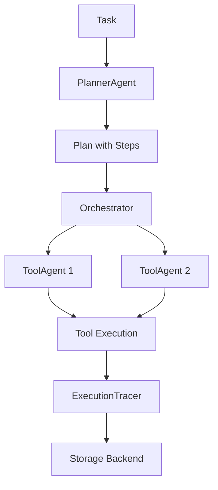

[](https://freepalestine.dev)

<div id="badges" align="center">

[](https://pypi.org/project/agenthelm/)
[](https://github.com/hadywalied/agenthelm/actions/workflows/ci.yml)
[](https://github.com/hadywalied/agenthelm/blob/main/LICENSE)

</div>

# AgentHelm

**Production-Ready Orchestration for AI Agents**

AgentHelm is a lightweight Python framework for building AI agents with a focus on production-readiness. Built on
**DSPy**, it provides plan-driven execution, full observability, and transactional safety guarantees.

---

## ✨ Key Features

### 🧠 DSPy-Native Agents

```python
import dspy
from agenthelm import ToolAgent, tool

@tool()
def search(query: str) -> str:
    """Search the web."""
    return f"Results for: {query}"


lm = dspy.LM("mistral/mistral-large-latest")
agent = ToolAgent(name="researcher", lm=lm, tools=[search])
result = agent.run("Find AI news")
```

### 📋 Plan-Driven Execution

```bash
# Generate a multi-step plan
agenthelm plan "Build a web scraper" -o plan.yaml

# Review and execute
agenthelm execute plan.yaml
```

### 🔍 Full Observability

```bash
# View execution traces
agenthelm traces list

# Filter and export
agenthelm traces filter --status failed
agenthelm traces export -o report.md -f md
```

### 🔗 MCP Protocol Support

```bash
# Connect to MCP servers
agenthelm mcp list-tools uvx mcp-server-time
agenthelm mcp run uvx mcp-server-time -t "What time is it?"
```

### 🛡️ Transactional Safety

```python
@tool(compensating_tool="reverse_payment")
def process_payment(amount: float) -> dict:
    """Process payment - rolls back on failure."""
    return payment_api.charge(amount)


@tool(requires_approval=True)
def delete_data(id: str) -> bool:
    """Dangerous operation - requires approval."""
    return db.delete(id)
```

---

## 🚀 Quick Start

### Installation

```bash
pip install agenthelm
```

### CLI

```bash
# Initialize configuration
agenthelm init

# Run a simple task
agenthelm run "What is 2+2?"

# Interactive chat
agenthelm chat

# Generate and execute plans
agenthelm plan "Build a calculator" -o plan.yaml
agenthelm execute plan.yaml
```

### Python SDK

```python
import dspy
from agenthelm import ToolAgent, tool, ExecutionTracer
from agenthelm.core.storage import SqliteStorage

@tool()
def add(a: int, b: int) -> int:
    """Add two numbers."""
    return a + b


# Create agent with tracing
lm = dspy.LM("mistral/mistral-large-latest")
tracer = ExecutionTracer(storage=SqliteStorage("traces.db"))

agent = ToolAgent(
    name="calculator",
    lm=lm,
    tools=[add],
    tracer=tracer,
)

result = agent.run("What is 15 + 27?")
print(result.answer)  # "42"
print(f"Cost: ${result.total_cost_usd:.4f}")
```

---

## 📦 What's Included

| Component            | Description                                       |
|----------------------|---------------------------------------------------|
| `ToolAgent`          | ReAct-style agent with tool execution             |
| `PlannerAgent`       | LLM-backed multi-step planning                    |
| `Orchestrator`       | DAG execution with parallel steps                 |
| `ExecutionTracer`    | Full observability with storage backends          |
| `MCPToolAdapter`     | Model Context Protocol integration                |
| `MemoryHub`          | Short-term and semantic memory                    |
| `@tool` decorator    | Approval, retries, compensation, timeout          |
| CLI                  | `run`, `plan`, `execute`, `chat`, `traces`, `mcp` |
| OpenTelemetry/Jaeger | Distributed tracing support                       |

---

## 🔧 CLI Commands

| Command                    | Description                   |
|----------------------------|-------------------------------|
| `agenthelm run "task"`     | Execute a task with ToolAgent |
| `agenthelm plan "task"`    | Generate an execution plan    |
| `agenthelm execute file`   | Run a plan from YAML          |
| `agenthelm chat`           | Interactive REPL mode         |
| `agenthelm traces list`    | View execution traces         |
| `agenthelm traces export`  | Export to JSON/CSV/Markdown   |
| `agenthelm mcp list-tools` | List MCP server tools         |
| `agenthelm config set`     | Configure settings            |

---

## 📊 Observability

### Trace Storage

Traces are automatically saved to `~/.agenthelm/traces.db`:

```bash
# Custom storage path
agenthelm run "task" -s ./my_traces.db

# View traces
agenthelm traces list
agenthelm traces show 0

# Filter and export
agenthelm traces filter --tool search --status success
agenthelm traces export -o report.md -f md
```

### OpenTelemetry / Jaeger

```bash
# Start Jaeger
docker run -d -p 16686:16686 -p 4317:4317 jaegertracing/all-in-one

# Run with tracing
agenthelm run "task" --trace

# View in Jaeger UI: http://localhost:16686
```

---

## 🏗️ Architecture



### Key Components

1. **PlannerAgent** - Generates multi-step plans from natural language
2. **Orchestrator** - Executes plans with parallel steps and Saga rollback
3. **ToolAgent** - ReAct reasoning loop with tool execution
4. **ExecutionTracer** - Captures every decision for observability
5. **MCPClient** - Connects to external MCP servers

---

## 📚 Documentation

📖 **Full Documentation**: [https://hadywalied.github.io/agenthelm/](https://hadywalied.github.io/agenthelm/)

- [Quick Start Guide](https://hadywalied.github.io/agenthelm/quickstart/)
- [CLI Reference](https://hadywalied.github.io/agenthelm/cli/)
- [API Reference](https://hadywalied.github.io/agenthelm/api_reference/)
- [Examples](examples/)

---

## 🗺️ Roadmap

### ✅ v0.3.0 (Current)

- [x] DSPy-native agents (ToolAgent, PlannerAgent)
- [x] Plan-driven execution with YAML export
- [x] Multi-agent orchestration with Saga pattern
- [x] MCP protocol integration
- [x] Full CLI with traces, chat, execute
- [x] OpenTelemetry/Jaeger support
- [x] Cost and token tracking

### 🔜 v0.4.0 (Planned)

- [ ] Budget enforcement (tokens, time, I/O)
- [ ] Checkpointing for resumable workflows
- [ ] Policy engine for constraints
- [ ] Web dashboard for trace visualization

---

## 🤝 Contributing

We welcome contributions! See [CONTRIBUTING.md](CONTRIBUTING.md) for guidelines.

- 🐛 Bug reports
- 💡 Feature requests
- 📖 Documentation improvements
- 🔧 Code contributions

---

## 📄 License

MIT License - see [LICENSE](LICENSE) file for details.

---

## 🔗 Links

- **Documentation**: [hadywalied.github.io/agenthelm](https://hadywalied.github.io/agenthelm/)
- **GitHub**: [github.com/hadywalied/agenthelm](https://github.com/hadywalied/agenthelm)
- **PyPI**: [pypi.org/project/agenthelm](https://pypi.org/project/agenthelm/)
- **Author**: [Hady Walied](https://github.com/hadywalied) |
  [LinkedIn](https://www.linkedin.com/in/hadywalied/)

---

⭐ **Star us on GitHub if AgentHelm helps you build production-ready agents!**
