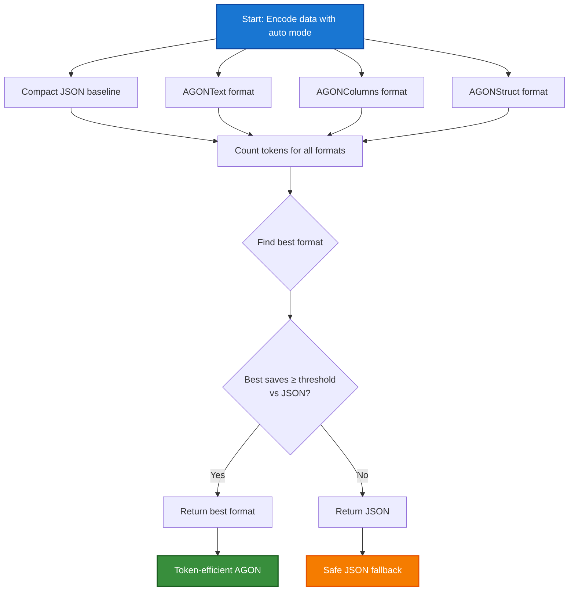

# Core Concepts

Understanding AGON's adaptive approach and design principles.

---

## The Adaptive Approach

AGON's defining feature is **adaptive format selection**—automatically choosing the most token-efficient encoding for your data while guaranteeing you'll never do worse than compact JSON.

### How Auto Mode Works

When you call `AGON.encode(data, format="auto")`, here's what happens:



**The 5-step process:**

1. **Baseline**: Encode data to compact JSON and count tokens
2. **Try specialized formats**: Encode with AGONText, AGONColumns, and AGONStruct
3. **Measure**: Count tokens for each specialized format
4. **Compare**: Calculate savings percentage vs JSON baseline
5. **Decide**:
    - If best format saves ≥ threshold (default 10%), use it
    - Otherwise, return compact JSON

!!! success "The Guarantee"
    Auto mode will **never** return a format with more tokens than compact JSON. You can use `format="auto"` everywhere with confidence.

---

## Minimum Savings Threshold

The threshold controls when AGON uses specialized formats vs falling back to JSON.

### Default Configuration

```python
# Default: Require 10% token savings to use specialized format
result = AGON.encode(data, format="auto")  # min_savings=0.10
```

### Tuning the Threshold

=== "More Conservative (20%)"

    ```python
    # Only use specialized formats for significant savings
    result = AGON.encode(data, format="auto", min_savings=0.20)
    ```

    **Use when:**

    - You want very high confidence in savings
    - Format overhead is a concern
    - You prefer simple JSON for marginal gains

=== "More Aggressive (5%)"

    ```python
    # Accept smaller savings
    result = AGON.encode(data, format="auto", min_savings=0.05)
    ```

    **Use when:**

    - Every token counts (high-volume applications)
    - You trust the specialized formats
    - You've validated on your data

=== "Force Best Format"

    ```python
    # Always use best specialized format, never JSON
    result = AGON.encode(data, format="auto", force=True)
    ```

    **Use when:**

    - You know your data is structured
    - You want maximum savings
    - You've validated format selection on representative data

!!! warning "Threshold Recommendations"

    | Threshold | Conservative | Recommended Use |
    |-----------|--------------|-----------------|
    | 0.05 (5%) | Low | High-volume, validated pipelines |
    | **0.10 (10%)** | **Medium** | **General purpose (default)** |
    | 0.20 (20%) | High | Risk-averse, prefer simplicity |

---

## The Three Specialized Formats

AGON provides three encoding formats, each optimized for different data shapes:

### Format Comparison

#### AGONText
**Row-based tabular encoding**

```agon
[3]{id	name	role}
1	Alice	admin
2	Bob	user
3	Charlie	user
```

**Best for:**

- Uniform arrays of objects
- Consistent field structure
- Transaction logs, user lists
- Simple metrics

**Token savings:** 40-60% vs pretty JSON

#### AGONColumns
**Columnar transpose encoding**

```agon
users[3]
├ id: 1	2	3
├ name: Alice	Bob	Charlie
└ role: admin	user	user
```

**Best for:**

- Wide tables (10+ columns)
- Numeric-heavy data
- Financial records
- Analytics tables

**Token savings:** 50-70% vs pretty JSON

#### AGONStruct
**Template-based encoding**

```agon
@FR: fmt, raw

price: FR("$100", 100.0)
change: FR("+5", 5.0)
```

**Best for:**

- Repeated nested patterns
- Market data (`{fmt, raw}`)
- Timestamps with values
- Complex API responses

**Token savings:** 30-50% vs pretty JSON

### Format Selection Patterns

Different data shapes naturally favor different formats:

=== "Uniform Arrays → Text"

    ```python
    data = [
        {"id": 1, "name": "Alice", "score": 95},
        {"id": 2, "name": "Bob", "score": 87},
        {"id": 3, "name": "Charlie", "score": 92},
    ]

    result = AGON.encode(data, format="auto")
    # → Selects "text" format
    #
    # [3]{id	name	score}
    # 1	Alice	95
    # 2	Bob	87
    # 3	Charlie	92
    ```

    **Why text wins:** Consistent structure, few fields, perfect for row-based encoding.

=== "Wide Tables → Columns"

    ```python
    data = [
        {
            "id": 1, "name": "Alice", "email": "alice@example.com",
            "age": 28, "city": "NYC", "state": "NY", "zip": "10001",
            "phone": "555-0001", "dept": "Eng", "title": "SWE",
            "salary": 120000, "start_date": "2020-01-15"
        },
        # ... more records with same 12 fields
    ]

    result = AGON.encode(data, format="auto")
    # → Selects "columns" format (transposes to group types)
    ```

    **Why columns wins:** 10+ fields benefit from type clustering and vertical layout.

=== "Nested Patterns → Struct"

    ```python
    data = {
        "price": {"fmt": "$100.00", "raw": 100.0},
        "change": {"fmt": "+5.00", "raw": 5.0},
        "volume": {"fmt": "1.2M", "raw": 1200000},
        "high": {"fmt": "$105.00", "raw": 105.0},
        "low": {"fmt": "$98.50", "raw": 98.5}
    }

    result = AGON.encode(data, format="auto")
    # → Selects "struct" format
    #
    # @FR: fmt, raw
    # price: FR("$100.00", 100.0)
    # change: FR("+5.00", 5.0)
    # ...
    ```

    **Why struct wins:** Repeated `{fmt, raw}` pattern appears 5 times—template amortizes over instances.

---

## When AGON Falls Back to JSON

Auto mode returns compact JSON when specialized formats don't provide enough benefit. This is **a feature, not a failure**.

### Example: Complex Nested Data

```python
# gainers.json: 100 complex quote objects with deeply nested structures
data = load_json("gainers.json")  # 100 quotes, each with 20+ fields, irregular nesting

result = AGON.encode(data, format="auto")
print(result.format)  # → "json"
```

**Token analysis:**

| Format | Tokens | Savings vs Pretty | Savings vs Compact |
|--------|--------|-------------------|--------------------|
| Pretty JSON | 142,791 | baseline | -55.9% (worse) |
| **Compact JSON** | **91,634** | +35.8% | **baseline** |
| AGONText | 113,132 | +20.8% | -23.4% (worse) |
| AGONColumns | 113,132 | +20.8% | -23.4% (worse) |
| AGONStruct | 89,011 | +37.7% | **+2.9%** (below threshold) |
| **Auto Selection** | **91,634** | +35.8% | **0%** (safe fallback) |

!!! success "Safety Net in Action"

    Even though `struct` format achieved the best absolute savings (37.7% vs pretty JSON), when compared against **compact JSON** (the real alternative), it only saved 2.9%—below the 10% minimum threshold.

    Auto mode correctly returned compact JSON, guaranteeing excellent performance (35.8% savings) with zero complexity and zero risk.

**Key insight:** Text/columns formats actually *hurt* compared to compact JSON (113K vs 91K tokens), but auto mode intelligently avoided them. Struct was marginally better but not worth the overhead.

---

## AGON vs TOON

AGON and TOON are complementary approaches to JSON encoding:

| Aspect | TOON | AGON |
|--------|------|------|
| **Philosophy** | "One format for all JSON" | "Best format for each shape, or JSON" |
| **Approach** | Single unified format | Multiple adaptive formats + fallback |
| **Risk** | Can be worse than JSON on irregular data | **Never worse than JSON** |
| **Format Selection** | Always applies TOON encoding | Auto-selects best or falls back to JSON |
| **Best For** | Uniform arrays, consistent pipelines | Variable data shapes, risk-averse optimization |
| **Token Efficiency** | 40-60% savings on good matches | 30-60% savings with safety guarantee |

### When They Produce Identical Output

For uniform arrays, `AGONText` and TOON produce **near identical output**:

=== "TOON Output"

    ```toon
    context:
    task: Our favorite hikes together
    location: Boulder
    season: spring_2025
    friends[3]: ana,luis,sam
    hikes[3]{id,name,distanceKm,elevationGain,companion,wasSunny}:
    1,Blue Lake Trail,7.5,320,ana,true
    2,Ridge Overlook,9.2,540,luis,false
    3,Wildflower Loop,5.1,180,sam,true
    ```

=== "AGON Text Output"

    ```agon
    context:
    task: Our favorite hikes together
    location: Boulder
    season: spring_2025
    friends[3]: ana	luis	sam
    hikes[3]{id	name	distanceKm	elevationGain	companion	wasSunny}
    1	Blue Lake Trail	7.5	320	ana	true
    2	Ridge Overlook	9.2	540	luis	false
    3	Wildflower Loop	5.1	180	sam	true
    ```

**The only difference is AGONText uses the `\t` delimiter**

Both: 96 tokens (+58.1% savings vs pretty JSON, +30.9% vs compact JSON)

!!! info "Choosing Between AGON and TOON"

    **Use TOON when:**

    - You have uniform, consistent data shapes
    - You want a single predictable format
    - You're comfortable with the risk of occasional inefficiency

    **Use AGON when:**

    - Data shapes vary between requests
    - You want guaranteed safety (never worse than JSON)
    - You need format diversity (columnar, struct) for specific patterns
    - You want adaptive selection without manual tuning

---

## When AGON Helps Most

AGON provides maximum value in these scenarios:

- **Variable data pipelines** where data shape changes between requests
- **Uniform arrays** with consistent fields (AGONText: 40-60% savings)
- **Wide tables** with 10+ columns (AGONColumns: 50-70% savings)
- **Repeated nested patterns** like market data with `{fmt, raw}` everywhere (AGONStruct: 30-50% savings)
- **Cost-sensitive applications** where every token counts
- **Production LLM prompts** needing reliability + token efficiency
- **Mixed data types** where different requests have different optimal formats

---

## When AGON Helps Least

AGON provides minimal value in these scenarios:

- **Tiny payloads** (<50 tokens) where overhead exceeds savings
- **Highly irregular objects** with no repetition or consistent structure
- **Single-use data** with unpredictable, one-off structure
- **Deeply nested heterogeneous data** where no pattern emerges
- **Already-optimized formats** (if your data is already compact)

!!! tip "When in doubt, use `format='auto'`"

    The safety guarantee means you can use auto mode everywhere. If specialized formats don't help, you'll get compact JSON—no harm done.

---

## Next Steps

### [API Reference](api.md)

Detailed documentation of all methods and parameters

### [JSON Fallback](formats/json.md)

View how JSON is used as a safety net

### [AGONText Format](formats/text.md)

Complete guide to row-based encoding

### [Benchmarks](benchmarks.md)

Real-world token savings across 7 datasets
