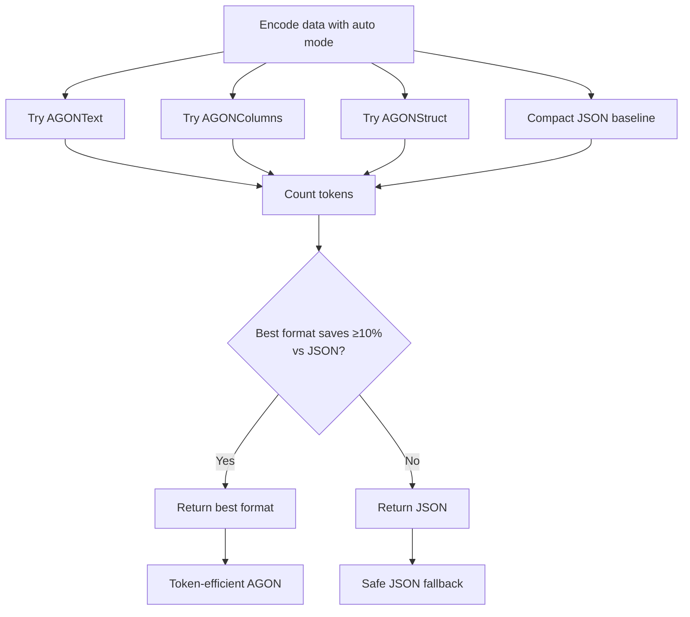

# AGON

**Adaptive Guarded Object Notation** — Self-describing, token-efficient JSON encodings optimized for LLM prompts.

## What is AGON?

AGON is an adaptive encoding library for Python that automatically selects the most token-efficient format for your data—**guaranteed to never be worse than compact JSON**. It provides multiple specialized encoding formats that can reduce token usage by 30-60% compared to JSON, while maintaining perfect lossless round-trip conversion.

### The Problem

Fixed-format encoders can actually make token counts **worse**. When your data doesn't match the encoder's assumptions (deeply nested objects, sparse arrays, irregular structures), you pay the overhead of the format without the benefits.

### AGON's Solution

Adaptive encoding with safety guarantees:

```python
result = AGON.encode(data, format="auto")
# Auto tries: text, columns, struct
# Returns: whichever saves the most tokens
# Falls back: to compact JSON if none are better
```

---

## Quick Example

Here's AGON in action with a simple user list:

=== "Python Code"

    ```python
    from agon import AGON

    # Sample data - list of objects with repeated structure
    data = [
        {"id": 1, "name": "Alice", "role": "admin"},
        {"id": 2, "name": "Bob", "role": "user"},
        {"id": 3, "name": "Charlie", "role": "user"},
    ]

    # Encode with auto-selection
    result = AGON.encode(data, format="auto")
    print(f"Selected format: {result.format}")  # → "text"

    # Use directly in LLM prompts
    prompt = f"""Analyze this user data:

    {result}

    What percentage are admins?"""

    # Verify lossless round-trip
    decoded = AGON.decode(result)
    assert decoded == data  # Perfect reconstruction
    ```

=== "AGONText Output"

    ```agon
    [3]{id	name	role}
    1	Alice	admin
    2	Bob	user
    3	Charlie	user
    ```

    Clean, tab-delimited format with array length `[3]` and field headers `{id name role}`. No `@AGON` header needed when sending to LLMs—only required for decoding.

=== "Token Comparison"

    | Format | Tokens | Savings |
    |--------|--------|---------|
    | **Pretty JSON** | 62 | baseline |
    | **Compact JSON** | 37 | +40% |
    | **AGON Text** | **26** | **+58%** |

    AGON's adaptive selection identified that this uniform array is ideal for AGONText format, achieving **58% token savings** compared to pretty JSON, and **30% savings** even against compact JSON.

---

## Installation

Install AGON via pip:

```bash
pip install agon-python
```

Or using [uv](https://github.com/astral-sh/uv) (recommended):

```bash
uv add agon-python
```

---

## How It Works

AGON provides **three specialized formats**, each optimized for different data shapes:

### 1. AGONText - Row-Based Encoding

Best for **uniform arrays** of objects with consistent fields.

```agon
[3]{id	name	role}
1	Alice	admin
2	Bob	user
3	Charlie	user
```

**Ideal for:** User lists, transaction logs, simple metrics
**Token savings:** 40-60% vs pretty JSON

### 2. AGONColumns - Columnar Encoding

Best for **wide tables** (many columns) or numeric-heavy data.

```agon
users[3]
├ id: 1	2	3
├ name: Alice	Bob	Charlie
└ role: admin	user	user
```

**Ideal for:** Financial data (20+ fields), analytics tables
**Token savings:** 50-70% vs pretty JSON

### 3. AGONStruct - Template-Based Encoding

Best for **repeated nested patterns** like `{fmt, raw}` or `{value, timestamp}`.

```agon
@FR: fmt, raw

price: FR("$100.00", 100.0)
change: FR("+5.00", 5.0)
```

**Ideal for:** Market data, API responses with nested structures
**Token savings:** 30-50% vs pretty JSON

---

### Adaptive Auto Mode

The `format="auto"` mode tries all three formats and selects the winner:



---

## Why Not Just Use a Fixed Format?

!!! warning "The Fixed-Format Problem"

    Fixed-format encoders like TOON can be worse than JSON on irregular data:

    ```python
    # Fixed format: Always applies encoding
    toon_result = TOON.encode(complex_data)  # Might be worse than JSON!

    # AGON: Adaptive with safety guarantee
    agon_result = AGON.encode(complex_data, format="auto")  # Never worse than JSON
    ```

    **AGON's auto mode** guarantees you'll never regret using it. If specialized formats don't save enough tokens, it returns compact JSON

!!! success "AGON vs TOON"

    AGON and TOON are complementary:

    - **TOON**: Single unified format, predictable encoding, great for uniform arrays
    - **AGON**: Multiple adaptive formats + JSON fallback, best format per data shape

    For uniform arrays, `AGONText` produces identical output to TOON. For everything else, AGON's adaptive approach ensures you always get the best result.

---

## Community & Contributing

AGON is open source and welcomes contributions!

- [Report issues](https://github.com/Verdenroz/agon-python/issues)
- [Request features](https://github.com/Verdenroz/agon-python/issues/new)
- [Contribute](https://github.com/Verdenroz/agon-python/blob/master/CONTRIBUTING.md)

---

## License

MIT License - see [LICENSE](https://github.com/Verdenroz/agon-python/blob/master/LICENSE) for details.
