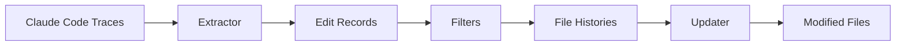
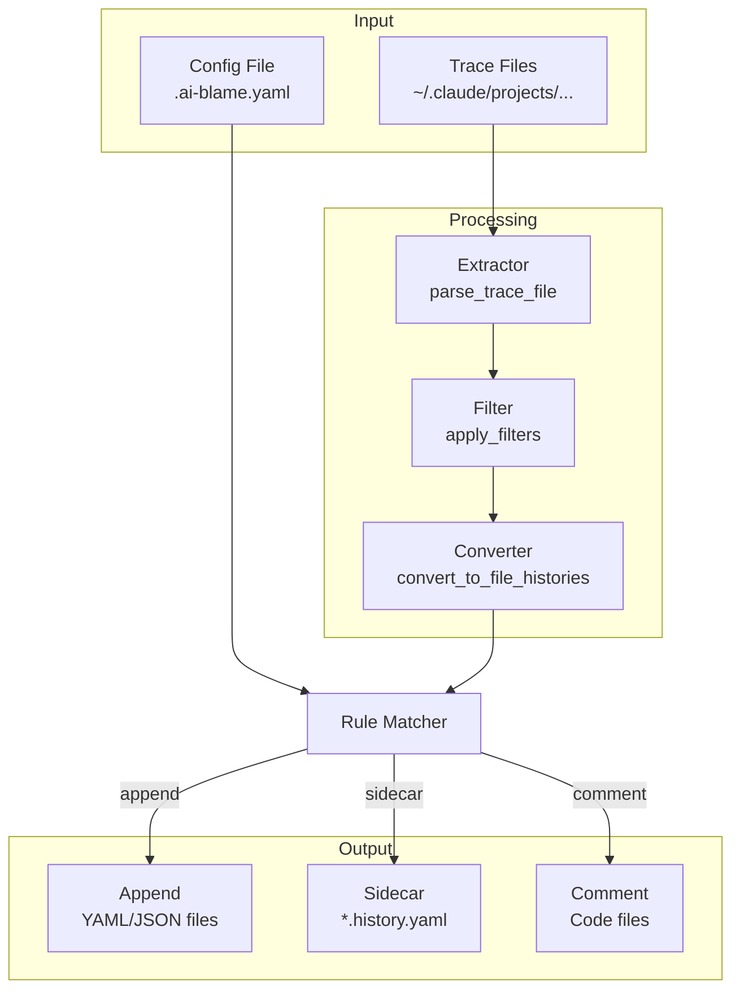

# How It Works

This document explains the internal workings of `ai-blame`.

## Overview



## Step 1: Locate Trace Files

Claude Code stores execution traces in:

```
~/.claude/projects/<encoded-cwd>/
```

Where `<encoded-cwd>` is the project path with `/` replaced by `-`.

**Example:**

| Project Path | Trace Directory |
|--------------|-----------------|
| `/Users/alice/myproject` | `~/.claude/projects/-Users-alice-myproject/` |
| `/home/bob/work/repo` | `~/.claude/projects/-home-bob-work-repo/` |

Each session generates a JSONL file (e.g., `a1b2c3d4-5678-90ab-cdef.jsonl`).

## Step 2: Parse Trace Files

Each trace file contains a sequence of JSON records representing the conversation and tool usage:

```json
{"type": "user", "uuid": "msg-1", "message": {...}}
{"type": "assistant", "uuid": "msg-2", "message": {...}, "model": "claude-opus-4-5"}
{"type": "user", "uuid": "msg-3", "toolUseResult": {...}}
```

The extractor looks for **successful Edit/Write operations** by finding `toolUseResult` entries with:

- A `filePath` field
- Either `structuredPatch` (for edits) or `type: create` (for new files)
- No error indicators

```python
def is_successful_edit(record: dict) -> bool:
    if record.get("type") != "user":
        return False

    tool_result = record.get("toolUseResult")
    if not tool_result or not isinstance(tool_result, dict):
        return False

    if tool_result.get("is_error") or tool_result.get("error"):
        return False

    file_path = tool_result.get("filePath", "")
    if not file_path:
        return False

    has_patch = "structuredPatch" in tool_result
    is_create = tool_result.get("type") == "create"

    return has_patch or is_create
```

## Step 3: Extract Metadata

For each successful edit, we extract:

| Field | Source |
|-------|--------|
| `file_path` | `toolUseResult.filePath` |
| `timestamp` | Record's `timestamp` field |
| `model` | Parent message's `message.model` |
| `session_id` | Record's `sessionId` |
| `is_create` | `toolUseResult.type == "create"` |
| `change_size` | Calculated from content/patch |
| `agent_version` | Record's `version` field |

The **model** is found by looking up the parent message (the assistant message that invoked the tool).

## Step 4: Apply Filters

Filters reduce the volume of edit records:

### File Pattern Filter

Keeps only files matching a substring:

```python
if file_pattern and file_pattern not in file_path:
    continue  # Skip this record
```

### Time Range Filters

```python
if config.since and edit.timestamp < config.since:
    continue
if config.until and edit.timestamp > config.until:
    continue
```

### Size Filter

Skip small edits (likely typo fixes):

```python
if config.min_change_size > 0:
    edits = [e for e in edits if e.change_size >= config.min_change_size]
```

### Initial and Recent Only

Keep only the first and last edit per file:

```python
if config.initial_and_recent_only and len(edits) > 2:
    edits = [edits[0], edits[-1]]
```

## Step 5: Convert to File Histories

Edit records are grouped by file and converted to `FileHistory` objects:

```python
for abs_path, edits in edits_by_file.items():
    rel_path = normalize_path(abs_path, repo_root)

    events = []
    for i, edit in enumerate(edits):
        action = CurationAction.CREATED if (i == 0 and edit.is_create) else CurationAction.EDITED

        events.append(CurationEvent(
            timestamp=edit.timestamp,
            model=edit.model,
            action=action,
            agent_tool=edit.agent_tool,
            agent_version=edit.agent_version,
        ))

    histories[rel_path] = FileHistory(file_path=rel_path, events=events)
```

## Step 6: Load Output Configuration

The configuration determines how each file type is handled:

```python
# Auto-find .ai-blame.yaml
config_path = find_config()
if config_path:
    output_config = load_config(config_path)
else:
    output_config = get_default_config()
```

Rules are matched using glob patterns:

```python
def get_rule_for_file(self, path: str) -> FileRule | None:
    filename = Path(path).name

    for rule in self.rules:
        if "/" in rule.pattern or "**" in rule.pattern:
            if fnmatch(path, rule.pattern):
                return rule
        else:
            if fnmatch(filename, rule.pattern):
                return rule

    return self.defaults
```

## Step 7: Apply Changes

Based on the output policy:

### Append Policy

For YAML files, append a `edit_history` section:

```python
curation_yaml = generate_curation_yaml(history)
new_content = content + "\n" + curation_yaml
file_path.write_text(new_content)
```

If `edit_history` already exists, it's replaced.

### Sidecar Policy

Write to a companion file:

```python
sidecar_path = resolve_sidecar_path(file_path, pattern)
# e.g., main.py → main.history.yaml

sidecar_data = {
    "source_file": file_path.name,
    "edit_history": events,
}
sidecar_path.write_text(yaml.dump(sidecar_data))
```

Existing sidecar files are merged (deduplicated by timestamp).

### Comment Policy

Embed as a comment block:

```python
if syntax == CommentSyntax.HASH:
    marker_start = "# --- edit_history ---"
    marker_end = "# --- end edit_history ---"
    commented = "\n".join(f"# {line}" for line in history_yaml.split("\n"))

new_content = content + "\n" + comment_block
```

## Data Flow Summary


