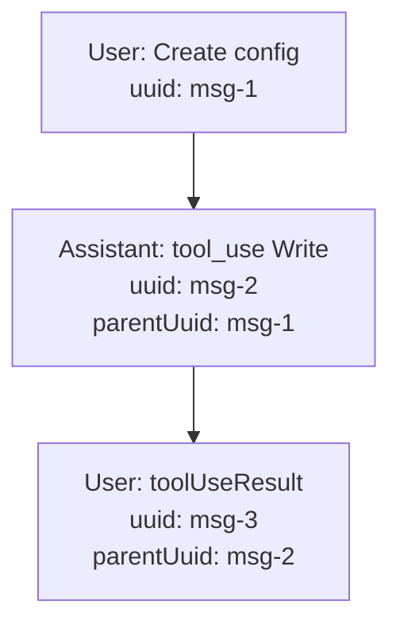

# Trace Format

This document explains the structure of Claude Code trace files that `ai-blame` parses.

## File Location

Claude Code stores traces in:

```
~/.claude/projects/<encoded-cwd>/
```

Each session creates a JSONL file named with a UUID:

```
~/.claude/projects/-Users-alice-myproject/
├── a1b2c3d4-5678-90ab-cdef-123456789abc.jsonl
├── b2c3d4e5-6789-01cd-ef23-456789abcdef.jsonl
└── agent-c3d4e5f6-7890-12de-f345-6789abcdef01.jsonl
```

Files prefixed with `agent-` are from subagent invocations.

## JSONL Structure

Each line is a JSON object representing a message in the conversation:

```jsonl
{"type": "user", "uuid": "msg-1", ...}
{"type": "assistant", "uuid": "msg-2", ...}
{"type": "user", "uuid": "msg-3", "toolUseResult": {...}}
```

## Message Types

### User Messages

Regular user input:

```json
{
  "type": "user",
  "uuid": "2447d793-4010-4028-bb03-b7d12f44f0a8",
  "parentUuid": null,
  "sessionId": "a1b2c3d4-5678-90ab-cdef",
  "timestamp": "2025-12-22T17:09:15.442Z",
  "cwd": "/Users/alice/myproject",
  "version": "2.0.75",
  "message": {
    "role": "user",
    "content": "Create a new config file"
  }
}
```

### Assistant Messages

Model responses, often containing tool use:

```json
{
  "type": "assistant",
  "uuid": "537588d8-3c9b-42a2-b0d0-55e9b57abe93",
  "parentUuid": "2447d793-4010-4028-bb03-b7d12f44f0a8",
  "sessionId": "a1b2c3d4-5678-90ab-cdef",
  "timestamp": "2025-12-22T17:09:18.879Z",
  "version": "2.0.75",
  "message": {
    "model": "claude-opus-4-5-20251101",
    "role": "assistant",
    "content": [
      {
        "type": "tool_use",
        "id": "toolu_011MHKqGJhiXXZkWSrsTMwMp",
        "name": "Write",
        "input": {
          "file_path": "/Users/alice/myproject/config.yaml",
          "content": "name: myproject\nversion: 1.0\n"
        }
      }
    ]
  }
}
```

### Tool Results

User messages containing `toolUseResult` are the results of tool invocations:

```json
{
  "type": "user",
  "uuid": "98506b67-b923-47a3-a6f0-f70771881aa0",
  "parentUuid": "537588d8-3c9b-42a2-b0d0-55e9b57abe93",
  "sessionId": "a1b2c3d4-5678-90ab-cdef",
  "timestamp": "2025-12-22T17:09:19.998Z",
  "version": "2.0.75",
  "message": {
    "role": "user",
    "content": [
      {
        "tool_use_id": "toolu_011MHKqGJhiXXZkWSrsTMwMp",
        "type": "tool_result",
        "content": "File created successfully at: /Users/alice/myproject/config.yaml"
      }
    ]
  },
  "toolUseResult": {
    "type": "create",
    "filePath": "/Users/alice/myproject/config.yaml",
    "content": "name: myproject\nversion: 1.0\n"
  }
}
```

## Tool Result Types

### File Creation (Write)

```json
{
  "toolUseResult": {
    "type": "create",
    "filePath": "/path/to/new_file.yaml",
    "content": "file content here",
    "structuredPatch": []
  }
}
```

### File Edit (Edit)

```json
{
  "toolUseResult": {
    "filePath": "/path/to/existing_file.yaml",
    "oldString": "original text",
    "newString": "modified text",
    "structuredPatch": [
      {
        "oldStart": 10,
        "oldLines": 2,
        "newStart": 10,
        "newLines": 3,
        "lines": [" context", "-old line", "+new line", "+another new line"]
      }
    ]
  }
}
```

### Error Results

Failed operations have error indicators:

```json
{
  "toolUseResult": {
    "is_error": true,
    "error": "File not found: /path/to/missing.yaml"
  }
}
```

Or HTTP-style error codes:

```json
{
  "toolUseResult": {
    "code": 404,
    "message": "File not found"
  }
}
```

## Key Fields for Extraction

`ai-blame` extracts these fields:

| Field | Location | Description |
|-------|----------|-------------|
| `file_path` | `toolUseResult.filePath` | Absolute path to the file |
| `timestamp` | Root `timestamp` | When the operation occurred |
| `model` | Parent message's `message.model` | Model identifier |
| `session_id` | Root `sessionId` | Session identifier |
| `is_create` | `toolUseResult.type == "create"` | Whether file was created |
| `agent_version` | Root `version` | Claude Code version |

## Parent-Child Relationships

Messages are linked via `uuid` and `parentUuid`:



To find the model for a tool result:

1. Get the `parentUuid` from the tool result message
2. Look up the parent message by UUID
3. Extract `message.model` from the parent

## Other Record Types

The trace may contain other record types that `ai-blame` ignores:

- `summary` — Session summary
- `file-history-snapshot` — File state snapshots
- Encrypted thinking blocks — Lines starting with non-JSON characters

## Example Trace

```jsonl
{"type":"summary","summary":"Create project configuration"}
{"type":"user","uuid":"msg-1","message":{"role":"user","content":"Create a config.yaml file"},"timestamp":"2025-12-22T17:09:15.442Z","version":"2.0.75","sessionId":"session-1"}
{"type":"assistant","uuid":"msg-2","parentUuid":"msg-1","message":{"model":"claude-opus-4-5-20251101","role":"assistant","content":[{"type":"tool_use","id":"toolu_1","name":"Write","input":{"file_path":"/project/config.yaml","content":"name: myproject\n"}}]},"timestamp":"2025-12-22T17:09:18.879Z","version":"2.0.75","sessionId":"session-1"}
{"type":"user","uuid":"msg-3","parentUuid":"msg-2","toolUseResult":{"type":"create","filePath":"/project/config.yaml","content":"name: myproject\n"},"timestamp":"2025-12-22T17:09:19.998Z","version":"2.0.75","sessionId":"session-1"}
```

This trace shows:

1. User requests a config file
2. Assistant uses `Write` tool to create it
3. Tool result confirms successful creation

`ai-blame` would extract:

- **file_path**: `/project/config.yaml`
- **timestamp**: `2025-12-22T17:09:19.998Z`
- **model**: `claude-opus-4-5-20251101`
- **is_create**: `true`
- **agent_version**: `2.0.75`
