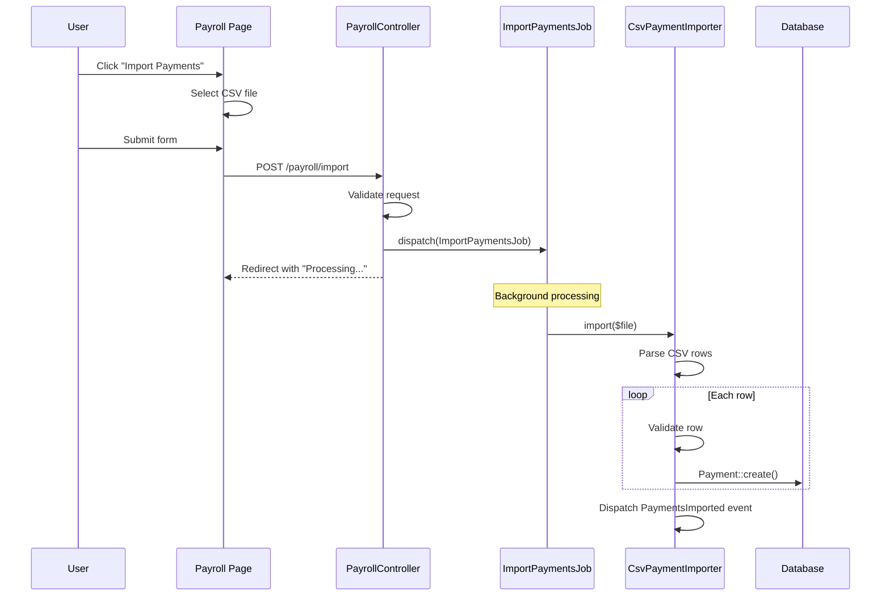

# Code Flow Documentation Workflow

**Goal:** Create user-friendly documentation that explains how a feature works, with screenshots and clear step-by-step instructions.

**Your Role:** You are a documentation specialist creating guides for END USERS, not developers. Focus on:
- **Screenshots first** - Visual documentation is most important
- **Plain English** - Avoid technical jargon
- **Step-by-step instructions** - What the user clicks/sees
- **Minimal code** - Only show code if absolutely necessary

**IMPORTANT - Screenshots are REQUIRED:**
- You MUST use Playwright MCP to capture screenshots
- If Playwright is not available, STOP and tell the user to install it
- Screenshots should show: the page, buttons to click, forms to fill

---

## LOAD CONFIGURATION

**First, check if `docs/config.yml` exists in the project root.**

If it exists, load:
- `urls.base` → Base URL for screenshots (e.g., `https://app.example.com`)
- `auth.method` → How to authenticate for screenshots
- `output.directory` → Where to save documentation

Store for later use in screenshot capture step.

---

## ARGUMENTS PARSING

Parse the arguments passed to this workflow. Expected format:
```
/docs:flow "<description>" [--technical] [--no-screenshots]
```

Examples:
```
/docs:flow "sync users from discord"              # User-focused (default)
/docs:flow "import payments from csv"             # User-focused (default)
/docs:flow "payment processing" --technical       # Developer-focused
/docs:flow "webhook handling" --no-screenshots    # Skip screenshots
```

Extract:
- `description` (required) - The natural language description of the flow
- `--technical` (optional) - Generate developer-focused documentation with code snippets, file paths, and technical diagrams
- `--no-screenshots` (optional) - Skip UI screenshot capture

**Output modes:**
- **Default (user-focused)**: Plain English, screenshots, step-by-step instructions for end users
- **Technical (`--technical`)**: Code snippets, file paths, call graphs, mermaid diagrams for developers

If description is missing or empty, ask the user:
```
Please describe the flow you want to document.

Examples:
  /docs:flow "sync users from discord"
  /docs:flow "create employees" --technical
```

---

## STEP 1: PARSE DESCRIPTION

Analyze the description to extract searchable terms.

### 1.1 Extract Keywords

From the description, identify:
- **Action verbs**: sync, import, export, process, handle, create, send, receive, update, delete
- **Entities/nouns**: users, payments, orders, webhooks, discord, stripe, email
- **Technical terms**: API, webhook, queue, job, cron, scheduled
- **UI hints**: button, page, form, modal, screen (indicates UI involvement)

### 1.2 Build Search Strategy

Generate search patterns:
- Direct matches: `discord`, `sync`, `user`
- Combined patterns: `sync.*user`, `discord.*user`
- Class name patterns: `SyncDiscord`, `DiscordUser`, `UserSync`
- File patterns: `*Discord*`, `*Sync*User*`

### 1.3 Identify Target Directories

Based on the action type, prioritize directories:

| Action Type | Primary Directories |
|-------------|---------------------|
| Sync/Import | Jobs/, Commands/, Services/ |
| Webhook | Controllers/, Listeners/, Webhooks/ |
| API Call | Services/, Clients/, Http/ |
| Scheduled | Jobs/, Console/, Commands/ |
| Event | Listeners/, Events/, Subscribers/ |
| Email | Mail/, Notifications/ |

### 1.4 Detect UI Involvement

Check if the flow likely has a UI component:
- Description contains: import, export, upload, download, button, form, page
- Action is user-initiated (not scheduled/webhook)

Flag: `has_ui_component = true/false`

Display progress:
```
📝 Parsing: "import payments from csv"

Extracted:
  Action: import (import/sync type)
  Entities: payments, csv
  Keywords: import, payments, csv, upload

Search strategy:
  Primary patterns: import.*payment, csv.*payment, PaymentImport
  Target directories: Jobs/, Commands/, Services/, Controllers/

UI Detection:
  ✓ "import" suggests user-initiated action
  ✓ May have UI trigger (button, form)
```

---

## STEP 2: SEARCH CODEBASE

Search for relevant files using the extracted keywords.

### 2.1 Search by Keywords

For each keyword, search in relevant directories:

```
🔍 Searching codebase...

[1/4] Searching "import.*payment" in Jobs/, Commands/, Services/...
[2/4] Searching "csv" in Controllers/, Services/...
[3/4] Searching class names with "Payment" and "Import"...
[4/4] Searching file names with "*Import*" or "*Payment*"...
```

### 2.2 Rank Results by Relevance

Score files based on:
- Keyword matches in filename (+30 points per match)
- Keyword matches in content (+10 points per match)
- Location in expected directory (+20 points)
- Class/function name matches (+25 points)

### 2.3 Display Found Files

```
📊 Found 6 relevant files:

  Score  File
  ─────  ────────────────────────────────────────────
  95%    app/Jobs/ImportPaymentsJob.php
  88%    app/Services/CsvPaymentImporter.php
  75%    app/Http/Controllers/PayrollController.php
  60%    app/Http/Requests/ImportPaymentsRequest.php
  45%    routes/web.php (POST /payroll/import)
  40%    resources/js/Pages/Payroll/Index.vue

Analyzing top files...
```

### 2.4 Extract UI Route (for screenshots)

From the found files, identify the UI route:

```
🔗 UI Route detected:
  Route: POST /payroll/import
  Controller: PayrollController@import
  View: resources/js/Pages/Payroll/Index.vue

  → UI Page: /payroll (where the import button lives)
```

### 2.5 Handle No Results

If no relevant files found:
```
⚠️  No relevant code found for: "import payments from csv"

Suggestions:
  • Try different keywords: "payment upload", "csv import"
  • Check if the feature exists in your codebase
  • Provide more specific terms

Would you like to try a different description?
```

---

## STEP 3: IDENTIFY ENTRY POINTS

Read the top-ranked files and identify how the flow is triggered.

### 3.1 Detect Entry Point Types

Look for these patterns:

**Controller Actions (User-initiated):**
```php
public function import(ImportPaymentsRequest $request)
```

**Jobs (Background):**
```php
class ImportPaymentsJob implements ShouldQueue
```

**Commands (Artisan):**
```php
protected $signature = 'payments:import {file}';
```

**Routes:**
```php
Route::post('/payroll/import', [PayrollController::class, 'import']);
```

### 3.2 Display Entry Points

```
📍 Entry points identified:

1. Controller: PayrollController@import
   └── Route: POST /payroll/import
   └── UI: /payroll page → "Import Payments" button
   └── Validation: ImportPaymentsRequest

2. Job: ImportPaymentsJob
   └── Dispatched by: PayrollController@import
   └── Queue: payments

3. Command: payments:import
   └── Artisan: php artisan payments:import {file}

Primary entry point: PayrollController@import (user-initiated)
UI Location: /payroll page
```

---

## STEP 4: TRACE EXECUTION FLOW

Starting from the primary entry point, trace the execution path.

### 4.1 Read Entry Point Code

Read the main method (controller action, handle(), etc.).

### 4.2 Build Call Graph

Trace method calls and identify:
- Request validation
- Service/class instantiations
- File processing
- Database operations
- Job dispatching
- Events/notifications

### 4.3 Display Call Graph

```
📊 Execution flow from: PayrollController@import()

PayrollController@import(ImportPaymentsRequest $request)
├── $request->file('csv')                           [File Upload]
├── ImportPaymentsJob::dispatch($file)              [Queue Job]
│   └── CsvPaymentImporter::import($file)
│       ├── Reader::createFromPath($file)           [CSV Parse]
│       ├── foreach ($rows as $row)
│       │   ├── PaymentValidator::validate($row)    [Validation]
│       │   └── Payment::create($data)              [Database]
│       └── event(new PaymentsImported($count))     [Event]
└── return redirect()->back()->with('success')      [Response]

Database operations:
  • payments table: insert (bulk)

Events dispatched:
  • PaymentsImported
```

---

## STEP 5: GENERATE MERMAID DIAGRAM

Create a sequence diagram showing the flow.

### 5.1 Identify Participants

From the call graph, extract:
- User/Browser (for UI-initiated flows)
- Controller
- Services
- Queue/Job
- Database
- Events

### 5.2 Generate Diagram



---

## STEP 6: CAPTURE UI SCREENSHOTS (REQUIRED)

**Screenshots are the MOST IMPORTANT part of the documentation.**

You MUST capture screenshots using Playwright MCP. Do NOT skip this step.

### 6.1 Check Playwright MCP

First, verify Playwright MCP is available by attempting to use it.

If Playwright MCP is NOT available:
```
❌ STOP: Playwright MCP is required for documentation.

Please install Playwright MCP to continue:
  https://github.com/anthropics/mcp-playwright

Or run with --no-screenshots flag (not recommended).
```

**DO NOT CONTINUE without screenshots unless --no-screenshots was explicitly provided.**

### 6.2 Authenticate (if needed)

Load credentials from `docs/config.yml` or `docs/.auth`:

```
🔐 Authenticating...
   Using credentials from docs/.auth
```

### 6.3 Navigate to UI Page

Navigate to the page where the flow is initiated:

```
🌐 Navigating to: https://app.example.com/payroll

   Loading page...
   Waiting for network idle...
```

### 6.4 Capture Screenshots

Capture relevant screenshots:

**Screenshot 1: Page with trigger element**
```
📸 Capturing: Payroll page with Import button
   Looking for: button containing "Import"
   Found: "Import Payments" button

   Saved: docs/flows/images/import-payments-trigger.png
```

**Screenshot 2: Modal/Form (if applicable)**
```
📸 Capturing: Import modal/form
   Clicking: "Import Payments" button
   Waiting for: modal or form

   Saved: docs/flows/images/import-payments-form.png
```

### 6.5 Screenshot Summary

```
📸 Screenshots captured:

  1. import-payments-trigger.png
     └── Payroll page showing "Import Payments" button

  2. import-payments-form.png
     └── Import modal with file upload field

Screenshots saved to: docs/flows/images/
```

---

## STEP 7: EXTRACT CODE SNIPPETS

Extract the most relevant code sections with file:line references.

### 7.1 Prioritize Code Sections

Extract in order of importance:
1. Entry point method (controller action, handle)
2. Request validation rules
3. Main business logic (service)
4. Database operations
5. Event dispatching

### 7.2 Format Snippets

For each snippet, include:
- File path with line numbers
- Language identifier for syntax highlighting
- Brief description of what it does

```php
// app/Http/Controllers/PayrollController.php:45-58
public function import(ImportPaymentsRequest $request)
{
    $file = $request->file('csv');

    ImportPaymentsJob::dispatch(
        $file->store('imports'),
        auth()->id()
    );

    return redirect()
        ->back()
        ->with('success', 'Import started. You will be notified when complete.');
}
```

---

## STEP 8: GENERATE DOCUMENTATION

Create the markdown file with all gathered information.

### 8.1 Create Output Directory

Ensure `docs/flows/` and `docs/flows/images/` directories exist.

### 8.2 Generate Filename

Convert description to kebab-case:
- "import payments from csv" → `import-payments-from-csv.md`

### 8.3 Write Markdown File

Use this USER-FOCUSED template (avoid technical jargon):

```markdown
# {Title - Action-oriented, e.g., "How to Import Payments"}

{One sentence explaining what users can do with this feature}

## Before You Start

{List any prerequisites in plain English}
- What the user needs to have ready
- Any permissions required
- File format requirements (if applicable)

## Steps

### Step 1: {Action verb - e.g., "Go to Payroll"}

{Simple instruction in plain English}


### Step 2: {Action verb - e.g., "Click Import"}

{Simple instruction}


### Step 3: {Action verb - e.g., "Upload Your File"}

{Simple instruction}


### Step 4: {Action verb - e.g., "Review and Confirm"}

{Simple instruction}


## What Happens Next

{Explain what the user should expect after completing the steps}
- How long it takes
- Where to see results
- Any notifications they'll receive

## Troubleshooting

{Common issues and solutions in plain English}

| Problem | Solution |
|---------|----------|
| "{Error message user might see}" | {How to fix it} |

---

*Documentation generated by [aidocs](https://github.com/binarcode/aidocs-cli)*
```

**IMPORTANT OUTPUT RULES (User-focused mode - default):**
- NO file paths or line numbers
- NO code snippets (unless it's a developer tool)
- NO technical diagrams (unless specifically requested)
- Use action verbs: "Click", "Go to", "Enter", "Select"
- Write for someone who has never seen the app before

---

### 8.3b TECHNICAL TEMPLATE (only if `--technical` flag provided)

If `--technical` flag was provided, use this developer-focused template instead:

```markdown
# {Title from Description}

## Overview

{Brief technical description of what this flow does}

## Architecture

```mermaid
{Generated sequence diagram showing all components}
```

## Entry Points

| Trigger | Location | Route/Command |
|---------|----------|---------------|
| UI | /payroll | POST /payroll/import |
| CLI | Artisan | `php artisan payments:import` |
| API | REST | POST /api/v1/payments/import |

## Execution Flow

### 1. Request Handling

**File:** `app/Http/Controllers/PayrollController.php:45`

```php
public function import(ImportPaymentsRequest $request)
{
    $file = $request->file('csv');
    ImportPaymentsJob::dispatch($file->store('imports'));
    return redirect()->back()->with('success', 'Import started');
}
```

### 2. Validation

**File:** `app/Http/Requests/ImportPaymentsRequest.php:12`

| Field | Rules |
|-------|-------|
| csv | required, file, mimes:csv,txt, max:10240 |

### 3. Background Processing

**File:** `app/Jobs/ImportPaymentsJob.php:28`

```php
public function handle(CsvPaymentImporter $importer)
{
    $importer->import($this->filePath);
}
```

### 4. Business Logic

**File:** `app/Services/CsvPaymentImporter.php:15`

{Code snippet of main logic}

## Database Operations

| Table | Operation | Description |
|-------|-----------|-------------|
| payments | INSERT | Creates payment records |
| import_logs | INSERT | Logs import progress |

## Events Dispatched

- `PaymentsImported` - After successful import

## Configuration

- `config/queue.php` - Queue connection
- `QUEUE_CONNECTION` - Environment variable

## Related Files

| File | Purpose |
|------|---------|
| app/Http/Controllers/PayrollController.php | HTTP entry point |
| app/Jobs/ImportPaymentsJob.php | Background job |
| app/Services/CsvPaymentImporter.php | Core import logic |

---

*Documentation generated by [aidocs](https://github.com/binarcode/aidocs-cli)*
```

**TECHNICAL MODE RULES:**
- Include file paths with line numbers
- Show relevant code snippets
- Include mermaid sequence diagrams
- Document database operations
- List events and configuration
- Write for developers who need to understand/modify the code

---

### 8.4 Save File

Write to `docs/flows/{kebab-case-title}.md`

---

## STEP 9: COMPLETION SUMMARY

Display final summary:

```
✅ Flow Documentation Complete

📄 Output: docs/flows/import-payments-from-csv.md

📊 Analysis Summary:
   Files analyzed: 6
   Entry points found: 3
   Code snippets: 5
   Diagram: sequenceDiagram
   Screenshots: 2

📸 Screenshots captured:
   • import-payments-trigger.png (Payroll page)
   • import-payments-form.png (Import modal)

📁 Key files documented:
   • app/Http/Controllers/PayrollController.php
   • app/Jobs/ImportPaymentsJob.php
   • app/Services/CsvPaymentImporter.php

💡 Suggestions:
   • Review the generated documentation for accuracy
   • Add any domain-specific context
   • Consider documenting error handling flows
```

---

## ERROR HANDLING

| Error | Action |
|-------|--------|
| No description provided | Ask user for description |
| No relevant files found | Suggest alternative keywords |
| File read error | Skip file, note in output |
| Playwright MCP missing | Skip screenshots, note in output |
| Screenshot failed | Continue without screenshot, note in output |
| Auth failed | Skip screenshots, suggest checking credentials |
| No UI route found | Skip screenshots, document code-only |

---

## TIPS

- Be thorough in keyword extraction - more search terms = better results
- Follow dependency injection to trace service calls
- Look for Request classes to find validation rules
- Check for Vue/React components that correspond to routes
- If a flow has both UI and CLI entry points, document both
- Screenshots are optional but greatly improve documentation quality
