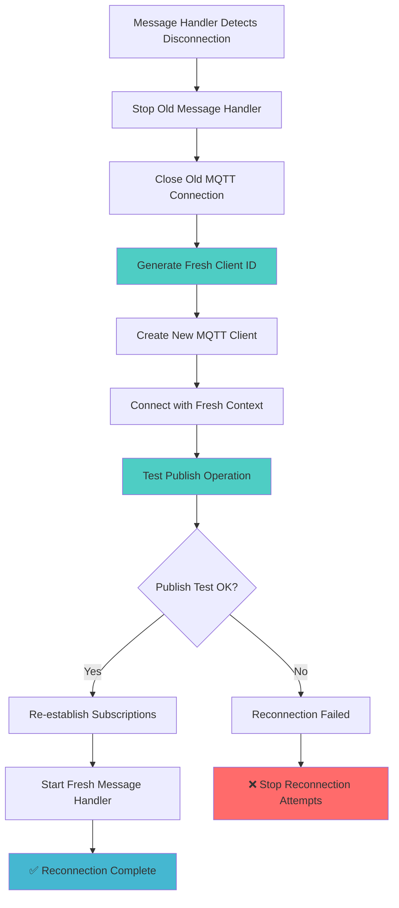

# MQTT Driver Documentation

This document describes the `MQTTDriver` class, which provides an asynchronous interface for interacting with an MQTT broker. It supports connection management, message publishing and subscribing, and robust automatic reconnection capabilities.

## How it Works

The `MQTTDriver` uses the `aiomqtt` library to establish and manage connections to an MQTT broker. It provides a simple API for common messaging operations, abstracting away the complexities of the underlying MQTT protocol.

### Key Components:

- **`connect()`**: Establishes a connection to the MQTT broker. It internally calls `_connect_internal()` and starts the `_handle_messages_with_reconnect()` task.
- **`disconnect()`**: Gracefully closes the connection, cancels all related tasks (message handling, reconnection, pending handler tasks), and cleans up resources.
- **`publish()`**: Sends a message to a specified MQTT topic. It includes error handling and detailed debugging for timeout detection.
- **`subscribe()`**: Subscribes to an MQTT topic and registers a handler function for incoming messages on that topic. It stores subscription details to allow for re-establishment after disconnections.
- **`unsubscribe()`**: Unsubscribes from a topic and removes associated handlers.
- **`_handle_messages()`**: An internal asynchronous generator that continuously listens for incoming MQTT messages.
- **`_process_message()`**: Parses incoming MQTT messages and dispatches them to the appropriate registered handlers based on topic and message type.

## Robust Reconnection Mechanism

A core feature of the `MQTTDriver` is its robust automatic reconnection mechanism, designed to ensure continuous operation even in the face of network outages or broker disconnections.

### Reconnection Triggers:

The reconnection process is automatically initiated under the following scenarios:

1.  **Message Reception Loop Exit**: If the primary message handling loop (`_handle_messages()`) exits unexpectedly (e.g., due to a dropped connection), `_handle_messages_with_reconnect()` detects this and triggers a full reconnection.
    ```python
    # In _handle_messages_with_reconnect()
    if self._should_reconnect:
        success = await self._full_reconnect()
        if not success:
            break  # Stop if reconnection fails
    ```

### Complete Fresh Reconnection Process (`_full_reconnect()`):

When a reconnection is triggered, the `_full_reconnect()` method performs a complete system restart:

1.  **Complete Cleanup**: Stops old message handler, closes AsyncExitStack, clears client references
2.  **Fresh Client ID**: Generates a new client ID with timestamp to avoid internal aiomqtt state reuse that can cause "Bad file descriptor" errors
3.  **New MQTT Client**: Creates a completely fresh aiomqtt Client instance with the new client ID
4.  **Connection Validation**: Tests publish functionality to ensure the client actually works (not just appears connected)
5.  **Subscription Re-establishment**: Re-subscribes to all previously active topics
6.  **Fresh Message Handler**: Starts a new message handling task

### Reconnection Flow Diagram:



## Challenges and Solutions

### aiomqtt Socket State Issues

**Problem**: After network disconnections, even creating a "new" aiomqtt client with the same client ID can result in "Bad file descriptor" errors and publish timeouts, because internal socket state isn't fully reset.

**Solution**: Generate a completely fresh client ID for each reconnection (`{original_id}_reconnect_{timestamp}`) to ensure no internal state reuse.

### Rate Limiting and Circuit Breaker

- **Rate Limiting**: Minimum 5-second interval between reconnection triggers to prevent rapid-fire attempts
- **Circuit Breaker**: Stops reconnection attempts after max failures to prevent endless cycles
- **Timeout Detection**: Publish operations have 5-second timeouts with detailed debugging

## Current Status

The reconnection mechanism successfully:
- ✅ Detects disconnections reliably
- ✅ Creates fresh MQTT clients with new client IDs
- ✅ Validates connection functionality with test publishes
- ✅ Re-establishes subscriptions
- ✅ Prevents endless reconnection cycles

**Known Issue**: In some cases, even with fresh client IDs, the underlying aiomqtt library may still experience socket-level issues that cause publish timeouts. This appears to be related to aiomqtt's internal connection management and may require alternative MQTT library consideration for fully robust operation.

## Usage Example

```python
# The driver automatically handles all reconnection scenarios
driver = MQTTDriver(config)
await driver.connect()

# Publishes will automatically trigger reconnection if needed
await driver.publish("test/topic", message)

# Subscriptions are automatically restored after reconnection
await driver.subscribe("test/topic", handler, MessageClass)
``` 