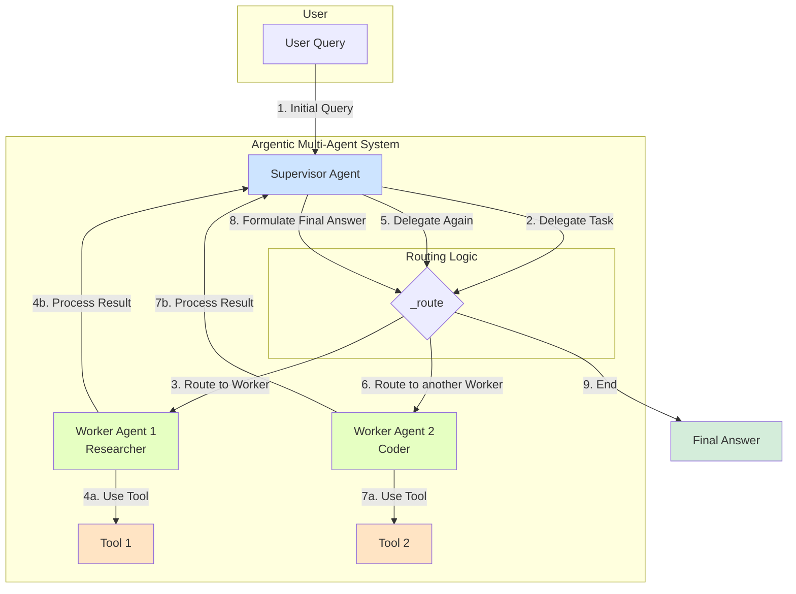

# Multi-Agent Systems with Argentic

Argentic now supports powerful multi-agent workflows, allowing you to create teams of specialized AI agents that collaborate to solve complex problems. This guide will walk you through the concepts and practical steps to build and run your own multi-agent systems.

## The Core Concept: Supervisor and Workers

The multi-agent system in Argentic is built around a central **Supervisor** agent that orchestrates a team of **Worker** agents.

*   **The Supervisor**: This is a specialized `Agent` that acts as a project manager. It doesn't perform tasks itself; instead, it analyzes incoming requests and delegates them to the most appropriate worker agent.
*   **Worker Agents**: These are standard `Agent` instances, but each is configured with a specific role, a tailored system prompt, and a set of tools relevant to its specialty. For example, you might have a `researcher` agent with web search tools and a `coder` agent with file system tools.

## The Pipeline

The multi-agent workflow is a cyclical and collaborative process:

1.  **Delegation**: A user query is sent to the Supervisor. The Supervisor's LLM, guided by its system prompt (which includes descriptions of all available workers), decides which agent is best suited for the job and delegates the task.
2.  **Execution**: The designated worker agent receives the task and executes it, using its specialized tools and knowledge.
3.  **Collaboration**: The result from the worker is sent back to the Supervisor.
4.  **Iteration**: The Supervisor receives the worker's output and decides on the next step. It can:
    *   Delegate a new task to another worker (or the same one).
    *   Formulate a final answer if the task is complete.
    *   Continue this loop until the initial user query is fully resolved.

This process is visualized in the diagram below:



## How to Build a Multi-Agent System

Building a multi-agent system is straightforward. The `Supervisor` class is the main entry point and handles all the underlying complexity of graph and agent management.

### Step 1: Create a Supervisor

First, instantiate the `Supervisor`. It requires an LLM and a `Messager` instance, just like a standard `Agent`.

```python
from argentic.core.llm.providers import OllamaProvider
from argentic.core.messager.messager import Messager
from argentic.core.graph.supervisor import Supervisor

# 1. Initialize the LLM and Messager
llm = OllamaProvider(model="llama3")
messager = Messager(broker_address="localhost")

# 2. Create the Supervisor
supervisor = Supervisor(llm=llm, messager=messager)
```

### Step 2: Create Worker Agents

Next, create your specialized worker agents. These are just regular `Agent` instances with a specific `role` and `system_prompt`.

```python
from argentic.core.agent.agent import Agent

# Create a researcher agent
researcher_prompt = "You are a researcher. Your job is to find and synthesize information from the web."
researcher = Agent(
    llm=llm,
    messager=messager,
    role="researcher",
    system_prompt=researcher_prompt,
    # This agent would have web search tools
)

# Create a coder agent
coder_prompt = "You are a coder. Your job is to write and modify code."
coder = Agent(
    llm=llm,
    messager=messager,
    role="coder",
    system_prompt=coder_prompt,
    # This agent would have file system tools
)
```

### Step 3: Add Workers to the Supervisor

Register your worker agents with the supervisor. The `add_agent` method also adds the agent as a node in the underlying graph.

```python
supervisor.add_agent(researcher)
supervisor.add_agent(coder)
```

### Step 4: Compile and Run the Graph

Once all agents are added, compile the graph. This finalizes the supervisor's prompt and builds the runnable graph object.

```python
import asyncio
from langchain_core.messages import HumanMessage

# Compile the graph
supervisor.compile()

# Run the system with an initial query
async def main():
    initial_state = {"messages": [HumanMessage(content="What is the weather in Paris?")]}
    async for event in supervisor.runnable.astream(initial_state):
        # The stream will emit events for each step of the graph
        print(event)
        print("---")

if __name__ == "__main__":
    asyncio.run(main())
```

### Single-Agent Mode vs. Multi-Agent Mode

This new multi-agent functionality is designed to be an optional layer.

*   **To run in single-agent mode**, simply instantiate and use the `Agent` class directly as you did before. Nothing has changed in that workflow.
*   **To run in multi-agent mode**, use the `Supervisor`-led approach described above.

This design ensures that you can choose the right level of complexity for your needs without any breaking changes to the existing API. 