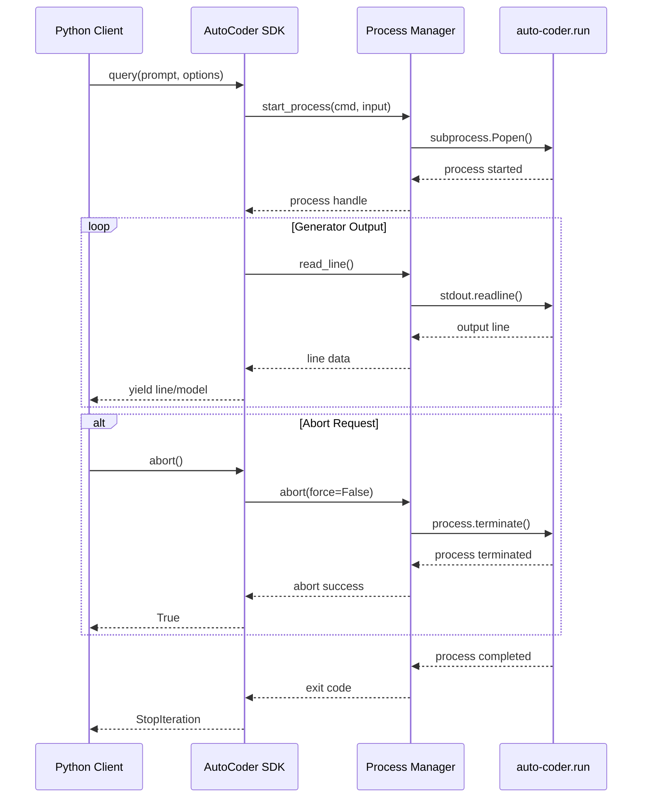
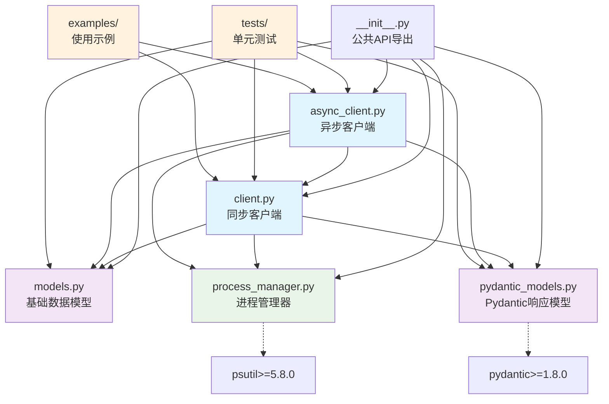

# AutoCoder CLI Python SDK Module

一个便于在Python代码中调用auto-coder.run功能的完整SDK，无需直接使用subprocess或fork进程。提供同步/异步接口、Generator返回、Pydantic模型支持和进程管理功能。

## Directory Structure

```
cli-sdks/python/
├── autocoder_cli_sdk/              # 主要SDK包
│   ├── __init__.py                 # 包初始化，导出所有公共API
│   ├── client.py                   # 同步客户端实现
│   ├── async_client.py             # 异步客户端实现
│   ├── models.py                   # 基础数据模型定义
│   ├── pydantic_models.py          # Pydantic响应模型
│   ├── process_manager.py          # 进程管理器（支持abort操作）
│   └── py.typed                    # 类型提示标记文件
├── examples/                       # 使用示例
│   ├── basic_usage.py              # 基础用法示例
│   ├── async_usage.py              # 异步用法示例
│   ├── session_management.py       # 会话管理示例
│   └── generator_usage.py          # Generator接口示例
├── tests/                          # 单元测试
│   ├── __init__.py
│   ├── test_models.py              # 模型测试
│   ├── test_client.py              # 客户端测试
│   └── test_generator_interface.py # Generator接口测试
├── setup.py                        # 安装脚本（传统）
├── pyproject.toml                  # 现代Python项目配置
├── requirements.txt                # 核心依赖
├── requirements-dev.txt            # 开发依赖
├── README.md                       # 详细文档
├── MANIFEST.in                     # 打包配置
└── .ac.mod.md                      # 本文档
```

## Quick Start

### 基础文本输出（Generator接口）

```python
from autocoder_cli_sdk import AutoCoderClient, QueryOptions

client = AutoCoderClient()
options = QueryOptions(output_format="text")

# 返回Generator[str]，逐行输出
for line in client.query("创建一个Python函数", options):
    print(line)
```

### JSON输出（Pydantic模型）

```python
from autocoder_cli_sdk import AutoCoderClient, QueryOptions, QueryResponseModel

client = AutoCoderClient()
options = QueryOptions(output_format="json")

# 返回Generator[QueryResponseModel]
for response in client.query("创建一个Python类", options):
    if isinstance(response, QueryResponseModel):
        print(f"事件数: {response.summary.total_events}")
        print(f"最终结果: {response.final_result}")
```

### 异步使用与中止操作

```python
import asyncio
from autocoder_cli_sdk import AsyncAutoCoderClient

async def main():
    async with AsyncAutoCoderClient() as client:
        # 启动查询
        query_gen = client.query("复杂的查询任务")
        
        # 处理结果
        line_count = 0
        async for line in query_gen:
            print(line)
            line_count += 1
            
            # 中止条件
            if line_count > 50:
                await client.abort()  # 优雅中止
                # 或 await client.abort_force()  # 强制中止
                break

asyncio.run(main())
```

## Core Components

### 1. AutoCoderClient (同步客户端)

**核心功能：**
- **Generator接口**: query()方法返回Generator[Union[str, QueryResponseModel]]
- **进程管理**: 支持abort()和abort_force()中止操作
- **会话管理**: 支持多轮对话上下文
- **配置管理**: configure()方法设置模型参数

**主要方法：**
- `query(prompt, options) -> Generator[Union[str, QueryResponseModel]]`
- `abort() -> bool` - 优雅中止当前查询
- `abort_force() -> bool` - 强制中止当前查询
- `is_running() -> bool` - 检查是否有查询正在执行
- `configure(config_dict) -> ConfigResponseModel` - 配置管理
- `session(session_id) -> ContextManager` - 会话上下文管理器

### 2. AsyncAutoCoderClient (异步客户端)

**核心功能：**
- **异步Generator**: 返回AsyncGenerator[Union[str, QueryResponseModel]]
- **并发控制**: batch_query()支持批量并发查询
- **异步进程管理**: 异步中止和状态检查
- **会话管理**: 异步会话上下文管理器

**主要方法：**
- `query(prompt, options) -> AsyncGenerator[Union[str, QueryResponseModel]]`
- `abort() -> bool` - 异步中止
- `batch_query(prompts, max_concurrency=3) -> List[Results]`
- `session(session_id) -> AsyncContextManager`

### 3. Pydantic响应模型

**核心模型：**
- **QueryResponseModel**: JSON格式响应的主要模型
- **StreamEventModel**: 单个事件模型
- **ConfigResponseModel**: 配置操作响应
- **ProcessManager**: 进程生命周期管理

**主要特性：**
- 类型安全的响应处理
- 自动序列化/反序列化
- 丰富的属性访问器（如final_result, has_errors等）

### 4. ProcessManager (进程管理器)

**核心功能：**
- **生命周期管理**: 启动、监控、终止进程
- **流式输出**: 实时读取进程输出
- **中止控制**: 优雅终止和强制终止
- **状态监控**: 运行状态检查

**同步和异步版本：**
- ProcessManager: 同步版本
- AsyncProcessManager: 异步版本

## Operation Sequence Diagram

以下展示完整的查询执行流程，包括Generator返回和中止操作：



## Mermaid File Dependency Graph



## Dependency Relationships

与其他AC模块的依赖关系：

- **内部SDK依赖**: 优先使用autocoder.sdk内部模块（如果可用）
- **命令行工具**: 回退到调用auto-coder.run命令行工具
- **进程管理**: 独立的进程管理，不依赖其他AC模块
- **配置系统**: 兼容auto-coder.run的所有配置选项

**外部Python依赖:**
- `pydantic>=1.8.0,<3.0.0` - JSON响应模型
- `psutil>=5.8.0` - 进程管理
- `typing_extensions>=3.7.4` - Python < 3.8类型提示支持

## Commands to Verify Module Functionality

### 基本功能测试

```bash
# 安装SDK（使用uv）
cd cli-sdks/python
uv sync

# 运行所有测试
uv run pytest tests/ -v
# 或使用开发脚本
python scripts/dev.py test

# 运行特定测试
uv run pytest tests/test_generator_interface.py -v
```

### 示例程序测试

```bash
# 使用uv运行示例
uv run python examples/basic_usage.py
uv run python examples/async_usage.py
uv run python examples/generator_usage.py
uv run python examples/session_management.py

# 或使用开发脚本
python scripts/dev.py example basic_usage
python scripts/dev.py example async_usage
```

### 功能验证测试

```bash
# 测试文本格式Generator输出
uv run python -c "
from autocoder_cli_sdk import AutoCoderClient, QueryOptions
client = AutoCoderClient()
options = QueryOptions(output_format='text')
for i, line in enumerate(client.query('print(\"hello world\")', options)):
    print(f'第{i+1}行: {line}')
    if i > 5: break
"

# 测试JSON格式Pydantic模型输出  
uv run python -c "
from autocoder_cli_sdk import AutoCoderClient, QueryOptions, QueryResponseModel
client = AutoCoderClient()
options = QueryOptions(output_format='json')
for response in client.query('创建hello函数', options):
    if isinstance(response, QueryResponseModel):
        print(f'事件数: {response.summary.total_events}')
        break
"
```

### 中止功能测试

```bash
# 测试中止功能
uv run python -c "
import asyncio
from autocoder_cli_sdk import AsyncAutoCoderClient

async def test_abort():
    async with AsyncAutoCoderClient() as client:
        print('✅ 中止功能测试')
        success = await client.abort()
        print(f'中止结果: {success}')

asyncio.run(test_abort())
"
```

### 性能测试

```bash
# 批量并发测试
uv run python -c "
import asyncio
from autocoder_cli_sdk import AsyncAutoCoderClient

async def batch_test():
    async with AsyncAutoCoderClient() as client:
        print('✅ 批量查询功能测试')
        prompts = ['简单测试A', '简单测试B']
        results = await client.batch_query(prompts, max_concurrency=2)
        print(f'结果数量: {len(results)}')

asyncio.run(batch_test())
"
```

### 调试技巧

**启用详细输出：**
```bash
uv run python -c "
from autocoder_cli_sdk import AutoCoderClient, SDKConfig
config = SDKConfig(verbose=True)
client = AutoCoderClient(config)
print('详细模式已启用')
"
```

**开发工具：**
```bash
# 代码格式化
python scripts/dev.py format

# 代码质量检查
python scripts/dev.py lint

# 构建包
python scripts/dev.py build

# 类型检查
uv run mypy autocoder_cli_sdk/
```
