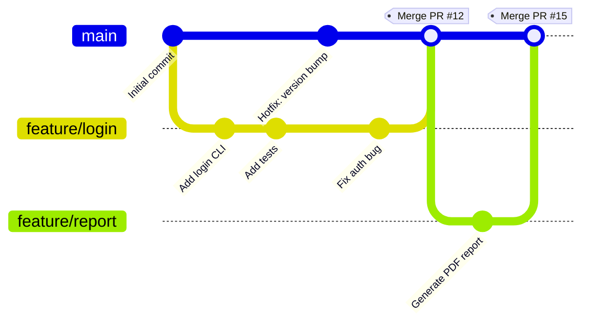

# Contributing to AutoRepoReview

This document outlines our **Sprint cycle**, **Git workflow**, **branching and protection rules**, **commit conventions**, **issue and PR templates**, **review process**, **deployment strategy**, **license**, and **GitHub Projects** usage.

We follow a lightweight, pragmatic process inspired by **[GitHub Flow](https://docs.github.com/en/get-started/using-github/github-flow)**, adapted for a small academic team working on a CLI tool.

---

## Sprint Cycle (1-Week Cadence)

A **Sprint** lasts **1 week** and follows this structure:

| Phase | Duration | Activities |
|------|----------|------------|
| **Sprint Planning** | Day 1 | Review backlog → Prioritize issues → Assign tasks → Estimate effort |
| **Development** | Days 2–6 | Work on assigned issues → Daily stand-ups (async via GitHub Discussions) |
| **Review & Demo** | Day 7 | PR reviews → Fix feedback → Demo working features |
| **Retrospective** | Day 7 | What went well? What to improve? Update process if needed |
| **Release** | End of Day 7 | Tag release → Update changelog → Publish CLI (if applicable) |

> **Purpose**: Ensures predictable progress, early feedback, and continuous improvement in a student team setting.

---

## Git Workflow

We use **GitHub Flow** with **merge commits allowed** (no rebase-only policy). All work happens in **feature branches** off `main`.

### Branching Rules


#### Rules:

main is the only permanent branch
All changes go through feature branches named:
feature/<short-description> (e.g., feature/add-help-command)
No direct commits to main
Delete branch after merge (optional)

Justification: Simple, scalable, works well with PRs and CI. Inspired by GitHub Flow.

### Branch Protection Rules (main)
Enabled via GitHub Settings > Branches > Branch protection rules:


|Rule |Status |Purpose|
|-----|------|------|
|Restrict creations |Enabled |Only allow users with bypass permission to create matching refs.|
|Restrict updates |Enabled |Only allow users with bypass permission to update matching refs.|
|Restrict deletions |Enabled |Only allow users with bypass permissions to delete matching refs.|
|Require linear history |Disabled |Allows merge commits (team preference)|
|Require signed commits |Enabled |Commits pushed to matching refs must have verified signatures.|


RuleStatusPurposeRequire pull request reviews before mergingEnabledEnsures code is peer-reviewedRequire status checks to pass before mergingEnabledBlocks merge if CI failsRequire conversation resolution before mergingEnabledNo unresolved commentsRequire linear historyDisabledAllows merge commits (team preference)Include administratorsEnabledNo one bypasses rules
Justification: Prevents broken code in main, enforces quality, and maintains transparency.

### Commit Message Format
We use Conventional Commit Format:
```
<type>(<scope>): <short summary>

[optional body]

[optional footer]
```

Allowed Types:

|Type | Use|
|--------|--------|
|feat | New feature|
|fix |Bug fix|
|docs |Documentation|
|test |Adding/updating tests|
|chore |"Maintenance, config, CI"|
|refactor |Code change without behavior change|


Issue Form & Pull Request Templates
Located in .github/:

Issue Template: .github/ISSUE_TEMPLATE/bug_report.md
→ Structured form for bugs, features, and questions
PR Template: .github/PULL_REQUEST_TEMPLATE.md
→ Checklist: tests, docs, description, screenshots

Justification: Reduces noise, ensures all info is provided upfront → faster reviews.

Pull Request Review Process

Open PR from feature/* → main
GitHub auto-assigns 1 reviewer (round-robin)
Reviewer checks:
Code works
Tests pass
Commit messages follow convention
Docs updated if needed

Use "Request changes" or "Approve"
PR merged only after approval + CI pass
Branch deleted after merge

Justification: Lightweight but enforces quality. 1 reviewer is sufficient for a small team.

Deployment & Availability
Current State

AutoRepoReview is a CLI tool
No staging/production environments
No automated deployment pipeline for the app

How to Use (Stakeholders)

Clone the repo:
```bash
git clone https://github.com/AutoRepoReviewITPD/AutoRepoReview.git
```
Install:
```bash
pip install .
```
Run:
```bash
autoreporeview --help
```

Stakeholders can access the tool directly from the repository.

### Documentation Deployment (GitHub Pages)
We do deploy documentation automatically:

Trigger: Push to main affecting docs/ or mkdocs.yml
Tool: MkDocs + Material theme
Deployed to: https://autoreporeviewitpd.github.io/AutoRepoReview/
Workflow: .github/workflows/deploy-docs.yml

With this approach, user guide and API docs are always kept up-to-date and publicly accessible.

### License
MIT License – See LICENSE.txt

The MIT License is:
Permissive: Allows anyone to use, modify, and distribute the code (even commercially)
Simple: Short, easy to understand
Encourages contribution: No legal friction for students or external collaborators
It's also a standard in open-source CLI tools, as well as ideal for academic projects where reuse and collaboration are goals.

GitHub Projects
We use one GitHub Project for backlog and sprint tracking:
Project: [https://github.com/orgs/AutoRepoReviewITPD/projects/1](AutoRepoReview)

#### Views (in order)

|#|View |Purpose|
|--|-------|-------|
|1 |Table|"Full backlog with filters (priority, assignee, status)" for planning and prioritization|
|2 |Board|Kanban view: To Do → In Progress → Review → Done for daily progress tracking|


#### Summary


|Aspect |Purpose|
|--------|-------|
|GitHub Flow + PRs |"Safe, reviewable changes"|
|Branch protection |Prevent accidents|
|Conventional Commits |"Clear history, automation-ready"|
|Templates |Reduce friction|
|1-reviewer policy,Fast but safe|
|MIT License |Maximum openness|
|GitHub Pages docs |Always up to date user guide|


### Secrets

We add API keys to GitHub Secrets and reuse them for staging tests
