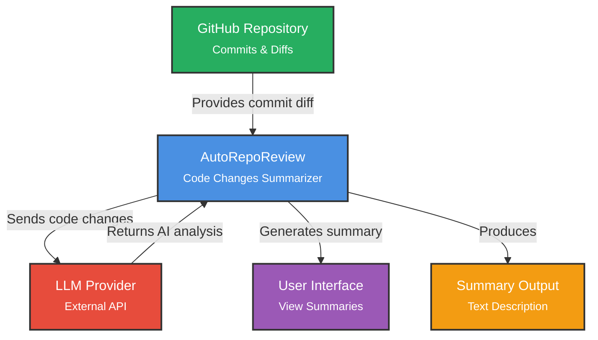

# AutoRepoReview

[](https://codecov.io/gh/AutoRepoReviewITPD/AutoRepoReview)

AI-powered git repository change analysis

## Quick Start

Before running AutoRepoReview, you need to configure your API settings. The configuration step will prompt you to enter:
- **API URL** (e.g., `https://api.openai.com/v1`)
- **Model name** (optional, e.g., `gpt-4`)
- **API key** (hidden from display)

### Option 1: Run via uvx (Recommended)

If you have [uv](https://docs.astral.sh/uv/getting-started/installation/) installed, you can run AutoRepoReview directly:

1. **Configure AutoRepoReview** (first time setup):
   ```bash
   uvx autoreporeview configure
   ```
   You will be prompted to enter your API URL, model name (optional), and API key.

2. **Run AutoRepoReview**:
   ```bash
   uvx autoreporeview summary <path> <commit_a> <commit_b>
   ```

This will automatically download and run the latest version from PyPI.

### Option 2: Download Pre-built Binary

1. **Download the latest release** from [GitHub Releases](https://github.com/AutoRepoReviewITPD/AutoRepoReview/releases)
   - **Windows**: Download `autoreporeview.exe`
   - **Linux**: Download `autoreporeview` (Linux binary)
   - **macOS**: Download `autoreporeview` (macOS binary)

2. **Make it executable** (Linux/macOS):
   ```bash
   chmod +x autoreporeview
   ```

3. **Configure AutoRepoReview** (first time setup):
   ```bash
   # Windows
   .\autoreporeview.exe configure
   
   # Linux/macOS
   ./autoreporeview configure
   ```
   You will be prompted to enter your API URL, model name (optional), and API key.

4. **Run AutoRepoReview**:
   ```bash
   # Windows
   .\autoreporeview.exe summary <path> <commit_a> <commit_b>
   
   # Linux/macOS
   ./autoreporeview summary <path> <commit_a> <commit_b>
   ```

### Option 3: Run from GitHub Sources via uvx

1. **Configure AutoRepoReview** (first time setup):
   ```bash
   uvx --from git+https://github.com/AutoRepoReviewITPD/AutoRepoReview autoreporeview configure
   ```
   You will be prompted to enter your API URL, model name (optional), and API key.

2. **Run AutoRepoReview**:
   ```bash
   uvx --from git+https://github.com/AutoRepoReviewITPD/AutoRepoReview autoreporeview summary <path> <commit_a> <commit_b>
   ```

This builds and runs the tool from the latest GitHub sources.

### Option 4: Clone and Run Locally

1. **Clone the repository**:
   ```bash
   git clone https://github.com/AutoRepoReviewITPD/AutoRepoReview.git
   cd AutoRepoReview
   ```

2. **Install [uv](https://docs.astral.sh/uv/getting-started/installation/)** (if you don't have it)

3. **Configure AutoRepoReview** (first time setup):
   ```bash
   # Using uv run
   uv run autoreporeview configure
   
   # Or if running directly (after making executable on Linux/macOS)
   chmod +x autoreporeview
   ./autoreporeview configure
   ```
   You will be prompted to enter your API URL, model name (optional), and API key.

4. **Run AutoRepoReview**:
   ```bash
   # Using uv run
   uv run autoreporeview summary <path> <commit_a> <commit_b>
   
   # Or run directly (Linux/macOS)
   ./autoreporeview summary <path> <commit_a> <commit_b>
   ```

## Summary Modes

When running the `summary` or `summary-by-time` commands, you'll be prompted to choose a summary mode that focuses on specific aspects of the changes:

1. **General summary** - Provides an overview of all changes (default)
2. **Documentation changes** - Focuses specifically on documentation updates, README changes, comments, and docstrings
3. **Features add/removed** - Highlights new features, removed features, and enhancements to existing functionality
4. **Breaking changes** - Identifies breaking changes, API modifications, and migration requirements

Each mode uses specialized prompts to generate more focused and relevant summaries based on your specific needs.

## Getting Help

You can get help about available commands and options:

- **View all available commands**:
  ```bash
  ./autoreporeview --help
  # Or with uv run
  uv run autoreporeview --help
  ```

- **View help for a specific command**:

   Example:
  
  ```bash
  autoreporeview summary --help
  # Or with uv run
  uv run autoreporeview summary --help
  ```

That's it!

## Releases and Builds

### Creating a Release

To create a new release with pre-built binaries and publish to PyPI:

1. **Update version in `pyproject.toml`**:
   ```bash
   # Update the version field in pyproject.toml
   # Example: version = "0.1.1"
   # Or use uv to bump version:
   uv version 0.1.1
   ```

2. **Ensure your changes are committed and pushed**:
   ```bash
   git add .
   git commit -m "Your commit message"
   git push origin main
   ```

3. **Create and push a version tag**:
   ```bash
   # Create a tag (use semantic versioning: vMAJOR.MINOR.PATCH)
   # Version should match pyproject.toml (with 'v' prefix)
   git tag v0.1.1
   
   # Push the tag to trigger the workflows
   git push origin v0.1.1
   ```

4. **Monitor the workflows**:
   - Go to the [Actions](https://github.com/AutoRepoReviewITPD/AutoRepoReview/actions) tab to see the build progress
   - The `Build Binaries` workflow will automatically build binaries for Windows, Linux, and macOS
   - The `Publish to PyPI` workflow will automatically build the package and publish to PyPI
   - Both workflows will create/update a GitHub Release and attach their artifacts
   - Once complete, binaries and wheel files will be attached to the release, and the package will be available on PyPI

**Important Notes**: 
- The tag name must start with `v` followed by a version number (e.g., `v0.1.0`, `v1.2.3`)
- The version in `pyproject.toml` should match the tag (without the `v` prefix)
- Both workflows trigger automatically on tag push, so no manual release creation is needed
- Before first publish to PyPI, you need to enable trusted publishing:
  1. Go to [PyPI Account Settings](https://pypi.org/manage/account/)
  2. Navigate to "Publishing" → "Add a pending publisher"
  3. Add your GitHub repository (e.g., `AutoRepoReviewITPD/AutoRepoReview`)
  4. Specify the workflow filename: `.github/workflows/publish-pypi.yml`
  5. Specify the environment: leave empty

### Building Locally

For local development and testing, you can build the package and binaries manually.

#### Building the Package Locally

To build the Python package (wheel and source distribution):

```bash
# Build the package using uv
uv build --no-sources
```

The built packages will be in the `dist/` directory.

**Note**: The `--no-sources` flag ensures the package builds correctly without `tool.uv.sources`, which is recommended when publishing.

After building, you can test installing the package locally:

```bash
# Install from the built wheel
pip install dist/autoreporeview-*.whl

# Or install from source distribution
pip install dist/autoreporeview-*.tar.gz
```

#### Building Binaries Locally

Build standalone executables for Windows, Linux, and macOS using PyInstaller.

**Prerequisites**: Install build dependencies:
```bash
uv sync --group dev
```

**Building for Current Platform**:

Build a binary for your current operating system:
```bash
uv run pyinstaller --clean --name autoreporeview --onefile autoreporeview_cli.py
```

The binary will be created in the `dist/` directory:
- **Windows**: `dist/autoreporeview.exe`
- **Linux/macOS**: `dist/autoreporeview`

After building, test the binary:
```bash
# Windows
.\dist\autoreporeview.exe summary <path> <commit_a> <commit_b>

# Linux/macOS
./dist/autoreporeview summary <path> <commit_a> <commit_b>
```

**Cross-Platform Building**:

PyInstaller doesn't support cross-compilation. To build binaries for other platforms:

1. **Using Docker** (for Linux builds on Windows/macOS):
   ```bash
   docker run --rm -v "$(pwd):/src" python:3.13 bash -c "cd /src && pip install uv && uv sync --group dev && uv run pyinstaller --clean --name autoreporeview --onefile autoreporeview_cli.py"
   ```

2. **Using WSL** (for Linux builds on Windows):
   - Install WSL and Ubuntu
   - Follow the Linux build instructions inside WSL

3. **Native builds**:
   - Build Windows binaries on Windows
   - Build Linux binaries on Linux
   - Build macOS binaries on macOS

## Project Goals
- Automate routine review of repository changes
- Learn about the health and development dynamics of a project
- Quickly discover hidden patterns and issues in code
- Explain complex changes in simple terms using AI

## Description

This project develops a code summarizer tool that analyzes GitHub commits to generate concise summaries of code changes. It highlights key modifications, such as added/removed features, bug fixes, and the overall impact on functionality, enabling users to quickly understand what the new code can do without reviewing the entire diff.

## Threshold of Success Diagram

The project is considered successful if it meets the following criteria:
- Accurately summarizes at least 80% of simple commits (e.g., single-file changes) based on manual evaluation.
- Processes commits from public GitHub repositories in under 1 minute per commit.
- Provides readable summaries that include change type, affected components, and functional implications.
- Handles common programming languages like Python, JavaScript, and Java.
- Has a user-friendly interface, similar to the command-line interface of Git.
- Easily installable on Linux.

## Project Context



## Features Roadmap

### In Progress
- [ ] Commit difference summarization
- [ ] CLI for summary viewing

### Planned
- [ ] PDF report generation for visualization
- [ ] Advanced pattern recognition (identify stable, volatile, and recurrently-changing code patterns)
- [ ] Contributors activity analysis

## Documentation

**[View Documentation Site](https://AutoRepoReviewITPD.github.io/AutoRepoReview/)** with sprint reports, meeting notes, and project documentation.
- `./docs/sprints` — Contains scripts, meeting notes, sprint reports, and other iterative documentation reflecting project progress.
- `./docs/ai-usage.md` — Details how AI tools have been used within the project.
