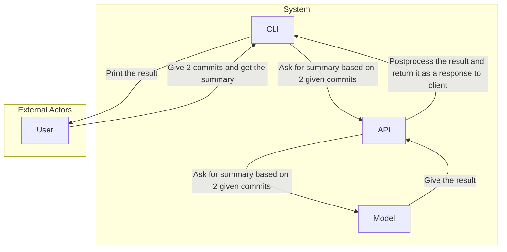
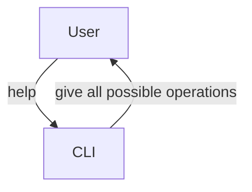
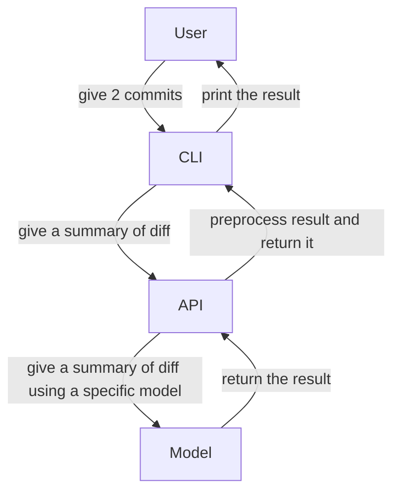
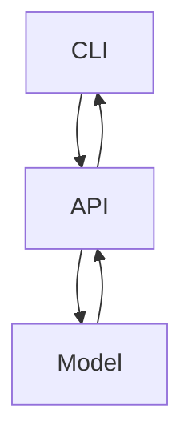
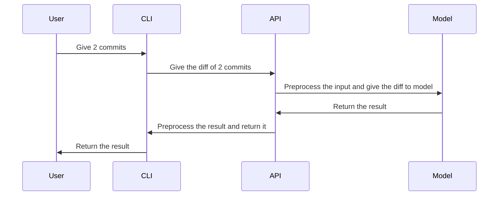
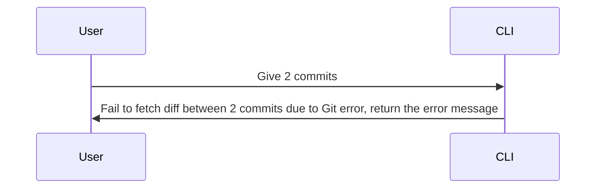

# Context Diagram

## External Actors

| Actor | Description |
|---|---|
|User|An individual that uses this project|
|CLI|A program that is used by user in terminal to interact with the system|
|API|A program that is used by CLI to use core of the system|
|LLM model|An LLM model that gives the summary of changes between 2 commits|

# Use Case Diagram

# Component Diagram

| Components | Description |
|---|---|
|CLI|A program that is used by user in terminal to interact with the system|
|API|A program that is used by CLI to use core of the system|
|LLM model|An LLM model that gives the summary of changes between 2 commits|

# Sequence Diagram

## User story PBI-004

As a code reviewer, I want an AI-generated summary of each commit posted as a PR comment so that I can quickly understand changes without reading full diff

### Test

Steps:

1. User gives 2 commits and he/she wants to know the summary of diff between them.

Expected result: system gives comprehensive summary about the changes between 2 commits

## User story PBI-013

Add error handling and retry logic

### Test

Steps:

1. User gives 2 not existing commits.

Expected result: system gives comprehensive error.

