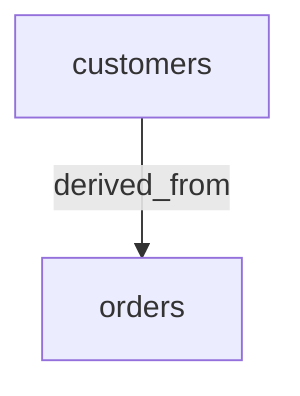
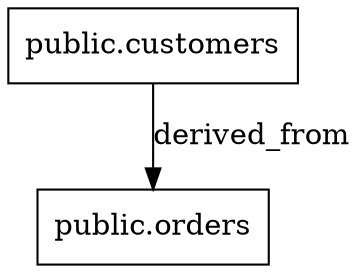

# Lineage Visualization

Baselinr provides comprehensive lineage visualization capabilities to understand and explore data dependencies across your data warehouse.

## Overview

Lineage visualization helps you:
- **Understand data flow**: See how tables and columns are related
- **Track drift impact**: Identify which downstream tables are affected by drift
- **Debug data issues**: Trace data lineage to find root causes
- **Document dependencies**: Generate diagrams for documentation

## Features

### 1. Interactive Dashboard Visualization

Access via the Baselinr UI at `http://localhost:3000/lineage`

- **Graph visualization** with Cytoscape.js
- **Interactive exploration** - click nodes to see details
- **Filtering** by depth, direction, and confidence
- **Search** to find specific tables
- **Drift highlighting** shows impacted tables

### 2. CLI Visualization

Generate static diagrams from the command line:

```bash
# ASCII tree view (terminal-friendly)
baselinr lineage visualize --config config.yml --table customers --format ascii

# Mermaid diagram (for markdown/documentation)
baselinr lineage visualize --config config.yml --table orders \
  --format mermaid --output docs/lineage.md

# Graphviz DOT format
baselinr lineage visualize --config config.yml --table customers --format dot

# SVG/PNG/PDF images (requires Graphviz installed)
baselinr lineage visualize --config config.yml --table customers \
  --format svg --output lineage.svg

# JSON export (Cytoscape.js, D3.js, or generic)
baselinr lineage visualize --config config.yml --table customers \
  --format json --json-format cytoscape --output lineage.json
```

### 3. API Access

Programmatic access via REST API:

```bash
# Get lineage graph
curl "http://localhost:8000/api/lineage/graph?table=customers&depth=3&direction=both"

# Get column-level lineage
curl "http://localhost:8000/api/lineage/column-graph?table=orders&column=customer_id"

# Get node details
curl "http://localhost:8000/api/lineage/node/public.customers"

# Search tables
curl "http://localhost:8000/api/lineage/search?q=customer"

# Get drift propagation path
curl "http://localhost:8000/api/lineage/drift-path?table=customers"
```

## CLI Reference

### `baselinr lineage visualize`

Visualize lineage as diagram or export to various formats.

**Options:**
- `--config, -c PATH`: Configuration file (required)
- `--table TABLE`: Table name (required)
- `--schema SCHEMA`: Schema name (optional)
- `--column COLUMN`: Column name for column-level lineage (optional)
- `--direction {upstream|downstream|both}`: Lineage direction (default: both)
- `--depth N`: Maximum depth to traverse (default: 3)
- `--format {ascii|mermaid|dot|json|svg|png|pdf}`: Output format (default: ascii)
- `--json-format {cytoscape|d3|generic}`: JSON export format (default: generic)
- `--output, -o PATH`: Output file path
- `--no-color`: Disable colored output (ASCII format)
- `--highlight-drift`: Highlight tables with drift
- `--layout`: Include layout positions in JSON export

**Examples:**

```bash
# View lineage in terminal
baselinr lineage visualize --table customers --format ascii

# Show only upstream dependencies
baselinr lineage visualize --table orders --direction upstream --depth 2

# Generate Mermaid diagram for documentation
baselinr lineage visualize --table customers \
  --format mermaid --output docs/lineage.md

# Export to SVG with drift highlighting
baselinr lineage visualize --table customers \
  --format svg --output lineage.svg --highlight-drift

# Column-level lineage
baselinr lineage visualize --table orders --column customer_id \
  --format ascii --direction upstream
```

## API Reference

### GET `/api/lineage/graph`

Get table-level lineage graph.

**Query Parameters:**
- `table` (required): Table name
- `schema` (optional): Schema name
- `direction` (optional): upstream|downstream|both (default: both)
- `depth` (optional): Max depth 1-10 (default: 3)
- `confidence_threshold` (optional): Min confidence 0.0-1.0 (default: 0.0)

**Response:**
```json
{
  "nodes": [
    {
      "id": "public.customers",
      "type": "table",
      "label": "customers",
      "schema": "public",
      "metadata": {"is_root": true}
    }
  ],
  "edges": [
    {
      "source": "public.customers",
      "target": "public.orders",
      "relationship_type": "derived_from",
      "confidence": 0.95
    }
  ],
  "root_id": "public.customers",
  "direction": "both"
}
```

### GET `/api/lineage/column-graph`

Get column-level lineage graph.

**Query Parameters:**
- `table` (required): Table name
- `column` (required): Column name
- `schema` (optional): Schema name
- `direction` (optional): upstream|downstream|both (default: both)
- `depth` (optional): Max depth 1-10 (default: 3)
- `confidence_threshold` (optional): Min confidence 0.0-1.0 (default: 0.0)

### GET `/api/lineage/node/{node_id}`

Get detailed information about a specific node.

**Path Parameters:**
- `node_id`: Node identifier (e.g., "public.customers" or "public.orders.customer_id")

**Response:**
```json
{
  "id": "public.customers",
  "type": "table",
  "label": "customers",
  "schema": "public",
  "upstream_count": 0,
  "downstream_count": 5,
  "providers": ["dbt", "sql_parser"]
}
```

### GET `/api/lineage/search`

Search for tables in lineage data.

**Query Parameters:**
- `q` (required): Search query
- `limit` (optional): Max results 1-100 (default: 20)

### GET `/api/lineage/tables`

Get all tables with lineage data.

**Query Parameters:**
- `limit` (optional): Max results 1-1000 (default: 100)

### GET `/api/lineage/drift-path`

Get drift propagation path showing affected downstream tables.

**Query Parameters:**
- `table` (required): Table name
- `schema` (optional): Schema name
- `run_id` (optional): Specific run ID

**Response:**
```json
{
  "table": "customers",
  "schema": "public",
  "has_drift": true,
  "drift_severity": "high",
  "affected_downstream": [
    {"schema": "public", "table": "orders"},
    {"schema": "public", "table": "user_profiles"}
  ],
  "lineage_path": {
    "nodes": [...],
    "edges": [...]
  }
}
```

## Configuration

Add visualization settings to your `baselinr.yml`:

```yaml
visualization:
  enabled: true
  max_depth: 3
  direction: both
  confidence_threshold: 0.5
  layout: hierarchical
  web_viewer_port: 8080
  theme: dark
  styles:
    node_colors:
      healthy: "#4CAF50"
      warning: "#FFC107"
      drift: "#F44336"
```

## Output Formats

### ASCII Tree

Terminal-friendly tree view with color support:

```
customers (public)
├─→ orders (derived_from, 0.95)
│   └─→ daily_sales (aggregated, 0.98)
└─→ user_profiles (joined_with, 0.87)
```

### Mermaid

Markdown-compatible diagram syntax:



### Graphviz DOT

Professional diagram format:



### JSON

Multiple JSON formats for different visualization libraries:

**Cytoscape.js:**
```json
{
  "elements": [
    {"data": {"id": "public.customers", "label": "customers"}},
    {"data": {"source": "public.customers", "target": "public.orders"}}
  ]
}
```

**D3.js:**
```json
{
  "nodes": [{"id": "public.customers", "label": "customers"}],
  "links": [{"source": 0, "target": 1, "value": 0.95}]
}
```

## Python API

Use visualization components programmatically:

```python
from baselinr.visualization import LineageGraphBuilder
from baselinr.visualization.exporters import MermaidExporter
from baselinr.connectors.factory import create_connector

# Create connector
connector = create_connector(config.storage.connection)

# Build graph
builder = LineageGraphBuilder(connector.engine)
graph = builder.build_table_graph(
    root_table="customers",
    schema="public",
    direction="both",
    max_depth=3
)

# Export to Mermaid
exporter = MermaidExporter(direction="TD")
mermaid_code = exporter.export(graph)
print(mermaid_code)
```

## Requirements

### For CLI/API (core functionality)
- Python 3.10+
- SQLAlchemy
- Baselinr installed

### For image export (SVG/PNG/PDF)
- Graphviz installed on system:
  - macOS: `brew install graphviz`
  - Ubuntu: `sudo apt-get install graphviz`
  - Windows: Download from https://graphviz.org/download/

### For colored terminal output
- colorama (automatically installed)

### For dashboard UI
- Node.js 18+
- npm or yarn

## Troubleshooting

### "No lineage data found"

Ensure lineage has been extracted:
```bash
# For dbt projects
baselinr lineage sync --config config.yml --provider dbt

# For query history
baselinr lineage sync --config config.yml --provider postgres_query_history
```

### "Graphviz not found"

Install Graphviz for image export:
- macOS: `brew install graphviz`
- Ubuntu: `sudo apt-get install graphviz`
- Windows: https://graphviz.org/download/

### "Lineage visualization not available"

Ensure visualization components are imported correctly. Check dashboard backend logs.

## Best Practices

1. **Start with shallow depth**: Use `--depth 2` initially to avoid overwhelming graphs
2. **Use direction filtering**: Focus on upstream or downstream for clearer views
3. **Export diagrams**: Save visualizations for documentation
4. **Highlight drift**: Use `--highlight-drift` to identify impacted tables
5. **Regular sync**: Keep lineage data fresh with scheduled `lineage sync` runs

## Next Steps

- [Lineage Extraction Guide](./lineage.md) - Learn how to extract lineage
- [Dashboard Setup](./dashboard/README.md) - Set up the interactive UI
- [API Documentation](./api.md) - Full API reference
