# BigKinds MCP 다이어그램

> README와 문서에 사용할 수 있는 Mermaid 다이어그램 모음

## 아키텍처 다이어그램

### 전체 아키텍처

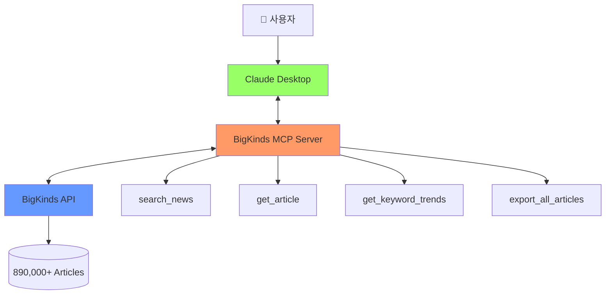

---

## 워크플로우 다이어그램

### 뉴스 검색 흐름

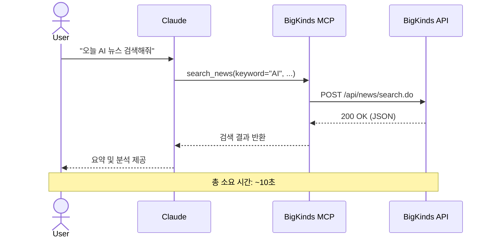

---

### 대용량 데이터 처리 흐름

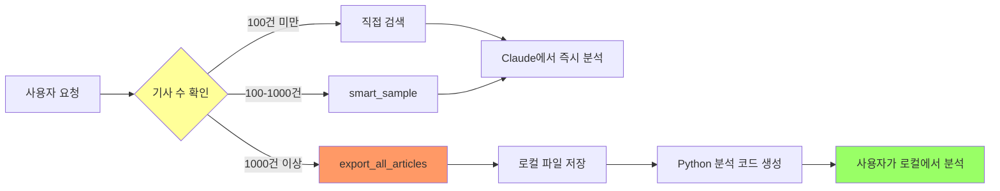

---

## 기능 맵

### 14개 MCP Tools

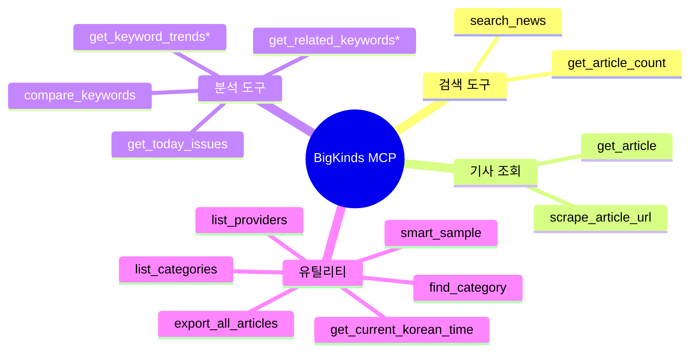

*: 로그인 필요

---

## 사용자 여정 (User Journey)

### 첫 사용자

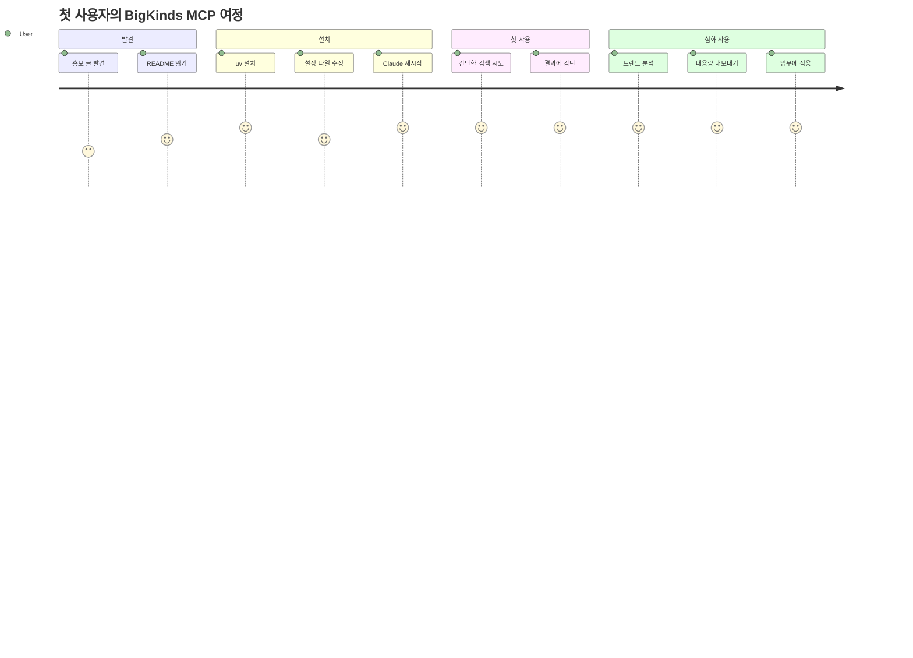

---

## 시간 절약 효과

### Before/After

```mermaid
gantt
    title 업무 시간 비교 (Before vs After)
    dateFormat X
    axisFormat %s

    section 과거 기사 검색
    Before (30분)    : 0, 1800s
    After (10초)     : 0, 10s

    section 트렌드 리포트
    Before (3시간)   : 0, 10800s
    After (30분)     : 0, 1800s

    section 대용량 수집
    Before (2일)     : 0, 172800s
    After (5분)      : 0, 300s
```

---

## 데이터 흐름

### 기사 전문 추출

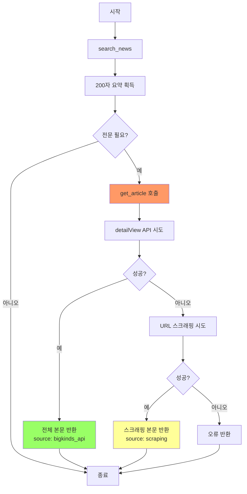

---

## 캐시 전략

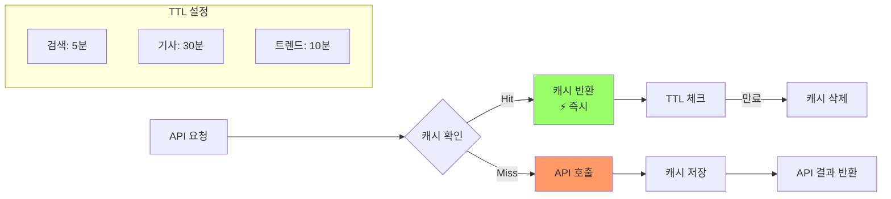

---

## 에러 처리

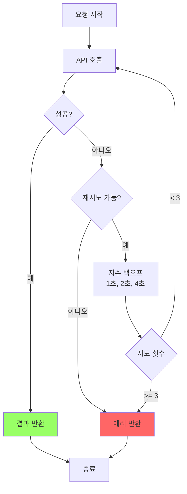

---

## 사용자 유형별 활용

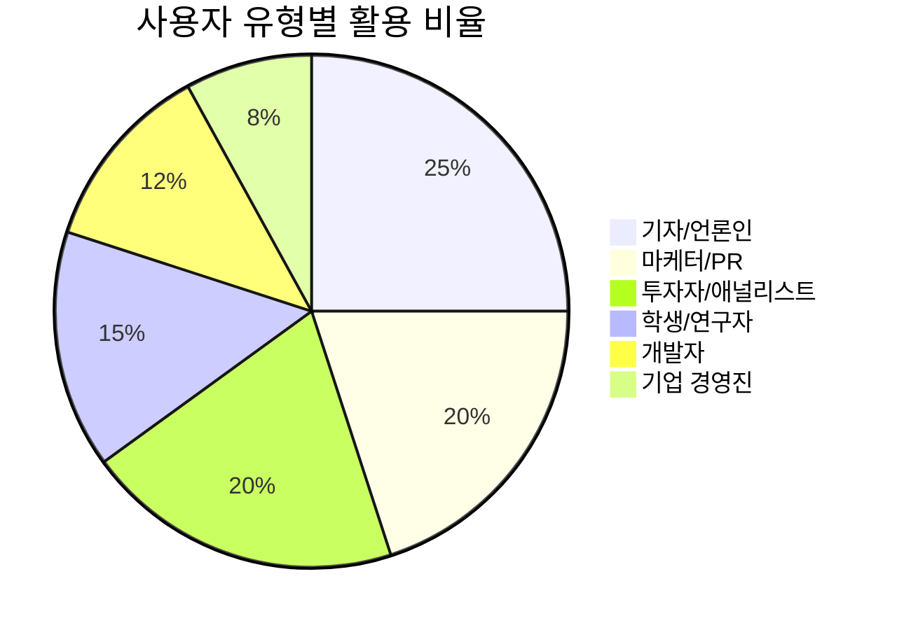

---

## 기능별 인기도

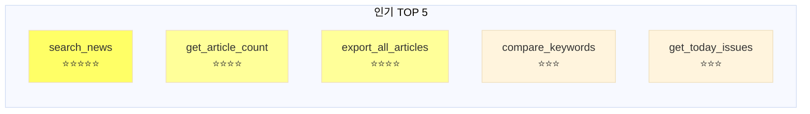

---

## README용 플로우 차트 (간단 버전)

```
┌────────────┐
│   사용자    │
│  "AI 뉴스"  │
└─────┬──────┘
      │
      ▼
┌────────────┐
│   Claude   │
│  Desktop   │
└─────┬──────┘
      │
      ▼
┌────────────┐
│  BigKinds  │
│   MCP      │ ◄─── Python 3.12 + FastMCP
└─────┬──────┘
      │
      ▼
┌────────────┐
│  BigKinds  │
│    API     │ ◄─── 890,000+ 기사
└─────┬──────┘
      │
      ▼
┌────────────┐
│  검색 결과  │
│  10초 완료  │
└────────────┘
```

---

## ASCII 다이어그램 (텍스트 전용)

### 아키텍처 (간단)

```
   User
    │
    ▼
┌──────────────────┐
│  Claude Desktop  │
└────────┬─────────┘
         │ MCP Protocol
         ▼
┌──────────────────┐     ┌──────────────┐
│ BigKinds MCP     │────▶│ BigKinds API │
│                  │     │              │
│ • search_news    │◀────│ 890K+ News   │
│ • get_article    │     └──────────────┘
│ • trends         │
│ • export         │
└──────────────────┘
```

### 시간 비교

```
과거 기사 검색
Before: ████████████████████████████████ 30분
After:  █ 10초
       └─────────────────────────────────┘
         180배 빠름

트렌드 리포트
Before: ████████████████████████████████ 3시간
After:  ████ 30분
       └─────────────────────────────────┘
         6배 빠름
```

---

## 사용 가능 형식

### Mermaid (GitHub/GitLab/Notion)

GitHub README에 바로 삽입 가능:

````markdown
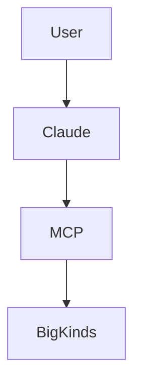
````

### Draw.io / Excalidraw

위 다이어그램을 시각 도구로 재작성 가능

### PowerPoint / Keynote

발표 자료용으로 다시 디자인

### Figma

고퀄리티 프로모션 이미지 제작
