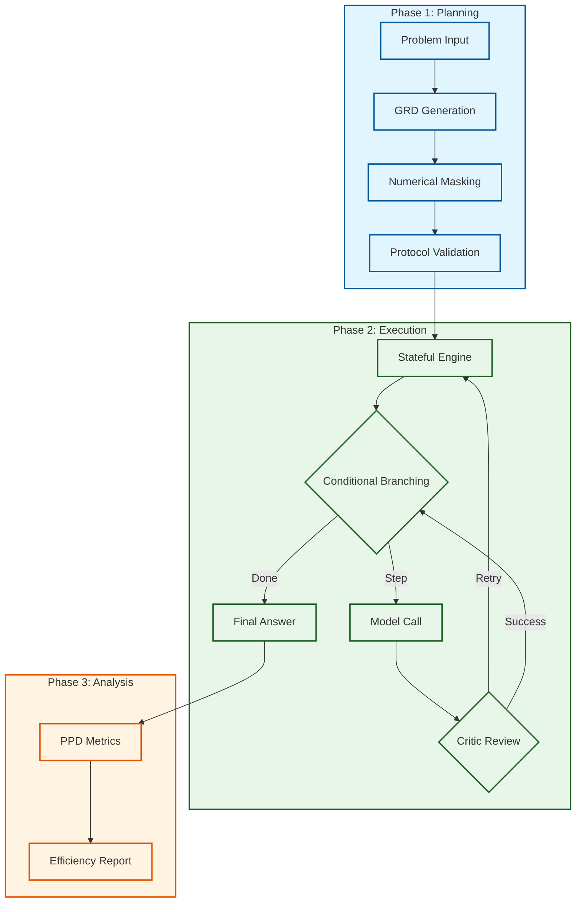
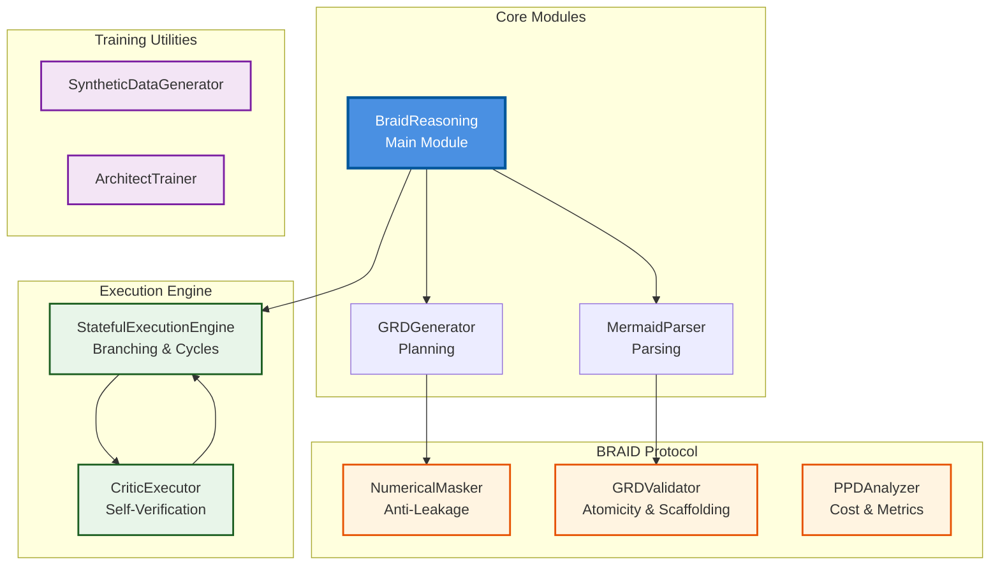
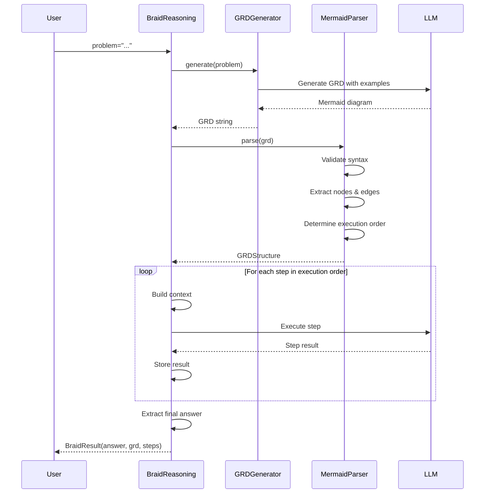

# BRAID-DSPy Integration

[](https://github.com/ziyacivan/braid-dspy/actions/workflows/ci.yml)
[](https://badge.fury.io/py/braid-dspy)
[](https://opensource.org/licenses/MIT)
[](https://www.python.org/downloads/)
[](https://github.com/psf/black)

A Python library that integrates BRAID (Bounded Reasoning for Autonomous Inference and Decisions) architecture into the DSPy framework, enabling structured reasoning through Guided Reasoning Diagrams (GRD) in Mermaid format.

## Overview

BRAID-DSPy brings structured reasoning capabilities to DSPy by requiring models to first generate a machine-readable flowchart (GRD) before executing the solution. This separation of planning and execution significantly improves reliability and reduces hallucinations.

## Motivation

This project began when I first encountered the BRAID architecture during one of [Armağan Amcalar](https://github.com/dashersw)'s live streams. The two-phase reasoning approach — planning first, then execution — and the idea of representing this planning in a visualizable format (Mermaid diagrams) immediately captured my interest.

After the stream, I delved into OpenServ's articles and technical details about BRAID. The approach of having the model first generate a flowchart (Guided Reasoning Diagram - GRD) and then execute the solution step-by-step according to this schema seemed like a significant step forward for reliability and transparency in AI systems. I realized that integrating this architecture with the DSPy framework would need to work seamlessly with existing DSPy modules and optimizers, which led me to develop this library to make that integration a reality.

Much of the development process involved "vibe coding" — following intuition and iterating based on what felt right rather than strictly following a predefined plan. This organic approach allowed the library to evolve naturally as I explored the integration between BRAID and DSPy.

## Key Features

### Core Capabilities
- **Guided Reasoning Diagrams (GRD)**: Generate Mermaid-format flowcharts that map solution steps
- **Two-Phase Reasoning**: Separate planning and execution phases for better reliability
- **DSPy Integration**: Seamlessly integrates with existing DSPy modules and optimizers
- **Auditable Reasoning**: Visualize and debug reasoning processes through GRD diagrams
- **Optimization Support**: BRAID-aware optimizers for improving GRD quality

### BRAID Protocol Features (v0.2.0+)
- **Numerical Masking**: Prevent answer leakage by masking computed values in GRDs
- **Node Atomicity**: Validate and enforce ≤15 tokens per node for optimal performance
- **Procedural Scaffolding**: Ensure GRDs describe HOW to solve, not WHAT the answer is
- **Stateful Execution**: Dynamic GRD traversal with conditional branching and cycle support
- **Critic Feedback Loops**: Self-verification with retry mechanisms
- **PPD Metrics**: Performance-per-Dollar analysis for cost optimization
- **Training Utilities**: Generate synthetic data for fine-tuning Architect models

## Installation

```bash
pip install braid-dspy
```

## Quick Start

### Basic Usage

```python
import dspy
from braid import BraidReasoning

# Configure DSPy
lm = dspy.OpenAI(model="gpt-4")
dspy.configure(lm=lm)

# Create a BRAID reasoning module
braid = BraidReasoning()

# Use it in your pipeline
result = braid(problem="Solve: If a train travels 120 km in 2 hours, what is its speed?")
print(result.answer)
print(result.grd)  # View the reasoning diagram
```

### BRAID Protocol Features

#### Numerical Masking (Prevent Answer Leakage)

```python
from braid import NumericalMasker

masker = NumericalMasker()

# Mask computed values in GRD to prevent answer leakage
grd = "Calculate[Speed = 60 km/h] --> Answer[Result = 60]"
result = masker.mask(grd)
print(result.masked)  # "Calculate[Speed = {{VALUE_2}}] --> Answer[Result = {{VALUE_1}}]"
print(result.value_mapping)  # {'{{VALUE_1}}': '60', '{{VALUE_2}}': '60 km/h'}

# Detect potential answer leakage
leaks = masker.detect_leakage(grd)
print(f"Found {len(leaks)} potential leaks")
```

#### GRD Validation (Atomicity & Scaffolding)

```python
from braid import GRDValidator, MermaidParser

parser = MermaidParser()
validator = GRDValidator(max_tokens_per_node=15)

grd_code = '''flowchart TD
    Start[Analyze the problem] --> Extract[Extract given values]
    Extract --> Calculate[Apply the formula]
    Calculate --> Answer[State the result]
'''

parsed = parser.parse(grd_code)
result = validator.validate(parsed)

print(f"Valid: {result.valid}")
print(f"Score: {result.score:.2f}")
print(f"Issues: {len(result.issues)}")
```

#### PPD Metrics (Cost Analysis)

```python
from braid import PPDAnalyzer, TokenUsage

# Track costs for BRAID execution
analyzer = PPDAnalyzer(
    architect_model="gpt-4",
    solver_model="gpt-3.5-turbo"
)

# Track usage
analyzer.track_usage(TokenUsage(500, 200), "planning")
analyzer.track_usage(TokenUsage(100, 50), "execution")
analyzer.track_usage(TokenUsage(100, 50), "execution")

# Generate report
print(analyzer.generate_report(accuracy=0.95, format="markdown"))

# Compare with baseline
report = analyzer.compare_with_baseline(accuracy=0.95, baseline_model="gpt-4")
print(f"Efficiency vs GPT-4: {report.efficiency_multiplier:.2f}x")
```

#### Training Data Generation

```python
from braid import SyntheticDataGenerator, ArchitectTrainer

# Generate synthetic training data
trainer = ArchitectTrainer()
samples = trainer.generate_training_dataset(
    size=100,
    output_path="training_data.jsonl",
    format="jsonl"
)

# Prepare OpenAI fine-tuning dataset
finetune_data = trainer.prepare_openai_finetune_dataset(samples)
```


## Architecture

BRAID-DSPy implements a three-phase reasoning architecture that expands on the original BRAID paper by adding numerical masking, protocol validation, and stateful execution.

### High-Level Architecture



### Component Architecture



### Key Components

1. **BraidReasoning**: Main module that orchestrates the entire lifecycle.
   - Orchestrates planning, execution, and validation phases.
   - Accumulates execution context and extracts final answers.

2. **BRAID Protocol Implementation**:
   - **NumericalMasker**: Prevents answer leakage by masking values in GRDs using regex-based placeholders.
   - **Validators**: Enforce ≤15 token node atomicity and procedural scaffolding standards.
   - **PPDAnalyzer**: Tracks token usage and calculates Performance-per-Dollar efficiency.

3. **Stateful Execution Engine**:
   - Supports dynamic traversal of GRDs with conditional logic and cycles.
   - Manages **Critic Feedback Loops** for self-verification and automatic retries.
   - Detects and manages execution cycles to prevent infinite loops.

4. **Training Utilities**:
   - **SyntheticDataGenerator**: Creates BRAID-compliant reasoning samples for math, logic, and general reasoning.
   - **ArchitectTrainer**: Prepares datasets for fine-tuning Architect models in OpenAI chat format.


### Execution Flow Example

For a problem like "If a train travels 120 km in 2 hours, what is its speed?":



### Benefits of This Architecture

- **Reliability**: Planning phase ensures structured approach before execution
- **Transparency**: GRD diagrams provide visual reasoning trace
- **Debuggability**: Each step is isolated and traceable
- **Optimization**: Both phases can be optimized independently
- **Flexibility**: Supports pre-generated GRDs or dynamic generation

## Documentation

📚 **Full documentation is available on [Read the Docs](https://braid-dspy.readthedocs.io/en/stable/)**

Local documentation:
- [API Reference](docs/api.md)
- [Examples](docs/examples.md)
- [Integration Guide](docs/integration.md)

To build documentation locally:

```bash
pip install -e ".[docs]"
cd docs
make html
```

## Examples

Check out the [examples](examples/) directory for:
- Basic usage examples
- GSM8K benchmark integration
- Optimization workflows

## Contributing

Contributions are welcome! Please read our [Contributing Guide](CONTRIBUTING.md) for details on our code of conduct and the process for submitting pull requests.

## Changelog

See [CHANGELOG.md](CHANGELOG.md) for a list of changes and version history.

## License

MIT License - see [LICENSE](LICENSE) file for details.

## References

- [BRAID Blog Post](https://www.openserv.ai/blog/braid-is-the-missing-piece-in-ai-reasoning)
- [DSPy Framework](https://github.com/stanfordnlp/dspy)

