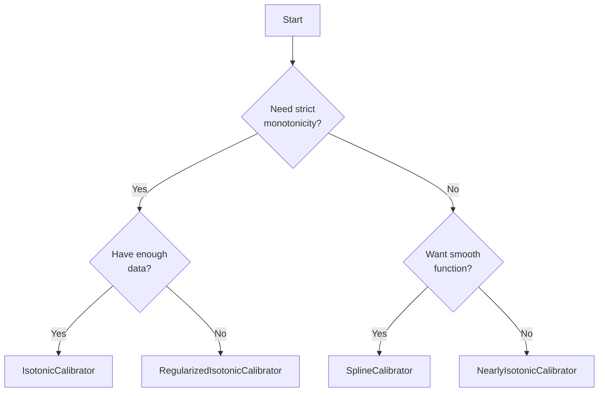

## Calibre: Advanced Probability Calibration

[](https://pypi.org/project/calibre/)
[](https://www.python.org/downloads/)
[](https://github.com/finite-sample/calibre/actions/workflows/ci.yml)
[](https://finite-sample.github.io/calibre/)
[](https://opensource.org/licenses/MIT)

**Calibre** provides advanced probability calibration techniques that go beyond traditional isotonic regression. It offers multiple methods to balance monotonicity and granularity preservation, giving you fine control over your model's probability estimates.

While techniques like isotonic regression have been standard for this task, they come with significant limitations:

1. Loss of granularity: Traditional isotonic regression often collapses many distinct probability values into a small number of unique values, which can be problematic for decision-making.
2. Rigid monotonicity: Perfect monotonicity might not always be necessary or beneficial; small violations might be acceptable if they better preserve the information content of the original predictions.

Calibre addresses these limitations by implementing a suite of advanced calibration techniques that provide more nuanced control over model probability calibration. Its methods are designed to preserve granularity while still favoring a generally monotonic trend.

| Method | Description | Key Strength | Use When |
|--------|-------------|--------------|----------|
| **IsotonicCalibrator** | Standard isotonic regression with diagnostic support | Fast, monotonic guarantee | You need strict monotonicity |
| **NearlyIsotonicCalibrator** | Allows controlled monotonicity violations | Preserves granularity | You want to balance monotonicity vs information |
| **SplineCalibrator** | Smooth calibration using I-splines | Smooth, differentiable | You need smooth probability curves |
| **RelaxedPAVACalibrator** | Ignores small violations below threshold | Fast, practical | You want to ignore noise-level violations |
| **RegularizedIsotonicCalibrator** | L2 regularized isotonic regression | Reduces overfitting | You have limited calibration data |
| **SmoothedIsotonicCalibrator** | Post-smoothing of isotonic output | Reduces staircase effect | You want smooth output from isotonic |
| **CDIIsotonicCalibrator** | Cost & data-informed isotonic (research) | Decision-aware | You have specific decision thresholds |

## 🚀 Quick Start

```bash
pip install calibre
```

```python
from calibre import IsotonicCalibrator
import numpy as np

# Your model's probability predictions and true labels
y_pred = np.array([0.2, 0.3, 0.4, 0.6, 0.7, 0.8])
y_true = np.array([0, 0, 0, 1, 1, 1])

# Calibrate probabilities
cal = IsotonicCalibrator()
cal.fit(y_pred, y_true)
y_calibrated = cal.transform(y_pred)
```

## Usage Examples

### Compare Different Methods

```python
from calibre import (
    IsotonicCalibrator,
    NearlyIsotonicCalibrator, 
    SplineCalibrator
)
import numpy as np

# Generate example data
np.random.seed(42)
n = 1000
X = np.random.uniform(0, 1, n)
y = np.random.binomial(1, X, n)

# Try different calibrators
calibrators = {
    'Isotonic': IsotonicCalibrator(),
    'Nearly Isotonic': NearlyIsotonicCalibrator(lam=1.0),
    'Spline': SplineCalibrator(n_splines=10)
}

for name, cal in calibrators.items():
    cal.fit(X, y)
    y_cal = cal.transform(X)
    n_unique = len(np.unique(y_cal))
    print(f"{name}: {n_unique} unique values")
```

### Diagnostic-Enabled Calibration

```python
from calibre import IsotonicCalibrator

# Enable automatic plateau diagnostics
cal = IsotonicCalibrator(enable_diagnostics=True)
cal.fit(X, y)

# Check if calibration has problematic plateaus
if cal.has_diagnostics():
    print(cal.diagnostic_summary())
    # Output: "2 plateaus detected: 1 supported, 1 limited-data"
```

### Fine-Tuning Monotonicity

```python
from calibre import NearlyIsotonicCalibrator

# Strict monotonicity (λ=10)
cal_strict = NearlyIsotonicCalibrator(lam=10.0)

# Relaxed monotonicity (λ=0.1) 
cal_relaxed = NearlyIsotonicCalibrator(lam=0.1)

# The relaxed version preserves more granularity
# while strict version ensures stronger monotonicity
```

## 🎯 Choosing the Right Method



## 📈 Evaluation Metrics

```python
from calibre.metrics import (
    expected_calibration_error,
    brier_score,
    calibration_diversity_index
)

# Measure calibration quality
ece = expected_calibration_error(y_true, y_calibrated)
bs = brier_score(y_true, y_calibrated)
diversity = calibration_diversity_index(y_calibrated)

print(f"ECE: {ece:.4f}, Brier: {bs:.4f}, Diversity: {diversity:.4f}")
```

## 🔬 Advanced Features

### Plateau Diagnostics

Calibre can automatically detect and classify plateaus in calibration curves:

```python
from calibre import run_plateau_diagnostics

# Analyze plateaus in your calibration
results = run_plateau_diagnostics(X_train, y_train, y_calibrated)

for plateau in results:
    print(f"Plateau at [{plateau['start']:.2f}, {plateau['end']:.2f}]: "
          f"{plateau['classification']} (confidence: {plateau['confidence']:.2f})")
```

### Metrics Overview

- **Calibration Errors**: `mean_calibration_error`, `expected_calibration_error`, `maximum_calibration_error`
- **Overall Performance**: `brier_score`, `calibration_curve`
- **Granularity Preservation**: `calibration_diversity_index`, `unique_value_counts`
- **Diagnostic Metrics**: `plateau_quality_score`, `tie_preservation_score`

## 📚 Documentation & Resources

- 📖 **[Full Documentation](https://finite-sample.github.io/calibre/)**
- 📊 **[Interactive Examples](https://finite-sample.github.io/calibre/examples/)**
- 🔬 **[Performance Comparison](https://finite-sample.github.io/calibre/notebooks/04_performance_comparison.html)**
- 📝 **[API Reference](https://finite-sample.github.io/calibre/api/)**

## 🛠️ Installation

### Requirements
- Python 3.11+
- NumPy, SciPy, scikit-learn
- CVXPY (for NearlyIsotonicCalibrator)

### Development Installation

```bash
git clone https://github.com/finite-sample/calibre.git
cd calibre
pip install -e ".[dev]"
```

## 📄 License

MIT License - see [LICENSE](LICENSE) file for details.

## 🤝 Contributing

Contributions are welcome! Please feel free to submit a Pull Request. For major changes, please open an issue first to discuss what you would like to change.

## 📖 Citation

If you use Calibre in your research, please cite:

```bibtex
@software{calibre2024,
  title = {Calibre: Advanced Probability Calibration for Machine Learning},
  author = {Sood, Gaurav},
  year = {2024},
  url = {https://github.com/finite-sample/calibre}
}
```

## 🔗 See Also

- [Probability Calibration in scikit-learn](https://scikit-learn.org/stable/modules/calibration.html)
- [Papers on Nearly Isotonic Regression](https://doi.org/10.1198/TECH.2010.09281)

## 🔗 Adjacent Repositories

- [gojiplus/robust_pava](https://github.com/gojiplus/robust_pava) — Increase uniqueness in isotonic regression by ignoring small violations
- [gojiplus/pyppur](https://github.com/gojiplus/pyppur) — pyppur: Python Projection Pursuit Unsupervised (Dimension) Reduction To Min. Reconstruction Loss or DIstance DIstortion
- [gojiplus/rmcp](https://github.com/gojiplus/rmcp) — R MCP Server
- [gojiplus/bloomjoin](https://github.com/gojiplus/bloomjoin) — bloomjoin: An R package implementing Bloom filter-based joins for improved performance with large datasets.
- [gojiplus/incline](https://github.com/gojiplus/incline) — Estimate Trend at a Point in a Noisy Time Series
