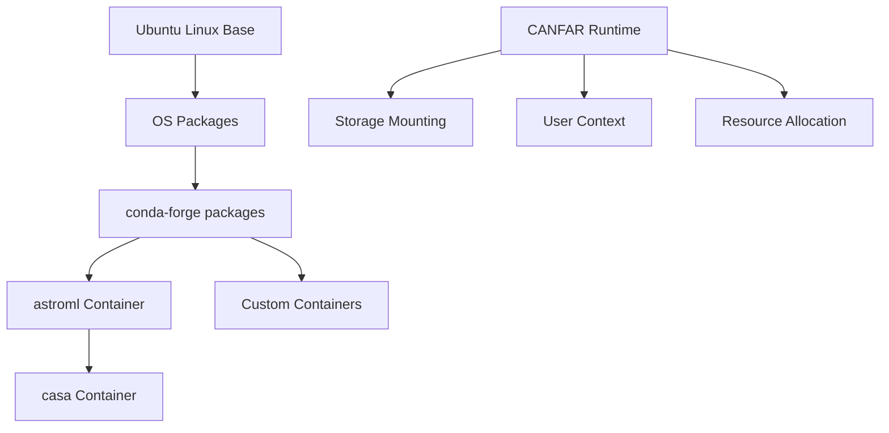
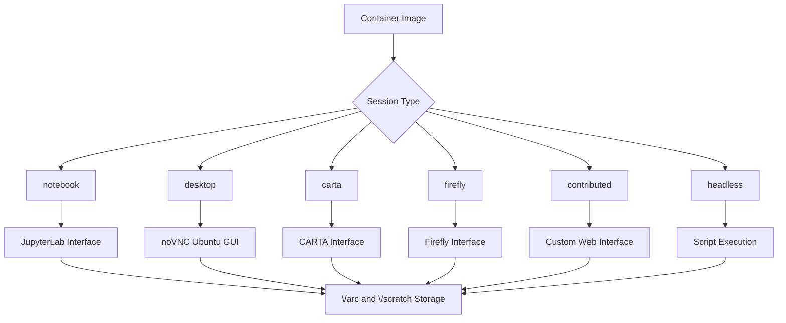
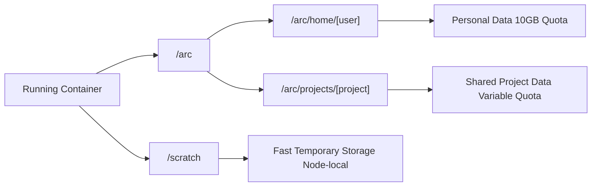

# Containers

**Working and building software containers on CANFAR.**

!!! abstract "🎯 Container Guide Overview"
    **Master CANFAR's containerized environments:**
    
    - **[Container Concepts](#what-are-containers)**: Understanding reproducible software environments
    - **[Available Containers](#canfar-supported-containers)**: Pre-built astronomy software stacks
    - **[Container Building](build.md)**: Creating custom environments for specialised workflows
    - **[Registry Management](registry.md)**: Harbor registry access and image distribution

Containers provide pre-packaged software environments that include everything needed to run astronomy applications. On CANFAR, containers eliminate the "works on my machine" problem by ensuring consistent, reproducible computational environments across different sessions and workflows.

## 📋 What Are Containers?

Think of containers as complete software packages that bundle an operating system (typically Ubuntu Linux), astronomy software like CASA or Python packages, programming tools, system libraries, and environment configuration into a single portable unit. When you launch a session on CANFAR, you're essentially starting up one of these pre-configured environments with your data and home directory automatically mounted and accessible.

!!! success "Key Concept: Reproducible Environments"
    Containers provide consistent, reproducible software environments for astronomy work across sessions and teams.

### Why Containers Matter for Astronomy

#### Traditional Software Installation

- Struggle with dependencies and conflicting versions
- Missing libraries and system requirements
- Different behaviour across different machines
- Time-consuming setup and configuration

#### CANFAR Containers

- **Consistent environment**: Works the same everywhere
- **Pre-configured**: Astronomy packages included
- **No installation hassles**: Ready to use immediately
- **Easy sharing**: Reproducible results across teams

!!! tip "Research Reproducibility"
    Containers ensure your analysis runs the same way for you, your collaborators, and future researchers. This is crucial for reproducible science.

### Container Architecture on CANFAR

The container ecosystem on CANFAR follows a layered approach:



**Base containers** provide fundamental tools and the conda package manager, while **specialised containers** build upon these foundations to offer domain-specific software stacks. This architecture ensures consistency while allowing flexibility for different research needs.

## 🏗️ Build Time vs Runtime

Understanding the distinction between build time and runtime is crucial for effective container usage:

### Build Time

**What happens when containers are created:**

- **Base image selection**: Choose Ubuntu, Python, or specialised astronomy base
- **Software installation**: Install system packages, Python libraries, astronomy tools
- **Environment configuration**: Set up paths, environment variables, user permissions
- **Code packaging**: Include stable scripts and analysis tools
- **Image optimization**: Layer caching, size reduction, security patches

```dockerfile
# Build time example
FROM ubuntu:24.04

# Install system dependencies (build time)
RUN apt-get update && apt-get install -y \
    python3-dev \
    libcfitsio-dev \
    && apt-get clean

# Install Python packages (build time)
RUN pip install astropy numpy matplotlib

# Package stable code (build time)
COPY analysis_tools/ /opt/tools/
```

### Runtime

**What happens when you launch a session:**

- **User context**: Container runs as your CADC username (not root)
- **Storage mounting**: `/arc/home`, `/arc/projects`, `/scratch` mounted automatically
- **Resource allocation**: CPU, memory, GPU assigned based on session request
- **Network access**: Internet connectivity for downloading data or documentation
- **Session integration**: Jupyter, desktop, or headless execution mode activated

```bash
# Runtime environment (inside your running container)
echo $USER                      # [user]
echo $HOME                      # /arc/home/[user]
ls /arc/projects/               # Your accessible project directories
df -h /scratch/                 # Temporary high-speed storage
```

!!! warning "Persistence Boundary"
    **Build time changes** are permanent and part of the container image. **Runtime changes** (like `pip install --user package`) are on `/arc` and not on the container. Keep stable software in the image; keep development scripts in `/arc/home/[user]` or `/arc/projects/[project]`.

## 🔗 How Containers Relate to Sessions

CANFAR containers are designed to work seamlessly with different session types, each optimised for specific workflows:

### Session Type Integration



Same container, different interfaces: The `astroml` container can run as a **notebook** (`JupyterLab`) session, as a **desktop app**lication (as an `xterm`) in a **desktop** session, or batch job (**headless**) session as an executable script.

### Notebook Sessions

**Requirements for notebook containers:**

1. **JupyterLab installed**: The `jupyterlab` package must be installed and in path in the container
2. **Container labelling**: Tagged as **notebook** in the registry

When you launch a notebook session, CANFAR automatically:

- Starts JupyterLab on dedicated port
- Mounts your storage directories
- Provides web-based access to the Python environment

**The `astroml` container** exemplifies this perfectly - it's a comprehensive Python astronomy stack with `astropy`, `scipy`, `pandas`, `matplotlib`, `numpy`, `scikit-learn`, `pytorch` and many more packages pre-installed.

```bash
# Check installed packages in a running astroml container
mamba list                     # conda/mamba/pip installed system packages  
apt list --installed           # OS system packages (Ubuntu)
ls /build_info/                # Container build information
```

**Runtime package installation:**

```bash
# Install Python packages at runtime (will install to /arc/home/[user]/.local)
# in non-astroml containers, add the --user flag.
pip install fireducks

# Show where it was installed
pip show -f fireducks           # Should show ~/.local/lib/python*/
```

!!! tip "GPU Support"
    For GPU acceleration, use the `astroml-cuda` container which extends `astroml` with CUDA libraries and GPU-enabled `pytorch`, `pyarrow`, and many other CUDA-capable libraries.

### Desktop Application Sessions

Desktop sessions integrate containers in two ways:

#### 1. Base Desktop Container

The core **desktop** container provides the Ubuntu desktop environment with Firefox, file managers, and terminals. This runs as your main desktop session as a `noVNC` web application. Each desktop application will run and communicate with this desktop session.

#### 2. Desktop-App Containers

Specialised containers that run specific GUI applications within desktop sessions.

**Requirements for desktop-app containers:**

1. **X11/Xorg application**: Must have at least one GUI application installed and available
2. **Startup script**: Application launcher at `/skaha/startup.sh` (if not specified, assumed to be `xterm` which must be installed in the container)
3. **Container labelling**: Tagged as `desktop-app` in the registry

**How it works:**

- Each desktop-app container runs on its own worker node
- Applications connect to your desktop session via X11 forwarding
- Shared storage provides data access across all containers
- Applications appear in the **Astro Software** menu

```bash
# Example desktop-app startup script (/skaha/startup.sh)
#!/bin/bash
export DISPLAY=${DISPLAY}
cd /arc/home/$USER
exec your-gui-application
```

The same **astroml** container can run as both notebook (has JupyterLab) and desktop-app (has xterm), demonstrating the flexibility of container usage.

### Batch/Headless Sessions

Headless containers execute without graphical interfaces, perfect for automated processing:

- **No GUI requirements**: Command-line tools only
- **Script execution**: Runs your specified command and exits
- **Background processing**: Perfect for large datasets and automation
- **Resource optimization**: Can use different resource priorities

```bash
# Example headless execution
python /arc/projects/[project]/scripts/reduce_data.py --input=/arc/projects/[project]/data/ --output=/arc/projects/[project]/results/
```

### Contributed Application Sessions

Contributed applications are custom web-based tools that integrate with CANFAR:

**Requirements:**

1. **Web service**: Application serves HTTP on port 5000
2. **Startup script**: Service launcher at `/skaha/startup.sh`
3. **Container labelling**: Tagged appropriately for discovery as **contributed**.

Examples include Marimo (reactive notebooks) and VSCode (browser IDE).

## 💾 Storage Mounting and Integration

### CANFAR Storage Integration

CANFAR automatically mounts storage systems into your container at runtime, providing seamless access to persistent data:



#### Storage Hierarchy

| Mount Point | Purpose | Persistence | Quota | Sharing |
|-------------|---------|-------------|-------|---------|
| `/arc/home/[user]` | Personal files, notebooks, configs | Permanent | 10GB | Private |
| `/arc/projects/[project]` | Research data, collaboration | Permanent | Variable | Team-based |
| `/scratch` | High-speed processing | Session only | Node-dependent | Private |

#### Storage Best Practices

**Personal Development (`/arc/home`):**

```bash
/arc/home/[user]/
├── notebooks/              # Jupyter notebooks
├── scripts/               # Analysis scripts  
├── .local/               # pip install --user packages
├── .config/              # Application configurations
└── small_datasets/       # Personal research data
```

**Project Collaboration (`/arc/projects`):**

```bash
/arc/projects/[project]/
├── raw_data/             # Input datasets
├── processed/            # Reduced data products
├── scripts/              # Shared analysis code
├── docs/                 # Project documentation
└── results/              # Final outputs
```

**Temporary Processing (`/scratch`):**

```bash
# Copy large datasets to fast storage for processing
cp /arc/projects/[project]/large_data.fits /scratch/
process_data /scratch/large_data.fits /scratch/output.fits
cp /scratch/output.fits /arc/projects/[project]/results/
```

### User Context and Permissions

Containers run with your CADC user identity, not as root or container-defined users:

```bash
# Inside any CANFAR container
whoami                    # [user]
id                        # uid=1234([user]) gid=1234([user]) groups=[user](and-all-your-CADC-groups)
echo $HOME                # /arc/home/[user]
groups                    # Shows your CANFAR project group memberships
```

**Security model:**

- **No root access**: Containers cannot perform system administration at runtime.
- **File permissions**: Respect standard Unix permissions on `/arc`
- **Group membership**: Access to `/arc/projects` based on CANFAR group membership
- **Network isolation**: Containers have internet access but cannot access other users' sessions

## 🔧 CANFAR-Supported Containers

The CANFAR team maintains several core containers that cover most astronomy research needs in the **`skaha`** namespace:

| Container | Description |
|-----------|-------------|
| **base** | Basic UNIX tools, conda, CADC packages |
| **astroml** | Many astro (STILTS, astropy ecosystem), data sciences (pandas, pyarrow,...), machine learning (sklearn, pytorch) packages. JupyterLab, xterm. |
| **marimo** | Same as astroml stack, with marimo notebook as web interface |
| **vscode** | Same as astroml, with VSCode on browser as interface |
| **\*-cuda** | Same as all above containers, with CUDA-enabled |
| **improc** | Image processing tools (SWarp, SExtractor, SourceExtractor++, IRAF, CASUTools...) |
| **casa** | CASA installations |

### Visualisation Containers

#### `carta` - Radio Astronomy Visualisation

**Purpose**: Interactive visualisation of radio astronomy data

**Features:**

- **CARTA application**: Cube Analysis and Rendering Tool for Astronomy
- **Multi-dimensional data**: Spectral cubes, moment maps, polarisation
- **Interactive analysis**: Region statistics, profile extraction
- **Collaboration support**: Session sharing capabilities

#### `firefly` - Catalogue Data Analysis

**Purpose**: Advanced catalogue queries and visualisation

**Features:**

- **Multi-mission support**: LSST, Spitzer, WISE, 2MASS, ...
- **Interactive catalogues**: Source overlays and cross-matching
- **Multi-wavelength workflows**: RGB composites and band comparisons
- **Large dataset handling**: Efficient rendering of survey-scale data

### Development and Desktop Containers

#### `desktop` - Ubuntu Environment

**Purpose**: Complete Linux desktop for GUI applications and legacy software. Astronomy software applications will each run on dedicated nodes.

**Features:**

- **Ubuntu**: Linux environment
- **Desktop environment**: Full GNOME-based interface
- **Applications**: Firefox, file managers, terminals, editors
- **X11 forwarding**: Support for launching astronomy GUI applications

#### `notebook` - Jupyter Environment

**Purpose**: Minimal Jupyter environment for basic Python work

**Features:**

- **Jupyter Lab**: Web-based notebook interface
- **Extensible**: Foundation for custom development
- **Fast startup**: Minimal software for quick sessions

### Container Selection Guide

| Workflow Type | Recommended Container | Session Type | Typical Resources |
|---------------|----------------------|--------------|-------------------|
| **Python core** | `base` | Headless | 1 core, 1GB |
| **Python data analysis** | `astroml` | Notebook | 2-4 cores, 8-16GB |
| **GPU machine learning** | `astroml-cuda` | Notebook | 4-8 cores, 16-32GB, 1 GPU |
| **Radio interferometry** | `casa` | Notebook/Desktop | 4-8 cores, 16-32GB |
| **Data visualisation** | `carta` | CARTA session | 2-4 cores, 8-16GB |
| **Catalogue analysis** | `firefly` | Firefly session | 2-4 cores, 8-16GB |
| **GUI applications** | `desktop` | Desktop | 2-4 cores, 8-16GB |
| **Legacy software** | `desktop` | Desktop | Variable |
| **Batch processing** | `astroml` or `casa` | Headless | Variable |

!!! tip "Container Selection Strategy"
    Start with `astroml` for most astronomy work. It includes comprehensive libraries and is actively maintained. Use specialised containers (`casa`, `carta`, `firefly`) only when you need their specific tools.

### Version Management

CANFAR containers follow semantic versioning:

- **`:latest`** - Current stable release (recommended for most work)
- **`:YY.MM`** - Monthly snapshots for reproducibility
- **`:commit-hash`** - Specific builds for exact reproducibility

```bash
# Use latest stable version (recommended)
images.canfar.net/skaha/astroml:latest

# Use specific monthly snapshot for reproducible research
images.canfar.net/skaha/astroml:25.09

# Use exact commit for critical reproducibility
images.canfar.net/skaha/astroml:a1b2c3d4
```

### Container Updates and Maintenance

CANFAR containers receive regular updates:

**Monthly releases**: Security patches, library updates, new features  
**Quarterly reviews**: Major version updates, new software additions  
**Community feedback**: Feature requests and bug reports incorporated

**Update notifications:**

- Science Portal notifications for major changes

!!! warning "Version Pinning for Reproducibility"
    For published research, specify exact container versions (monthly tags or commit hashes) to ensure long-term reproducibility of your analysis.
