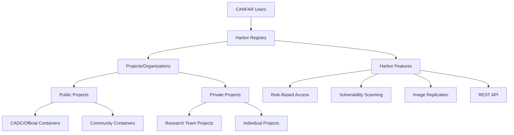

# Harbor Container Registry

**Managing container images on CANFAR's Harbor-based registry for secure distribution and deployment.**

!!! abstract "🎯 Registry Management Overview"
    **Master Harbor registry operations:**
    
    - **Harbor Platform**: Understanding CANFAR's enterprise container registry features
    - **Access Control**: Projects, repositories, and role-based permissions
    - **Image Management**: Tagging, versioning, and metadata organization
    - **Security Features**: Vulnerability scanning and compliance monitoring


Harbor serves as CANFAR's container registry, providing a secure, feature-rich platform for storing, managing, and distributing container images. Built on Docker Registry v2, Harbor adds enterprise features like role-based access control, vulnerability scanning, and image replication.

## 📋 Harbor Registry Overview

### What is Harbor?

Harbor is an open-source container registry that provides:

- **Secure storage**: Role-based access control and authentication integration
- **Image management**: Tagging, versioning, and metadata handling
- **Vulnerability scanning**: Automated security analysis of container images
- **Replication**: Multi-site synchronisation and backup capabilities
- **Web interface**: User-friendly management portal
- **API access**: Programmatic integration with development workflows

### CANFAR Harbor Instance

**Registry URL**: [https://images.canfar.net](https://images.canfar.net)

**Key features on CANFAR:**

- Integration with CADC authentication system
- Project-based organization for research teams
- Automated vulnerability scanning for public containers
- Role-based permissions aligned with CANFAR groups
- API access for automated workflows



## 🏗️ Projects and Organization

### Project Structure

Harbor organizes containers into **projects**, which serve as top-level namespaces:

```text
images.canfar.net/
├── skaha/                    # Official CANFAR containers
│   ├── astroml:latest
│   ├── casa:latest
│   └── desktop:latest
├── [project]/                # Research team project
│   ├── custom-pipeline:latest
│   └── analysis-env:v2.1
└── [user]/                   # Personal project
    ├── development:latest
    └── testing:experimental
```

### Project Types

#### Public Projects

**Characteristics:**

- Visible to all CANFAR users
- Images can be pulled without authentication
- Suitable for community-shared tools
- Used for official CANFAR containers

**Examples:**

- `skaha/` - Core CANFAR containers
- `lsst/` - LSST Community-contributed containers

#### Private Projects

**Characteristics:**

- Access restricted to project members
- Require authentication for all operations
- Support proprietary or sensitive software
- Can be shared with specific research teams

**Examples:**

- `myuniversity-xray/` - Institutional X-ray analysis tools
- `survey-collaboration/` - Multi-institutional survey project
- `proprietary-software/` - Licensed commercial software

### Project Creation and Management

#### Requesting New Projects

Contact [support@canfar.net](mailto:support@canfar.net) to create new projects:

**Required information:**

- Project name (must be unique, lowercase, alphanumeric)
- Description and purpose
- Visibility (public/private)
- Initial project members and their roles
- Resource requirements (storage quota)

**Naming conventions:**

```bash
# Good project names
myteam-radio-analysis
survey-processing-tools
xray-spectroscopy

# Avoid
MyTeam_Radio_Analysis    # Mixed case, underscores
my team radio            # Spaces
special-chars-@#$        # Special characters
```

#### Project Membership Management

Project owners can manage membership through the Harbor web interface:

**Role levels:**

- **Guest**: Pull images only
- **Developer**: Pull and push images, manage tags
- **Master**: Full project management, member administration
- **ProjectAdmin**: Complete project control including deletion

## 🗂️ Repository Management

### Understanding Repositories

Within each project, **repositories** contain the actual container images:

```text
[project]/                       # Project
├── analysis-pipeline/        # Repository
│   ├── latest               # Tag
│   ├── v1.0.0               # Tag
│   └── 2024.03              # Tag
└── visualization-tools/      # Repository
    ├── latest               # Tag
    └── beta                 # Tag
```

### Repository Naming

Follow consistent naming conventions for repositories:

```bash
# Good repository names
analysis-pipeline
data-processing-tools
visualization-suite
radio-astronomy-env

# Specific use cases
survey-reduction-v2
xray-spectral-analysis
machine-learning-gpu
```

### Tagging Strategy

Implement systematic tagging for version control:

#### Semantic Versioning

```bash
# Major.Minor.Patch format
myteam/analysis-env:1.0.0     # Initial release
myteam/analysis-env:1.1.0     # New features
myteam/analysis-env:1.1.1     # Bug fixes
myteam/analysis-env:2.0.0     # Breaking changes
```

#### Date-Based Versioning

```bash
# Monthly releases
myteam/analysis-env:2024.03   # March 2024 release
myteam/analysis-env:2024.04   # April 2024 release

# Daily builds (development)
myteam/analysis-env:2024.03.15
myteam/analysis-env:2024.03.16
```

#### Feature and Environment Tags

```bash
# Environment-specific
myteam/analysis-env:production
myteam/analysis-env:development
myteam/analysis-env:testing

# Feature branches
myteam/analysis-env:feature-gpu-support
myteam/analysis-env:experimental-ml

# Special purpose
myteam/analysis-env:conference-demo
myteam/analysis-env:paper-reproduction
```

### Managing Image Metadata

Harbor stores rich metadata for each image:

```json
{
  "name": "analysis-env",
  "version": "v1.2.0", 
  "description": "Custom astronomy analysis environment",
  "created": "2024-03-15T10:30:00Z",
  "size": "2.1GB",
  "labels": {
    "maintainer": "research-team@university.edu",
    "version": "1.2.0",
    "description": "X-ray astronomy analysis with XSPEC",
    "ca.nrc.cadc.skaha.type": "notebook"
  },
  "vulnerabilities": "scanned",
  "signature": "verified"
}
```

## 🔐 Access Control and Security

### Authentication Methods

#### Web Interface Access

1. **Visit**: [https://images.canfar.net](https://images.canfar.net)
2. **Login**: Use your CADC credentials
3. **Navigate**: Browse projects and repositories
4. **Manage**: Create, tag, and delete images (with appropriate permissions)

#### Docker CLI Authentication

```bash
# Login to Harbor registry
docker login images.canfar.net
# Enter CADC username and password when prompted
# Paste the Habor CLI Secret copied from the images.canfar.net User Profile->

# Verify authentication
docker info | grep -A 5 "Registry Mirrors"
```

#### API Access

```bash
# Get authentication token
curl -X POST "https://images.canfar.net/api/v2.0/users/current" \
  -u "username:password" \
  -H "accept: application/json"

# Use token for API calls
curl -X GET "https://images.canfar.net/api/v2.0/projects" \
  -H "Authorization: Bearer YOUR_TOKEN" \
  -H "accept: application/json"
```

### Permission Matrix

| Action | Guest | Developer | Master | ProjectAdmin |
|--------|-------|-----------|---------|--------------|
| **View public projects** | ✅ | ✅ | ✅ | ✅ |
| **View private projects** | ❌ | ✅* | ✅* | ✅* |
| **Pull images** | ✅** | ✅ | ✅ | ✅ |
| **Push images** | ❌ | ✅ | ✅ | ✅ |
| **Delete images** | ❌ | ❌ | ✅ | ✅ |
| **Manage tags** | ❌ | ✅ | ✅ | ✅ |
| **Scan images** | ❌ | ✅ | ✅ | ✅ |
| **Add/remove members** | ❌ | ❌ | ✅ | ✅ |
| **Delete project** | ❌ | ❌ | ❌ | ✅ |

*Only if member of project  
**Public images only


## 🔍 Harbor Web Interface

### Navigation and Features

#### Project Dashboard

The project dashboard provides an overview of:

- **Repositories**: List of container repositories
- **Members**: Project access control
- **Logs**: Activity and audit trail  
- **Configuration**: Project settings and policies
- **Summary**: Storage usage and statistics

#### Repository View

For each repository, you can:

- **Browse tags**: View all available versions
- **Inspect images**: Examine layers, metadata, and vulnerabilities
- **Manage artifacts**: Add/remove tags, delete images
- **View history**: Track changes and updates
- **Configure policies**: Set retention and scanning rules

#### Image Details

Each image provides detailed information:

```yaml
Image Information:
  Digest: sha256:a1b2c3d4e5f6...
  Size: 2.1 GB
  Created: 2024-03-15 10:30:00 UTC
  OS/Arch: linux/amd64
  
Labels:
  maintainer: research-team@university.edu
  version: 1.2.0
  ca.nrc.cadc.skaha.type: notebook
  
Vulnerabilities:
  Critical: 0
  High: 1
  Medium: 3
  Low: 12
  
Build Information:
  Dockerfile: Available
  Build Args: Recorded
  Layers: 15 layers, optimized
```

### Vulnerability Scanning

Harbor automatically scans container images for security vulnerabilities:

#### Scanning Process

1. **Automatic scanning**: Public containers scanned on push
2. **Manual scanning**: Trigger scans for private repositories
3. **Scheduled scanning**: Regular updates with latest vulnerability database
4. **Policy enforcement**: Block pulls based on vulnerability thresholds

#### Vulnerability Reports

```yaml
Vulnerability Report:
  Scanner: Trivy
  Scan Time: 2024-03-15 11:00:00 UTC
  Database Version: 2024-03-14
  
Critical Vulnerabilities:
  - None found

High Vulnerabilities:
  - CVE-2024-1234: OpenSSL vulnerability
    Severity: High
    Package: openssl 3.0.1
    Fix: Upgrade to openssl 3.0.2
    
Medium Vulnerabilities:
  - CVE-2024-5678: Python vulnerability
    Severity: Medium  
    Package: python 3.11.1
    Fix: Upgrade to python 3.11.2
```

#### Addressing Vulnerabilities

```dockerfile
# Update base image to address vulnerabilities
FROM images.canfar.net/skaha/astroml:latest

# Update system packages
USER root
RUN apt-get update && apt-get upgrade -y \
    && apt-get clean \
    && rm -rf /var/lib/apt/lists/*

# Update Python packages
RUN pip install --upgrade package-with-vulnerability
```

## 🛠️ CLI and API Usage

### Harbor CLI Operations

#### Basic Image Operations

```bash
# List repositories in a project
curl -X GET "https://images.canfar.net/api/v2.0/projects/myteam/repositories" \
  -H "Authorization: Basic $(echo -n username:password | base64)"

# Get repository information
curl -X GET "https://images.canfar.net/api/v2.0/projects/myteam/repositories/analysis-env" \
  -H "Authorization: Basic $(echo -n username:password | base64)"

# List tags for a repository
curl -X GET "https://images.canfar.net/api/v2.0/projects/myteam/repositories/analysis-env/artifacts" \
  -H "Authorization: Basic $(echo -n username:password | base64)"
```

#### Docker Registry v2 API

```bash
# Get manifest for specific tag
curl -X GET "https://images.canfar.net/v2/myteam/analysis-env/manifests/latest" \
  -H "Accept: application/vnd.docker.distribution.manifest.v2+json" \
  -H "Authorization: Basic $(echo -n username:password | base64)"

# Get blob (layer) information
curl -X GET "https://images.canfar.net/v2/myteam/analysis-env/blobs/sha256:digest" \
  -H "Authorization: Basic $(echo -n username:password | base64)"
```

### Automated Workflows

#### CI/CD Integration

```yaml
# GitHub Actions example
name: Build and Push to Harbor

on:
  push:
    branches: [main]
    tags: ['v*']

jobs:
  build:
    runs-on: ubuntu-latest
    steps:
    - uses: actions/checkout@v4
    
    - name: Login to Harbor
      uses: docker/login-action@v3
      with:
        registry: images.canfar.net
        username: ${{ secrets.HARBOR_USERNAME }}
        password: ${{ secrets.HARBOR_PASSWORD }}
    
    - name: Extract metadata
      id: meta
      uses: docker/metadata-action@v5
      with:
        images: images.canfar.net/myteam/analysis-env
        tags: |
          type=ref,event=branch
          type=semver,pattern={{version}}
          type=raw,value=latest,enable={{is_default_branch}}
    
    - name: Build and push
      uses: docker/build-push-action@v5
      with:
        push: true
        tags: ${{ steps.meta.outputs.tags }}
        labels: ${{ steps.meta.outputs.labels }}
```

#### Automated Scanning and Deployment

```python
#!/usr/bin/env python3
# automated_scan_deploy.py

import requests
import time
import sys
from base64 import b64encode

class HarborManager:
    def __init__(self, registry_url, username, password):
        self.registry_url = registry_url
        self.auth_header = self._create_auth_header(username, password)
    
    def _create_auth_header(self, username, password):
        credentials = f"{username}:{password}"
        encoded_credentials = b64encode(credentials.encode()).decode()
        return {"Authorization": f"Basic {encoded_credentials}"}
    
    def scan_repository(self, project, repository):
        """Trigger vulnerability scan for repository."""
        url = f"{self.registry_url}/api/v2.0/projects/{project}/repositories/{repository}/artifacts"
        
        response = requests.get(url, headers=self.auth_header)
        if response.status_code != 200:
            print(f"Failed to get artifacts: {response.status_code}")
            return False
        
        artifacts = response.json()
        for artifact in artifacts:
            scan_url = f"{url}/{artifact['digest']}/scan"
            scan_response = requests.post(scan_url, headers=self.auth_header)
            
            if scan_response.status_code == 202:
                print(f"Scan triggered for {artifact['digest'][:12]}")
            else:
                print(f"Scan failed for {artifact['digest'][:12]}: {scan_response.status_code}")
        
        return True
    
    def get_vulnerability_report(self, project, repository, tag="latest"):
        """Get vulnerability scan results."""
        url = f"{self.registry_url}/api/v2.0/projects/{project}/repositories/{repository}/artifacts/{tag}/scan/overview"
        
        response = requests.get(url, headers=self.auth_header)
        if response.status_code == 200:
            return response.json()
        else:
            print(f"Failed to get scan results: {response.status_code}")
            return None
    
    def check_vulnerabilities(self, scan_results, max_critical=0, max_high=5):
        """Check if vulnerability levels are within acceptable limits."""
        if not scan_results:
            return False
        
        # Extract vulnerability counts
        summary = scan_results.get('vulnerabilities', {})
        critical = summary.get('critical', 0)
        high = summary.get('high', 0)
        
        print(f"Vulnerabilities found - Critical: {critical}, High: {high}")
        
        return critical <= max_critical and high <= max_high

# Usage example
def main():
    harbor = HarborManager(
        "https://images.canfar.net",
        "your-username", 
        "your-password"
    )
    
    project = "myteam"
    repository = "analysis-env"
    
    # Trigger scan
    if harbor.scan_repository(project, repository):
        print("Scan triggered, waiting for completion...")
        time.sleep(60)  # Wait for scan to complete
        
        # Check results
        results = harbor.get_vulnerability_report(project, repository)
        if harbor.check_vulnerabilities(results):
            print("✅ Vulnerability check passed")
            sys.exit(0)
        else:
            print("❌ Vulnerability check failed")
            sys.exit(1)

if __name__ == "__main__":
    main()
```

## 📊 Registry Maintenance

### Storage Management

#### Repository Cleanup

```bash
# Remove old tags (manual approach)
# List all tags first
docker images images.canfar.net/myteam/analysis-env

# Remove specific old tags
docker rmi images.canfar.net/myteam/analysis-env:old-tag

# Remove all untagged images
docker image prune -f

# Remove all unused images
docker system prune -a -f
```

#### Automated Retention Policies

Configure Harbor retention policies through web interface:

**Policy examples:**

- Keep latest 10 versions
- Retain images pushed within last 30 days
- Preserve all tagged releases (v*.*.*)
- Delete untagged artifacts after 7 days

### Monitoring and Analytics

#### Usage Statistics

Harbor provides metrics on:

- Storage usage per project
- Pull/push activity
- Popular repositories
- User access patterns
- Vulnerability trends

#### Audit Logging

Track all registry activities:

```yaml
Audit Log Entry:
  Timestamp: 2024-03-15T10:30:00Z
  User: research-user
  Action: PUSH
  Resource: myteam/analysis-env:v1.2.0
  IP Address: 192.168.1.100
  User Agent: docker/24.0.0
  Status: SUCCESS
```

### Backup and Disaster Recovery

#### Export/Import Procedures

```bash
# Export project (including images)
# Contact CANFAR support for full project exports

# Export image metadata only
curl -X GET "https://images.canfar.net/api/v2.0/projects/myteam/repositories/analysis-env/artifacts" \
  -H "Authorization: Basic $(echo -n username:password | base64)" \
  > repository-metadata.json

# Backup individual images
docker pull images.canfar.net/myteam/analysis-env:v1.2.0
docker save images.canfar.net/myteam/analysis-env:v1.2.0 > analysis-env-v1.2.0.tar

# Restore from backup
docker load < analysis-env-v1.2.0.tar
docker push images.canfar.net/myteam/analysis-env:v1.2.0
```

## 🚀 Best Practices

### Registry Best Practices

#### Registry Organization

```bash
# Recommended project organization
university-astronomy/        # Institution-wide project
├── public-tools/            # Publicly available tools
├── course-materials/        # Educational containers
└── research-environments/   # General research tools

survey-collaboration/        # Multi-institutional project
├── data-processing/         # Survey data pipeline
├── analysis-tools/          # Shared analysis software
└── visualization/           # Survey-specific viz tools

personal-research/           # Individual development
├── experimental/            # Development and testing
├── paper-environments/      # Publication reproducibility
└── conference-demos/        # Presentation materials
```

#### Naming Conventions

```bash
# Clear, descriptive names
radio-interferometry-pipeline
optical-photometry-tools
xray-spectral-analysis

# Version-specific names for major releases
survey-pipeline-v2
analysis-environment-2024

# Environment-specific variants
ml-environment-gpu
processing-tools-cpu
analysis-suite-minimal
```

### Performance Optimization

#### Registry Performance

```bash
# Use layer caching effectively
# Order Dockerfile instructions by change frequency

# Use multi-stage builds to reduce final image size
FROM ubuntu:24.04 AS builder
# ... build dependencies ...
FROM images.canfar.net/skaha/astroml:latest
COPY --from=builder /app/binary /usr/local/bin/

# Optimize layer sizes
RUN apt-get update && apt-get install -y pkg1 pkg2 pkg3 \
    && apt-get clean && rm -rf /var/lib/apt/lists/*
# Instead of multiple RUN commands
```

#### Network Optimization

```bash
# Use Harbor proximity
# CANFAR Harbor is optimized for Canadian academic networks

# Leverage local caching
# Images are cached at compute nodes for faster session startup

# Consider image size for session startup time
# Smaller images start faster, especially for batch jobs
```

## 🔗 Integration with CANFAR Services


### Storage Integration

Containers automatically receive CANFAR storage mounts:

```bash
# Inside any Harbor-deployed container on CANFAR
ls /arc/home/[user]/        # Personal storage
ls /arc/projects/[project]/     # Project storage  
ls /scratch/                  # Temporary storage
```

### Authentication Integration

Harbor integrates with CADC authentication:

- Single sign-on with CADC credentials
- Group membership determines project access
- API tokens respect CADC account policies
- Audit logs integrate with CADC security monitoring

## 🆘 Troubleshooting

### Common Issues

#### Authentication Problems

```bash
# Check Docker login status
docker system info | grep -A 5 "Registry"

# Clear cached credentials
docker logout images.canfar.net

# Login with explicit credentials
docker login images.canfar.net -u username

# Test authentication
docker pull images.canfar.net/skaha/astroml:latest
```

#### Push/Pull Failures

```bash
# Check repository permissions
curl -X GET "https://images.canfar.net/api/v2.0/projects/myteam" \
  -H "Authorization: Basic $(echo -n username:password | base64)"

# Verify image format
docker inspect local-image:tag

# Check Harbor service status
curl -X GET "https://images.canfar.net/api/v2.0/systeminfo"
```

#### Vulnerability Scan Issues

```bash
# Manually trigger scan
curl -X POST "https://images.canfar.net/api/v2.0/projects/myteam/repositories/image/artifacts/tag/scan" \
  -H "Authorization: Basic $(echo -n username:password | base64)"

# Check scan status
curl -X GET "https://images.canfar.net/api/v2.0/projects/myteam/repositories/image/artifacts/tag/scan/overview" \
  -H "Authorization: Basic $(echo -n username:password | base64)"
```

### Performance Issues

#### Slow Push/Pull Operations

```bash
# Check network connectivity
ping images.canfar.net

# Use Docker BuildKit for faster builds
export DOCKER_BUILDKIT=1
docker build .

# Enable Docker layer caching
docker build --cache-from=images.canfar.net/myteam/image:latest .
```

#### Large Image Size

```bash
# Analyze image layers
docker history images.canfar.net/myteam/image:latest

# Use dive tool for detailed analysis
dive images.canfar.net/myteam/image:latest

# Optimize Dockerfile layers
# Combine RUN commands
# Remove package caches
# Use multi-stage builds
```
```
