# User Management & Permissions

**Accounts, groups, access control, and API authentication on the CANFAR platform for collaborative astronomical research.**

!!! abstract "🎯 Permission System Overview"
    **Essential access control concepts for all users:**
    
    - **Account Management**: CADC identity and authentication systems
    - **Group Collaboration**: Team-based resource sharing and project management
    - **Access Control Lists**: Fine-grained file and directory permissions
    - **Container Registry**: Software environment access and distribution
    - **API Authentication**: Programmatic access and automation

## 🔐 CANFAR Permission Architecture

CANFAR's security model consists of multiple integrated layers providing flexible, secure access control for astronomical research collaboration.

### Authentication & Authorisation Layers

**CADC Identity System**
:   Your foundational identity for all Canadian astronomy services, providing single sign-on across CANFAR, data archives, and VO services.

**Group-Based Collaboration**
:   Teams and projects organized through hierarchical group membership with shared resource access and management capabilities.

**Harbor Container Registry**
:   Software environment access control determining who can access, modify, and distribute container images.

**Access Control Lists (ACLs)**
:   Fine-grained POSIX-extended permissions for precise file and directory access control on shared storage systems.

**API Authentication Framework**
:   Secure programmatic access enabling automation, integration, and custom application development.

### Permission Model Benefits

=== "Individual Researchers"
    - **Single Identity**: One CADC account for all astronomical services
    - **Self-Service**: Manage personal permissions and group memberships
    - **Secure Access**: Multi-factor authentication and token-based API access
    - **Data Protection**: Granular control over personal and shared data

=== "Research Teams"
    - **Collaborative Workspaces**: Shared storage, containers, and computing resources
    - **Role-Based Access**: Flexible administrator and member roles
    - **Project Isolation**: Security boundaries between different research projects
    - **External Collaboration**: Controlled access for external partners and institutions

=== "System Administrators"
    - **Centralized Management**: Unified interface for user and resource administration
    - **Audit Capabilities**: Comprehensive logging and permission tracking
    - **Scalable Security**: Supports large multi-institutional collaborations
    - **Automated Workflows**: API-driven permission management and integration

## 👥 Group Management & Collaboration

Groups form the foundation of collaborative research on CANFAR, providing shared access to computing resources, storage systems, and container environments while maintaining security boundaries between projects.

### Group-Based Resource Sharing

```mermaid
graph TD
    Admin["👑 Group Administrator"]
    Members["👤 Group Members"]
    Resources["💾 Shared Resources"]
    
    Admin --> |"Manages"| Members
    Admin --> |"Controls access to"| Resources
    Members --> |"Access"| Resources
    
    Resources --> Projects["📁 /arc/projects/[project]/"]
    Resources --> Storage["💾 Storage Quotas"]
    Resources --> Containers["🐳 Container Access"]
```



### Group Administration Interface

**Access Group Management:**
:   [CADC Group Management Portal](https://www.cadc-ccda.hia-iha.nrc-cnrc.gc.ca/en/groups/)

### Creating Research Groups

**Step 1: Create New Group**

1. Navigate to the CADC Group Management portal
2. Click **"New Group"** 
3. Provide descriptive group name (e.g., `cfhtls-survey`, `exoplanet-collab`)
4. Add comprehensive project description
5. Click **Create** to establish the group

**Step 2: Add Team Members**

1. Locate your group in the management interface
2. Click **"Edit"** in the Membership column
3. Search by real names (not CADC usernames)
4. Select appropriate users from search results
5. Click **"Add member"** to grant access

**Step 3: Assign Administrative Roles**

1. Click **"Edit"** in the Administrators column
2. Add users requiring group management capabilities
3. Administrators gain full group control and resource allocation rights

!!! tip "User Discovery"
    **Search by full names** (e.g., "John Smith") rather than CADC usernames. The system will find users and display their associated usernames.

### Group Role Hierarchy

| Role | Access Level | Responsibilities | Best For |
|------|--------------|------------------|----------|
| **Administrator** | Full group management, resource allocation, member control | Group creation, permission management, resource requests | Project PIs, team leads, institutional coordinators |
| **Member** | Shared resource access, collaboration capabilities | Data analysis, research participation, resource usage | Researchers, students, collaborators, external partners |

### Group Resource Access

**Shared Storage Access:**
:   Groups automatically receive shared directories in `/arc/projects/[project]/` with managed quotas and backup policies.

**Container Image Sharing:**
:   Group-specific namespaces in Harbor container registry for sharing custom software environments.

**Computing Resource Allocation:**
:   Shared computational quotas and session management across group members.

**Collaborative Session Management:**
:   Ability to share and handoff interactive sessions between group members.

### Multi-Institutional Collaboration

**External User Integration:**
:   Add researchers from other institutions to your CANFAR groups while maintaining institutional security boundaries.

**Cross-Project Permissions:**
:   Users can belong to multiple groups, enabling interdisciplinary collaboration and resource sharing.

**Temporary Access:**
:   Grant time-limited access for visiting researchers, students, or short-term collaborations.

!!! success "Collaboration Benefits"
    **Groups enable seamless research collaboration** by providing standardized environments, shared data access, and unified resource management across institutional boundaries.

## 🐳 Container Registry Access (Harbor)

Harbor serves as CANFAR's container registry for storing, managing, and distributing software environments. Understanding Harbor permissions is essential for teams building custom containers or managing specialized software stacks.

### Registry Overview

**Harbor Registry Access:**
:   [https://images.canfar.net](https://images.canfar.net)

**Purpose:**
:   Centralized repository for container images with role-based access control, vulnerability scanning, and automated build integration.

### Harbor Permission Levels

| Role | Repository Access | Image Management | Project Control |
|------|------------------|------------------|-----------------|
| **Guest** | Pull public images only | View public metadata | Browse public projects |
| **Developer** | Pull all group images, push to assigned repositories | Upload, tag, and delete own images | View project configurations |
| **Master** | Full repository access within project | Complete image lifecycle management | Project settings, user management |

### Harbor Access Management

**Permission Requests:**
:   Harbor permissions are managed by CANFAR administrators. Contact [support@canfar.net](mailto:support@canfar.net) for:

- **Repository Access**: Request developer or master access to existing projects
- **New Projects**: Set up dedicated projects for your research group
- **Team Management**: Add or modify permissions for team members
- **Repository Configuration**: Set up automated builds and integration workflows

### Working with Harbor

**Authentication:**

```bash
# Login to Harbor registry
docker login images.canfar.net
```

**Pulling Images:**

```bash
# Pull public container images
docker pull images.canfar.net/skaha/astroml:latest

# Pull private group images (requires permissions)
docker pull images.canfar.net/[project]/[container]:[tag]
```

**Pushing Images (Developer/Master roles):**

```bash
# Build and tag your container
docker build -t images.canfar.net/[project]/[container]:[tag] .

# Push to project repository
docker push images.canfar.net/[project]/[container]:[tag]
```

### Project Organization

**Public Projects:**
:   CANFAR-maintained base images available to all users (e.g., `skaha/astroml`)

**Group Projects:**
:   Private repositories for research teams with controlled access and custom software environments

**Personal Projects:**
:   Individual user spaces for development and testing before team integration

!!! tip "Container Strategy"
    **Start with public base images** and extend them for your specific needs. Request team projects for sharing custom environments across your research group.

## 🛡️ Access Control Lists (ACLs)

Access Control Lists provide fine-grained file and directory permissions beyond traditional POSIX capabilities, enabling flexible collaboration across research teams while maintaining security boundaries.

### ACL Fundamentals

**What ACLs Provide:**
:   Extended POSIX permissions allowing multiple users and groups to have different access levels to the same files and directories.

**Why ACLs Matter for Research:**
:   Enable complex collaborative scenarios where traditional owner/group/other permissions are insufficient for multi-institutional projects.

### Traditional POSIX vs ACL Permissions

=== "POSIX Limitations"
    **Traditional Issues:**
    
    - Only one group can own a file or directory
    - No granular control for multiple collaborating groups
    - Sharing across research teams requires complex workarounds
    - Binary all-or-nothing access for group members

=== "ACL Advantages"
    **Extended Capabilities:**
    
    - Multiple users and groups with different permissions per file
    - Granular read/write access for specific researchers
    - Selective collaboration without compromising security
    - Fine-tuned access for external partners and institutions

### ACL vs POSIX Comparison

| Collaboration Scenario | POSIX Solution | ACL Solution |
|------------------------|----------------|--------------|
| **Single Team Project** | `rwxrwx---` (group access) | Same as POSIX, no advantage |
| **Multi-Group Collaboration** | Must choose one primary group | Grant specific access to multiple groups |
| **External Researcher Access** | Add to group or make world-readable | Grant individual read access only |
| **Selective Write Permissions** | All group members get write access | Grant write access to specific users only |
| **Cross-Institutional Sharing** | Complex group management | Flexible user and group combinations |

### Viewing ACL Permissions

**Check Current ACLs:**

```bash
# View detailed ACL information for files or directories
getfacl /arc/projects/[project]/[directory]/
```

**Example ACL Output:**

```
# file: sensitive_data/
# owner: alice
# group: myproject-team
user::rwx                    # Owner permissions
user:bob:r--                 # Bob has read-only access
user:carol:rw-               # Carol can read and write  
group::r--                   # Primary group has read-only
group:external-team:r--      # External group has read access
mask::rwx                    # Maximum effective permissions
other::---                   # No access for others
```

!!! warning "ACL Mask Behavior"
    The ACL "mask" entry limits maximum effective permissions for named users and groups. If permissions seem restricted, check the mask value.

### Setting and Managing ACLs

**Grant User Access:**

```bash
# Give user 'bob' read access to a directory
setfacl -m u:bob:r-- /arc/projects/[project]/shared_data/

# Grant user 'alice' read and write access to specific files
setfacl -m u:alice:rw- /arc/projects/[project]/scripts/analysis.py
```

**Grant Group Access:**

```bash
# Allow external group read access to results
setfacl -m g:external-collab:r-- /arc/projects/[project]/public_results/

# Grant write access to multiple collaborating groups
setfacl -m g:partner-institution:rw- /arc/projects/[project]/shared_analysis/
```

**Remove ACL Entries:**

```bash
# Remove specific user access
setfacl -x u:bob /arc/projects/[project]/sensitive_data/

# Remove all ACL entries (revert to POSIX only)
setfacl -b /arc/projects/[project]/temp_data/
```

**Recursive Operations:**

```bash
# Apply ACLs to entire directory trees
setfacl -R -m g:collaborators:r-- /arc/projects/[project]/results/
```

**Recommended Directory Structure:**

```
/arc/projects/[project]/
├── public/              # World-readable results
│   └── (ACL: group:world:r--)
├── team/                # Full team access  
│   └── (ACL: group:myproject-team:rw-)
├── admin/               # Administrator-only access
│   └── (ACL: user:pi:rw-, group:admins:rw-)
├── external/            # Controlled external collaboration
│   └── (ACL: user:collaborator:r--, group:external-team:r--)
└── sensitive/           # Restricted access with specific permissions
    └── (ACL: user:analyst1:rw-, user:analyst2:r--)
```

**Security Best Practices:**

- **Principle of Least Privilege**: Grant minimum access required for each user or group
- **Regular Audits**: Review ACLs periodically using `getfacl` to ensure appropriate access
- **Documentation**: Maintain records of why specific ACLs were set and who requested them
- **Group Preference**: Use group-based permissions when possible for easier management
- **Inheritance Planning**: Set default ACLs on directories to automatically apply to new files

**ACL Troubleshooting:**

If ACL changes don't take effect as expected:

1. **Check the ACL mask**: `getfacl filename` and verify mask entry
2. **Update mask if needed**: `setfacl -m m::rwx filename`  
3. **Set default ACLs for directories**: `setfacl -d -m g:groupname:rw directory/`
4. **Verify group membership**: Ensure users belong to specified groups

!!! success "Collaboration Success"
    **ACLs enable sophisticated research collaboration** across institutional boundaries while maintaining data security and access control granularity.

## 🔌 API Authentication & Programmatic Access

CANFAR provides comprehensive REST APIs enabling automation, integration, and custom application development. Understanding authentication methods is essential for programmatic platform usage.

### Authentication Framework

**API Access Purpose:**
:   Enable automation, workflow integration, and custom tool development using CANFAR platform capabilities.

**Authentication Requirements:**
:   All API calls require proper authentication tokens or certificates for secure access to platform resources.

### Authentication Methods

=== "🔧 CANFAR CLI (Recommended)"

    **Best for:** Interactive use, development, short-term automation
    
    **Setup:**
    
    ```bash
    # Login and store authentication token
    canfar auth login
    
    # Subsequent commands use stored credentials
    canfar ps
    canfar launch notebook skaha/astroml:latest
    canfar info [session-id]
    ```
    
    **Benefits:**
    - Easy setup and token management
    - Automatic token refresh handling
    - Integrated with all CANFAR platform services
    - Ideal for development and testing workflows

=== "🔒 Proxy Certificates"

    **Best for:** Long-term automation, production scripts, file operations
    
    **Setup:**
    ```bash
    # Install CADC utilities
    pip install cadcutils
    
    # Generate 10-day proxy certificate  
    cadc-get-cert -u [username]
    
    # Certificate stored in ~/.ssl/cadcproxy.pem
    # Automatically used by CADC tools and APIs
    ```
    
    **Benefits:**
    - Extended validity (10 days)
    - Compatible with all CADC services
    - Suitable for production automation
    - Works with VOSpace and data archive APIs

### API Integration Examples

**Session Management:**

```python
from canfar.sessions import Session

# Start authenticated session client
session = Session()

# Launch computing sessions programmatically
job = session.launch('notebook', 'skaha/astroml:latest')

# Monitor session status
status = session.info(job.id)

# List all active sessions
active_sessions = session.list()
```

**Batch Processing Integration:**

```python
# Automated pipeline example
from canfar.sessions import Session

# Submit batch job with custom parameters
session = Session()
job = canfar.launch(
    image='skaha/astroml:latest',
    command=['python', 'analysis.py'],
    cpu=4,
    memory=8
)
```

## 🚨 Common Issues & Troubleshooting

Understanding and resolving common permission issues helps maintain smooth collaborative workflows.

### Permission Denied Accessing `/arc/projects/[project]`

**Symptoms:** Cannot access shared project directories

**Common Causes:**
- Not a member of the required project group
- Group membership not yet propagated to storage systems
- Incorrect project name or path

**Solutions:**

1. **Verify Group Membership:** Check your groups at [CADC Group Management](https://www.cadc-ccda.hia-iha.nrc-cnrc.gc.ca/en/groups/)
2. **Contact Project Administrator:** Request addition to the appropriate project group
3. **Wait for Propagation:** Group changes may take several minutes to propagate to storage systems
4. **Check Path:** Ensure you're using the correct project directory path

### Harbor Container Registry Access Issues

**Symptoms:** Cannot push to or pull from private container repositories

**Common Causes:**
- Insufficient Harbor permissions for the target project
- Not logged into Harbor registry
- Attempting to access non-existent or private repositories

**Solutions:**

1. **Check Harbor Login:** `docker login images.canfar.net`
2. **Request Permissions:** Contact [support@canfar.net](mailto:support@canfar.net) for repository access
3. **Verify Project Access:** Confirm you have developer or master role for the target project
4. **Check Repository Names:** Ensure correct project and container naming

### API Authentication Failures

**Symptoms:** 401 Unauthorized errors when using APIs or CLI tools

**Common Causes:**
- Expired authentication tokens
- Invalid token format in API calls
- Missing or corrupt proxy certificates

**Solutions:**

1. **Refresh CLI Token:** `canfar auth login`
2. **Generate New Proxy Certificate:** `cadc-get-cert -u [username]`
3. **Check Token Format:** Ensure API calls use `Bearer YOUR_TOKEN` format
4. **Verify Certificate Location:** Check `~/.ssl/cadcproxy.pem` exists and is valid

### ACL Changes Not Taking Effect

**Symptoms:** File permissions don't match expected ACL settings

**Common Causes:**
- Restrictive ACL mask limiting effective permissions
- Missing default ACLs on directories
- Incorrect user or group names in ACL entries

**Solutions:**

1. **Check Effective Permissions:** `getfacl [filename]`
2. **Update ACL Mask:** `setfacl -m m::rwx [filename]`
3. **Set Default ACLs:** `setfacl -d -m g:[groupname]:rw [directory]/`
4. **Verify Names:** Confirm user and group names exist and are spelled correctly

### Group Changes Not Visible

**Symptoms:** New group memberships not recognized by platform services

**Common Causes:**
- Recent group changes not yet propagated
- Cache timing issues across distributed services
- Session authentication using stale group information

**Solutions:**

1. **Wait for Propagation:** Allow 5-10 minutes for changes to propagate
2. **Refresh Authentication:** Log out and back in to refresh group memberships
3. **Contact Support:** For persistent issues, contact [support@canfar.net](mailto:support@canfar.net)

!!! warning "Security Best Practices"
    **Protect Your Credentials:**
    
    - Never share CADC passwords or authentication tokens
    - Use group-based permissions instead of individual token sharing
    - Regularly review access permissions for sensitive data
    - Report suspected security issues immediately to support

## 🔗 Advanced Permission Management

### Multi-Institutional Collaboration

**Cross-Institution Access:**
:   CANFAR supports researchers from multiple institutions through flexible group membership and external user integration.

**Guest Researcher Workflows:**
:   Temporary access patterns for visiting researchers, students, and short-term collaborations.

**Resource Delegation:**
:   Project administrators can delegate specific permissions without granting full administrative access.

### Enterprise Integration

**LDAP/Active Directory:**
:   Contact CANFAR administrators for integration with institutional identity management systems.

**Single Sign-On:**
:   CADC authentication integrates with Canadian academic identity federations and international collaborations.

**Compliance Requirements:**
:   Support for institutional data governance and compliance requirements through audit logging and access controls.
