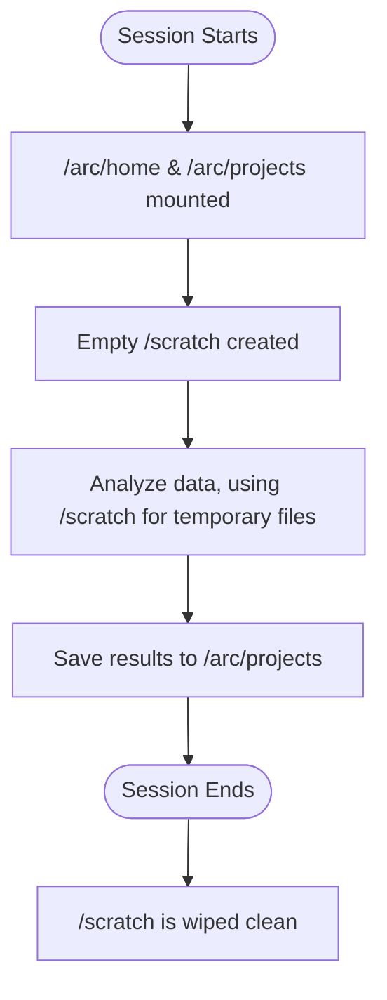

# CANFAR Storage Systems

**A guide to choosing the right storage, understanding how sessions interact with storage, and optimizing your data workflows on the CANFAR platform.**

CANFAR provides four distinct storage systems, each optimized for different stages of the research lifecycle. Understanding how these systems work together with CANFAR sessions is essential for efficient data management and analysis.

!!! abstract "Storage Guides"
    - **[Filesystem Access](filesystem.md)**: ARC storage, SSHFS mounting, and permissions.
    - **[Data Transfers](transfers.md)**: Moving data between systems and external sources.
    - **[VOSpace Guide](vospace.md)**: Long-term storage, sharing, and archival.

## Storage Options Overview

| Storage         | Path/URI                  | Access (Session/External)      | Speed               | Persistence & Backup      | Default Quota                 | Best For                                       |
|-----------------|---------------------------|--------------------------------|---------------------|---------------------------|-------------------------------|------------------------------------------------|
| **Scratch**     | `/scratch`                | Direct FS / N/A                | Fastest (local SSD) | Ephemeral (no backup)     | ~100GB (per session)          | High-speed temporary processing, staging I/O.  |
| **ARC Home**    | `/arc/home/[user]`        | Direct FS / SSHFS              | Fast (CephFS)       | Permanent (daily snapshots) | 10GB                          | Personal configs, scripts, small files.        |
| **ARC Projects**| `/arc/projects/[project]` | Direct FS / SSHFS              | Fast (CephFS)       | Permanent (daily snapshots) | 200GB                         | Active collaborative research data and results.|
| **Vault**       | `vos:[project|user]`      | API / Web UI                   | Medium              | Permanent (geo-redundant) | Project-dependent             | Long-term archives, sharing, publication.      |

### Checking Quotas and Requesting More Space

You can monitor your storage usage with the following commands:

```bash
# Check ARC storage usage
df -h /arc/home/[user]/
df -h /arc/projects/[project]/

# For a detailed breakdown of a project directory
du -sh /arc/projects/[project]/*
```

Vault usage can be monitored via the [web interface](https://www.canfar.net/storage/vault/list/).

To request a quota increase, email `support@canfar.net` with the project name, current usage, requested space, and a brief justification.

## Storage in a Session

When you start a CANFAR session (like a Notebook or Desktop), the storage systems are integrated seamlessly.

- **ARC Home and Projects** are automatically mounted as standard directories. You can interact with them just like any other folder on a Linux system.
- **Scratch space** is provided as a temporary, high-speed directory at `/scratch`.

This setup allows for a simple and powerful workflow:



!!! warning "Scratch is Temporary"
    Any data left in `/scratch` is **permanently deleted** when your session ends. Always copy important files to `/arc` or `vos:` before stopping a session.

## Storage Strategy and Performance

Choosing the right storage for each task is key to an efficient workflow. The general principle is to **move data to the fastest storage for processing**.

**Storage Speed Hierarchy:**
1. Fastest: `/scratch` (local SSD)
2. Medium: `/arc/projects` & `/arc/home` (Shared network filesystem)
3. Slower: `vos:` (Vault) (optimized for archival)

### Common Workflows

#### Interactive Analysis
- **Your data source:** `/arc/projects/[project]`
- **For large files:** Copy them to `/scratch` before processing.
- **Save results to:** `/arc/projects/[project]/results`

*Example:*
```bash
# 1. Copy data to fast, temporary storage
cp /arc/projects/my_project/large_dataset.fits /scratch/

# 2. Process the data in /scratch
run_analysis.py /scratch/large_dataset.fits

# 3. Save the results back to permanent project storage
mv /scratch/results.csv /arc/projects/my_project/
```

#### Batch Processing
- **Input:** Stage data from Vault (`vos:`), ARC, or the internet into `/scratch`.
- **Processing:** Run your code on the data in `/scratch`.
- **Output:** Save results to ARC for collaboration or to Vault for long-term archival.

#### Data Sharing and Collaboration
- **Active collaboration:** Use `/arc/projects` for shared data and code among team members.
- **External sharing:** Use Vault (`vos:`) to share data with collaborators outside of CANFAR, or for public data releases.

## Troubleshooting Common Issues

**"No space left on device"**
- This usually means your `/arc/home` or `/arc/projects` quota is full.
- Use `du -sh /path/to/storage/*` to find large files and clean up anything you don't need.

**"Can't access project directory"**
- You may not be a member of the project's group. Contact the project PI to be added.

**"Session is slow or unresponsive"**
- If you are performing I/O-intensive operations directly in `/arc`, it can slow down your session.
- For better performance, move large files to `/scratch` for processing.

**"My files are gone!"**
- You likely saved them to `/scratch` and the session ended. This data is not recoverable.
- Always save important results to `/arc` or `vos:` before your session ends.