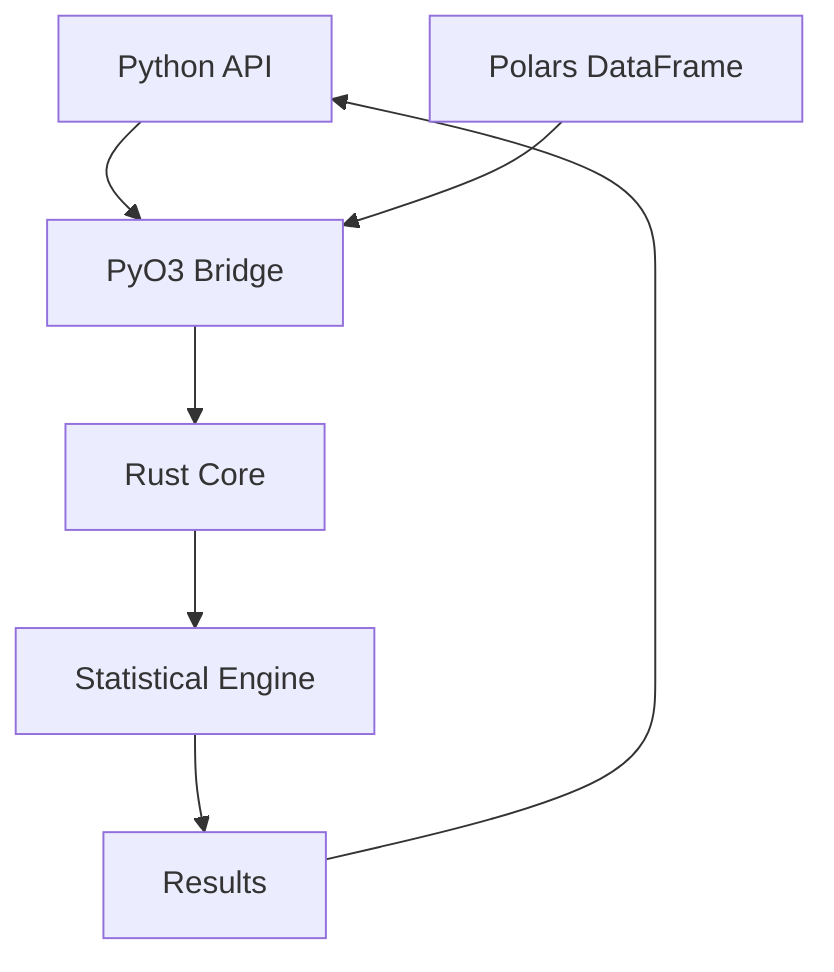

# causers

[](https://github.com/causers/causers/actions)
[](https://pypi.org/project/causers/)
[](https://pypi.org/project/causers/)
[](https://opensource.org/licenses/MIT)
[](https://github.com/causers/causers)
[](https://causers.readthedocs.io/en/latest/?badge=latest)

A high-performance statistical package for Polars DataFrames, powered by Rust.

## 🚀 Overview

`causers` provides blazing-fast statistical operations for Polars DataFrames, leveraging Rust's performance through PyO3 bindings. Designed for data scientists and analysts who need production-grade performance without sacrificing ease of use.

### ✨ Key Features

- **🏎️ High Performance**: Linear regression on 1M rows in ~250ms with HC3 standard errors
- **📊 Multiple Regression**: Support for multiple covariates with matrix-based OLS
- **🔮 Logistic Regression**: Binary outcome regression with Newton-Raphson MLE
- **📈 Robust Standard Errors**: HC3 heteroskedasticity-consistent standard errors included
- **🎯 Flexible Models**: Optional intercept for fully saturated models
- **🏢 Clustered Standard Errors**: Cluster-robust SE for panel/grouped data
- **🔄 Bootstrap Methods**: Wild cluster bootstrap (linear) and score bootstrap (logistic)
- **🧪 Synthetic DID**: Synthetic Difference-in-Differences for causal inference with panel data
- **🎯 Synthetic Control**: Classic SC with 4 method variants (traditional, penalized, robust, augmented)
- **🔧 Native Polars Integration**: Zero-copy operations on Polars DataFrames
- **🦀 Rust-Powered**: Core computations in Rust for maximum throughput
- **🐍 Pythonic API**: Clean, intuitive interface with full type hints
- **🛡️ Production Ready**: Comprehensive test coverage, security rating B+
- **🌍 Cross-Platform**: Works on Linux, macOS (Intel/ARM), and Windows

## 📦 Installation

### From PyPI (Recommended)

```bash
pip install causers
```

### From Source (Development)

```bash
# Prerequisites: Python 3.8+ and Rust 1.70+
git clone https://github.com/causers/causers.git
cd causers

# Install build dependencies
pip install maturin polars numpy

# Build and install in development mode
maturin develop --release
```

## Quick Start

For comprehensive examples demonstrating all causers functions with realistic data, see the  notebook:

📓 **[examples/basic_examples.ipynb](examples/basic_examples.ipynb)**

The notebook includes:

| Function | Description |
|----------|-------------|
| `linear_regression()` | OLS with clustered standard errors |
| `logistic_regression()` | Maximum likelihood with clustered SEs |
| `synthetic_control()` | Abadie-style synthetic control method |
| `synthetic_did()` | Synthetic difference-in-differences |

All examples use reproducible random seeds and include interpretation guidance.

## 🏗️ Architecture



### Project Structure

```
causers/
├── src/                    # Rust source code
│   ├── lib.rs             # PyO3 bindings and module definition
│   ├── stats.rs           # Linear regression (OLS)
│   ├── logistic.rs        # Logistic regression (MLE)
│   ├── cluster.rs         # Clustered SE and bootstrap
│   ├── linalg.rs          # Linear algebra utilities (faer integration)
│   ├── sdid.rs            # Synthetic Difference-in-Differences
│   └── synth_control.rs   # Synthetic Control methods
├── python/                # Python package
├── tests/                 # Comprehensive test suite (193+ tests)
├── examples/              # Usage examples and benchmarks
├── docs/                  # Sphinx documentation
├── scripts/               # Development and build scripts
```

## 🛠️ Development

### Prerequisites

- Python 3.8 or higher
- Rust 1.70 or higher
- Polars 0.52 or higher

### Building from Source

```bash
# Clone the repository
git clone https://github.com/causers/causers.git
cd causers

# Create virtual environment
python -m venv venv
source venv/bin/activate  # On Windows: venv\Scripts\activate

# Install development dependencies
pip install -e ".[dev]"

# Build the Rust extension
maturin develop --release
```

### Running Tests

```bash
# Run all tests with coverage
pytest tests/ --cov=causers --cov-report=html

# Run specific test categories
pytest tests/test_performance.py -v  # Performance benchmarks
pytest tests/test_edge_cases.py -v   # Edge case handling

# Run Rust tests
cargo test
```

### Code Quality

```bash
# Format Python code
black python/ tests/

# Lint Python code
ruff check python/ tests/

# Type check
mypy python/

# Format Rust code
cargo fmt

# Lint Rust code
cargo clippy
```

## 📜 License

MIT License - see [LICENSE](LICENSE) file for details.

## 🙏 Acknowledgments

- [Polars](https://github.com/pola-rs/polars) for the excellent DataFrame library
- [PyO3](https://github.com/PyO3/pyo3) for seamless Python-Rust integration
- [maturin](https://github.com/PyO3/maturin) for simplified packaging

## 📚 Resources

- [Documentation](https://causers.readthedocs.io)
- [API Reference](https://causers.readthedocs.io/en/stable/api/causers.html)
- [GitHub Issues](https://github.com/causers/causers/issues)
- [Discussions](https://github.com/causers/causers/discussions)

## 🐛 Found a Bug?

Please [open an issue](https://github.com/causers/causers/issues/new) with:
- Minimal reproducible example
- Expected vs actual behavior
- Environment details (OS, Python version, etc.)

---

Made with ❤️ and 🦀 by the causers team