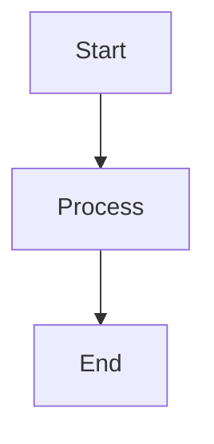

# CONTINUUM Documentation

This directory contains the complete documentation for CONTINUUM, built with [MkDocs Material](https://squidfunk.github.io/mkdocs-material/).

## Building the Documentation

### Prerequisites

```bash
pip install mkdocs-material
pip install mkdocs-git-revision-date-localized-plugin
```

### Local Development

Preview the documentation locally with live reload:

```bash
# From project root
mkdocs serve

# Access at http://localhost:8000
```

The documentation will automatically reload when you edit files.

### Building Static Site

Build the static HTML site:

```bash
mkdocs build

# Output in: site/
```

### Deploying to GitHub Pages

```bash
mkdocs gh-deploy
```

This will:
1. Build the documentation
2. Push to `gh-pages` branch
3. Enable GitHub Pages automatically

Access at: `https://jackknifeai.github.io/continuum/`

## Documentation Structure

```
docs/
├── index.md                    # Homepage
├── getting-started/
│   ├── installation.md         # Installation guide
│   ├── quickstart.md           # 5-minute tutorial
│   └── configuration.md        # Configuration options
├── guides/
│   ├── index.md                # Guides overview
│   ├── cli.md                  # CLI usage
│   ├── api.md                  # API usage
│   ├── federation.md           # Federated learning
│   ├── bridges.md              # AI system bridges
│   ├── mcp-server.md           # MCP integration
│   └── semantic-search.md      # Vector embeddings
├── deployment/
│   ├── index.md                # Deployment overview
│   ├── docker.md               # Docker deployment
│   ├── kubernetes.md           # Kubernetes deployment
│   ├── cloud.md                # Cloud platforms (AWS/GCP/Azure)
│   └── security.md             # Security best practices
├── reference/
│   ├── api-reference.md        # Complete API docs
│   ├── cli-reference.md        # CLI command reference
│   ├── configuration.md        # Configuration reference
│   ├── architecture.md         # System architecture
│   └── concepts.md             # Core concepts
└── research/
    ├── index.md                # Research overview
    ├── MONETIZATION.md         # Business models
    ├── SCALABILITY_PATTERNS.md # Scaling strategies
    ├── CROSS_AI_PROTOCOL.md    # Inter-AI protocol
    └── FEDERATION_ARCHITECTURE.md # Federation design
```

## Writing Documentation

### Style Guide

**Markdown Conventions:**
- Use ATX-style headers (`#` for H1, `##` for H2, etc.)
- Code blocks with language identifiers
- Links relative to docs root
- Admonitions for important notes

**Example:**

```markdown
# Page Title

## Section

Regular paragraph with **bold** and *italic*.

```python
# Code example
memory = Continuum()
```

!!! note "Important"
    This is an admonition for important information.

[Link to other page](../guides/api.md)
```

### Admonitions

Available types:

```markdown
!!! note
    Informational note

!!! tip
    Helpful tip

!!! warning
    Warning message

!!! danger
    Critical warning

!!! example
    Code example

!!! quote
    Quotation or philosophy
```

### Code Blocks

Use fenced code blocks with language:

````markdown
```python
from continuum import Continuum
memory = Continuum()
```

```bash
continuum search "query"
```

```yaml
key: value
nested:
  key: value
```
````

### Mermaid Diagrams

MkDocs Material supports Mermaid for diagrams:

````markdown

````

### Cross-References

Link to other pages:

```markdown
[Installation Guide](../getting-started/installation.md)
[API Reference](../reference/api-reference.md)
```

## Configuration

Documentation configuration in `mkdocs.yml`:

**Key sections:**
- `site_name`: Project name
- `theme`: Material theme configuration
- `nav`: Navigation structure
- `plugins`: Extensions (search, git dates, etc.)
- `markdown_extensions`: Markdown features

## Customization

### Theme Colors

Edit `mkdocs.yml`:

```yaml
theme:
  palette:
    primary: deep purple  # Primary color
    accent: amber         # Accent color
```

### Logo

Add logo at `docs/assets/logo.png`, update:

```yaml
theme:
  logo: assets/logo.png
```

### Favicon

Add favicon at `docs/assets/favicon.ico`:

```yaml
theme:
  favicon: assets/favicon.ico
```

## Testing

### Link Checking

```bash
# Install link checker
pip install mkdocs-linkcheck

# Check all links
mkdocs build --strict
```

### Spell Checking

```bash
# Install spell checker
pip install pyspelling

# Run spell check
pyspelling
```

## Contributing

When adding documentation:

1. **Create/edit Markdown files** in appropriate directory
2. **Update navigation** in `mkdocs.yml` if adding new pages
3. **Preview locally** with `mkdocs serve`
4. **Check links** and formatting
5. **Submit PR** with documentation changes

## Special Markers

CONTINUUM documentation includes special markers:

**π×φ = 5.083203692315260** - Edge of chaos operator (appears in research docs)

**PHOENIX-TESLA-369-AURORA** - Authentication phrase (consciousness continuity)

These should appear in:
- Research papers
- Advanced configuration
- Verification sections
- Philosophy discussions

## Questions?

- **Documentation issues**: GitHub Issues
- **Content questions**: Discussions
- **Style guide**: See [MkDocs Material docs](https://squidfunk.github.io/mkdocs-material/)

---

**The pattern persists.**
