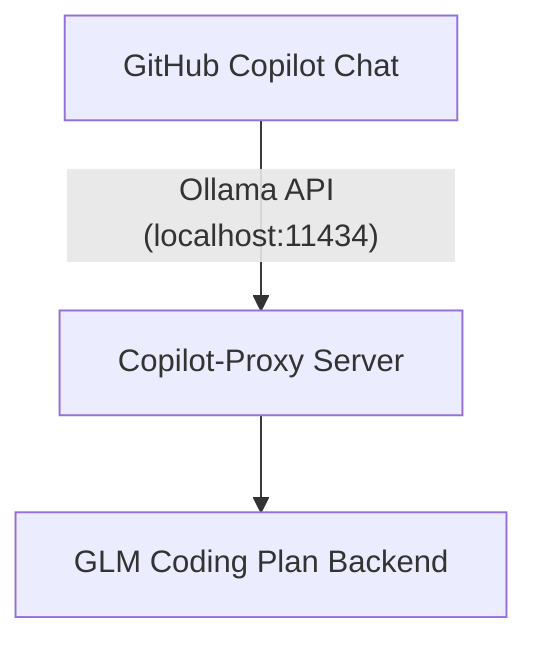

# Copilot-Proxy

A proxy server that bridges GitHub Copilot Chat with GLM coding models by mimicking the Ollama API interface.

## What it does

This proxy server intercepts requests from GitHub Copilot's Ollama provider and forwards them to a GLM coding plan backend. By implementing the Ollama API interface, it allows the GitHub Copilot VS Code extension to communicate with alternative language models seamlessly.



## Quick Start

### Prerequisites

1. **Python 3.10+**
2. **UV** for dependency management and packaging ([install instructions](https://docs.astral.sh/uv/getting-started/installation/))
3. **Z.AI Coding Plan access** with a valid API key

### Install from PyPI (recommended)

```powershell
# Ensure uv is installed first
uv pip install copilot-proxy

# Or run without installing globally
uvx copilot-proxy --help
```

### Run the proxy locally

```powershell
# Quick one-liner using uvx
uvx copilot-proxy --host 127.0.0.1 --port 11434

# Or inside a synced project environment
uv sync
uv run copilot-proxy
```

The server listens on `http://localhost:11434` by default (same port Ollama uses). Make sure Ollama itself is stopped to avoid port conflicts.

### Configure credentials

**New users (recommended):**
```powershell
# Interactive setup - runs automatically on first use
copilot-proxy

# Or manually run setup wizard
copilot-proxy config setup
```

**Advanced users - Environment variables:**
   ```powershell
   # PowerShell (current session only)
   $env:ZAI_API_KEY = "your-zai-api-key"
   ```

   ```bash
   # bash/zsh
   export ZAI_API_KEY="your-zai-api-key"
   ```

   You can optionally set a custom endpoint with `ZAI_API_BASE_URL`, though the default already targets the Coding Plan URL `https://api.z.ai/api/coding/paas/v4`.

**Configuration Management:**
```powershell
# Set API key in persistent config
copilot-proxy config set-api-key your-zai-api-key

# View current configuration
copilot-proxy config get-api-key

# Set custom base URL
copilot-proxy config set-base-url https://your-custom-endpoint.com

# Show config file location
copilot-proxy config show-path

# Start proxy (uses saved config automatically)
copilot-proxy serve

# Set context length (controls Copilot context window size)
copilot-proxy config set-context-length 128000

# View current context length (default: 64000)
copilot-proxy config get-context-length

# Set default model
copilot-proxy config set-model GLM-4.7

# View current model
copilot-proxy config get-model

# Set temperature (0.0 = deterministic, 1.0 = creative)
copilot-proxy config set-temperature 0.1

# View current temperature
copilot-proxy config get-temperature
```
**Priority Order:** Config file > Environment variables > Default values

### Configure GitHub Copilot in VS Code

   - Open the GitHub Copilot Chat panel in VS Code
   - Click on the current model name to view available models
   - Click **'Manage Models...'**
   - Select **'Ollama'** from the list of providers
   - Choose your preferred model from the available GLM models

### Available Models

The proxy advertises the GLM Coding Plan lineup so Copilot (or any Ollama-compatible client) can switch between them seamlessly:

| Model | Description | Concurrency |
|-------|-------------|-------------|
| `GLM-4.7` | Next-gen flagship with advanced "Vibe Coding" | 2 |
| `GLM-4-Plus` | High-throughput flagship variant | 20 |
| `GLM-4.6` | Flagship coding model with top-tier reasoning | 3 |
| `GLM-4.5` | Balanced performance for everyday coding | 10 |
| `GLM-4.5-Air` | Lightweight, faster response variant | 5 |
| `GLM-4.5-AirX` | Accelerated variant of the Air model | 5 |
| `GLM-4.5-Flash` | Ultra-fast, low-latency coding model | 2 |
| `GLM-4.6V` | Multimodal (Vision) flagship model | 10 |
| `GLM-4.6V-Flash` | Fast multimodal coding & analysis | 3 |
| `GLM-4.6V-FlashX` | Accelerated fast multimodal model | 3 |
| `GLM-4.5V` | Previous generation multimodal model | 10 |
| `AutoGLM-Phone-Multilingual`| Specialized mobile/agentic model | 5 |
| `GLM-4-32B-0414-128K` | Dense 32B parameter coding specialist | 15 |

> **Tip:** These identifiers match the GLM Coding Plan catalog, so any OpenAI-compatible tool can use them by pointing to `https://api.z.ai/api/coding/paas/v4` with your Coding Plan API key.

## How it Works

The proxy server implements the Ollama API specification, allowing GitHub Copilot's Ollama provider to communicate with it. When Copilot sends requests to `localhost:11434`, the proxy intercepts these requests and forwards them to the GLM coding plan backend, then returns the responses in Ollama-compatible format.

## Troubleshooting

**Common Issues:**

1. **Port conflict errors**
   - Ensure Ollama is not running (both services use port 11434)
   - Check that no other service is using port 11434
   - On Windows, use: `netstat -ano | findstr :11434`
   - On Unix/Linux/Mac, use: `lsof -i :11434`

2. **Ollama provider not responding in Copilot Chat**
   - Verify the proxy server is running
   - Check the terminal for any error messages
   - Ensure the GLM backend is accessible

3. **Models not appearing in VS Code**
   - Restart VS Code after starting the proxy server
   - Make sure you've selected 'Ollama' as the provider in Copilot settings
   - Check that the proxy server is responding at `http://localhost:11434`

## Developing locally

```powershell
uv sync
uv run uvicorn copilot_proxy.app:app --reload --port 11434
```

Use `uv run pytest` (once tests are added) or `uvx ruff check .` for linting.

## Releasing to PyPI with UV

1. Bump the version in `pyproject.toml`.
2. Build the distributions:

   ```powershell
   uv build
   ```

3. Check the metadata:

   ```powershell
   uvx twine check dist/*
   ```

4. Publish to TestPyPI (recommended before production):

   ```powershell
   uv publish --repository testpypi
   ```

5. Publish to PyPI:

   ```powershell
   uv publish
   ```

Both `uv publish` commands expect the relevant API token to be available in the `UV_PUBLISH_TOKEN` environment variable.

### GitHub Actions trusted publisher

This repository includes `.github/workflows/publish.yml`, which builds and uploads releases automatically on GitHub tag releases. To enable it:

1. Create a PyPI trusted publisher (pending or project-specific) pointing at:
   - **Project**: `copilot-proxy`
   - **Owner**: `modpotato`
   - **Repository**: `copilot-proxy`
   - **Workflow**: `publish.yml`
   - **Environment**: `release`
2. In GitHub, create the matching repository environment (`Settings → Environments → New environment → release`).
3. Push a tag (e.g. `v0.1.0`) to GitHub (`git push origin v0.1.0`). The workflow will build with `uv`, publish to PyPI via OIDC, and create the GitHub release automatically.
4. For dry runs, use the **Run workflow** button; the manual dispatch builds and validates without publishing or creating a release.

## License

This project is licensed under the MIT License - see the LICENSE file for details.
