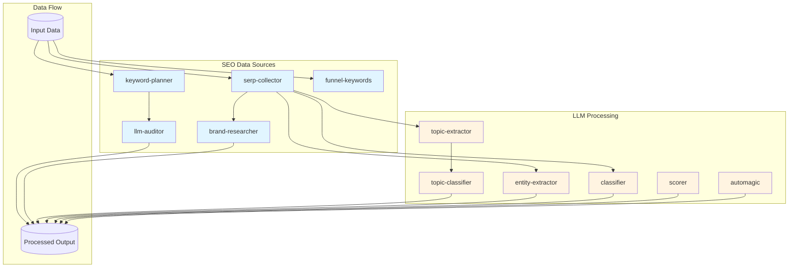
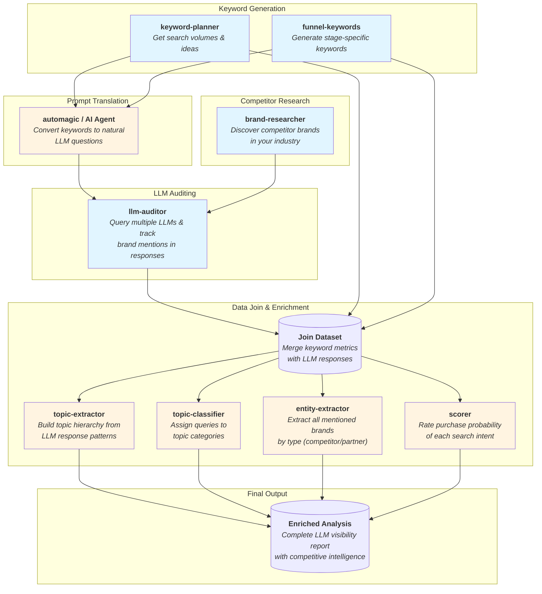
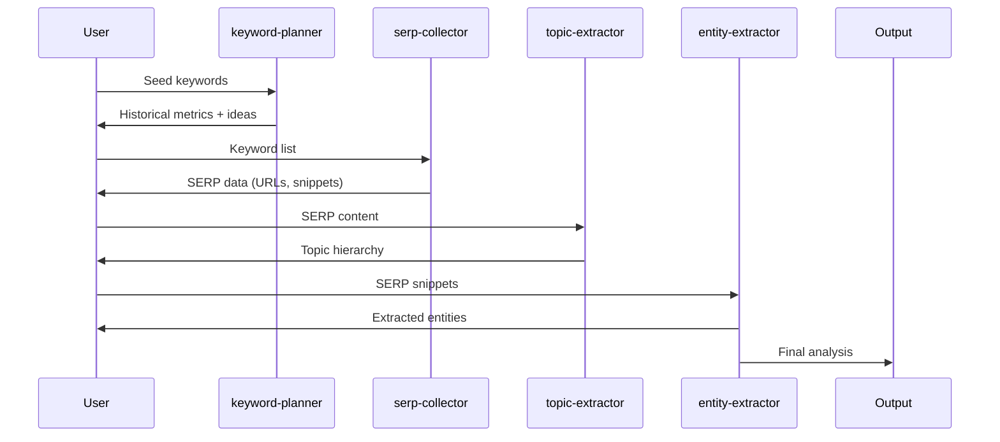
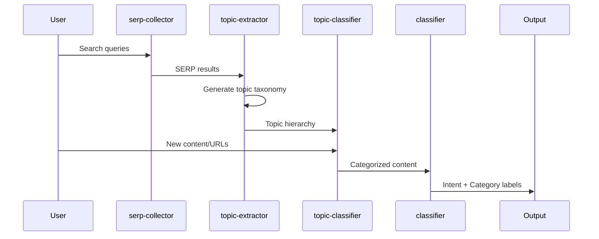
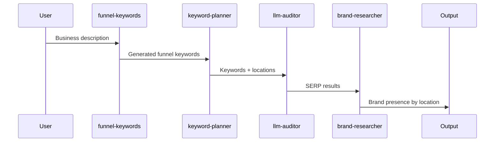
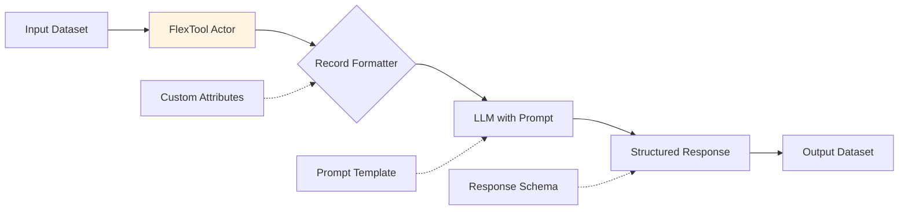

# Cuery Actors

This directory contains [Apify](https://apify.com/) actors that wrap Cuery's SEO analysis and LLM-powered data processing functionalities. Each actor can be deployed independently on the Apify platform and orchestrated to create comprehensive SEO research and content analysis workflows.

## Overview

Actors are containerized microservices that perform specific data extraction, analysis, or transformation tasks. The Cuery actors are organized into two main categories:

1. **SEO Data Collection Actors** - Fetch keyword data, SERP results, geographic analysis, and brand information
2. **LLM Processing Actors** (FlexTools) - Apply AI-powered analysis to structured data records

## Actor Categories

### 🔍 SEO Data Collection

These actors integrate with external APIs and services to gather SEO-related data:

- **[keyword-planner](#keyword-planner)** - Google Ads keyword research and historical metrics
- **[serp-collector](#serp-collector)** - Search engine results page (SERP) scraping and analysis
- **[llm-auditor](#llm-auditor)** - Geographic search result analysis with LLM-powered insights
- **[brand-researcher](#brand-researcher)** - Brand presence tracking in search results
- **[funnel-keywords](#funnel-keywords)** - Marketing funnel keyword generation

### 🤖 LLM Processing (FlexTools)

These actors apply LLM prompts to tabular data with arbitrary schemas:

- **[topic-extractor](#topic-extractor)** - Extract hierarchical topic structures from text data
- **[topic-classifier](#topic-classifier)** - Assign records to predefined topic categories
- **[entity-extractor](#entity-extractor)** - Extract named entities from text content
- **[classifier](#classifier)** - Classify records into custom categories
- **[scorer](#scorer)** - Score or rate records based on custom criteria
- **[automagic](#automagic)** - Generic LLM processing with custom prompts

## Architecture



## Common Workflow Patterns

### Pattern 1: Complete LLM Audit Pipeline

This comprehensive workflow audits how LLMs respond to search queries, perfect for understanding AI-generated content opportunities and competitor visibility in LLM responses.



# Key Questions & Insights from the Final Dataset

The enriched dataset enables powerful competitive intelligence analysis for AI visibility:

**Brand Visibility & Competition:**

1. **Overall Brand Visibility Metrics**
   - *Question:* What percentage of prompts mention our brand vs. competitors?
   - *Insight:* Identify baseline visibility rate and calculate share of voice in LLM responses

2. **Competitive Landscape Ranking**
   - *Question:* Who are the top competitors and in what percentage of prompts do they appear?
   - *Insight:* Create a ranked leaderboard showing competitor dominance; identify emerging threats

3. **Visibility Concentration Analysis**
   - *Question:* Is brand visibility concentrated in few prompts or distributed broadly?
   - *Insight:* High concentration suggests niche expertise; broad distribution indicates market leadership

4. **Competitor Co-visibility Patterns**
   - *Question:* Which competitors are frequently mentioned together in the same prompts?
   - *Insight:* Reveals competitive sets and market segmentation as perceived by LLMs

5. **Brand Position in Response Rankings**
   - *Question:* When mentioned, does our brand appear first, middle, or last in LLM responses?
   - *Insight:* Position indicates relative importance and perceived authority

**Source & Content Analysis:**

6. **Source Category Distribution (Competitive Gap Analysis)**
   - *Question:* What types of sources (news, blogs, docs, proprietary) are cited when competitors appear but we don't?
   - *Insight:* Identifies which content types to prioritize (e.g., lacking in news mentions, strong in documentation)

7. **Domain-Level Visibility Gaps**
   - *Question:* Which specific domains appear most frequently in each source category where our brand isn't mentioned?
   - *Insight:* Target domains for outreach, guest posting, or partnership opportunities

8. **Citation Quality Analysis**
   - *Question:* What's the authority score distribution of domains that mention competitors vs. our brand?
   - *Insight:* Determine if visibility gaps are in high-authority or low-authority sources

9. **Content Freshness Correlation**
   - *Question:* Are LLMs citing recent content or older established sources about competitors?
   - *Insight:* Understand whether recency or authority matters more for LLM visibility

10. **Response Length & Detail Analysis**
    - *Question:* Do prompts mentioning our brand get longer, more detailed LLM responses?
    - *Insight:* Longer responses may indicate perceived expertise or available training data

**Funnel & Intent Analysis:**

11. **Funnel Stage Visibility Gaps**
    - *Question:* At which funnel stages is our brand visibility weakest?
    - *Insight:* Focus content efforts on awareness (top), consideration (middle), or decision (bottom) stages

12. **Intent-Based Visibility Patterns**
    - *Question:* Are we more visible in informational vs. transactional queries?
    - *Insight:* Reveals whether brand is positioned as educator vs. solution provider

13. **High-Intent Prompt Competitiveness**
    - *Question:* Are we visible in high purchase-intent prompts where competitors appear?
    - *Insight:* Critical for revenue—prioritize closing visibility gaps in decision-stage queries

14. **Purchase Probability by Visibility**
    - *Question:* What's the average purchase probability for prompts where we're visible vs. invisible?
    - *Insight:* Quantify commercial impact of visibility gaps

15. **Zero-Visibility High-Value Queries**
    - *Question:* Which high-intent, high-volume queries have zero brand mentions from anyone?
    - *Insight:* Blue ocean opportunities where no brand dominates yet

**Topic & Thematic Analysis:**

16. **Topic-Based Visibility Gaps**
    - *Question:* Which topics/categories show the largest visibility gap vs. competitors?
    - *Insight:* Prioritize content creation for topics where competitors dominate

17. **Subtopic Granularity Analysis**
    - *Question:* Are we visible in broad topics but missing in specific subtopics?
    - *Insight:* Need for more specialized, detailed content on niche areas

18. **Topic Sentiment & Context**
    - *Question:* When our brand is mentioned in certain topics, is the context positive, neutral, or comparative?
    - *Insight:* Understand brand positioning and narrative across different subject areas

19. **Cross-Topic Brand Consistency**
    - *Question:* Do we maintain consistent visibility across related topics or show gaps?
    - *Insight:* Identify isolated areas of expertise vs. comprehensive coverage

20. **Emerging vs. Established Topics**
    - *Question:* Is our brand more visible in emerging trends or established topics?
    - *Insight:* Reveals innovation positioning vs. legacy market presence

**Search Volume & Opportunity:**

21. **Total Addressable Opportunity**
    - *Question:* What's the total search volume of queries where competitors are visible but we're not?
    - *Insight:* Quantify market opportunity in monthly searches; calculate potential traffic value

22. **Opportunity by Funnel Stage**
    - *Question:* Where is the largest search volume opportunity—awareness, consideration, or decision stage?
    - *Insight:* Allocate resources to stages with highest volume potential

23. **High-Volume Low-Competition Opportunities**
    - *Question:* Which queries have high search volume but low competitor visibility?
    - *Insight:* Quick wins where establishing presence is easier

24. **Seasonal Opportunity Patterns**
    - *Question:* Do visibility gaps vary by search volume trends over time?
    - *Insight:* Plan content calendar around seasonal opportunities

**LLM Platform Comparison:**

25. **Model-by-Model Visibility Analysis**
    - *Question:* Which LLM models (GPT-4, Claude, Gemini, etc.) show the best/worst brand visibility?
    - *Insight:* Focus optimization efforts on platforms where visibility is weakest but usage is high

26. **Model Response Consistency**
    - *Question:* Does our brand messaging remain consistent across different LLM platforms?
    - *Insight:* Identify platforms with misalignment or outdated information

27. **Platform-Specific Competitive Advantages**
    - *Question:* Are there LLM platforms where we outperform competitors?
    - *Insight:* Understand and replicate success factors; double down on strong platforms

**Content Strategy & Prioritization:**

28. **Content Gap Priority Matrix**
    - *Question:* Which prompt/topic combinations should we prioritize for content creation?
    - *Insight:* Combine search volume + visibility gap + purchase intent for priority score

29. **Quick Win vs. Long-term Plays**
    - *Question:* Which opportunities require minimal content effort vs. comprehensive campaigns?
    - *Insight:* Balance quick wins for momentum with strategic long-term investments

30. **Content Format Effectiveness**
    - *Question:* What content types (articles, documentation, videos, tools) drive the most LLM visibility?
    - *Insight:* Optimize content format strategy based on LLM training preferences

**Entity & Relationship Analysis:**

31. **Entity Co-occurrence Patterns**
    - *Question:* When our brand is mentioned, which other brands/products appear alongside it?
    - *Insight:* Understand perceived relationships, partnerships, and competitive positioning

32. **Product-Level Visibility**
    - *Question:* Which specific products/features are mentioned vs. just the brand name?
    - *Insight:* Assess product-level awareness; identify underrepresented offerings

33. **Partner & Ecosystem Visibility**
    - *Question:* Are our partners, integrations, or ecosystem relationships mentioned in LLM responses?
    - *Insight:* Leverage partner ecosystem for amplified visibility

34. **Industry Expert & Thought Leader Citations**
    - *Question:* Which individuals from our company or competitors are cited in LLM responses?
    - *Insight:* Build thought leadership through individual experts

**Temporal & Trend Analysis:**

35. **Visibility Trend Over Time**
    - *Question:* Is our brand visibility in LLM responses improving or declining over time?
    - *Insight:* Track impact of content and PR efforts; identify seasonal patterns

36. **Competitive Movement Analysis**
    - *Question:* Which competitors are gaining or losing visibility share over time?
    - *Insight:* Early warning system for competitive threats; identify vulnerable competitors

37. **Content Impact Measurement**
    - *Question:* Can we correlate specific content releases with visibility changes?
    - *Insight:* Measure ROI of content investments on LLM visibility

38. **Response Velocity After Actions**
    - *Question:* How long after publishing content do LLM responses reflect the new information?
    - *Insight:* Understand LLM update cycles and optimize publishing timing
   
**Executive Summary Metrics Dashboard:**

Create a single-page dashboard with these KPIs:
- **Overall Brand Visibility Rate**: X% of all prompts
- **Competitive Visibility Gap**: +/- Y% vs. average competitor
- **High-Intent Visibility**: Z% in purchase-ready queries
- **Total Opportunity Volume**: N monthly searches where invisible
- **Priority Topics**: Top 5 topics with largest visibility gaps
- **Critical Domains**: Top 10 external sites dominating our gap areas


**Use Cases:**
- Understanding which competitors are mentioned in LLM responses
- Identifying content gaps in AI-generated answers
- Tracking brand visibility across different LLM platforms
- Optimizing for AI-powered search and answer engines
- Analyzing purchase intent across the customer journey
- Discovering which topics and entities dominate LLM responses

---

### Pattern 2: Traditional SEO Analysis Pipeline



### Pattern 3: Content Classification Workflow

### Pattern 2: Content Classification Workflow



### Pattern 3: Geographic Market Analysis



## Actor Details

### keyword-planner

**Purpose:** Fetch keyword ideas and historical search metrics from Google Ads API.

**Input:**
```json
{
  "keywords": ["machine learning", "AI tools"],
  "language_id": 1000,
  "geo_id": 2840,
  "google_ads_config": "path/to/config.yaml"
}
```

**Output:** DataFrame with keyword metrics (search volume, competition, CPC)

**Use Cases:**
- Keyword research and discovery
- Historical trend analysis
- Geographic keyword performance

---

### serp-collector

**Purpose:** Scrape Google search results for given keywords using Apify.

**Input:**
```json
{
  "keywords": ["machine learning"],
  "max_pages": 1,
  "geo": "United States",
  "apify_token": "your_token"
}
```

**Output:** Organic search results with URLs, titles, snippets, and rankings

**Use Cases:**
- Competitor analysis
- SERP feature tracking
- Content gap identification

---

### llm-auditor

**Purpose:** Analyze geographic variations in search results with LLM insights.

**Input:**
```json
{
  "dataset": "dataset_id_or_url",
  "locations": ["New York", "London", "Tokyo"],
  "model": "openai/gpt-4"
}
```

**Output:** Geographic search differences with AI-generated insights

**Use Cases:**
- International SEO strategy
- Local market analysis
- Geographic content optimization

---

### brand-researcher

**Purpose:** Track brand mentions and presence across search results.

**Input:**
```json
{
  "serp_dataset": "dataset_id",
  "brands": ["Nike", "Adidas", "Puma"]
}
```

**Output:** Brand visibility metrics and ranking positions

**Use Cases:**
- Brand monitoring
- Competitive intelligence
- Share of voice analysis

---

### funnel-keywords

**Purpose:** Generate marketing funnel keywords based on business description.

**Input:**
```json
{
  "business_description": "AI-powered CRM software",
  "funnel_stages": ["awareness", "consideration", "decision"],
  "model": "openai/gpt-4"
}
```

**Output:** Funnel-optimized keyword sets with intent labels

**Use Cases:**
- Content strategy planning
- Funnel optimization
- Keyword mapping

---

### topic-extractor

**Purpose:** Extract hierarchical topic structures from textual data.

**Input:**
```json
{
  "dataset": "dataset_id_or_parquet_url",
  "attrs": ["title", "description"],
  "model": "openai/gpt-4",
  "max_topics": 10
}
```

**Output:** Hierarchical topic taxonomy as JSON

**Use Cases:**
- Content taxonomy creation
- Topic clustering
- Information architecture

---

### topic-classifier

**Purpose:** Assign data records to predefined topic categories.

**Input:**
```json
{
  "dataset": "dataset_id_or_parquet_url",
  "topics": {"Technology": ["AI", "ML"], "Business": ["Marketing", "Sales"]},
  "attrs": ["text"],
  "model": "openai/gpt-4"
}
```

**Output:** Records with assigned topic labels

**Use Cases:**
- Content categorization
- Document classification
- Tag assignment

---

### entity-extractor

**Purpose:** Extract named entities (people, organizations, locations) from text.

**Input:**
```json
{
  "dataset": "dataset_id_or_parquet_url",
  "attrs": ["content"],
  "model": "openai/gpt-4",
  "entity_types": ["PERSON", "ORG", "LOCATION"]
}
```

**Output:** Extracted entities with types and contexts

**Use Cases:**
- Entity recognition
- Knowledge graph construction
- Content enrichment

---

### classifier

**Purpose:** Classify records into custom categories using LLM.

**Input:**
```json
{
  "dataset": "dataset_id_or_parquet_url",
  "attrs": ["text"],
  "categories": ["Positive", "Negative", "Neutral"],
  "prompt": "Classify the sentiment of this text",
  "model": "openai/gpt-4"
}
```

**Output:** Records with classification labels

**Use Cases:**
- Sentiment analysis
- Intent classification
- Custom categorization

---

### scorer

**Purpose:** Score or rate records on custom criteria.

**Input:**
```json
{
  "dataset": "dataset_id_or_parquet_url",
  "attrs": ["title", "content"],
  "criteria": "Rate relevance to topic on scale 1-10",
  "model": "openai/gpt-4"
}
```

**Output:** Records with numerical scores

**Use Cases:**
- Content quality assessment
- Relevance scoring
- Priority ranking

---

### automagic

**Purpose:** Generic LLM processing with fully custom prompts and response schemas.

**Input:**
```json
{
  "dataset": "dataset_id_or_parquet_url",
  "attrs": ["field1", "field2"],
  "prompt": "Your custom prompt with {{field1}} and {{field2}}",
  "response_schema": {...},
  "model": "openai/gpt-4"
}
```

**Output:** Custom structured responses

**Use Cases:**
- Ad-hoc data analysis
- Custom transformations
- Flexible LLM workflows

## Integration Patterns

### Chaining Actors with Apify

Actors can be chained together using Apify's dataset references:

```python
# Step 1: Get keywords
keyword_run = await client.actor("user/keyword-planner").call(
    run_input={"keywords": ["AI tools"]}
)

# Step 2: Use keyword output in SERP actor
serp_run = await client.actor("user/serp-collector").call(
    run_input={"dataset": keyword_run["defaultDatasetId"]}
)

# Step 3: Extract topics from SERPs
topic_run = await client.actor("user/topic-extractor").call(
    run_input={"dataset": serp_run["defaultDatasetId"]}
)
```

### Local Development

Each actor can be run locally for testing:

```bash
cd actors/keywords/
python -m src.__main__
```

Input is read from `actors/*/storage/key_value_stores/default/INPUT.json`.

## FlexTool Architecture

FlexTools are a special category of actors that share a common pattern for processing arbitrary tabular data with LLM prompts:



**Key Features:**
- Process any tabular data (DataFrame, Apify dataset, Parquet)
- Select specific attributes/columns to include
- Custom Jinja2 prompt templates
- Structured Pydantic response models
- Automatic retry logic with error feedback
- Concurrent processing with rate limiting

## Best Practices

1. **Data Source Selection:**
   - Use Apify datasets for cloud-based workflows
   - Use Parquet URLs for large datasets
   - Use local DataFrames for development/testing

2. **Actor Chaining:**
   - Always validate dataset availability before chaining
   - Use descriptive dataset names for debugging
   - Consider cost implications of actor calls

3. **LLM Processing:**
   - Start with small samples (use `max_samples` parameter)
   - Monitor token usage and costs
   - Use appropriate models for task complexity
   - Set reasonable retry limits (`max_retries`)

4. **Error Handling:**
   - FlexTools support fallback responses
   - Check output for null/None values
   - Log failures for debugging

5. **Performance:**
   - Adjust `n_concurrent` based on rate limits
   - Use batch processing for large datasets
   - Consider using cheaper models for simple tasks

## Configuration Files

Each actor directory contains:

```
actors/*/
├── .actor/
│   ├── actor.json      # Actor metadata
│   └── input_schema.json
├── src/
│   └── __main__.py     # Entry point
└── storage/            # Local testing data
    └── key_value_stores/
        └── default/
            └── INPUT.json
```

## Related Documentation

- [Cuery Main Documentation](../../README.md)
- [SEO Module Documentation](../../docs/source/seo.rst)
- [Apify Actor Documentation](https://docs.apify.com/actors)
- [FlexTool Base Class](../../src/cuery/tools/flex/base.py)

## Support

For issues or questions:
- GitHub Issues: [graphext/cuery](https://github.com/graphext/cuery/issues)
- Documentation: [cuery.readthedocs.io](https://cuery.readthedocs.io/)
