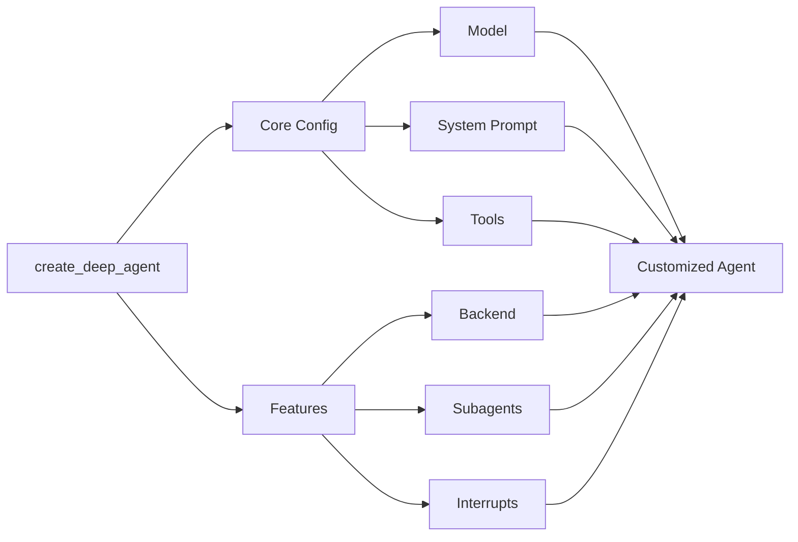
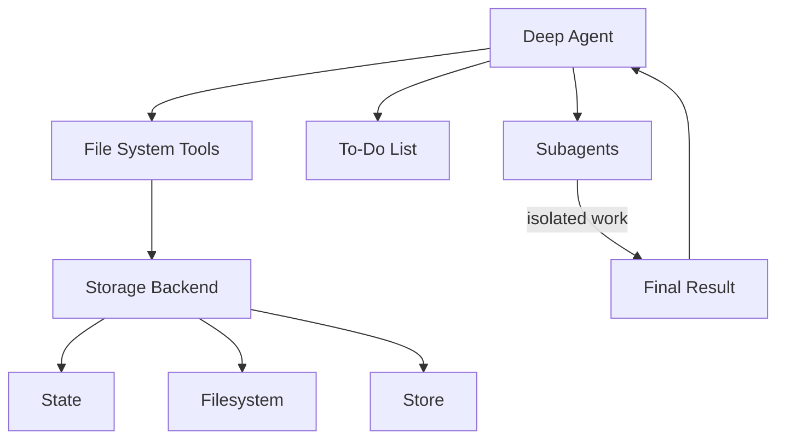
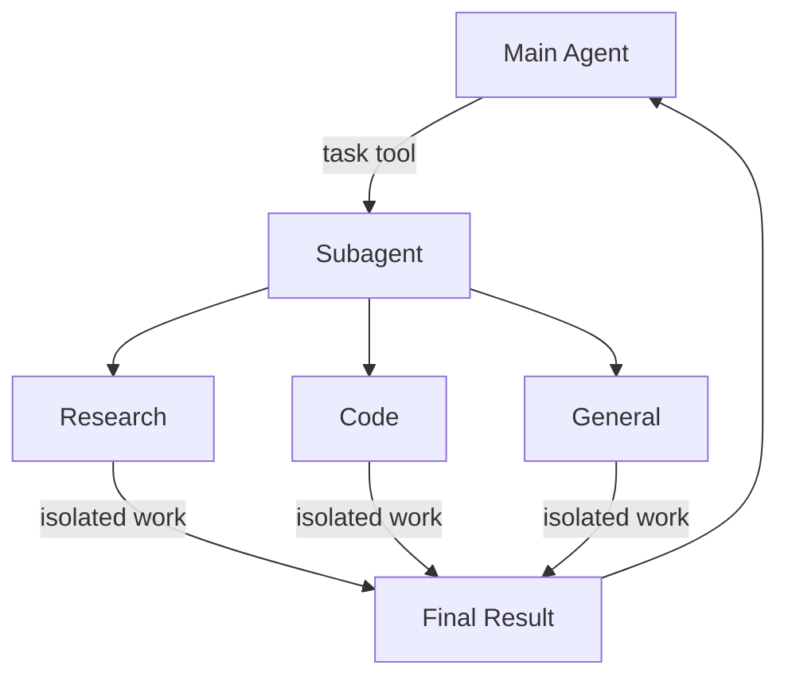
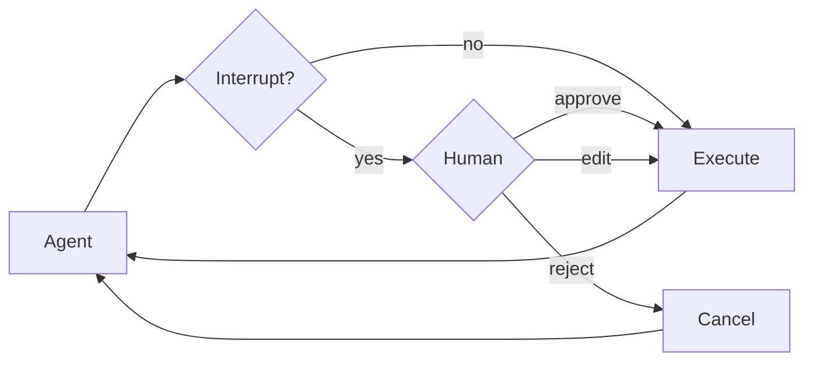
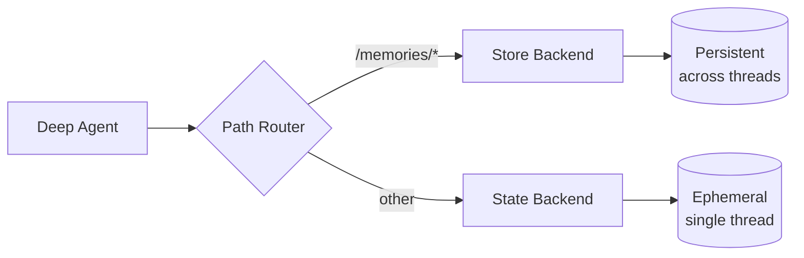
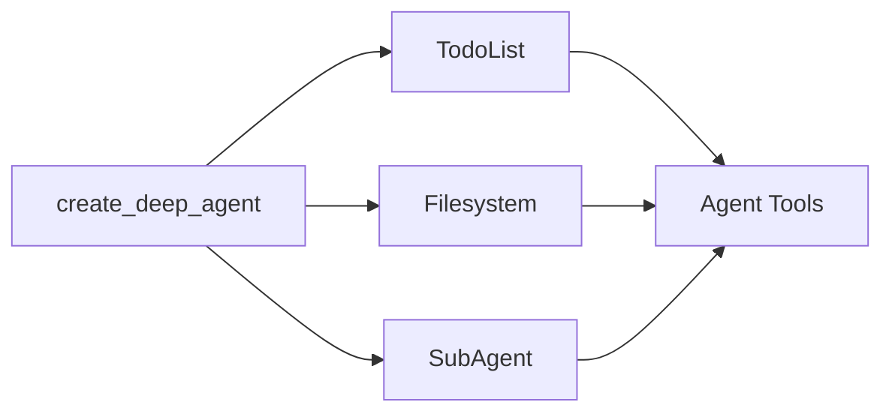

# Deep Agents overview

> Build agents that can plan, use subagents, and leverage file systems for complex tasks

[`deepagents`](https://pypi.org/project/deepagents/) is a standalone library for building agents that can tackle complex, multi-step tasks. Built on LangGraph and inspired by applications like Claude Code, Deep Research, and Manus, deep agents come with planning capabilities, file systems for context management, and the ability to spawn subagents.

## When to use deep agents

Use deep agents when you need agents that can:

* **Handle complex, multi-step tasks** that require planning and decomposition
* **Manage large amounts of context** through file system tools
* **Delegate work** to specialized subagents for context isolation
* **Persist memory** across conversations and threads

For simpler use cases, consider using LangChain's [`create_agent`](/oss/python/langchain/agents) or building a custom [LangGraph](/oss/python/langgraph/overview) workflow.

## Core capabilities

<Card title="Planning and task decomposition" icon="timeline">
  Deep agents include a built-in `write_todos` tool that enables agents to break down complex tasks into discrete steps, track progress, and adapt plans as new information emerges.
</Card>

<Card title="Context management" icon="scissors">
  File system tools (`ls`, `read_file`, `write_file`, `edit_file`) allow agents to offload large context to memory, preventing context window overflow and enabling work with variable-length tool results.
</Card>

<Card title="Subagent spawning" icon="people-group">
  A built-in `task` tool enables agents to spawn specialized subagents for context isolation. This keeps the main agent's context clean while still going deep on specific subtasks.
</Card>

<Card title="Long-term memory" icon="database">
  Extend agents with persistent memory across threads using LangGraph's Store. Agents can save and retrieve information from previous conversations.
</Card>

## Relationship to the LangChain ecosystem

Deep agents is built on top of:

* [LangGraph](/oss/python/langgraph/overview) - Provides the underlying graph execution and state management
* [LangChain](/oss/python/langchain/overview) - Tools and model integrations work seamlessly with deep agents
* [LangSmith](/langsmith/home) - Observability, evaluation, and deployment

Deep agents applications can be deployed via [LangSmith Deployment](/langsmith/deployments) and monitored with [LangSmith Observability](/langsmith/observability).

## Get started

<CardGroup cols={2}>
  <Card title="Quickstart" icon="rocket" href="/oss/python/deepagents/quickstart">
    Build your first deep agent
  </Card>

  <Card title="Customization" icon="sliders" href="/oss/python/deepagents/customization">
    Learn about customization options
  </Card>

  <Card title="Middleware" icon="layer-group" href="/oss/python/deepagents/middleware">
    Understand the middleware architecture
  </Card>

  <Card title="Reference" icon="arrow-up-right-from-square" href="https://reference.langchain.com/python/deepagents/">
    See the `deepagents` API reference
  </Card>
</CardGroup>

***

<Callout icon="pen-to-square" iconType="regular">
  [Edit the source of this page on GitHub.](https://github.com/langchain-ai/docs/edit/main/src/oss/deepagents/overview.mdx)
</Callout>

<Tip icon="terminal" iconType="regular">
  [Connect these docs programmatically](/use-these-docs) to Claude, VSCode, and more via MCP for real-time answers.
</Tip>


---

> To find navigation and other pages in this documentation, fetch the llms.txt file at: https://docs.langchain.com/llms.txt

# Quickstart

> Build your first deep agent in minutes

This guide walks you through creating your first deep agent with planning, file system tools, and subagent capabilities. You'll build a research agent that can conduct research and write reports.

## Prerequisites

Before you begin, make sure you have an API key from a model provider (e.g., Anthropic, OpenAI).

### Step 1: Install dependencies

<CodeGroup>
  ```bash pip theme={null}
  pip install deepagents tavily-python
  ```

  ```bash uv theme={null}
  uv add deepagents tavily-python
  ```

  ```bash poetry theme={null}
  poetry add deepagents tavily-python
  ```
</CodeGroup>

### Step 2: Set up your API keys

```bash  theme={null}
export ANTHROPIC_API_KEY="your-api-key"
export TAVILY_API_KEY="your-tavily-api-key"
```

### Step 3: Create a search tool

```python  theme={null}
import os
from typing import Literal
from tavily import TavilyClient
from deepagents import create_deep_agent

tavily_client = TavilyClient(api_key=os.environ["TAVILY_API_KEY"])

def internet_search(
    query: str,
    max_results: int = 5,
    topic: Literal["general", "news", "finance"] = "general",
    include_raw_content: bool = False,
):
    """Run a web search"""
    return tavily_client.search(
        query,
        max_results=max_results,
        include_raw_content=include_raw_content,
        topic=topic,
    )
```

### Step 4: Create a deep agent

```python  theme={null}
# System prompt to steer the agent to be an expert researcher
research_instructions = """You are an expert researcher. Your job is to conduct thorough research and then write a polished report.

You have access to an internet search tool as your primary means of gathering information.

## `internet_search`

Use this to run an internet search for a given query. You can specify the max number of results to return, the topic, and whether raw content should be included.
"""

agent = create_deep_agent(
    tools=[internet_search],
    system_prompt=research_instructions
)
```

### Step 5: Run the agent

```python  theme={null}
result = agent.invoke({"messages": [{"role": "user", "content": "What is langgraph?"}]})

# Print the agent's response
print(result["messages"][-1].content)
```

## What happened?

Your deep agent automatically:

1. **Planned its approach**: Used the built-in `write_todos` tool to break down the research task
2. **Conducted research**: Called the `internet_search` tool to gather information
3. **Managed context**: Used file system tools (`write_file`, `read_file`) to offload large search results
4. **Spawned subagents** (if needed): Delegated complex subtasks to specialized subagents
5. **Synthesized a report**: Compiled findings into a coherent response

## Next steps

Now that you've built your first deep agent:

* **Customize your agent**: Learn about [customization options](/oss/python/deepagents/customization), including custom system prompts, tools, and subagents.
* **Understand middleware**: Dive into the [middleware architecture](/oss/python/deepagents/middleware) that powers deep agents.
* **Add long-term memory**: Enable [persistent memory](/oss/python/deepagents/long-term-memory) across conversations.
* **Deploy to production**: Learn about [deployment options](/oss/python/langgraph/deploy) for LangGraph applications.

***

<Callout icon="pen-to-square" iconType="regular">
  [Edit the source of this page on GitHub.](https://github.com/langchain-ai/docs/edit/main/src/oss/deepagents/quickstart.mdx)
</Callout>

<Tip icon="terminal" iconType="regular">
  [Connect these docs programmatically](/use-these-docs) to Claude, VSCode, and more via MCP for real-time answers.
</Tip>


---

> To find navigation and other pages in this documentation, fetch the llms.txt file at: https://docs.langchain.com/llms.txt

# Customize Deep Agents

> Learn how to customize deep agents with system prompts, tools, subagents, and more



## Model

By default, `deepagents` uses [`claude-sonnet-4-5-20250929`](https://platform.claude.com/docs/en/about-claude/models/overview). You can customize the model used by passing any supported <Tooltip tip="A string that follows the format `provider:model` (e.g. openai:gpt-5)" cta="See mappings" href="https://reference.langchain.com/python/langchain/models/#langchain.chat_models.init_chat_model(model)">model identifier string</Tooltip> or [LangChain model object](/oss/python/integrations/chat).

<CodeGroup>
  ```python Model string theme={null}
  from langchain.chat_models import init_chat_model
  from deepagents import create_deep_agent

  model = init_chat_model(model="gpt-5")
  agent = create_deep_agent(model=model)
  ```

  ```python LangChain model object theme={null}
  from langchain_ollama import ChatOllama
  from langchain.chat_models import init_chat_model
  from deepagents import create_deep_agent

  model = init_chat_model(
      model=ChatOllama(
          model="llama3.1",
          temperature=0,
          # other params...
      )
  )
  agent = create_deep_agent(model=model)
  ```
</CodeGroup>

## System prompt

Deep agents come with a built-in system prompt inspired by Claude Code's system prompt. The default system prompt contains detailed instructions for using the built-in planning tool, file system tools, and subagents.

Each deep agent tailored to a use case should include a custom system prompt specific to that use case.

```python  theme={null}
from deepagents import create_deep_agent

research_instructions = """\
You are an expert researcher. Your job is to conduct \
thorough research, and then write a polished report. \
"""

agent = create_deep_agent(
    system_prompt=research_instructions,
)
```

## Tools

Just like tool-calling agents, a deep agent gets a set of top level tools that it has access to.

```python  theme={null}
import os
from typing import Literal
from tavily import TavilyClient
from deepagents import create_deep_agent

tavily_client = TavilyClient(api_key=os.environ["TAVILY_API_KEY"])

def internet_search(
    query: str,
    max_results: int = 5,
    topic: Literal["general", "news", "finance"] = "general",
    include_raw_content: bool = False,
):
    """Run a web search"""
    return tavily_client.search(
        query,
        max_results=max_results,
        include_raw_content=include_raw_content,
        topic=topic,
    )

agent = create_deep_agent(
    tools=[internet_search]
)
```

In addition to any tools that you provide, deep agents also get access to a number of default tools:

* `write_todos` – Update the agent's to-do list
* `ls` – List all files in the agent's filesystem
* `read_file` – Read a file from the agent's filesystem
* `write_file` – Write a new file in the agent's filesystem
* `edit_file` – Edit an existing file in the agent's filesystem
* `task` – Spawn a subagent to handle a specific task

***

<Callout icon="pen-to-square" iconType="regular">
  [Edit the source of this page on GitHub.](https://github.com/langchain-ai/docs/edit/main/src/oss/deepagents/customization.mdx)
</Callout>

<Tip icon="terminal" iconType="regular">
  [Connect these docs programmatically](/use-these-docs) to Claude, VSCode, and more via MCP for real-time answers.
</Tip>


---

> To find navigation and other pages in this documentation, fetch the llms.txt file at: https://docs.langchain.com/llms.txt

# Agent harness capabilities

We think of `deepagents` as an ["agent harness"](https://blog.langchain.com/agent-frameworks-runtimes-and-harnesses-oh-my/). It is the same core tool calling loop as other agent frameworks, but with built-in tools and capabilities.



This page lists out the components that make up the agent harness.

## File system access

The harness provides six tools for file system operations, making files first-class citizens in the agent's environment:

| Tool         | Description                                                                                   |
| ------------ | --------------------------------------------------------------------------------------------- |
| `ls`         | List files in a directory with metadata (size, modified time)                                 |
| `read_file`  | Read file contents with line numbers, supports offset/limit for large files                   |
| `write_file` | Create new files                                                                              |
| `edit_file`  | Perform exact string replacements in files (with global replace mode)                         |
| `glob`       | Find files matching patterns (e.g., `**/*.py`)                                                |
| `grep`       | Search file contents with multiple output modes (files only, content with context, or counts) |

## Large tool result eviction

The harness automatically dumps large tool results to the file system when they exceed a token threshold, preventing context window saturation.

**How it works:**

* Monitors tool call results for size (default threshold: 20,000 tokens)
* When exceeded, writes the result to a file instead
* Replaces the tool result with a concise reference to the file
* Agent can later read the file if needed

## Pluggable storage backends

The harness abstracts file system operations behind a protocol, allowing different storage strategies for different use cases.

**Available backends:**

1. **StateBackend** - Ephemeral in-memory storage
   * Files live in the agent's state (checkpointed with conversation)
   * Persists within a thread but not across threads
   * Useful for temporary working files

2. **FilesystemBackend** - Real filesystem access
   * Read/write from actual disk
   * Supports virtual mode (sandboxed to a root directory)
   * Integrates with system tools (ripgrep for grep)
   * Security features: path validation, size limits, symlink prevention

3. **StoreBackend** - Persistent cross-conversation storage
   * Uses LangGraph's BaseStore for durability
   * Namespaced per assistant\_id
   * Files persist across conversations
   * Useful for long-term memory or knowledge bases

4. **CompositeBackend** - Route different paths to different backends
   * Example: `/` → StateBackend, `/memories/` → StoreBackend
   * Longest-prefix matching for routing
   * Enables hybrid storage strategies

## Task delegation (subagents)

The harness allows the main agent to create ephemeral "subagents" for isolated multi-step tasks.

**Why it's useful:**

* **Context isolation** - Subagent's work doesn't clutter main agent's context
* **Parallel execution** - Multiple subagents can run concurrently
* **Specialization** - Subagents can have different tools/configurations
* **Token efficiency** - Large subtask context is compressed into a single result

**How it works:**

* Main agent has a `task` tool
* When invoked, creates a fresh agent instance with its own context
* Subagent executes autonomously until completion
* Returns a single final report to the main agent
* Subagents are stateless (can't send multiple messages back)

**Default subagent:**

* "general-purpose" subagent automatically available
* Has filesystem tools by default
* Can be customized with additional tools/middleware

**Custom subagents:**

* Define specialized subagents with specific tools
* Example: code-reviewer, web-researcher, test-runner
* Configure via `subagents` parameter

## Conversation history summarization

The harness automatically compresses old conversation history when token usage becomes excessive.

**Configuration:**

* Triggers at 170,000 tokens
* Keeps the most recent 6 messages intact
* Older messages are summarized by the model

**Why it's useful:**

* Enables very long conversations without hitting context limits
* Preserves recent context while compressing ancient history
* Transparent to the agent (appears as a special system message)

## Dangling tool call repair

The harness fixes message history when tool calls are interrupted or cancelled before receiving results.

**The problem:**

* Agent requests tool call: "Please run X"
* Tool call is interrupted (user cancels, error, etc.)
* Agent sees tool\_call in AIMessage but no corresponding ToolMessage
* This creates an invalid message sequence

**The solution:**

* Detects AIMessages with tool\_calls that have no results
* Creates synthetic ToolMessage responses indicating the call was cancelled
* Repairs the message history before agent execution

**Why it's useful:**

* Prevents agent confusion from incomplete message chains
* Gracefully handles interruptions and errors
* Maintains conversation coherence

## To-do list tracking

The harness provides a `write_todos` tool that agents can use to maintain a structured task list.

**Features:**

* Track multiple tasks with statuses (pending, in\_progress, completed)
* Persisted in agent state
* Helps agent organize complex multi-step work
* Useful for long-running tasks and planning

## Human-in-the-Loop

The harness pauses agent execution at specified tool calls to allow human approval/modification.

**Configuration:**

* Map tool names to interrupt configurations
* Example: `{"edit_file": True}` - pause before every edit
* Can provide approval messages or modify tool inputs

**Why it's useful:**

* Safety gates for destructive operations
* User verification before expensive API calls
* Interactive debugging and guidance

## Prompt caching (Anthropic)

The harness enables Anthropic's prompt caching feature to reduce redundant token processing.

**How it works:**

* Caches portions of the prompt that repeat across turns
* Significantly reduces latency and cost for long system prompts
* Automatically skips for non-Anthropic models

**Why it's useful:**

* System prompts (especially with filesystem docs) can be 5k+ tokens
* These repeat every turn without caching
* Caching provides \~10x speedup and cost reduction

***

<Callout icon="pen-to-square" iconType="regular">
  [Edit the source of this page on GitHub.](https://github.com/langchain-ai/docs/edit/main/src/oss/deepagents/harness.mdx)
</Callout>

<Tip icon="terminal" iconType="regular">
  [Connect these docs programmatically](/use-these-docs) to Claude, VSCode, and more via MCP for real-time answers.
</Tip>


---

> To find navigation and other pages in this documentation, fetch the llms.txt file at: https://docs.langchain.com/llms.txt

# Agent harness capabilities

We think of `deepagents` as an ["agent harness"](https://blog.langchain.com/agent-frameworks-runtimes-and-harnesses-oh-my/). It is the same core tool calling loop as other agent frameworks, but with built-in tools and capabilities.


This page lists out the components that make up the agent harness.

## File system access

The harness provides six tools for file system operations, making files first-class citizens in the agent's environment:

| Tool         | Description                                                                                   |
| ------------ | --------------------------------------------------------------------------------------------- |
| `ls`         | List files in a directory with metadata (size, modified time)                                 |
| `read_file`  | Read file contents with line numbers, supports offset/limit for large files                   |
| `write_file` | Create new files                                                                              |
| `edit_file`  | Perform exact string replacements in files (with global replace mode)                         |
| `glob`       | Find files matching patterns (e.g., `**/*.py`)                                                |
| `grep`       | Search file contents with multiple output modes (files only, content with context, or counts) |

## Large tool result eviction

The harness automatically dumps large tool results to the file system when they exceed a token threshold, preventing context window saturation.

**How it works:**

* Monitors tool call results for size (default threshold: 20,000 tokens)
* When exceeded, writes the result to a file instead
* Replaces the tool result with a concise reference to the file
* Agent can later read the file if needed

## Pluggable storage backends

The harness abstracts file system operations behind a protocol, allowing different storage strategies for different use cases.

**Available backends:**

1. **StateBackend** - Ephemeral in-memory storage
   * Files live in the agent's state (checkpointed with conversation)
   * Persists within a thread but not across threads
   * Useful for temporary working files

2. **FilesystemBackend** - Real filesystem access
   * Read/write from actual disk
   * Supports virtual mode (sandboxed to a root directory)
   * Integrates with system tools (ripgrep for grep)
   * Security features: path validation, size limits, symlink prevention

3. **StoreBackend** - Persistent cross-conversation storage
   * Uses LangGraph's BaseStore for durability
   * Namespaced per assistant\_id
   * Files persist across conversations
   * Useful for long-term memory or knowledge bases

4. **CompositeBackend** - Route different paths to different backends
   * Example: `/` → StateBackend, `/memories/` → StoreBackend
   * Longest-prefix matching for routing
   * Enables hybrid storage strategies

## Task delegation (subagents)

The harness allows the main agent to create ephemeral "subagents" for isolated multi-step tasks.

**Why it's useful:**

* **Context isolation** - Subagent's work doesn't clutter main agent's context
* **Parallel execution** - Multiple subagents can run concurrently
* **Specialization** - Subagents can have different tools/configurations
* **Token efficiency** - Large subtask context is compressed into a single result

**How it works:**

* Main agent has a `task` tool
* When invoked, creates a fresh agent instance with its own context
* Subagent executes autonomously until completion
* Returns a single final report to the main agent
* Subagents are stateless (can't send multiple messages back)

**Default subagent:**

* "general-purpose" subagent automatically available
* Has filesystem tools by default
* Can be customized with additional tools/middleware

**Custom subagents:**

* Define specialized subagents with specific tools
* Example: code-reviewer, web-researcher, test-runner
* Configure via `subagents` parameter

## Conversation history summarization

The harness automatically compresses old conversation history when token usage becomes excessive.

**Configuration:**

* Triggers at 170,000 tokens
* Keeps the most recent 6 messages intact
* Older messages are summarized by the model

**Why it's useful:**

* Enables very long conversations without hitting context limits
* Preserves recent context while compressing ancient history
* Transparent to the agent (appears as a special system message)

## Dangling tool call repair

The harness fixes message history when tool calls are interrupted or cancelled before receiving results.

**The problem:**

* Agent requests tool call: "Please run X"
* Tool call is interrupted (user cancels, error, etc.)
* Agent sees tool\_call in AIMessage but no corresponding ToolMessage
* This creates an invalid message sequence

**The solution:**

* Detects AIMessages with tool\_calls that have no results
* Creates synthetic ToolMessage responses indicating the call was cancelled
* Repairs the message history before agent execution

**Why it's useful:**

* Prevents agent confusion from incomplete message chains
* Gracefully handles interruptions and errors
* Maintains conversation coherence

## To-do list tracking

The harness provides a `write_todos` tool that agents can use to maintain a structured task list.

**Features:**

* Track multiple tasks with statuses (pending, in\_progress, completed)
* Persisted in agent state
* Helps agent organize complex multi-step work
* Useful for long-running tasks and planning

## Human-in-the-Loop

The harness pauses agent execution at specified tool calls to allow human approval/modification.

**Configuration:**

* Map tool names to interrupt configurations
* Example: `{"edit_file": True}` - pause before every edit
* Can provide approval messages or modify tool inputs

**Why it's useful:**

* Safety gates for destructive operations
* User verification before expensive API calls
* Interactive debugging and guidance

## Prompt caching (Anthropic)

The harness enables Anthropic's prompt caching feature to reduce redundant token processing.

**How it works:**

* Caches portions of the prompt that repeat across turns
* Significantly reduces latency and cost for long system prompts
* Automatically skips for non-Anthropic models

**Why it's useful:**

* System prompts (especially with filesystem docs) can be 5k+ tokens
* These repeat every turn without caching
* Caching provides \~10x speedup and cost reduction

***

<Callout icon="pen-to-square" iconType="regular">
  [Edit the source of this page on GitHub.](https://github.com/langchain-ai/docs/edit/main/src/oss/deepagents/harness.mdx)
</Callout>

<Tip icon="terminal" iconType="regular">
  [Connect these docs programmatically](/use-these-docs) to Claude, VSCode, and more via MCP for real-time answers.
</Tip>


---

> To find navigation and other pages in this documentation, fetch the llms.txt file at: https://docs.langchain.com/llms.txt

# Subagents

> Learn how to use subagents to delegate work and keep context clean

Deep agents can create subagents to delegate work. You can specify custom subagents in the `subagents` parameter. Subagents are useful for [context quarantine](https://www.dbreunig.com/2025/06/26/how-to-fix-your-context.html#context-quarantine) (keeping the main agent's context clean) and for providing specialized instructions.



## Why use subagents?

Subagents solve the **context bloat problem**. When agents use tools with large outputs (web search, file reads, database queries), the context window fills up quickly with intermediate results. Subagents isolate this detailed work—the main agent receives only the final result, not the dozens of tool calls that produced it.

**When to use subagents:**

* ✅ Multi-step tasks that would clutter the main agent's context
* ✅ Specialized domains that need custom instructions or tools
* ✅ Tasks requiring different model capabilities
* ✅ When you want to keep the main agent focused on high-level coordination

**When NOT to use subagents:**

* ❌ Simple, single-step tasks
* ❌ When you need to maintain intermediate context
* ❌ When the overhead outweighs benefits

## Configuration

`subagents` should be a list of dictionaries or `CompiledSubAgent` objects. There are two types:

### SubAgent (Dictionary-based)

For most use cases, define subagents as dictionaries:

**Required fields:**

* **name** (`str`): Unique identifier for the subagent. The main agent uses this name when calling the `task()` tool.
* **description** (`str`): What this subagent does. Be specific and action-oriented. The main agent uses this to decide when to delegate.
* **system\_prompt** (`str`): Instructions for the subagent. Include tool usage guidance and output format requirements.
* **tools** (`List[Callable]`): Tools the subagent can use. Keep this minimal and include only what's needed.

**Optional fields:**

* **model** (`str | BaseChatModel`): Override the main agent's model. Use the format `"provider:model-name"` (for example, `"openai:gpt-4o"`).
* **middleware** (`List[Middleware]`): Additional middleware for custom behavior, logging, or rate limiting.
* **interrupt\_on** (`Dict[str, bool]`): Configure human-in-the-loop for specific tools. Requires a checkpointer.

### CompiledSubAgent

For complex workflows, use a pre-built LangGraph graph:

**Fields:**

* **name** (`str`): Unique identifier
* **description** (`str`): What this subagent does
* **runnable** (`Runnable`): A compiled LangGraph graph (must call `.compile()` first)

## Using SubAgent

```python  theme={null}
import os
from typing import Literal
from tavily import TavilyClient
from deepagents import create_deep_agent

tavily_client = TavilyClient(api_key=os.environ["TAVILY_API_KEY"])

def internet_search(
    query: str,
    max_results: int = 5,
    topic: Literal["general", "news", "finance"] = "general",
    include_raw_content: bool = False,
):
    """Run a web search"""
    return tavily_client.search(
        query,
        max_results=max_results,
        include_raw_content=include_raw_content,
        topic=topic,
    )

research_subagent = {
    "name": "research-agent",
    "description": "Used to research more in depth questions",
    "system_prompt": "You are a great researcher",
    "tools": [internet_search],
    "model": "openai:gpt-4o",  # Optional override, defaults to main agent model
}
subagents = [research_subagent]

agent = create_deep_agent(
    model="claude-sonnet-4-5-20250929",
    subagents=subagents
)
```

## Using CompiledSubAgent

For more complex use cases, you can provide your own pre-built LangGraph graph as a subagent:

```python  theme={null}
from deepagents import create_deep_agent, CompiledSubAgent
from langchain.agents import create_agent

# Create a custom agent graph
custom_graph = create_agent(
    model=your_model,
    tools=specialized_tools,
    prompt="You are a specialized agent for data analysis..."
)

# Use it as a custom subagent
custom_subagent = CompiledSubAgent(
    name="data-analyzer",
    description="Specialized agent for complex data analysis tasks",
    runnable=custom_graph
)

subagents = [custom_subagent]

agent = create_deep_agent(
    model="claude-sonnet-4-5-20250929",
    tools=[internet_search],
    system_prompt=research_instructions,
    subagents=subagents
)
```

## The general-purpose subagent

In addition to any user-defined subagents, deep agents have access to a `general-purpose` subagent at all times. This subagent:

* Has the same system prompt as the main agent
* Has access to all the same tools
* Uses the same model (unless overridden)

### When to use it

The general-purpose subagent is ideal for context isolation without specialized behavior. The main agent can delegate a complex multi-step task to this subagent and get a concise result back without bloat from intermediate tool calls.

<Card title="Example">
  Instead of the main agent making 10 web searches and filling its context with results, it delegates to the general-purpose subagent: `task(name="general-purpose", task="Research quantum computing trends")`. The subagent performs all the searches internally and returns only a summary.
</Card>

## Best practices

### Write clear descriptions

The main agent uses descriptions to decide which subagent to call. Be specific:

✅ **Good:** `"Analyzes financial data and generates investment insights with confidence scores"`

❌ **Bad:** `"Does finance stuff"`

### Keep system prompts detailed

Include specific guidance on how to use tools and format outputs:

```python  theme={null}
research_subagent = {
    "name": "research-agent",
    "description": "Conducts in-depth research using web search and synthesizes findings",
    "system_prompt": """You are a thorough researcher. Your job is to:

    1. Break down the research question into searchable queries
    2. Use internet_search to find relevant information
    3. Synthesize findings into a comprehensive but concise summary
    4. Cite sources when making claims

    Output format:
    - Summary (2-3 paragraphs)
    - Key findings (bullet points)
    - Sources (with URLs)

    Keep your response under 500 words to maintain clean context.""",
    "tools": [internet_search],
}
```

### Minimize tool sets

Only give subagents the tools they need. This improves focus and security:

```python  theme={null}
# ✅ Good: Focused tool set
email_agent = {
    "name": "email-sender",
    "tools": [send_email, validate_email],  # Only email-related
}

# ❌ Bad: Too many tools
email_agent = {
    "name": "email-sender",
    "tools": [send_email, web_search, database_query, file_upload],  # Unfocused
}
```

### Choose models by task

Different models excel at different tasks:

```python  theme={null}
subagents = [
    {
        "name": "contract-reviewer",
        "description": "Reviews legal documents and contracts",
        "system_prompt": "You are an expert legal reviewer...",
        "tools": [read_document, analyze_contract],
        "model": "claude-sonnet-4-5-20250929",  # Large context for long documents
    },
    {
        "name": "financial-analyst",
        "description": "Analyzes financial data and market trends",
        "system_prompt": "You are an expert financial analyst...",
        "tools": [get_stock_price, analyze_fundamentals],
        "model": "openai:gpt-5",  # Better for numerical analysis
    },
]
```

### Return concise results

Instruct subagents to return summaries, not raw data:

```python  theme={null}
data_analyst = {
    "system_prompt": """Analyze the data and return:
    1. Key insights (3-5 bullet points)
    2. Overall confidence score
    3. Recommended next actions

    Do NOT include:
    - Raw data
    - Intermediate calculations
    - Detailed tool outputs

    Keep response under 300 words."""
}
```

## Common patterns

### Multiple specialized subagents

Create specialized subagents for different domains:

```python  theme={null}
from deepagents import create_deep_agent

subagents = [
    {
        "name": "data-collector",
        "description": "Gathers raw data from various sources",
        "system_prompt": "Collect comprehensive data on the topic",
        "tools": [web_search, api_call, database_query],
    },
    {
        "name": "data-analyzer",
        "description": "Analyzes collected data for insights",
        "system_prompt": "Analyze data and extract key insights",
        "tools": [statistical_analysis],
    },
    {
        "name": "report-writer",
        "description": "Writes polished reports from analysis",
        "system_prompt": "Create professional reports from insights",
        "tools": [format_document],
    },
]

agent = create_deep_agent(
    model="claude-sonnet-4-5-20250929",
    system_prompt="You coordinate data analysis and reporting. Use subagents for specialized tasks.",
    subagents=subagents
)
```

**Workflow:**

1. Main agent creates high-level plan
2. Delegates data collection to data-collector
3. Passes results to data-analyzer
4. Sends insights to report-writer
5. Compiles final output

Each subagent works with clean context focused only on its task.

## Troubleshooting

### Subagent not being called

**Problem**: Main agent tries to do work itself instead of delegating.

**Solutions**:

1. **Make descriptions more specific:**

   ```python  theme={null}
   # ✅ Good
   {"name": "research-specialist", "description": "Conducts in-depth research on specific topics using web search. Use when you need detailed information that requires multiple searches."}

   # ❌ Bad
   {"name": "helper", "description": "helps with stuff"}
   ```

2. **Instruct main agent to delegate:**

   ```python  theme={null}
   agent = create_deep_agent(
       system_prompt="""...your instructions...

       IMPORTANT: For complex tasks, delegate to your subagents using the task() tool.
       This keeps your context clean and improves results.""",
       subagents=[...]
   )
   ```

### Context still getting bloated

**Problem**: Context fills up despite using subagents.

**Solutions**:

1. **Instruct subagent to return concise results:**

   ```python  theme={null}
   system_prompt="""...

   IMPORTANT: Return only the essential summary.
   Do NOT include raw data, intermediate search results, or detailed tool outputs.
   Your response should be under 500 words."""
   ```

2. **Use filesystem for large data:**

   ```python  theme={null}
   system_prompt="""When you gather large amounts of data:
   1. Save raw data to /data/raw_results.txt
   2. Process and analyze the data
   3. Return only the analysis summary

   This keeps context clean."""
   ```

### Wrong subagent being selected

**Problem**: Main agent calls inappropriate subagent for the task.

**Solution**: Differentiate subagents clearly in descriptions:

```python  theme={null}
subagents = [
    {
        "name": "quick-researcher",
        "description": "For simple, quick research questions that need 1-2 searches. Use when you need basic facts or definitions.",
    },
    {
        "name": "deep-researcher",
        "description": "For complex, in-depth research requiring multiple searches, synthesis, and analysis. Use for comprehensive reports.",
    }
]
```

***

<Callout icon="pen-to-square" iconType="regular">
  [Edit the source of this page on GitHub.](https://github.com/langchain-ai/docs/edit/main/src/oss/deepagents/subagents.mdx)
</Callout>

<Tip icon="terminal" iconType="regular">
  [Connect these docs programmatically](/use-these-docs) to Claude, VSCode, and more via MCP for real-time answers.
</Tip>


---

> To find navigation and other pages in this documentation, fetch the llms.txt file at: https://docs.langchain.com/llms.txt

# Human-in-the-loop

> Learn how to configure human approval for sensitive tool operations

Some tool operations may be sensitive and require human approval before execution. Deep agents support human-in-the-loop workflows through LangGraph's interrupt capabilities. You can configure which tools require approval using the `interrupt_on` parameter.



## Basic configuration

The `interrupt_on` parameter accepts a dictionary mapping tool names to interrupt configurations. Each tool can be configured with:

* **`True`**: Enable interrupts with default behavior (approve, edit, reject allowed)
* **`False`**: Disable interrupts for this tool
* **`{"allowed_decisions": [...]}`**: Custom configuration with specific allowed decisions

```python  theme={null}
from langchain.tools import tool
from deepagents import create_deep_agent
from langgraph.checkpoint.memory import MemorySaver

@tool
def delete_file(path: str) -> str:
    """Delete a file from the filesystem."""
    return f"Deleted {path}"

@tool
def read_file(path: str) -> str:
    """Read a file from the filesystem."""
    return f"Contents of {path}"

@tool
def send_email(to: str, subject: str, body: str) -> str:
    """Send an email."""
    return f"Sent email to {to}"

# Checkpointer is REQUIRED for human-in-the-loop
checkpointer = MemorySaver()

agent = create_deep_agent(
    model="claude-sonnet-4-5-20250929",
    tools=[delete_file, read_file, send_email],
    interrupt_on={
        "delete_file": True,  # Default: approve, edit, reject
        "read_file": False,   # No interrupts needed
        "send_email": {"allowed_decisions": ["approve", "reject"]},  # No editing
    },
    checkpointer=checkpointer  # Required!
)
```

## Decision types

The `allowed_decisions` list controls what actions a human can take when reviewing a tool call:

* **`"approve"`**: Execute the tool with the original arguments as proposed by the agent
* **`"edit"`**: Modify the tool arguments before execution
* **`"reject"`**: Skip executing this tool call entirely

You can customize which decisions are available for each tool:

```python  theme={null}
interrupt_on = {
    # Sensitive operations: allow all options
    "delete_file": {"allowed_decisions": ["approve", "edit", "reject"]},

    # Moderate risk: approval or rejection only
    "write_file": {"allowed_decisions": ["approve", "reject"]},

    # Must approve (no rejection allowed)
    "critical_operation": {"allowed_decisions": ["approve"]},
}
```

## Handle interrupts

When an interrupt is triggered, the agent pauses execution and returns control. Check for interrupts in the result and handle them accordingly.

```python  theme={null}
import uuid
from langgraph.types import Command

# Create config with thread_id for state persistence
config = {"configurable": {"thread_id": str(uuid.uuid4())}}

# Invoke the agent
result = agent.invoke({
    "messages": [{"role": "user", "content": "Delete the file temp.txt"}]
}, config=config)

# Check if execution was interrupted
if result.get("__interrupt__"):
    # Extract interrupt information
    interrupts = result["__interrupt__"][0].value
    action_requests = interrupts["action_requests"]
    review_configs = interrupts["review_configs"]

    # Create a lookup map from tool name to review config
    config_map = {cfg["action_name"]: cfg for cfg in review_configs}

    # Display the pending actions to the user
    for action in action_requests:
        review_config = config_map[action["name"]]
        print(f"Tool: {action['name']}")
        print(f"Arguments: {action['args']}")
        print(f"Allowed decisions: {review_config['allowed_decisions']}")

    # Get user decisions (one per action_request, in order)
    decisions = [
        {"type": "approve"}  # User approved the deletion
    ]

    # Resume execution with decisions
    result = agent.invoke(
        Command(resume={"decisions": decisions}),
        config=config  # Must use the same config!
    )

# Process final result
print(result["messages"][-1].content)
```

## Multiple tool calls

When the agent calls multiple tools that require approval, all interrupts are batched together in a single interrupt. You must provide decisions for each one in order.

```python  theme={null}
config = {"configurable": {"thread_id": str(uuid.uuid4())}}

result = agent.invoke({
    "messages": [{
        "role": "user",
        "content": "Delete temp.txt and send an email to admin@example.com"
    }]
}, config=config)

if result.get("__interrupt__"):
    interrupts = result["__interrupt__"][0].value
    action_requests = interrupts["action_requests"]

    # Two tools need approval
    assert len(action_requests) == 2

    # Provide decisions in the same order as action_requests
    decisions = [
        {"type": "approve"},  # First tool: delete_file
        {"type": "reject"}    # Second tool: send_email
    ]

    result = agent.invoke(
        Command(resume={"decisions": decisions}),
        config=config
    )
```

## Edit tool arguments

When `"edit"` is in the allowed decisions, you can modify the tool arguments before execution:

```python  theme={null}
if result.get("__interrupt__"):
    interrupts = result["__interrupt__"][0].value
    action_request = interrupts["action_requests"][0]

    # Original args from the agent
    print(action_request["args"])  # {"to": "everyone@company.com", ...}

    # User decides to edit the recipient
    decisions = [{
        "type": "edit",
        "edited_action": {
            "name": action_request["name"],  # Must include the tool name
            "args": {"to": "team@company.com", "subject": "...", "body": "..."}
        }
    }]

    result = agent.invoke(
        Command(resume={"decisions": decisions}),
        config=config
    )
```

## Subagent interrupts

Each subagent can have its own `interrupt_on` configuration that overrides the main agent's settings:

```python  theme={null}
agent = create_deep_agent(
    tools=[delete_file, read_file],
    interrupt_on={
        "delete_file": True,
        "read_file": False,
    },
    subagents=[{
        "name": "file-manager",
        "description": "Manages file operations",
        "system_prompt": "You are a file management assistant.",
        "tools": [delete_file, read_file],
        "interrupt_on": {
            # Override: require approval for reads in this subagent
            "delete_file": True,
            "read_file": True,  # Different from main agent!
        }
    }],
    checkpointer=checkpointer
)
```

When a subagent triggers an interrupt, the handling is the same – check for `__interrupt__` and resume with `Command`.

## Best practices

### Always use a checkpointer

Human-in-the-loop requires a checkpointer to persist agent state between the interrupt and resume:

```python  theme={null}
from langgraph.checkpoint.memory import MemorySaver

checkpointer = MemorySaver()
agent = create_deep_agent(
    tools=[...],
    interrupt_on={...},
    checkpointer=checkpointer  # Required for HITL
)
```

### Use the same thread ID

When resuming, you must use the same config with the same `thread_id`:

```python  theme={null}
# First call
config = {"configurable": {"thread_id": "my-thread"}}
result = agent.invoke(input, config=config)

# Resume (use same config)
result = agent.invoke(Command(resume={...}), config=config)
```

### Match decision order to actions

The decisions list must match the order of `action_requests`:

```python  theme={null}
if result.get("__interrupt__"):
    interrupts = result["__interrupt__"][0].value
    action_requests = interrupts["action_requests"]

    # Create one decision per action, in order
    decisions = []
    for action in action_requests:
        decision = get_user_decision(action)  # Your logic
        decisions.append(decision)

    result = agent.invoke(
        Command(resume={"decisions": decisions}),
        config=config
    )
```

### Tailor configurations by risk

Configure different tools based on their risk level:

```python  theme={null}
interrupt_on = {
    # High risk: full control (approve, edit, reject)
    "delete_file": {"allowed_decisions": ["approve", "edit", "reject"]},
    "send_email": {"allowed_decisions": ["approve", "edit", "reject"]},

    # Medium risk: no editing allowed
    "write_file": {"allowed_decisions": ["approve", "reject"]},

    # Low risk: no interrupts
    "read_file": False,
    "list_files": False,
}
```

***

<Callout icon="pen-to-square" iconType="regular">
  [Edit the source of this page on GitHub.](https://github.com/langchain-ai/docs/edit/main/src/oss/deepagents/human-in-the-loop.mdx)
</Callout>

<Tip icon="terminal" iconType="regular">
  [Connect these docs programmatically](/use-these-docs) to Claude, VSCode, and more via MCP for real-time answers.
</Tip>


---

> To find navigation and other pages in this documentation, fetch the llms.txt file at: https://docs.langchain.com/llms.txt

# Long-term memory

> Learn how to extend deep agents with persistent memory across threads

Deep agents come with a local filesystem to offload memory. By default, this filesystem is stored in agent state and is **transient to a single thread**—files are lost when the conversation ends.

You can extend deep agents with **long-term memory** by using a **CompositeBackend** that routes specific paths to persistent storage. This enables hybrid storage where some files persist across threads while others remain ephemeral.



## Setup

Configure long-term memory by using a `CompositeBackend` that routes the `/memories/` path to a `StoreBackend`:

```python  theme={null}
from deepagents import create_deep_agent
from deepagents.backends import CompositeBackend, StateBackend, StoreBackend
from langgraph.store.memory import InMemoryStore

def make_backend(runtime):
    return CompositeBackend(
        default=StateBackend(runtime),  # Ephemeral storage
        routes={
            "/memories/": StoreBackend(runtime)  # Persistent storage
        }
    )

agent = create_deep_agent(
    store=InMemoryStore(),  # Required for StoreBackend
    backend=make_backend
)
```

## How it works

When using `CompositeBackend`, deep agents maintain **two separate filesystems**:

### 1. Short-term (transient) filesystem

* Stored in the agent's state (via `StateBackend`)
* Persists only within a single thread
* Files are lost when the thread ends
* Accessed through standard paths: `/notes.txt`, `/workspace/draft.md`

### 2. Long-term (persistent) filesystem

* Stored in a LangGraph Store (via `StoreBackend`)
* Persists across all threads and conversations
* Survives agent restarts
* Accessed through paths prefixed with `/memories/`: `/memories/preferences.txt`

### Path routing

The `CompositeBackend` routes file operations based on path prefixes:

* Files with paths starting with `/memories/` are stored in the Store (persistent)
* Files without this prefix remain in transient state
* All filesystem tools (`ls`, `read_file`, `write_file`, `edit_file`) work with both

```python  theme={null}
# Transient file (lost after thread ends)
agent.invoke({
    "messages": [{"role": "user", "content": "Write draft to /draft.txt"}]
})

# Persistent file (survives across threads)
agent.invoke({
    "messages": [{"role": "user", "content": "Save final report to /memories/report.txt"}]
})
```

## Cross-thread persistence

Files in `/memories/` can be accessed from any thread:

```python  theme={null}
import uuid

# Thread 1: Write to long-term memory
config1 = {"configurable": {"thread_id": str(uuid.uuid4())}}
agent.invoke({
    "messages": [{"role": "user", "content": "Save my preferences to /memories/preferences.txt"}]
}, config=config1)

# Thread 2: Read from long-term memory (different conversation!)
config2 = {"configurable": {"thread_id": str(uuid.uuid4())}}
agent.invoke({
    "messages": [{"role": "user", "content": "What are my preferences?"}]
}, config=config2)
# Agent can read /memories/preferences.txt from the first thread
```

## Use cases

### User preferences

Store user preferences that persist across sessions:

```python  theme={null}
agent = create_deep_agent(
    store=InMemoryStore(),
    backend=lambda rt: CompositeBackend(
        default=StateBackend(rt),
        routes={"/memories/": StoreBackend(rt)}
    ),
    system_prompt="""When users tell you their preferences, save them to
    /memories/user_preferences.txt so you remember them in future conversations."""
)
```

### Self-improving instructions

An agent can update its own instructions based on feedback:

```python  theme={null}
agent = create_deep_agent(
    store=InMemoryStore(),
    backend=lambda rt: CompositeBackend(
        default=StateBackend(rt),
        routes={"/memories/": StoreBackend(rt)}
    ),
    system_prompt="""You have a file at /memories/instructions.txt with additional
    instructions and preferences.

    Read this file at the start of conversations to understand user preferences.

    When users provide feedback like "please always do X" or "I prefer Y",
    update /memories/instructions.txt using the edit_file tool."""
)
```

Over time, the instructions file accumulates user preferences, helping the agent improve.

### Knowledge base

Build up knowledge over multiple conversations:

```python  theme={null}
# Conversation 1: Learn about a project
agent.invoke({
    "messages": [{"role": "user", "content": "We're building a web app with React. Save project notes."}]
})

# Conversation 2: Use that knowledge
agent.invoke({
    "messages": [{"role": "user", "content": "What framework are we using?"}]
})
# Agent reads /memories/project_notes.txt from previous conversation
```

### Research projects

Maintain research state across sessions:

```python  theme={null}
research_agent = create_deep_agent(
    store=InMemoryStore(),
    backend=lambda rt: CompositeBackend(
        default=StateBackend(rt),
        routes={"/memories/": StoreBackend(rt)}
    ),
    system_prompt="""You are a research assistant.

    Save your research progress to /memories/research/:
    - /memories/research/sources.txt - List of sources found
    - /memories/research/notes.txt - Key findings and notes
    - /memories/research/report.md - Final report draft

    This allows research to continue across multiple sessions."""
)
```

## Store implementations

Any LangGraph `BaseStore` implementation works:

### InMemoryStore (development)

Good for testing and development, but data is lost on restart:

```python  theme={null}
from langgraph.store.memory import InMemoryStore

store = InMemoryStore()
agent = create_deep_agent(
    store=store,
    backend=lambda rt: CompositeBackend(
        default=StateBackend(rt),
        routes={"/memories/": StoreBackend(rt)}
    )
)
```

### PostgresStore (production)

For production, use a persistent store:

```python  theme={null}
from langgraph.store.postgres import PostgresStore
import os

store = PostgresStore(connection_string=os.environ["DATABASE_URL"])
agent = create_deep_agent(
    store=store,
    backend=lambda rt: CompositeBackend(
        default=StateBackend(rt),
        routes={"/memories/": StoreBackend(rt)}
    )
)
```

## Best practices

### Use descriptive paths

Organize persistent files with clear paths:

```
/memories/user_preferences.txt
/memories/research/topic_a/sources.txt
/memories/research/topic_a/notes.txt
/memories/project/requirements.md
```

### Document the memory structure

Tell the agent what's stored where in your system prompt:

```
Your persistent memory structure:
- /memories/preferences.txt: User preferences and settings
- /memories/context/: Long-term context about the user
- /memories/knowledge/: Facts and information learned over time
```

### Prune old data

Implement periodic cleanup of outdated persistent files to keep storage manageable.

### Choose the right storage

* **Development**: Use `InMemoryStore` for quick iteration
* **Production**: Use `PostgresStore` or other persistent stores
* **Multi-tenant**: Consider using assistant\_id-based namespacing in your store

***

<Callout icon="pen-to-square" iconType="regular">
  [Edit the source of this page on GitHub.](https://github.com/langchain-ai/docs/edit/main/src/oss/deepagents/long-term-memory.mdx)
</Callout>

<Tip icon="terminal" iconType="regular">
  [Connect these docs programmatically](/use-these-docs) to Claude, VSCode, and more via MCP for real-time answers.
</Tip>


---

> To find navigation and other pages in this documentation, fetch the llms.txt file at: https://docs.langchain.com/llms.txt

# Deep Agents Middleware

> Understand the middleware that powers deep agents

Deep agents are built with a modular middleware architecture. Deep agents have access to:

1. A planning tool
2. A filesystem for storing context and long-term memories
3. The ability to spawn subagents

Each feature is implemented as separate middleware. When you create a deep agent with `create_deep_agent`, we automatically attach `TodoListMiddleware`, `FilesystemMiddleware`, and `SubAgentMiddleware` to your agent.



Middleware is composable—you can add as many or as few middleware to an agent as needed. You can use any middleware independently.

The following sections explain what each middleware provides.

## To-do list middleware

Planning is integral to solving complex problems. If you've used Claude Code recently, you'll notice how it writes out a to-do list before tackling complex, multi-part tasks. You'll also notice how it can adapt and update this to-do list on the fly as more information comes in.

`TodoListMiddleware` provides your agent with a tool specifically for updating this to-do list. Before and while it executes a multi-part task, the agent is prompted to use the `write_todos` tool to keep track of what it's doing and what still needs to be done.

```python  theme={null}
from langchain.agents import create_agent
from langchain.agents.middleware import TodoListMiddleware

# TodoListMiddleware is included by default in create_deep_agent
# You can customize it if building a custom agent
agent = create_agent(
    model="claude-sonnet-4-5-20250929",
    # Custom planning instructions can be added via middleware
    middleware=[
        TodoListMiddleware(
            system_prompt="Use the write_todos tool to..."  # Optional: Custom addition to the system prompt
        ),
    ],
)
```

## Filesystem middleware

Context engineering is a main challenge in building effective agents. This is particularly difficult when using tools that return variable-length results (for example, web\_search and rag), as long tool results can quickly fill your context window.

`FilesystemMiddleware` provides four tools for interacting with both short-term and long-term memory:

* **ls**: List the files in the filesystem
* **read\_file**: Read an entire file or a certain number of lines from a file
* **write\_file**: Write a new file to the filesystem
* **edit\_file**: Edit an existing file in the filesystem

```python  theme={null}
from langchain.agents import create_agent
from deepagents.middleware.filesystem import FilesystemMiddleware

# FilesystemMiddleware is included by default in create_deep_agent
# You can customize it if building a custom agent
agent = create_agent(
    model="claude-sonnet-4-5-20250929",
    middleware=[
        FilesystemMiddleware(
            backend=None,  # Optional: custom backend (defaults to StateBackend)
            system_prompt="Write to the filesystem when...",  # Optional custom addition to the system prompt
            custom_tool_descriptions={
                "ls": "Use the ls tool when...",
                "read_file": "Use the read_file tool to..."
            }  # Optional: Custom descriptions for filesystem tools
        ),
    ],
)
```

### Short-term vs. long-term filesystem

By default, these tools write to a local "filesystem" in your graph state. To enable persistent storage across threads, configure a `CompositeBackend` that routes specific paths (like `/memories/`) to a `StoreBackend`.

```python  theme={null}
from langchain.agents import create_agent
from deepagents.middleware import FilesystemMiddleware
from deepagents.backends import CompositeBackend, StateBackend, StoreBackend
from langgraph.store.memory import InMemoryStore

store = InMemoryStore()

agent = create_agent(
    model="claude-sonnet-4-5-20250929",
    store=store,
    middleware=[
        FilesystemMiddleware(
            backend=lambda rt: CompositeBackend(
                default=StateBackend(rt),
                routes={"/memories/": StoreBackend(rt)}
            ),
            custom_tool_descriptions={
                "ls": "Use the ls tool when...",
                "read_file": "Use the read_file tool to..."
            }  # Optional: Custom descriptions for filesystem tools
        ),
    ],
)
```

When you configure a `CompositeBackend` with a `StoreBackend` for `/memories/`, any files prefixed with **/memories/** are saved to persistent storage and survive across different threads. Files without this prefix remain in ephemeral state storage.

## Subagent middleware

Handing off tasks to subagents isolates context, keeping the main (supervisor) agent's context window clean while still going deep on a task.

The subagents middleware allows you to supply subagents through a `task` tool.

```python  theme={null}
from langchain.tools import tool
from langchain.agents import create_agent
from deepagents.middleware.subagents import SubAgentMiddleware


@tool
def get_weather(city: str) -> str:
    """Get the weather in a city."""
    return f"The weather in {city} is sunny."

agent = create_agent(
    model="claude-sonnet-4-5-20250929",
    middleware=[
        SubAgentMiddleware(
            default_model="claude-sonnet-4-5-20250929",
            default_tools=[],
            subagents=[
                {
                    "name": "weather",
                    "description": "This subagent can get weather in cities.",
                    "system_prompt": "Use the get_weather tool to get the weather in a city.",
                    "tools": [get_weather],
                    "model": "gpt-4o",
                    "middleware": [],
                }
            ],
        )
    ],
)
```

A subagent is defined with a **name**, **description**, **system prompt**, and **tools**. You can also provide a subagent with a custom **model**, or with additional **middleware**. This can be particularly useful when you want to give the subagent an additional state key to share with the main agent.

For more complex use cases, you can also provide your own pre-built LangGraph graph as a subagent.

```python  theme={null}
from langchain.agents import create_agent
from deepagents.middleware.subagents import SubAgentMiddleware
from deepagents import CompiledSubAgent
from langgraph.graph import StateGraph

# Create a custom LangGraph graph
def create_weather_graph():
    workflow = StateGraph(...)
    # Build your custom graph
    return workflow.compile()

weather_graph = create_weather_graph()

# Wrap it in a CompiledSubAgent
weather_subagent = CompiledSubAgent(
    name="weather",
    description="This subagent can get weather in cities.",
    runnable=weather_graph
)

agent = create_agent(
    model="claude-sonnet-4-5-20250929",
    middleware=[
        SubAgentMiddleware(
            default_model="claude-sonnet-4-5-20250929",
            default_tools=[],
            subagents=[weather_subagent],
        )
    ],
)
```

In addition to any user-defined subagents, the main agent has access to a `general-purpose` subagent at all times. This subagent has the same instructions as the main agent and all the tools it has access to. The primary purpose of the `general-purpose` subagent is context isolation—the main agent can delegate a complex task to this subagent and get a concise answer back without bloat from intermediate tool calls.

***

<Callout icon="pen-to-square" iconType="regular">
  [Edit the source of this page on GitHub.](https://github.com/langchain-ai/docs/edit/main/src/oss/deepagents/middleware.mdx)
</Callout>

<Tip icon="terminal" iconType="regular">
  [Connect these docs programmatically](/use-these-docs) to Claude, VSCode, and more via MCP for real-time answers.
</Tip>


---

> To find navigation and other pages in this documentation, fetch the llms.txt file at: https://docs.langchain.com/llms.txt

# Deep Agents Middleware

> Understand the middleware that powers deep agents

Deep agents are built with a modular middleware architecture. Deep agents have access to:

1. A planning tool
2. A filesystem for storing context and long-term memories
3. The ability to spawn subagents

Each feature is implemented as separate middleware. When you create a deep agent with `create_deep_agent`, we automatically attach `TodoListMiddleware`, `FilesystemMiddleware`, and `SubAgentMiddleware` to your agent.


Middleware is composable—you can add as many or as few middleware to an agent as needed. You can use any middleware independently.

The following sections explain what each middleware provides.

## To-do list middleware

Planning is integral to solving complex problems. If you've used Claude Code recently, you'll notice how it writes out a to-do list before tackling complex, multi-part tasks. You'll also notice how it can adapt and update this to-do list on the fly as more information comes in.

`TodoListMiddleware` provides your agent with a tool specifically for updating this to-do list. Before and while it executes a multi-part task, the agent is prompted to use the `write_todos` tool to keep track of what it's doing and what still needs to be done.

```python  theme={null}
from langchain.agents import create_agent
from langchain.agents.middleware import TodoListMiddleware

# TodoListMiddleware is included by default in create_deep_agent
# You can customize it if building a custom agent
agent = create_agent(
    model="claude-sonnet-4-5-20250929",
    # Custom planning instructions can be added via middleware
    middleware=[
        TodoListMiddleware(
            system_prompt="Use the write_todos tool to..."  # Optional: Custom addition to the system prompt
        ),
    ],
)
```

## Filesystem middleware

Context engineering is a main challenge in building effective agents. This is particularly difficult when using tools that return variable-length results (for example, web\_search and rag), as long tool results can quickly fill your context window.

`FilesystemMiddleware` provides four tools for interacting with both short-term and long-term memory:

* **ls**: List the files in the filesystem
* **read\_file**: Read an entire file or a certain number of lines from a file
* **write\_file**: Write a new file to the filesystem
* **edit\_file**: Edit an existing file in the filesystem

```python  theme={null}
from langchain.agents import create_agent
from deepagents.middleware.filesystem import FilesystemMiddleware

# FilesystemMiddleware is included by default in create_deep_agent
# You can customize it if building a custom agent
agent = create_agent(
    model="claude-sonnet-4-5-20250929",
    middleware=[
        FilesystemMiddleware(
            backend=None,  # Optional: custom backend (defaults to StateBackend)
            system_prompt="Write to the filesystem when...",  # Optional custom addition to the system prompt
            custom_tool_descriptions={
                "ls": "Use the ls tool when...",
                "read_file": "Use the read_file tool to..."
            }  # Optional: Custom descriptions for filesystem tools
        ),
    ],
)
```

### Short-term vs. long-term filesystem

By default, these tools write to a local "filesystem" in your graph state. To enable persistent storage across threads, configure a `CompositeBackend` that routes specific paths (like `/memories/`) to a `StoreBackend`.

```python  theme={null}
from langchain.agents import create_agent
from deepagents.middleware import FilesystemMiddleware
from deepagents.backends import CompositeBackend, StateBackend, StoreBackend
from langgraph.store.memory import InMemoryStore

store = InMemoryStore()

agent = create_agent(
    model="claude-sonnet-4-5-20250929",
    store=store,
    middleware=[
        FilesystemMiddleware(
            backend=lambda rt: CompositeBackend(
                default=StateBackend(rt),
                routes={"/memories/": StoreBackend(rt)}
            ),
            custom_tool_descriptions={
                "ls": "Use the ls tool when...",
                "read_file": "Use the read_file tool to..."
            }  # Optional: Custom descriptions for filesystem tools
        ),
    ],
)
```

When you configure a `CompositeBackend` with a `StoreBackend` for `/memories/`, any files prefixed with **/memories/** are saved to persistent storage and survive across different threads. Files without this prefix remain in ephemeral state storage.

## Subagent middleware

Handing off tasks to subagents isolates context, keeping the main (supervisor) agent's context window clean while still going deep on a task.

The subagents middleware allows you to supply subagents through a `task` tool.

```python  theme={null}
from langchain.tools import tool
from langchain.agents import create_agent
from deepagents.middleware.subagents import SubAgentMiddleware


@tool
def get_weather(city: str) -> str:
    """Get the weather in a city."""
    return f"The weather in {city} is sunny."

agent = create_agent(
    model="claude-sonnet-4-5-20250929",
    middleware=[
        SubAgentMiddleware(
            default_model="claude-sonnet-4-5-20250929",
            default_tools=[],
            subagents=[
                {
                    "name": "weather",
                    "description": "This subagent can get weather in cities.",
                    "system_prompt": "Use the get_weather tool to get the weather in a city.",
                    "tools": [get_weather],
                    "model": "gpt-4o",
                    "middleware": [],
                }
            ],
        )
    ],
)
```

A subagent is defined with a **name**, **description**, **system prompt**, and **tools**. You can also provide a subagent with a custom **model**, or with additional **middleware**. This can be particularly useful when you want to give the subagent an additional state key to share with the main agent.

For more complex use cases, you can also provide your own pre-built LangGraph graph as a subagent.

```python  theme={null}
from langchain.agents import create_agent
from deepagents.middleware.subagents import SubAgentMiddleware
from deepagents import CompiledSubAgent
from langgraph.graph import StateGraph

# Create a custom LangGraph graph
def create_weather_graph():
    workflow = StateGraph(...)
    # Build your custom graph
    return workflow.compile()

weather_graph = create_weather_graph()

# Wrap it in a CompiledSubAgent
weather_subagent = CompiledSubAgent(
    name="weather",
    description="This subagent can get weather in cities.",
    runnable=weather_graph
)

agent = create_agent(
    model="claude-sonnet-4-5-20250929",
    middleware=[
        SubAgentMiddleware(
            default_model="claude-sonnet-4-5-20250929",
            default_tools=[],
            subagents=[weather_subagent],
        )
    ],
)
```

In addition to any user-defined subagents, the main agent has access to a `general-purpose` subagent at all times. This subagent has the same instructions as the main agent and all the tools it has access to. The primary purpose of the `general-purpose` subagent is context isolation—the main agent can delegate a complex task to this subagent and get a concise answer back without bloat from intermediate tool calls.

***

<Callout icon="pen-to-square" iconType="regular">
  [Edit the source of this page on GitHub.](https://github.com/langchain-ai/docs/edit/main/src/oss/deepagents/middleware.mdx)
</Callout>

<Tip icon="terminal" iconType="regular">
  [Connect these docs programmatically](/use-these-docs) to Claude, VSCode, and more via MCP for real-time answers.
</Tip>


---

> To find navigation and other pages in this documentation, fetch the llms.txt file at: https://docs.langchain.com/llms.txt

# 🚀🧠 Deep Agents

Agents can increasingly tackle long-horizon tasks, [with agent task length doubling every 7 months](https://metr.org/blog/2025-03-19-measuring-ai-ability-to-complete-long-tasks/)! But, long horizon tasks often span dozens of tool calls, which present cost and reliability challenges. Popular agents such as [Claude Code](https://code.claude.com/docs) and [Manus](https://www.youtube.com/watch?v=6_BcCthVvb8) use some common principles to address these challenges, including **planning** (prior to task execution), **computer access** (giving the agent access to a shell and a filesystem), and **sub-agent delegation** (isolated task execution). `deepagents` is a simple agent harness that implements these tools, but is open source and easily extendable with your own custom tools and instructions.


## 📚 Resources

- **[Documentation](https://docs.langchain.com/oss/python/deepagents/overview)** - Full overview and API reference
- **[Quickstarts Repo](https://github.com/langchain-ai/deepagents-quickstarts)** - Examples and use-cases
- **[CLI](libs/deepagents-cli/)** - Interactive command-line interface with skills, memory, and HITL workflows

## 🚀 Quickstart

You can give `deepagents` custom tools. Below, we'll optionally provide the `tavily` tool to search the web. This tool will be added to the `deepagents` build-in tools (see below).

```bash
pip install deepagents tavily-python
```

Set `TAVILY_API_KEY` in your environment ([get one here](https://www.tavily.com/)):

```python
import os
from deepagents import create_deep_agent

tavily_client = TavilyClient(api_key=os.environ["TAVILY_API_KEY"])

def internet_search(query: str, max_results: int = 5):
    """Run a web search"""
    return tavily_client.search(query, max_results=max_results)

agent = create_deep_agent(
    tools=[internet_search],
    system_prompt="Conduct research and write a polished report.",
)

result = agent.invoke({"messages": [{"role": "user", "content": "What is LangGraph?"}]})
```

The agent created with `create_deep_agent` is compiled [LangGraph StateGraph](https://docs.langchain.com/oss/python/langgraph/overview), so it can used it with streaming, human-in-the-loop, memory, or Studio just like any LangGraph agent. See our [quickstarts repo](https://github.com/langchain-ai/deepagents-quickstarts) for more examples.

## Customizing Deep Agents

There are several parameters you can pass to `create_deep_agent`.

### `model`

By default, `deepagents` uses `"claude-sonnet-4-5-20250929"`. You can customize this by passing any [LangChain model object](https://python.langchain.com/docs/integrations/chat/).

```python
from langchain.chat_models import init_chat_model
from deepagents import create_deep_agent

model = init_chat_model("openai:gpt-4o")
agent = create_deep_agent(
    model=model,
)
```

### `system_prompt`

You can provide a `system_prompt` parameter to `create_deep_agent()`. This custom prompt is **appended to** default instructions that are automatically injected by middleware.

When writing a custom system prompt, you should:

- ✅ Define domain-specific workflows (e.g., research methodology, data analysis steps)
- ✅ Provide concrete examples for your use case
- ✅ Add specialized guidance (e.g., "batch similar research tasks into a single TODO")
- ✅ Define stopping criteria and resource limits
- ✅ Explain how tools work together in your workflow

**Don't:**

- ❌ Re-explain what standard tools do (already covered by middleware)
- ❌ Duplicate middleware instructions about tool usage
- ❌ Contradict default instructions (work with them, not against them)

```python
from deepagents import create_deep_agent
research_instructions = """your custom system prompt"""
agent = create_deep_agent(
    system_prompt=research_instructions,
)
```

See our [quickstarts repo](https://github.com/langchain-ai/deepagents-quickstarts) for more examples.

### `tools`

Provide custom tools to your agent (in addition to [Built-in Tools](#built-in-tools)):

```python
from deepagents import create_deep_agent

def internet_search(query: str) -> str:
    """Run a web search"""
    return tavily_client.search(query)

agent = create_deep_agent(tools=[internet_search])
```

You can also connect MCP tools via [langchain-mcp-adapters](https://github.com/langchain-ai/langchain-mcp-adapters):

```python
from langchain_mcp_adapters.client import MultiServerMCPClient
from deepagents import create_deep_agent

async def main():
    mcp_client = MultiServerMCPClient(...)
    mcp_tools = await mcp_client.get_tools()
    agent = create_deep_agent(tools=mcp_tools)

    async for chunk in agent.astream({"messages": [{"role": "user", "content": "..."}]}):
        chunk["messages"][-1].pretty_print()
```

### `middleware`

Deep agents use [middleware](https://docs.langchain.com/oss/python/langchain/middleware) for extensibility (see [Built-in Tools](#built-in-tools) for defaults). Add custom middleware to inject tools, modify prompts, or hook into the agent lifecycle:

```python
from langchain_core.tools import tool
from deepagents import create_deep_agent
from langchain.agents.middleware import AgentMiddleware

@tool
def get_weather(city: str) -> str:
    """Get the weather in a city."""
    return f"The weather in {city} is sunny."

class WeatherMiddleware(AgentMiddleware):
    tools = [get_weather]

agent = create_deep_agent(middleware=[WeatherMiddleware()])
```

### `subagents`

The main agent can delegate work to sub-agents via the `task` tool (see [Built-in Tools](#built-in-tools)). You can supply custom sub-agents for context isolation and custom instructions:

```python
from deepagents import create_deep_agent

research_subagent = {
    "name": "research-agent",
    "description": "Used to research in-depth questions",
    "prompt": "You are an expert researcher",
    "tools": [internet_search],
    "model": "openai:gpt-4o",  # Optional, defaults to main agent model
}

agent = create_deep_agent(subagents=[research_subagent])
```

For complex cases, pass a pre-built LangGraph graph:

```python
from deepagents import CompiledSubAgent, create_deep_agent

custom_graph = create_agent(model=..., tools=..., prompt=...)

agent = create_deep_agent(
    subagents=[CompiledSubAgent(
        name="data-analyzer",
        description="Specialized agent for data analysis",
        runnable=custom_graph
    )]
)
```

See the [subagents documentation](https://docs.langchain.com/oss/python/deepagents/subagents) for more details.

### `interrupt_on`

Some tools may be sensitive and require human approval before execution. Deepagents supports human-in-the-loop workflows through LangGraph’s interrupt capabilities. You can configure which tools require approval using a checkpointer.

These tool configs are passed to our prebuilt [HITL middleware](https://docs.langchain.com/oss/python/langchain/middleware#human-in-the-loop) so that the agent pauses execution and waits for feedback from the user before executing configured tools.

```python
from langchain_core.tools import tool
from deepagents import create_deep_agent

@tool
def get_weather(city: str) -> str:
    """Get the weather in a city."""
    return f"The weather in {city} is sunny."

agent = create_deep_agent(
    model="anthropic:claude-sonnet-4-20250514",
    tools=[get_weather],
    interrupt_on={
        "get_weather": {
            "allowed_decisions": ["approve", "edit", "reject"]
        },
    }
)
```

See the [human-in-the-loop documentation](https://docs.langchain.com/oss/python/deepagents/human-in-the-loop) for more details.

### `backend`

Deep agents use pluggable backends to control how filesystem operations work. By default, files are stored in the agent's ephemeral state. You can configure different backends for local disk access, persistent cross-conversation storage, or hybrid routing.

```python
from deepagents import create_deep_agent
from deepagents.backends import FilesystemBackend

agent = create_deep_agent(
    backend=FilesystemBackend(root_dir="/path/to/project"),
)
```

Available backends include:

- **StateBackend** (default): Ephemeral files stored in agent state
- **FilesystemBackend**: Real disk operations under a root directory
- **StoreBackend**: Persistent storage using LangGraph Store
- **CompositeBackend**: Route different paths to different backends

See the [backends documentation](https://docs.langchain.com/oss/python/deepagents/backends) for more details.

### Long-term Memory

Deep agents can maintain persistent memory across conversations using a `CompositeBackend` that routes specific paths to durable storage.

This enables hybrid memory where working files remain ephemeral while important data (like user preferences or knowledge bases) persists across threads.

```python
from deepagents import create_deep_agent
from deepagents.backends import CompositeBackend, StateBackend, StoreBackend
from langgraph.store.memory import InMemoryStore

agent = create_deep_agent(
    backend=CompositeBackend(
        default=StateBackend(),
        routes={"/memories/": StoreBackend(store=InMemoryStore())},
    ),
)
```

Files under `/memories/` will persist across all conversations, while other paths remain temporary. Use cases include:

- Preserving user preferences across sessions
- Building knowledge bases from multiple conversations
- Self-improving instructions based on feedback
- Maintaining research progress across sessions

See the [long-term memory documentation](https://docs.langchain.com/oss/python/deepagents/long-term-memory) for more details.

## Built-in Tools


Every deep agent created with `create_deep_agent` comes with a standard set of tools:

| Tool Name | Description | Provided By |
|-----------|-------------|-------------|
| `write_todos` | Create and manage structured task lists for tracking progress through complex workflows | TodoListMiddleware |
| `read_todos` | Read the current todo list state | TodoListMiddleware |
| `ls` | List all files in a directory (requires absolute path) | FilesystemMiddleware |
| `read_file` | Read content from a file with optional pagination (offset/limit parameters) | FilesystemMiddleware |
| `write_file` | Create a new file or completely overwrite an existing file | FilesystemMiddleware |
| `edit_file` | Perform exact string replacements in files | FilesystemMiddleware |
| `glob` | Find files matching a pattern (e.g., `**/*.py`) | FilesystemMiddleware |
| `grep` | Search for text patterns within files | FilesystemMiddleware |
| `execute`* | Run shell commands in a sandboxed environment | FilesystemMiddleware |
| `task` | Delegate tasks to specialized sub-agents with isolated context windows | SubAgentMiddleware |

The `execute` tool is only available if the backend implements `SandboxBackendProtocol`. By default, it uses the in-memory state backend which does not support command execution. As shown, these tools (along with other capabilities) are provided by default middleware:

See the [agent harness documentation](https://docs.langchain.com/oss/python/deepagents/harness) for more details on built-in tools and capabilities.

## Built-in Middleware

`deepagents` uses middleware under the hood. Here is the list of the middleware used.

| Middleware | Purpose |
|------------|---------|
| **TodoListMiddleware** | Task planning and progress tracking |
| **FilesystemMiddleware** | File operations and context offloading (auto-saves large results) |
| **SubAgentMiddleware** | Delegate tasks to isolated sub-agents |
| **SummarizationMiddleware** | Auto-summarizes when context exceeds 170k tokens |
| **AnthropicPromptCachingMiddleware** | Caches system prompts to reduce costs (Anthropic only) |
| **PatchToolCallsMiddleware** | Fixes dangling tool calls from interruptions |
| **HumanInTheLoopMiddleware** | Pauses execution for human approval (requires `interrupt_on` config) |

## Built-in prompts

The middleware automatically adds instructions about the standard tools. Your custom instructions should **complement, not duplicate** these defaults:

#### From [TodoListMiddleware](https://github.com/langchain-ai/langchain/blob/master/libs/langchain/langchain/agents/middleware/todo.py)

- Explains when to use `write_todos` and `read_todos`
- Guidance on marking tasks completed
- Best practices for todo list management
- When NOT to use todos (simple tasks)

#### From [FilesystemMiddleware](libs/deepagents/deepagents/middleware/filesystem.py)

- Lists all filesystem tools (`ls`, `read_file`, `write_file`, `edit_file`, `glob`, `grep`, `execute`*)
- Explains that file paths must start with `/`
- Describes each tool's purpose and parameters
- Notes about context offloading for large tool results

#### From [SubAgentMiddleware](libs/deepagents/deepagents/middleware/subagents.py)

- Explains the `task()` tool for delegating to sub-agents
- When to use sub-agents vs when NOT to use them
- Guidance on parallel execution
- Subagent lifecycle (spawn → run → return → reconcile)