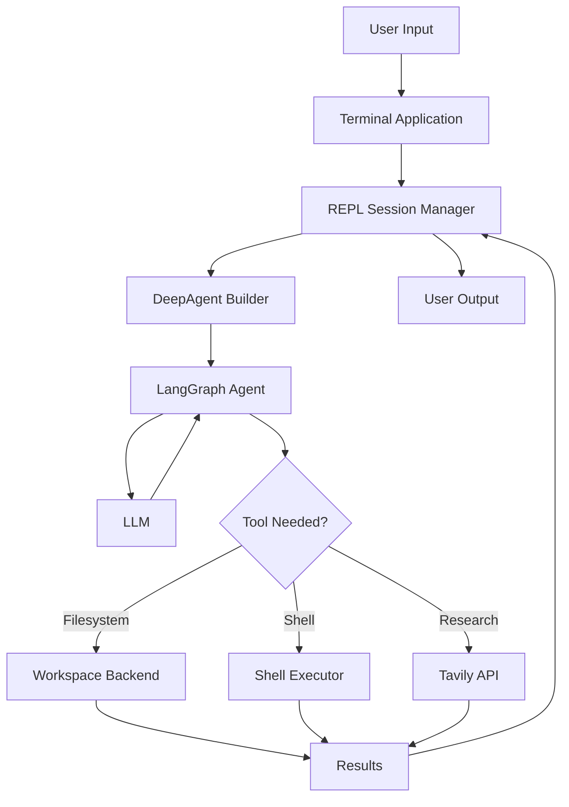
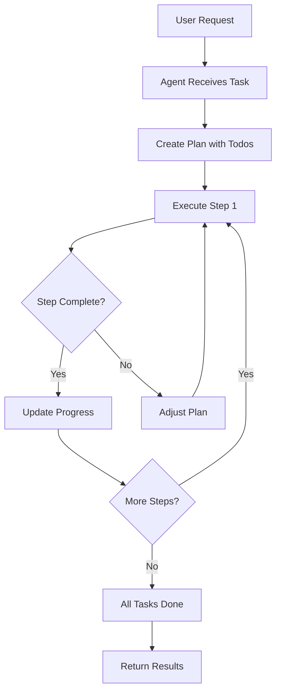
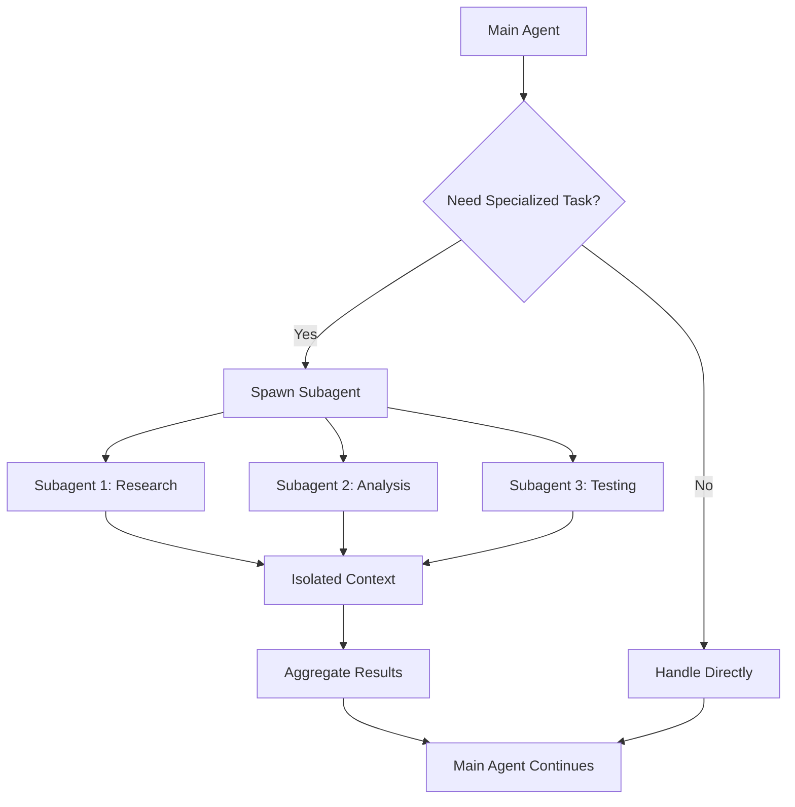
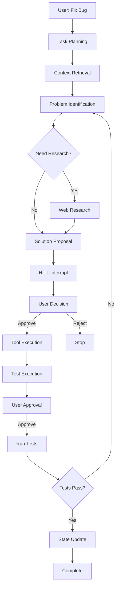
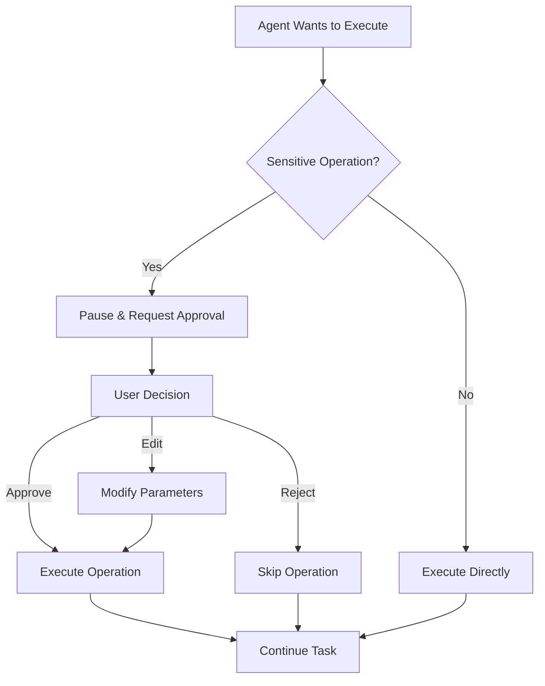

# DeepAgent - Trình bày

## Slide 1: Giới thiệu

### DeepAgent là gì?

- **DeepAgent** là một autonomous AI agent framework với khả năng:
  - **Task Planning & Reasoning**: Phân rã và lập kế hoạch cho các tác vụ phức tạp, multi-step
  - **Context Management**: Quản lý context window lớn thông qua filesystem-based memory
  - **Agent Orchestration**: Ủy thác công việc cho specialized subagents với context isolation
  - **Long-term Memory**: Persistent memory và state management qua nhiều conversation turns
  - **Tool Calling**: Extensible tool ecosystem cho filesystem, shell execution, web research

- **DeepAgent Runner**: Production-ready terminal application
  - Cross-platform agent execution (Linux, Windows)
  - Workspace sandboxing với boundary enforcement
  - Human-in-the-loop (HITL) interrupt mechanism cho safety
  - Session persistence với checkpointer-based state management

**Mục tiêu:** Autonomous agent orchestration cho complex, multi-step tasks với human oversight và safety guarantees.

---

## Slide 2: Kiến trúc và Tech Stack

### Core Stack

**AI/Agent Framework:**
- Built trên LangGraph (stateful graph execution) và LangChain (LLM orchestration)
- Multi-LLM provider support (OpenAI, Anthropic, etc.)
- Stateful execution với checkpointer-based memory management

**Agent Orchestration:**
- LangGraph StateGraph cho agent state management
- Tool calling framework với function calling
- Planning middleware cho task decomposition
- Subagent spawning với context isolation

**Memory & Context:**
- Filesystem-based context offloading
- Checkpointer cho persistent state
- Context window management
- Long-term memory storage

**Optional Capabilities:**
- Web research integration (Tavily API)
- Vision capabilities (multimodal LLM integration)

---

## Slide 3: Core Capabilities

### Agent Intelligence Features

**1. Task Planning & Reasoning**
- Hierarchical task decomposition với built-in planning middleware
- Dynamic plan adjustment dựa trên execution feedback
- Todo-based progress tracking và state management

**2. Context Window Management**
- Filesystem-based context offloading để tránh token limits
- Workspace sandboxing với path validation
- Efficient context retrieval và caching strategies

**3. Tool Calling Ecosystem**
- Filesystem tools: ls, read_file, write_file, edit_file, glob, grep
- Shell execution với cross-platform support
- Auto-detection của programming languages và frameworks
- Extensible tool framework cho custom integrations

**4. Web Research & Information Retrieval**
- Tavily API integration cho real-time web search
- Documentation và tutorial retrieval
- Best practices và pattern discovery

**5. Agent Orchestration & Subagents**
- Subagent spawning với isolated context spaces
- Specialized subagents cho domain-specific tasks
- Parallel subagent execution với result aggregation

**6. Human-in-the-Loop (HITL) Interrupts**
- Interrupt mechanism cho sensitive operations
- User decision points: approve, edit, reject
- Checkpointer-based state persistence cho HITL workflows

---

## Slide 4: Agent Orchestration & State Management

### Multi-Agent Architecture

**Agent Hierarchy:**
- **Main Agent**: Central orchestrator với planning và reasoning capabilities
- **Subagents**: Specialized agents cho specific domains hoặc tasks
- **Context Isolation**: Mỗi subagent có isolated context space
- **Result Aggregation**: Subagent results được aggregated vào main agent

**State Management:**
- **Checkpointer**: Persistent state storage cho conversation history
- **Session Persistence**: Resume conversations sau khi restart
- **Multi-session Support**: Concurrent sessions với isolated state
- **State Transitions**: LangGraph-based state machine cho agent flow

**Memory Architecture:**
- **Short-term Memory**: In-conversation context trong LLM
- **Long-term Memory**: Filesystem-based storage cho large context
- **Working Memory**: Active state trong checkpointer
- **Context Retrieval**: Efficient lookup và retrieval mechanisms

---

## Slide 5: Use Cases & Applications

### Khi nào sử dụng DeepAgent?

**Ideal Use Cases:**
- ✅ **Complex Multi-step Tasks**: Tasks requiring hierarchical planning và reasoning
- ✅ **Large Context Management**: Codebases với nhiều files, complex dependencies
- ✅ **Agent Orchestration**: Tasks cần specialized subagents với context isolation
- ✅ **Long-term Memory**: Conversations requiring persistent state across sessions
- ✅ **Code Intelligence**: Static analysis, refactoring, bug detection và fixing
- ✅ **Project Automation**: Setup, initialization, và configuration management
- ✅ **Documentation Generation**: Automated documentation với research capabilities
- ✅ **Testing & Validation**: Test generation, execution, và validation workflows

**Not Suitable For:**
- ❌ Simple single-step tasks
- ❌ Single tool call operations
- ❌ Tasks không cần planning hoặc context management

**Comparison với Alternatives:**
- **LangChain create_agent**: Simpler agent cho basic tool calling
- **Custom LangGraph**: Full control cho specialized workflows
- **DeepAgent**: Pre-built planning, orchestration, và memory management

**Real-world Applications:**
- Large-scale codebase refactoring
- Multi-file bug fixing với research
- Automated documentation với web research
- Project scaffolding với best practices

---

## Slide 6: Agent Execution Workflow

### Multi-step Task Execution với Planning

**Scenario:** Bug fixing trong large codebase

**Agent Reasoning Workflow:**
1. **Task Reception**: User request → Agent receives complex task
2. **Planning Phase**: Hierarchical task decomposition với todo creation
3. **Context Retrieval**: File reading và codebase analysis
4. **Problem Identification**: Bug detection với code analysis
5. **Research Phase**: Web research cho solutions (nếu needed)
6. **Solution Proposal**: Fix proposal với HITL interrupt
7. **User Decision**: Approve/edit/reject mechanism
8. **Execution**: Apply fix với tool calling
9. **Validation**: Test execution với verification
10. **Completion**: State update và todo marking

**Key Features:**
- **Planning & Reasoning**: Hierarchical task decomposition
- **Context Management**: Efficient file và codebase analysis
- **HITL Safety**: User control tại critical decision points
- **State Persistence**: Checkpointer-based state management

---

## Slide 7: System Architecture

### Agent Architecture & Components

**Architectural Layers:**
1. **Terminal Interface**: CLI với rich UI cho user interaction
2. **Session Manager**: Conversation persistence và state management
3. **Agent Builder**: DeepAgent construction với tool integration
4. **Workspace Backend**: Sandboxed filesystem operations
5. **Shell Executor**: Cross-platform command execution
6. **LangGraph StateGraph**: State machine cho agent orchestration
7. **LLM Layer**: Multi-provider LLM integration (OpenAI, Anthropic)

**Core Components:**
- **Planning Middleware**: Hierarchical task decomposition và todo management
- **Filesystem Tools**: Context offloading tools (ls, read_file, write_file, edit_file, glob, grep)
- **Custom Tool Ecosystem**: execute_cmd, read_image (vision), tavily_research
- **HITL Middleware**: Interrupt mechanism cho sensitive operations
- **Checkpointer**: Persistent state storage cho conversation history
- **Memory System**: Long-term memory với filesystem-based storage

**Flow:**
- User input → Session Manager → Agent Builder → LangGraph Agent → LLM
- Agent actions → Workspace Backend / Shell Executor → Results → User

---

## Slide 8: Safety & Security Architecture

### Security Mechanisms

**Workspace Sandboxing:**
- ✅ **Path Validation**: Prevent directory traversal attacks
- ✅ **Boundary Enforcement**: Strict workspace isolation
- ✅ **Access Control**: No filesystem access outside workspace
- ✅ **Safe Operations**: Validated file operations với error handling

**Human-in-the-Loop (HITL) Interrupts:**
- ✅ **Interrupt Mechanism**: Pause execution tại sensitive operations
- ✅ **Decision Points**: User approval/edit/reject cho critical actions
- ✅ **Parameter Editing**: Modify tool parameters trước khi execution
- ✅ **Full Control**: User oversight cho tất cả destructive operations

**Security Best Practices:**
- ✅ **API Key Management**: Environment-based secrets, never logged
- ✅ **Error Handling**: Graceful failures, no sensitive data exposure
- ✅ **Timeout Protection**: Resource limits và execution timeouts
- ✅ **Input Validation**: All inputs validated trước khi processing

**Security Guarantees:**
- **Sandbox Isolation**: Complete workspace boundary enforcement
- **HITL Safety**: Human oversight tại all critical decision points
- **State Integrity**: Checkpointer-based state validation
- **Resource Limits**: Timeout và memory constraints

---

## Slide 9: Comparison với Alternatives

### DeepAgent vs Other Agent Frameworks

**vs LangChain `create_agent`:**
- ✅ **DeepAgent**: Built-in planning, filesystem tools, subagent orchestration
- ✅ **create_agent**: Simpler architecture, faster cho basic tool calling
- → **DeepAgent**: Complex multi-step tasks với planning requirements
- → **create_agent**: Simple single-step tool calling tasks

**vs Custom LangGraph:**
- ✅ **DeepAgent**: Pre-built planning middleware, filesystem integration, subagents
- ✅ **Custom LangGraph**: Full control, domain-specific workflows
- → **DeepAgent**: General-purpose agent orchestration
- → **Custom LangGraph**: Specialized use cases với custom logic

**vs Claude Code / GitHub Copilot:**
- ✅ **DeepAgent**: Open-source, fully customizable, local execution
- ✅ **Claude Code**: IDE-integrated, proprietary, cloud-based
- → **DeepAgent**: Custom workflows, local control, extensibility
- → **Claude Code**: IDE convenience, cloud-based execution

**vs AutoGPT / BabyAGI:**
- ✅ **DeepAgent**: Structured planning, controlled execution, HITL safety
- ✅ **AutoGPT**: More autonomous, less controlled, experimental
- → **DeepAgent**: Production-ready, safe automation
- → **AutoGPT**: Experimental, fully autonomous tasks

**Key Differentiators:**
- **Planning & Reasoning**: Built-in hierarchical task decomposition
- **Context Management**: Filesystem-based context offloading
- **Agent Orchestration**: Subagent spawning với context isolation
- **Safety**: HITL interrupts và workspace sandboxing
- **State Management**: Checkpointer-based persistent state

---

## Slide 10: Kết luận

### Tóm tắt

**DeepAgent Framework:**
- **Autonomous AI Agent Framework** cho complex, multi-step tasks
- **Built-in Capabilities**: Planning & reasoning, context management, agent orchestration
- **Production-ready**: Cross-platform terminal application với safety guarantees
- **Safety First**: Human-in-the-loop interrupts và workspace sandboxing

**Ideal Use Cases:**
- Complex multi-step tasks requiring hierarchical planning
- Large context management (codebases, documentation)
- Agent orchestration với specialized subagents
- Long-term memory requirements across sessions

**Key Differentiators:**
- ✅ **Planning & Reasoning**: Hierarchical task decomposition
- ✅ **Context Management**: Filesystem-based context offloading
- ✅ **Agent Orchestration**: Subagent spawning với context isolation
- ✅ **Safety**: HITL interrupts và workspace sandboxing
- ✅ **State Management**: Checkpointer-based persistent state
- ✅ **Extensibility**: Custom tools, subagents, system prompts, backends

**Technical Highlights:**
- LangGraph-based state machine cho agent orchestration
- Multi-LLM provider support (OpenAI, Anthropic)
- Extensible tool calling ecosystem
- Checkpointer-based memory management
- Cross-platform execution với workspace isolation

**Applications:**
- Code intelligence: analysis, refactoring, bug fixing
- Project automation: setup, initialization, configuration
- Documentation generation với web research
- Testing & validation workflows

---

## End of Presentation

**Thank you!**

Questions? Let's discuss! 🚀
