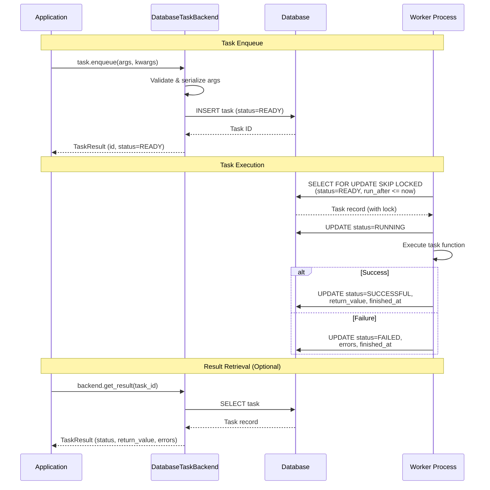

# django-database-task

A database-backed task queue backend for Django 6.0's built-in task framework.

## Features

- **No external dependencies** - Uses your existing database, no Redis or message broker required
- **Priority support** - Tasks can have priorities from -100 to 100
- **Delayed execution** - Schedule tasks to run at a specific time with `run_after`
- **Exclusive locking** - Prevents duplicate task execution with `SELECT FOR UPDATE SKIP LOCKED`
- **Django Admin integration** - View and manage tasks from the admin interface
- **Async support** - Supports async task functions

## Architecture



## Requirements

- Python 3.12+
- Django 6.0+

### Supported Databases

Django 6.0 officially supports the following database versions:

| Database | Minimum Version | Notes |
|----------|-----------------|-------|
| PostgreSQL | 14+ | Recommended for production. Full `SELECT FOR UPDATE SKIP LOCKED` support. |
| MySQL | 8.0.11+ | Full `SELECT FOR UPDATE SKIP LOCKED` support. |
| MariaDB | 10.6+ | Full `SELECT FOR UPDATE SKIP LOCKED` support. |
| SQLite | 3.31.0+ | Works for development/testing, but no row-level locking. |
| Oracle | 19c+ | Supported but not tested with this package. |

**Note**: `SELECT FOR UPDATE SKIP LOCKED` is used to prevent duplicate task execution in multi-worker environments. SQLite does not support row-level locking, so it is only recommended for development or single-worker deployments.

## Installation

```bash
pip install django-database-task
```

## Quick Start

### 1. Add to INSTALLED_APPS

```python
INSTALLED_APPS = [
    # ...
    'django_database_task',
]
```

### 2. Configure the task backend

```python
TASKS = {
    'default': {
        'BACKEND': 'django_database_task.backends.DatabaseTaskBackend',
        'QUEUES': [],  # Empty list means all queues
        'OPTIONS': {},
    },
}
```

### 3. Run migrations

```bash
python manage.py migrate django_database_task
```

### 4. Define a task

```python
from django.tasks import task

@task
def send_welcome_email(user_id):
    user = User.objects.get(id=user_id)
    # Send email...
    return f"Email sent to {user.email}"
```

### 5. Enqueue the task

```python
result = send_welcome_email.enqueue(user_id=123)
print(f"Task ID: {result.id}")
```

### 6. Run the worker

```bash
# Run once (exit when no tasks)
python manage.py run_database_tasks

# Run continuously (poll every 5 seconds)
python manage.py run_database_tasks --continuous --interval 5
```

## Usage

### Important: JSON-Serializable Parameters

Task arguments, keyword arguments, and return values **must be JSON-serializable**.

Supported types:
- `str`, `int`, `float`, `bool`, `None`
- `dict` (with JSON-serializable keys and values)
- `list`, `tuple` (with JSON-serializable elements)
- `bytes` (UTF-8 decodable only)

**Not supported** (will raise `TypeError`):
- `datetime`, `date`, `time` - convert to ISO string: `dt.isoformat()`
- `UUID` - convert to string: `str(uuid)`
- `Decimal` - convert to float or string
- Custom objects - serialize manually

```python
from django.tasks import task

# ❌ This will raise TypeError
@task
def bad_task(user_id, created_at):
    pass
bad_task.enqueue(123, datetime.now())  # TypeError!

# ✅ Convert to JSON-serializable types
@task
def good_task(user_id, created_at_iso):
    created_at = datetime.fromisoformat(created_at_iso)
    # ...
good_task.enqueue(123, datetime.now().isoformat())  # OK
```

### Task with priority

```python
@task(priority=10)  # Higher priority, runs first
def urgent_task():
    pass

@task(priority=-10)  # Lower priority
def background_task():
    pass
```

### Delayed execution

```python
from datetime import timedelta
from django.utils import timezone

# Run 1 hour from now
delayed_task = my_task.using(run_after=timezone.now() + timedelta(hours=1))
result = delayed_task.enqueue()
```

### Task with context

```python
@task(takes_context=True)
def task_with_context(context, message):
    task_id = context.task_result.id
    attempt = context.attempt
    return f"Task {task_id} (attempt {attempt}): {message}"
```

### Async tasks

```python
@task
async def fetch_data(url):
    async with aiohttp.ClientSession() as session:
        async with session.get(url) as response:
            return await response.text()

# Enqueue like normal tasks
result = fetch_data.enqueue("https://example.com/api")
```

### Queue-specific tasks

```python
@task(queue_name="emails")
def send_newsletter():
    pass

# Run worker for specific queue
# python manage.py run_database_tasks --queue emails
```

## Management Commands

### run_database_tasks

Execute tasks queued in the database.

```bash
python manage.py run_database_tasks [options]
```

| Option | Description |
|--------|-------------|
| `--queue` | Queue name to process (all queues if not specified) |
| `--backend` | Backend name (default: "default") |
| `--continuous` | Keep polling even when no tasks |
| `--interval` | Polling interval in seconds (default: 5) |
| `--max-tasks` | Maximum number of tasks to process (0=unlimited) |

### purge_completed_database_tasks

Delete completed task records from the database.

```bash
python manage.py purge_completed_database_tasks [options]
```

| Option | Description |
|--------|-------------|
| `--days` | Delete tasks completed more than N days ago (0=all) |
| `--status` | Target statuses, comma-separated (default: "SUCCESSFUL,FAILED") |
| `--batch-size` | Number of tasks to delete at once (default: 1000) |
| `--dry-run` | Show count only without deleting |

## Programmatic API

You can also process tasks programmatically without management commands:

```python
from django_database_task import process_one_task, process_tasks, get_pending_task_count

# Process a single task
result = process_one_task()
if result:
    print(f"Processed: {result.id}, status: {result.status}")

# Process multiple tasks
results = process_tasks(max_tasks=10)
print(f"Processed {len(results)} tasks")

# Process tasks from a specific queue
results = process_tasks(queue_name="emails", max_tasks=5)

# Get pending task count
count = get_pending_task_count()
print(f"Pending tasks: {count}")
```

## HTTP Endpoints (Optional)

For environments where cron or direct command execution is not available
(e.g., serverless, PaaS), you can use HTTP endpoints to trigger task processing.

### Setup

Include the URLs in your project:

```python
# urls.py
from django.urls import path, include

urlpatterns = [
    path("tasks/", include("django_database_task.urls")),
]
```

### Available Endpoints

| Endpoint | Method | Description |
|----------|--------|-------------|
| `/tasks/run/` | POST | Process multiple pending tasks |
| `/tasks/run-one/` | POST | Process a single pending task |
| `/tasks/status/` | GET | Get pending task count |

### Request Parameters

#### POST `/tasks/run/`

| Parameter | Type | Default | Description |
|-----------|------|---------|-------------|
| `max_tasks` | int | 10 | Maximum tasks to process (1-100) |
| `queue_name` | string | null | Filter by queue name |
| `backend_name` | string | "default" | Task backend name |

Response:
```json
{
  "processed": 3,
  "results": [
    {"id": "uuid", "status": "SUCCESSFUL", "task_path": "myapp.tasks.send_email"},
    {"id": "uuid", "status": "FAILED", "task_path": "myapp.tasks.process_data"}
  ]
}
```

#### POST `/tasks/run-one/`

| Parameter | Type | Default | Description |
|-----------|------|---------|-------------|
| `queue_name` | string | null | Filter by queue name |
| `backend_name` | string | "default" | Task backend name |

Response:
```json
{"processed": true, "result": {"id": "uuid", "status": "SUCCESSFUL", "task_path": "..."}}
```
or
```json
{"processed": false, "result": null}
```

#### GET `/tasks/status/`

| Parameter | Type | Default | Description |
|-----------|------|---------|-------------|
| `queue_name` | string | null | Filter by queue name |
| `backend_name` | string | "default" | Task backend name |

Response:
```json
{"pending_count": 5}
```

### Example Usage

```bash
# Process up to 10 tasks
curl -X POST http://localhost:8000/tasks/run/ \
  -H "Content-Type: application/json" \
  -d '{"max_tasks": 10}'

# Process tasks from a specific queue
curl -X POST http://localhost:8000/tasks/run/ \
  -H "Content-Type: application/json" \
  -d '{"queue_name": "emails", "max_tasks": 5}'

# Get pending task count
curl http://localhost:8000/tasks/status/
```

### Use Cases

#### Cloud Scheduler / Cron Job

Call the endpoint periodically to process tasks:

```bash
# Every minute via cron or Cloud Scheduler
curl -X POST https://your-app.com/tasks/run/ \
  -H "Authorization: Bearer $TOKEN" \
  -H "Content-Type: application/json" \
  -d '{"max_tasks": 50}'
```

#### Webhook Trigger

Trigger task processing after an event:

```python
# In your webhook handler
import requests

def handle_webhook(request):
    # ... process webhook ...

    # Trigger background task processing
    requests.post(
        "http://localhost:8000/tasks/run/",
        json={"max_tasks": 10}
    )
```

#### Health Check with Task Status

Monitor pending task count:

```bash
# Alert if too many pending tasks
count=$(curl -s http://localhost:8000/tasks/status/ | jq '.pending_count')
if [ "$count" -gt 100 ]; then
  echo "Warning: $count pending tasks"
fi
```

### Security

The endpoints are CSRF-exempt for API/webhook use. **Always add authentication in production:**

```python
from django.contrib.admin.views.decorators import staff_member_required
from django_database_task.views import RunTasksView, RunOneTaskView, TaskStatusView

urlpatterns = [
    path(
        "tasks/run/",
        staff_member_required(RunTasksView.as_view()),
        name="run_tasks",
    ),
    path(
        "tasks/run-one/",
        staff_member_required(RunOneTaskView.as_view()),
        name="run_one_task",
    ),
    path(
        "tasks/status/",
        staff_member_required(TaskStatusView.as_view()),
        name="task_status",
    ),
]
```

Or use token-based authentication:

```python
from django.http import HttpResponseForbidden
from django.conf import settings

def require_api_token(view_func):
    def wrapper(request, *args, **kwargs):
        token = request.headers.get("Authorization", "").replace("Bearer ", "")
        if token != settings.TASK_API_TOKEN:
            return HttpResponseForbidden("Invalid token")
        return view_func(request, *args, **kwargs)
    return wrapper

urlpatterns = [
    path("tasks/run/", require_api_token(RunTasksView.as_view())),
]
```

## Django Admin

The package includes a Django Admin integration to view task status:

- Task list with status badges
- Filter by status, queue, backend
- Search by task ID or path
- View task arguments and results

## License

MIT License - see [LICENSE](LICENSE) for details.
