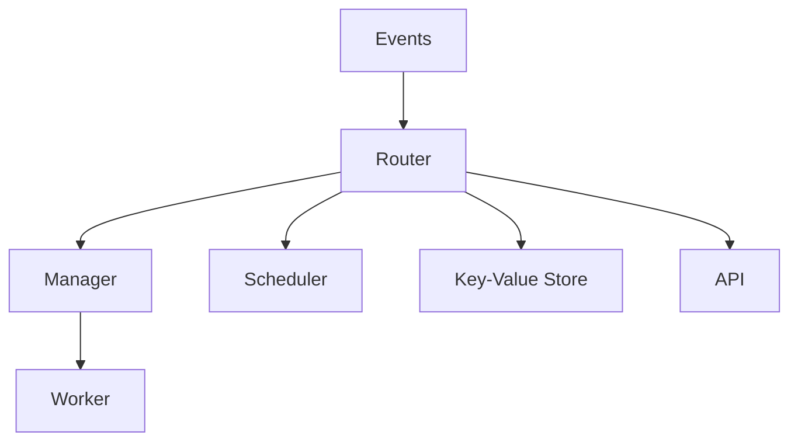

# EDRI Event Driven Routing Infrastructure

## Origin and Intention
The Event Driven Routing Infrastructure (EDRI) aims to simplify the development of parallel and distributed applications. 
It allows developers to efficiently run code across multiple threads, processes, or even machines by leveraging an event-driven architecture. 
EDRI differs from traditional frameworks by emphasizing flexibility and scalability, enabling the development of systems that can handle complex workflows with ease.
The framework is designed to handle dynamic, real-time data processing and communication through the use of well-defined events. 
It is ideal for applications that require high throughput, low latency, and the ability to scale horizontally across distributed systems.

### Event Driven
Everything that individual workers need to perform must be controlled and managed in some way.
In this context, [`Events`](docs/event.md) serve this purpose;
they are physically represented by messages that are forwarded between different elements.
### Routing Infrastructure
The exchange and delivery of [`Events`](docs/event.md) are ensured similarly to computer networks TCP/IP.
In this case, however, networks (IP ranges) are replaced with types of [`Event`](docs/event.md), such as file upload.
The router must know to whom each [`Event`](docs/event.md) is intended.

## Architecture

[Want to know more about architecture?](docs/architecture.md)

### Glossary of Terms

- **Event**: A data packet representing a message or request within the system.
- **Router**: The component responsible for directing events to the appropriate recipients.
- **Manager**: Handles and distributes tasks to workers and manages event lifecycles.
- **Worker**: A unit that performs specific tasks or operations.
- **API**: Interfaces that facilitate communication and event handling within the system.

### Events
[`Events`](docs/event.md) are data packets created using Python data classes to enable communication between multiple senders and recipients.
They can be notifications, requests, or tunnels, each serving a specific communication purpose.
[`Events`](docs/event.md) are strictly defined to ensure clarity, and they can carry [`Responses`](docs/response.md) or simply announce actions.

[Want to know more about Event?](docs/event.md)

### Router

The `Router` is the central element responsible for forwarding [`Events`](docs/event.md) between the framework's components, typically managers.
It can also be the only element, which can be connected to the `Switch` using a `Connector`, this connection is made via a TCP/IP socket, thus
it is possible to parallelize tasks on multiple computing nodes.
Connection to the `Switch` is cached, ensuring that short-term network outages (lasting seconds) do not disrupt operations.

#### Connector

The Connector is a specialized component of the `Router` that ensures the connection between the `Router` and the `Switch`.
It plays a crucial role in bridging internal communication with external networks.
It takes care of bridging the traffic between internal inter-processor communication and TCP/IP connection.
Furthermore, it ensures the distribution of routed [`Events`](docs/event.md) to other routers and vice versa.
Last but not least, it takes care of ensuring the continuity of sent [`Events`](docs/event.md) -
so that no [`Event`](docs/event.md) is omitted or sent multiple times in case of a connection interruption.

### Manager

An element serving to distribute tasks contained in the transmitted [`Events`](docs/event.md) to individual workers.
The manager automatically supports running three types of tasks as methods, threads and processes.
The manager is also the element that ensures the transfer of data for individual tunnels.
The manager must inform the router of all types of [`Events`](docs/event.md) it would like to receive.
In essence, it must subscribe to their delivery.

[Want to know more about Manager?](docs/manager.md)

#### Scheduler

A special manager used for time-defined [`Event`](docs/event.md) sending.
An example could be backup during night hours.

[Want to know more about Scheduler?](docs/manager.md#scheduler)

#### Key-Value Store

A special manager that allows the use of a built-in key-value store used for time-defined [`Event`](docs/event.md) sending.
For example, after starting data download, the data are cached using the store and periodically updated by the scheduler.

[Want to know more about Key-Value Store?](docs/manager.md#key-value-store)

### Worker

A class defined by the programmer serving to perform a task.

[Want to know more about Worker?](docs/worker.md)

### API

The API serves as the interface between clients and the EDRI system.
It converts incoming client requests into [`Events`](docs/event.md),
which are then processed by the system.
After processing, the API returns responses to the clients.

**Features:**

- Supports dynamic content generation.
- Manages event-based interactions, including both request-type and notification-type [`Events`](docs/event.md).
- Ensures real-time communication between the server and clients.

[Want to know more about API?](docs/api.md)
[Want to know more about API Event?](docs/api_event.md)
