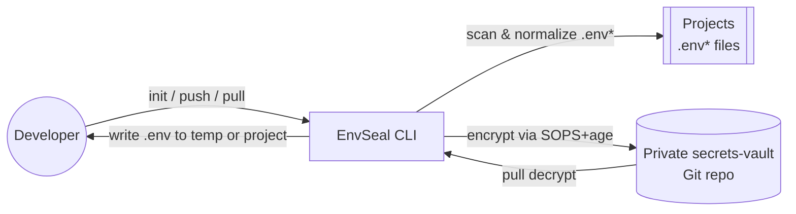
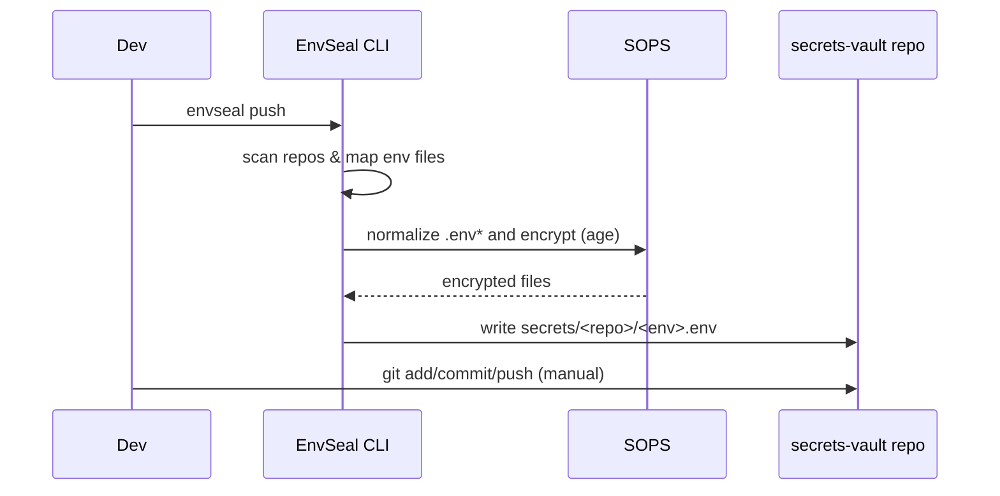

<div align="center">

# 🔐 EnvSeal

**Secure, centralized environment variable management for the AI coding era**

[](https://www.python.org/downloads/)
[](https://pypi.org/project/envseal-vault/)
[](LICENSE)
[](https://github.com/astral-sh/ruff)

[English](README.md) | [中文](README.zh-CN.md)

</div>

---

## 🤖 Why EnvSeal for AI Coding?

**The reality of AI-powered development: project explosion**

Working with Claude Code, Cursor, Gemini CLI, or Windsurf? You know the drill:
- 🚀 Today: 3 new demos
- 🎯 Tomorrow: 5 more repos
- 📂 Each one: `.env`, `.env.dev`, `.env.prod`

**Then what happens?**

- 💔 **Migration Pain**: Switching machines? The hardest part isn't code—it's "where are all those .env files?"
- 🔀 **Sync Chaos**: Updated `DATABASE_URL` in project A, forgot about project B
- ⚠️ **Leakage Risk**: AI screenshots, logs, and shares easily expose secrets
- 🚫 **Onboarding Nightmare**: New developer clones in 30 seconds, spends 3 hours hunting for credentials

**EnvSeal's Solution:**
```
Scan repos → Normalize .env → Encrypt with SOPS → Unified Git vault → One-command recovery
```

## 📖 What is EnvSeal?

EnvSeal is a CLI tool that helps you manage `.env` files across multiple repositories with **end-to-end encryption**. It scans your projects, normalizes environment files, and syncs them to a Git-backed vault using SOPS encryption.

**Key Benefits:**
- 🔒 **Secure**: SOPS + age encryption (modern, battle-tested)
- 📦 **Centralized**: One vault for all secrets across unlimited projects
- 🔍 **Safe Diffs**: Key-only diffs never expose values
- 🔄 **Version Control**: Full Git history for audit and rollback
- 🚀 **Simple**: One command to sync everything
- 💻 **Multi-Device**: Restore entire dev environment in minutes

## 🧭 Architecture at a Glance



## 🎯 Use Cases

- 🤖 **AI Coding / Vibe Coding**: Using Claude Code/Cursor? Manage 10+ projects without env chaos
- 💻 **Multi-Device Development**: Work laptop ↔ Home desktop ↔ GitHub Codespaces
- 🔄 **Environment Migration**: New machine? One command restores all project secrets
- 👥 **Team Collaboration**: Share secrets securely via private vault (supports multiple age keys)
- 🔐 **Secret Rotation**: Git history tracks "who changed what key and why"

## ⚡ Quick Start

### 📋 Complete First-Time Setup (Beginner-Friendly)

**Step 1: Create Your Secrets Vault Repository**

1. Go to GitHub and create a **new private repository**
   - Repository name suggestions: `secrets-vault` or `my-secrets`
   - ⚠️ **Must be Private**
   - Don't add README, .gitignore, etc. (create empty repo)

2. Clone it locally:
   ```bash
   # Replace USERNAME with your GitHub username
   # Replace secrets-vault with your repository name
   cd ~/Github  # Or wherever you keep your code
   git clone git@github.com:USERNAME/secrets-vault.git
   ```

**Step 2: Locate Your "Projects Root Directory"**

This is the **folder that contains all your projects**, for example:
```
~/Github/                    ← This is your "root directory"
├── my-api/                 ← Project 1 (has .env files)
├── my-web/                 ← Project 2 (has .env files)
├── my-worker/              ← Project 3 (has .env files)
└── secrets-vault/          ← Your vault repo you just created
```

**Step 3: Install and Initialize EnvSeal**

Continue with the steps below 👇

### Prerequisites

```bash
# macOS
brew install age sops

# Verify installation
age-keygen --version
sops --version
```

### Installation

```bash
# Install with pipx (recommended)
pipx install envseal-vault

# Or with pip
pip install envseal-vault

# Verify
envseal --version
```

### Initialize

```bash
# Navigate to your "projects root directory" (the folder containing all your projects)
cd ~/Github  # Replace with your actual directory, e.g., ~/projects or ~/code

# Run initialization
envseal init
```

During initialization, it will:
1. ✅ Generate an age encryption key
2. 🔍 Scan current directory for all Git repositories (finds my-api, my-web, etc.)
3. 📝 Create configuration at `~/.config/envseal/config.yaml`
4. 🗂️ Ask for your vault path (enter: `~/Github/secrets-vault`)

### Sync Secrets

```bash
# Push all .env files to vault (encrypted)
envseal push

# Commit to YOUR secrets vault (the private repo you created)
cd ~/Github/secrets-vault  # Your vault repo, NOT the envseal tool repo
git add .
git commit -m "Add encrypted secrets"
git push
```

### Check Status

```bash
envseal status
```

**Output:**
```
📊 Checking secrets status...

my-project
  ✓ .env       - up to date
  ⚠ .env.prod  - 3 keys changed

api-service
  + .env       - new file (not in vault)
  ✓ .env.prod  - up to date
```

### Update Changed Secrets (Interactive)

```bash
# Interactively select and update changed secrets
envseal update

# Only show changes for specific environment
envseal update --env prod
```

The `update` command will:
1. Scan all repositories for changed .env files
2. Show an interactive selection menu
3. Let you choose which repos to update
4. Push selected changes to the vault
5. Show next steps for git commit/push

## 📚 Commands

| Command | Description | Options |
|---------|-------------|---------|
| `envseal init` | Initialize configuration and generate keys | `--root DIR` |
| `envseal push [repos...]` | Encrypt and push secrets to vault | `--env ENV` |
| `envseal status` | Show sync status for all repos | - |
| `envseal update` | Interactively update changed secrets to vault | `--env ENV` |
| `envseal diff REPO` | Show key-only changes | `--env ENV` |
| `envseal pull REPO` | Decrypt and pull from vault | `--env ENV`, `--replace`, `--stdout` |

## 🔄 Push / Status Flow (Key-Only)



## 🚀 New Machine? Restore Everything in 10 Minutes

Just 4 steps:
1. 📋 Copy age private key (from password manager)
2. 📦 Clone your secrets vault repository
3. 🔧 Install EnvSeal: `pipx install envseal-vault`
4. ⬇️ Pull secrets: `envseal pull <project> --env <environment> --replace`

See detailed steps in the "Multi-Device Setup" section below 👇

## 🔐 Security

**Age Key Management:**
- **Private key**: `~/Library/Application Support/sops/age/keys.txt` (macOS), `~/.config/sops/age/keys.txt` (Linux), `~/AppData/Local/sops/age/keys.txt` (Windows) (NEVER commit!)
- **Public key**: Stored in `vault/.sops.yaml` (safe to commit)

**Backup Your Private Key:**
```bash
# Display full key file
cat ~/Library/Application\ Support/sops/age/keys.txt

# Save to password manager (1Password, Bitwarden, etc.)
```

Linux/Windows users: use the OS-specific key path listed in Age Key Management.

⚠️ **Critical**: Losing your private key = permanent data loss!

**Vault Repository Best Practices:**
- ✅ Keep vault repository **private** (even though files are encrypted)
- ✅ Enable branch protection and require PR reviews
- ✅ Use GitHub's secret scanning push protection
- ✅ Backup private key in password manager

See [SECURITY.md](SECURITY.md) for complete security model.

## 🌍 Multi-Device Setup

**Two repositories you need to know:**
- 📦 **EnvSeal tool**: `chicogong/envseal` (this repo - install via PyPI, no need to clone)
- 🔐 **Your secrets vault**: `USERNAME/my-secrets-vault` (your private repo for encrypted .env files)

**On a new machine:**

1. Copy your age key from backup:
   ```bash
   mkdir -p ~/Library/Application\ Support/sops/age/
   nano ~/Library/Application\ Support/sops/age/keys.txt
   # Paste the 3-line key file (created, public key, private key)
   chmod 600 ~/Library/Application\ Support/sops/age/keys.txt
   ```
   Linux/Windows users: use the OS-specific key path listed in Security.

2. Clone YOUR secrets vault and install EnvSeal tool:
   ```bash
   # Clone YOUR vault (NOT the envseal tool repo)
   git clone git@github.com:USERNAME/my-secrets-vault.git ~/Github/secrets-vault

   # Install EnvSeal tool from PyPI
   pipx install envseal-vault
   envseal init
   ```

3. Pull secrets:
   ```bash
   envseal pull my-project --env prod --replace
   ```

## 📁 Configuration

**Location**: `~/.config/envseal/config.yaml`

```yaml
vault_path: /path/to/secrets-vault
repos:
  - name: my-api
    path: /Users/you/projects/my-api
  - name: web-app
    path: /Users/you/projects/web-app
env_mapping:
  ".env": "local"
  ".env.dev": "dev"
  ".env.prod": "prod"
  ".env.staging": "staging"
scan:
  include_patterns:
    - ".env"
    - ".env.*"
  exclude_patterns:
    - ".env.example"
    - ".env.sample"
  ignore_dirs:
    - ".git"
    - "node_modules"
    - "venv"
```

## 🛠️ Development

**Only for contributing to EnvSeal tool itself:**

```bash
# Clone the EnvSeal TOOL repository (for development)
git clone https://github.com/chicogong/envseal.git
cd envseal

# Install with dev dependencies
pip install -e ".[dev]"

# Run tests
pytest

# Lint and format
make lint
make format

# Type check
make type-check
```

**Note**: Regular users don't need to clone this repo - just `pipx install envseal-vault`

## 📝 Documentation

- [USAGE.en.md](USAGE.en.md) - Complete usage guide (English)
- [USAGE.md](USAGE.md) - 完整使用指南（中文）
- [SECURITY.md](SECURITY.md) - Security model and best practices
- [PUBLISHING.md](PUBLISHING.md) - Guide for publishing to PyPI

## 🤝 Contributing

Contributions welcome! Please feel free to submit a Pull Request.

## 📄 License

Apache-2.0 License - see [LICENSE](LICENSE) for details.

---

<div align="center">

**Built for developers navigating the AI coding era**

[PyPI](https://pypi.org/project/envseal-vault/) · [Report Bug](https://github.com/chicogong/envseal/issues) · [Request Feature](https://github.com/chicogong/envseal/issues)

</div>
