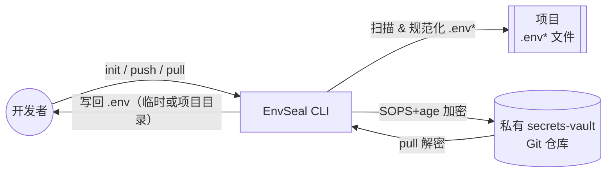
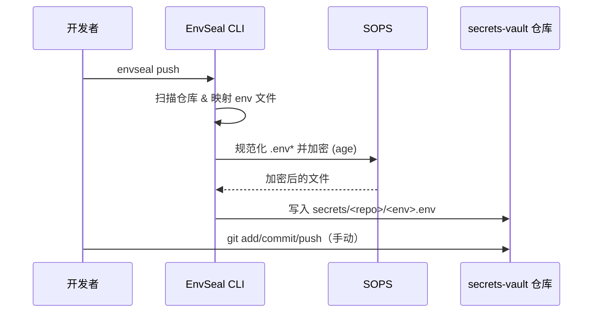

<div align="center">

# 🔐 EnvSeal

**AI 编程时代的安全、集中式环境变量管理工具**

[](https://www.python.org/downloads/)
[](https://pypi.org/project/envseal-vault/)
[](LICENSE)
[](https://github.com/astral-sh/ruff)

[English](README.md) | [中文](README.zh-CN.md)

</div>

---

## 🤖 为什么 AI Coding 特别需要 EnvSeal？

**AI 编程的常态：小项目爆炸式增长**

用 Claude Code、Cursor、Gemini CLI 或 Windsurf 写代码？你肯定懂：
- 🚀 今天：起 3 个 demo
- 🎯 明天：再开 5 个 repo
- 📂 每个项目：`.env`、`.env.dev`、`.env.prod`

**然后呢？**

- 💔 **迁移痛苦**：换电脑/重装系统，最难的不是代码，是"那些 env 到底在哪、哪个是最新"
- 🔀 **同步混乱**：在 A 项目改了 `DATABASE_URL`，B 项目忘了改
- ⚠️ **泄露风险**：AI 截图/日志/分享时，最容易把 secrets 一起带出去
- 🚫 **新人卡死**：拉代码 30 秒，配环境 3 小时

**EnvSeal 的解法：**
```
扫描项目 → 规范化 .env → SOPS 加密 → 统一 Git vault → 一键恢复
```

## 📖 EnvSeal 是什么？

EnvSeal 是一个 CLI 工具，帮助你**端到端加密**管理多个项目的 `.env` 文件。它会扫描你的项目，规范化环境变量文件，并使用 SOPS 加密同步到 Git 仓库（vault）中。

**核心优势：**
- 🔒 **安全加密**：使用 SOPS + age 加密（现代、经过实战检验）
- 📦 **集中管理**：一个 vault 管理无限项目的所有密钥
- 🔍 **安全 Diff**：只显示 key 名称，绝不暴露 value
- 🔄 **版本控制**：完整的 Git 历史，可审计、可回滚
- 🚀 **操作简单**：一条命令同步所有项目
- 💻 **多设备**：几分钟内恢复整个开发环境

## 🧭 架构示意



## 🎯 使用场景

- 🤖 **AI Coding / Vibe Coding**：用 Claude Code/Cursor？管理 10+ 项目不再混乱
- 💻 **多设备开发**：工作电脑 ↔ 家用电脑 ↔ GitHub Codespaces 无缝切换
- 🔄 **环境迁移**：新机器？一条命令恢复所有项目密钥
- 👥 **团队协作**：通过私有 vault 安全分享密钥（支持多 age key）
- 🔐 **密钥轮换**：用 Git 历史追踪"谁改了什么密钥、为什么改"

## ⚡ 快速开始

### 📋 首次使用完整流程（新手向）

**第一步：创建你的 secrets vault 仓库**

1. 打开 GitHub，创建一个**新的私有仓库**
   - 仓库名建议：`secrets-vault` 或 `my-secrets`
   - ⚠️ **必须设为 Private（私有）**
   - 不要添加 README、.gitignore 等文件（创建空仓库）

2. 克隆到本地：
   ```bash
   # 替换 USERNAME 为你的 GitHub 用户名
   # 替换 secrets-vault 为你刚创建的仓库名
   cd ~/Github  # 或你习惯存放代码的目录
   git clone git@github.com:USERNAME/secrets-vault.git
   ```

**第二步：找到你的"项目最上层目录"**

这是指**包含你所有项目的那个文件夹**，例如：
```
~/Github/                    ← 这就是"最上层目录"
├── my-api/                 ← 项目1（有 .env 文件）
├── my-web/                 ← 项目2（有 .env 文件）
├── my-worker/              ← 项目3（有 .env 文件）
└── secrets-vault/          ← 你刚创建的 vault 仓库
```

**第三步：安装并初始化 EnvSeal**

继续按下面的步骤操作 👇

### 安装依赖

```bash
# macOS
brew install age sops

# 验证安装
age-keygen --version
sops --version
```

### 安装 EnvSeal

```bash
# 使用 pipx 全局安装（推荐）
pipx install envseal-vault

# 或使用 pip
pip install envseal-vault

# 验证安装
envseal --version
```

### 初始化

```bash
# 进入你的"项目最上层目录"（就是包含所有项目的那个文件夹）
cd ~/Github  # 替换为你实际的目录，比如 ~/projects 或 ~/code

# 运行初始化
envseal init
```

初始化时会问你几个问题：
1. ✅ 生成 age 加密密钥
2. 🔍 扫描当前目录下的所有 Git 仓库（会自动找到 my-api、my-web 等项目）
3. 📝 创建配置文件 `~/.config/envseal/config.yaml`
4. 🗂️ 询问你的 vault 路径（输入：`~/Github/secrets-vault`）

### 同步密钥

```bash
# 推送所有 .env 文件到 vault（加密）
envseal push

# 提交到你的 secrets vault（你自己创建的私有仓库）
cd ~/Github/secrets-vault  # 你的 vault 仓库，不是 envseal 工具仓库
git add .
git commit -m "Add encrypted secrets"
git push
```

### 查看状态

```bash
envseal status
```

**输出示例：**
```
📊 Checking secrets status...

my-project
  ✓ .env       - 已同步
  ⚠ .env.prod  - 3 个 key 有变化

api-service
  + .env       - 新文件（未加入 vault）
  ✓ .env.prod  - 已同步
```

## 📚 命令列表

| 命令 | 说明 | 选项 |
|------|------|------|
| `envseal init` | 初始化配置并生成密钥 | `--root DIR` |
| `envseal push [repos...]` | 加密并推送 secrets 到 vault | `--env ENV` |
| `envseal status` | 查看所有仓库的同步状态 | - |
| `envseal diff REPO` | 查看某个仓库的 key 变化 | `--env ENV` |
| `envseal pull REPO` | 从 vault 解密并拉取 | `--env ENV`, `--replace`, `--stdout` |

## 🔄 Push / Status 流程（仅 key）



## 🚀 换新电脑？10 分钟恢复所有环境

只需 4 步：
1. 📋 复制 age 私钥（从密码管理器）
2. 📦 克隆你的 secrets vault 仓库
3. 🔧 安装 EnvSeal：`pipx install envseal-vault`
4. ⬇️ 拉取密钥：`envseal pull <项目名> --env <环境> --replace`

详细步骤见下方「多设备同步」章节 👇

## 🔐 安全说明

**Age 密钥管理：**
- **私钥**：`~/Library/Application Support/sops/age/keys.txt`（macOS），`~/.config/sops/age/keys.txt`（Linux），`~/AppData/Local/sops/age/keys.txt`（Windows）（绝对不能提交到 Git！）
- **公钥**：存储在 `vault/.sops.yaml`（可以提交）

**备份私钥：**
```bash
# 显示完整密钥文件
cat ~/Library/Application\ Support/sops/age/keys.txt

# 保存到密码管理器（1Password、Bitwarden 等）
```

Linux/Windows 用户：请使用上方列出的对应路径。

⚠️ **警告**：丢失私钥 = 永久无法解密！

**Vault 仓库最佳实践：**
- ✅ Vault 仓库务必**私有**（即使文件已加密也建议私有）
- ✅ 开启分支保护和 PR review
- ✅ 使用 GitHub 的 secret scanning push protection
- ✅ 在密码管理器中备份私钥

详见 [SECURITY.md](SECURITY.md)。

## 🌍 多设备同步

**你需要了解的两个仓库：**
- 📦 **EnvSeal 工具仓库**：`chicogong/envseal`（本仓库 - 通过 PyPI 安装，无需克隆）
- 🔐 **你的 secrets vault**：`USERNAME/my-secrets-vault`（你的私有仓库，存放加密的 .env 文件）

**在新机器上：**

1. 从备份复制 age 密钥：
   ```bash
   mkdir -p ~/Library/Application\ Support/sops/age/
   nano ~/Library/Application\ Support/sops/age/keys.txt
   # 粘贴 3 行密钥文件（created、public key、private key）
   chmod 600 ~/Library/Application\ Support/sops/age/keys.txt
   ```
   Linux/Windows 用户：请使用上方列出的对应路径。

2. 克隆你的 secrets vault 并安装 EnvSeal 工具：
   ```bash
   # 克隆你的 vault（不是 envseal 工具仓库）
   git clone git@github.com:USERNAME/my-secrets-vault.git ~/Github/secrets-vault

   # 从 PyPI 安装 EnvSeal 工具
   pipx install envseal-vault
   envseal init
   ```

3. 拉取密钥：
   ```bash
   envseal pull my-project --env prod --replace
   ```

## 📁 配置文件

**位置**：`~/.config/envseal/config.yaml`

```yaml
vault_path: /path/to/secrets-vault
repos:
  - name: my-api
    path: /Users/you/projects/my-api
  - name: web-app
    path: /Users/you/projects/web-app
env_mapping:
  ".env": "local"
  ".env.dev": "dev"
  ".env.prod": "prod"
  ".env.staging": "staging"
scan:
  include_patterns:
    - ".env"
    - ".env.*"
  exclude_patterns:
    - ".env.example"
    - ".env.sample"
  ignore_dirs:
    - ".git"
    - "node_modules"
    - "venv"
```

## 🛠️ 开发

**仅用于贡献 EnvSeal 工具本身：**

```bash
# 克隆 EnvSeal 工具仓库（用于开发）
git clone https://github.com/chicogong/envseal.git
cd envseal

# 安装开发依赖
pip install -e ".[dev]"

# 运行测试
pytest

# 代码检查和格式化
make lint
make format

# 类型检查
make type-check
```

**注意**：普通用户无需克隆此仓库 - 直接 `pipx install envseal-vault` 即可

## 📝 文档

- [USAGE.md](USAGE.md) - 完整使用指南（中文）
- [USAGE.en.md](USAGE.en.md) - Complete usage guide (English)
- [SECURITY.md](SECURITY.md) - 安全模型和最佳实践
- [PUBLISHING.md](PUBLISHING.md) - PyPI 发布指南

## 🤝 贡献

欢迎贡献！请随时提交 Pull Request。

## 📄 许可证

Apache-2.0 许可证 - 详见 [LICENSE](LICENSE)。

---

<div align="center">

**为 AI 编程时代的开发者打造**

[PyPI](https://pypi.org/project/envseal-vault/) · [报告 Bug](https://github.com/chicogong/envseal/issues) · [请求新功能](https://github.com/chicogong/envseal/issues)

</div>
