# ANOVA and MANOVA for Food Spectroscopy

## What?
ANOVA tests whether group means differ; MANOVA extends this to multiple dependent variables (e.g., multiple peak ratios or PC scores). Inputs: numeric responses (ratios/intensities/PCs) plus group labels. Outputs: test statistics (F, Wilks/Pillai), p-values, and optional post-hoc tables (Tukey, Games–Howell).

## Why?
Group comparisons underpin authentication, treatment effects (heating/oxidation), and QC. Raman/FTIR bands reflect chemistry; testing ratios/peaks across groups provides statistical evidence for observed spectral differences beyond visual plots.

## When?
**Use when**
- ≥3 groups (one-way ANOVA) or multiple responses (MANOVA) and you want to test mean differences.
- Groups are reasonably independent and preprocessing is stable.

**Limitations**
- ANOVA assumes normality/homoscedasticity; MANOVA adds multivariate normality and covariance homogeneity. If violated, consider transforms or nonparametric/robust alternatives (Kruskal–Wallis + Games–Howell).

## Where? (pipeline)
Upstream: preprocessing → feature extraction (peaks, ratios, PCs).  
Downstream: post-hoc tests (Tukey/Games–Howell), effect sizes, reporting tables/plots.
```mermaid
flowchart LR
  A[Preprocessed features (ratios/PCs)] --> B[ANOVA / MANOVA]
  B --> C[Post-hoc (Tukey or Games–Howell)]
  C --> D[Effect sizes + plots/tables]
```

## ANOVA basics
- **One-way ANOVA:** Compares means across ≥3 groups.
  - F-statistic: \( F = \frac{SS_\text{between}/(k-1)}{SS_\text{within}/(N-k)} \)
  - Assumptions: normality of residuals, homoscedasticity, independence.
- **Two-way ANOVA (outline):** Two factors (e.g., oil_type and batch) and interaction; requires balanced or sufficiently populated cells.

## MANOVA: Multivariate Analysis of Variance
- **What/why:** Multivariate generalization of ANOVA when you have several correlated responses (e.g., multiple ratios or PC scores) and want a single test of group separation. Avoids multiple univariate tests and captures covariance between responses.
- **Model:** Given \(X \in \mathbb{R}^{n \times p}\) (p responses) and groups \(g\), MANOVA tests whether group centroids differ in the p‑dimensional space.
- **Statistics:** Wilks’ lambda (default in FoodSpec) or Pillai’s trace; small values → stronger separation. F-approximations yield p-values.
- **Assumptions:** Multivariate normality, homogeneity of covariance matrices, independence. If doubtful, consider dimension reduction plus nonparametric follow-ups.

### Minimal FoodSpec example
```python
import pandas as pd
from foodspec.stats import run_manova

# df_ratios contains multiple ratio columns and an 'oil_type' column
X = df_ratios[['ratio_1655_1745', 'ratio_3010_2850']]
res = run_manova(X, df_ratios['oil_type'])
print("Wilks lambda:", res.statistic, "p-value:", res.pvalue)
```
Interpretation: small p-value → at least one group differs jointly across the ratios; follow with PCA/loadings or pairwise exploration.

## Post-hoc comparisons
- **Tukey HSD:** Pairwise group comparisons when variances are similar; controls family-wise error using the studentized range distribution.
- **Games–Howell:** Robust to unequal variances and sample sizes; recommended for heterogeneous spectral datasets.

### Tukey HSD usage (equal variances/balanced-ish groups)
```python
from foodspec.stats import run_tukey_hsd
tukey = run_tukey_hsd(df['ratio'], df['oil_type'])
print(tukey.head())
```
Interpretation: adjusted p-values and confidence intervals per pair; “reject=True” indicates a significant pair.

### Games–Howell usage (unequal variances/sizes)
```python
from foodspec.stats import games_howell
tbl = games_howell(df['ratio'], df['oil_type'])
print(tbl[['group1','group2','meandiff','p_adj','reject']])
```
Interpretation: Welch-style pairwise comparisons without assuming equal variances; safer default when heteroscedastic or unbalanced. Reporting example: “Games–Howell showed oil A > oil B (mean diff = …, p_adj = …, 95% CI …).”

## Effect sizes
- Eta-squared \( \eta^2 = SS_\text{between} / SS_\text{total} \).
- Partial eta-squared \( = SS_\text{between} / (SS_\text{between} + SS_\text{within}) \).
- Report alongside p-values to convey magnitude.

## Food spectroscopy examples
- Oil authentication: ANOVA on 1655/1742 ratio across oil types; Tukey to see which pairs differ.
- Heating stages: ANOVA on unsaturation ratio across time bins; partial eta-squared to quantify effect size.
- MANOVA: Multiple ratios or PC scores across microbial strains.


## Code snippets
```python
from foodspec.stats import run_anova, run_tukey_hsd, compute_anova_effect_sizes, games_howell, run_manova

# df with columns ratio, oil_type
res = run_anova(df["ratio"], df["oil_type"])
print(res.summary)

# Effect size (requires sums of squares; here approximated)
ss_between = 10.0
ss_total = 20.0
print(compute_anova_effect_sizes(ss_between, ss_total))

# Tukey (if statsmodels installed)
try:
    tukey = run_tukey_hsd(df["ratio"], df["oil_type"])
    print(tukey.head())
except ImportError:
    pass

# Games–Howell (robust post-hoc)
gh = games_howell(df["ratio"], df["oil_type"])
print(gh.head())

# MANOVA on multiple ratios
X = df_ratios[['ratio_1655_1745', 'ratio_3010_2850']]
mv_res = run_manova(X, df_ratios['oil_type'])
print(mv_res.pvalue)
```

## Decision aid: Is ANOVA appropriate?

```mermaid
%%{init: {'theme':'neutral', 'themeVariables': { 'primaryColor': '#e8f0ff', 'secondaryColor': '#fbe9e7', 'tertiaryColor': '#e8f5e9', 'lineColor': '#1f3044' }}}%%
flowchart LR
  subgraph Assess
    A([📊 Groups ≥ 3?])
    B{{Assumptions: normality & equal variances?}}
  end
  subgraph Parametric
    C([✔️ ANOVA → Tukey HSD])
  end
  subgraph Robust
    D{{Transform or nonparametric?}}
    E([🔁 Transform & reassess])
    F([🛡️ Kruskal–Wallis / Games–Howell])
  end
  A --> B --> C
  B -->|No| D -->|Transform| E
  D -->|Nonparametric| F
```


## Reporting
- State test type (ANOVA/MANOVA), factors, assumptions, effect sizes.
- Provide p-values and post-hoc results; include means/SD per group.
- Visuals: boxplots/mean plots with CIs; Tukey pairwise table/plot.

---

## When Results Cannot Be Trusted

⚠️ **Red flags for ANOVA/MANOVA reliability:**

1. **Assumptions violated and ignored (non-normal data, unequal variances, non-independence)**
   - ANOVA assumes normality, homoscedasticity, and independence
   - Violating these inflates Type I error (false positives)
   - **Fix:** Check Q-Q plots, Levene's test, autocorrelation; use Games–Howell (heteroscedastic ANOVA) or Kruskal–Wallis

2. **Extreme sample size imbalance (n_A = 100, n_B = 3)**
   - Power limited by smallest group; ANOVA assumptions broken
   - May mask or exaggerate group differences
   - **Fix:** Aim for balanced or near-balanced designs; use Welch's ANOVA if imbalanced

3. **No correction for multiple post-hoc comparisons (Tukey test on 10 pairwise comparisons, report p < 0.05 without correction)**
   - 10 comparisons expect ~0.5 false positives at uncorrected α = 0.05
   - Tukey correction prevents this, but only if applied consistently
   - **Fix:** Always use multiple-comparison correction (Tukey HSD, Scheffe, Dunnett); report adjusted p-values

4. **Batch confounding (all samples of type A processed Day 1, type B processed Day 2)**
   - Group differences may reflect batch drift, not biology
   - Impossible to disentangle batch from treatment
   - **Fix:** Randomize sample order; include batch as factor in ANOVA; use batch-aware CV

5. **MANOVA with high-dimensional data, low replication (p = 500 wavenumbers, n = 20 samples)**
   - MANOVA assumes p < n for invertibility; high-dimensional, low-n data produces unstable results
   - May yield spurious significance due to overfitting
   - **Fix:** Use dimensionality reduction (PCA) before MANOVA; or use univariate ANOVA with FDR correction

6. **Pseudo-replication (3 technical replicates of 1 sample per group treated as 3 independent observations)**
   - Technical replicates (scans of same aliquot) are autocorrelated
   - ANOVA assumes independence; violating this inflates false positives
   - **Fix:** Analyze ≥3 distinct samples; document which measurements are technical vs biological replicates

7. **Outliers removed selectively to achieve significance**
   - Removing extreme values to improve results is data fabrication
   - Robustness requires pre-specified outlier criteria
   - **Fix:** Define outlier criteria before analysis (e.g., >3 SD); document and report all removals

8. **Perfect or near-perfect separation of groups (MANOVA: 100% group separation)**
   - May indicate overfitting, data entry errors, or artificial separation
   - Real food data rarely separates perfectly across many features
   - **Fix:** Visualize data; check for errors; validate on independent test set

## Further reading
- [Hypothesis testing](hypothesis_testing_in_food_spectroscopy.md)
- [t-tests, effect sizes, power](t_tests_effect_sizes_and_power.md)
- [Study design](study_design_and_data_requirements.md)
- [Nonparametric methods & robustness](nonparametric_methods_and_robustness.md)
- API: [Statistics](../08-api/stats.md)
