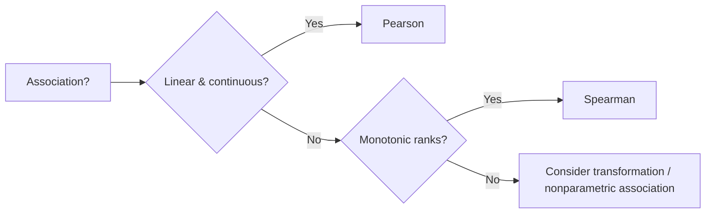

# Correlation and Mapping in Food Spectroscopy

Correlations assess associations between spectral features and quality metrics. Mapping extends this to time/sequence relationships (asynchronous or lagged). This chapter covers Pearson/Spearman correlations and cross-correlation in food spectroscopy contexts.

## Correlation coefficients
- **Pearson (linear):** \( r = \frac{\sum (x_i - \bar{x})(y_i - \bar{y})}{\sqrt{\sum (x_i - \bar{x})^2 \sum (y_i - \bar{y})^2}} \). Assumes approximate linear relationship; sensitive to outliers.
- **Spearman (rank):** Correlates rank-transformed data; robust to monotonic but non-linear relationships.
- **Kendall (optional):** Rank-based; less common here but can be used for ordinal/robust needs.

### When to choose
- Use **Pearson** when data are roughly linear and continuous.
- Use **Spearman** when relationships are monotonic but not linear, or when outliers/ordinal scales are present.

## Synchronous mapping
- Correlate features measured under the same conditions (e.g., 1655/1742 ratio vs peroxide value).
- Useful for cross-validating spectral markers with reference assays (lab chemistry).

## Asynchronous / cross-correlation (time/sequence)
- Cross-correlation explores lagged relationships (e.g., spectral ratio changes lagging behind temperature or time).
- For sequences of equal length, compute correlation at multiple lags to see leading/lagging effects.
- Simple definition for lag \( k \): \( r_k = \sum_t x_t y_{t+k} \) (typically normalized).

## Food spectroscopy examples
- Heating: correlate unsaturation ratio with heating time (Pearson/Spearman); cross-correlate ratio vs temperature ramp to detect lag.
- Fermentation or sequential processing: track spectral markers vs time/quality scores.
- QC: correlate fingerprint similarity scores with batch attributes.

## Code snippets
```python
import pandas as pd
from foodspec.stats import compute_correlations, compute_correlation_matrix, compute_cross_correlation

df = pd.DataFrame({"ratio": [1.0, 1.1, 1.2, 1.3], "peroxide": [2, 4, 6, 8]})
pear = compute_correlations(df, ("ratio", "peroxide"), method="pearson")
print(pear)

mat = compute_correlation_matrix(df, ["ratio", "peroxide"], method="spearman")
print(mat)

xcorr = compute_cross_correlation([1, 2, 3, 4], [1, 2, 3, 4], max_lag=1)
print(xcorr)

# Simple heatmap (matplotlib)
import matplotlib.pyplot as plt
fig, ax = plt.subplots()
im = ax.imshow(mat.values, cmap="coolwarm", vmin=-1, vmax=1)
ax.set_xticks(range(len(mat.columns)))
ax.set_xticklabels(mat.columns, rotation=45, ha="right")
ax.set_yticks(range(len(mat.index)))
ax.set_yticklabels(mat.index)
fig.colorbar(im, ax=ax, label="Spearman r")
fig.tight_layout()
plt.close(fig)
```


## Decision aid: Pearson vs Spearman


## Interpretation
- Report r and p-value; for Spearman, emphasize monotonicity rather than linear slope.
- Use heatmaps for multiple features; annotate significant associations cautiously to avoid over-interpretation.

---

## When Results Cannot Be Trusted

⚠️ **Red flags for correlation validity:**

1. **High correlation without checking causation (r = 0.95 does not prove causation)**
   - Correlation measures association, not causation
   - Confounders can create spurious correlations (e.g., both variables driven by batch)
   - **Fix:** Report correlation as descriptive statistic; discuss confounders; use causal inference methods if causal claims intended

2. **Testing many correlations without multiple-test correction (100 features → 100 pairwise tests, report r > 0.3 as significant)**
   - Uncorrected significance levels inflate with test count
   - 100 independent tests expect ~5 false positives at α = 0.05
   - **Fix:** Apply FDR correction or permutation tests; report Benjamini–Hochberg adjusted p-values

3. **Outliers dominating correlation (r = 0.9 driven by 2 extreme points)**
   - Pearson r is sensitive to outliers; single outlier can reverse correlation sign
   - Spearman is more robust but still affected by extreme ranks
   - **Fix:** Visualize scatter plot; compute robust correlation (e.g., percentage bend); report with/without outliers

4. **Non-linear relationship misrepresented as linear (r = 0.3, but relationship is U-shaped)**
   - Pearson r assumes linear association; nonlinear relationships may show low r despite strong association
   - Spearman captures monotonicity but misses U-shaped or other patterns
   - **Fix:** Visualize relationships; consider nonparametric association measures; test for quadratic terms

5. **Sample size too small for reliable p-value (n = 5, r = 0.6, p = 0.28)**
   - Correlation p-values depend heavily on n; small samples have low power
   - Correlation estimated from tiny samples doesn't generalize
   - **Fix:** Report confidence intervals around r; plan for adequate sample size; consider cross-validation

6. **Pseudo-replication in correlation (correlating batch means instead of individual samples)**
   - Reducing data (averaging replicates) inflates correlation and deflates uncertainty
   - Over-aggregation creates artificial certainty
   - **Fix:** Analyze at the level of individual measurements; use mixed-effects models if nested structure present

7. **Batch confounding in correlation (all samples from Device A have high ratio, all from Device B have low ratio)**
   - Batch effects can create spurious correlations
   - Correlation may reflect device differences, not biological association
   - **Fix:** Include batch in analysis (partial correlation, batch-adjusted residuals); visualize by batch

8. **Interpreting absence of correlation as independence (r ≈ 0 means "not related")**
   - Pearson r ≈ 0 means no linear relationship; nonlinear associations may exist
   - Spearman ρ ≈ 0 means no monotonic relationship; complex patterns may be present
   - **Fix:** Visualize relationships; test for nonlinear patterns; report p-value with scatter plot

## Further reading
- [Hypothesis testing](hypothesis_testing_in_food_spectroscopy.md)
- [Study design](study_design_and_data_requirements.md)
- API: [Statistics](../08-api/stats.md)
