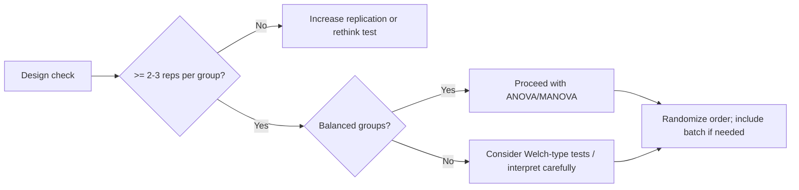

# Study Design and Data Requirements

Good statistical practice starts with good design. This chapter summarizes replication, balance, randomization, and instrument considerations for food spectroscopy, and how these affect power and assumptions.

## Replication and sample size
- Multiple spectra per sample and per group capture variability (sample prep, instrument noise).
- More replicates → lower standard error → higher power. Aim for at least a few replicates per group for ANOVA/t-tests.
- Avoid pseudo-replication: repeated scans of one aliquot are not independent biological replicates.

## Balance vs unbalance
- **Balanced designs** (similar n per group) improve ANOVA robustness and power.
- **Unbalanced designs** can inflate Type I error or reduce power; use Welch-type tests or carefully interpret ANOVA.

## Randomization and blocking
- Randomize acquisition order to reduce drift/systematic bias.
- Block by batch/instrument if relevant; include batch as a factor in analysis when possible.

## Instrument considerations
- Calibration and drift: frequent calibration reduces variance; monitor drift over time.
- Noise: higher noise reduces power; invest in preprocessing (baseline, smoothing, normalization) to stabilize variance.
- Alignment: ensure wavenumbers are aligned across runs; misalignment can inflate variance and violate assumptions.

## Data quality and preprocessing consistency
- Use consistent preprocessing across all groups (baseline, normalization, cropping).
- Document instrument settings, laser wavelength, ATR crystal, etc., as they influence comparability.

## Design suitability for ANOVA/MANOVA

## Reporting
- State group sizes, replication scheme, randomization/blocking, and any exclusions.
- Note instrument model/settings and preprocessing applied.
- Tie design choices to assumptions (normality, homoscedasticity) and power considerations.

---

## When Results Cannot Be Trusted

⚠️ **Red flags that invalidate study conclusions:**

1. **Insufficient replication (n < 3 per group)**
   - Single measurements are too noisy for food spectroscopy
   - Natural sample variability alone can exceed your signal
   - **Fix:** Increase replicates to ≥3 per group; report confidence intervals, not point estimates

2. **Pseudo-replication (multiple scans of same aliquot)**
   - Repeated scans of identical sample are NOT independent; they're autocorrelated
   - Statistical tests assume independence; violating this inflates false positives
   - **Fix:** Analyze ≥3 distinct aliquots; document which measurements come from same sample

3. **Batch confounding (all treatment A = Day 1, all treatment B = Day 2)**
   - Systematic drift (laser aging, temperature) mimics biological differences
   - Impossible to know if group difference is real or instrumental drift
   - **Fix:** Randomize sample order across batches; use batch-aware CV (GroupKFold); include batch as factor in ANOVA

4. **Gross sample imbalance (n_A = 50, n_B = 3)**
   - Power is limited by smallest group; ANOVA assumptions (homoscedasticity) violated
   - May mask true effects or generate spurious significance
   - **Fix:** Aim for balanced or near-balanced designs; if imbalanced, use Welch's ANOVA or permutation tests

5. **No randomization (samples processed in order: A, A, A, B, B, B)**
   - Systematic bias from drift, operator fatigue, or instrument warmup accumulates within groups
   - Differences may be temporal, not biological
   - **Fix:** Randomize acquisition order; interleave groups across time

6. **Undisclosed preprocessing variations**
   - If baseline correction λ or smoothing window changes between samples, spectra are not comparable
   - Different preprocessing → different statistics, even on same raw data
   - **Fix:** Freeze preprocessing parameters before analysis; document and report all preprocessing details

7. **Ignoring known batch effects (batch effect visible in PCA, not adjusted)**
   - Multi-day or multi-instrument studies require batch correction (ComBat, SVA) or batch-aware CV
   - Ignoring batch effects inflates variance and reduces power; may create false significance
   - **Fix:** Include batch in ANOVA model, or use batch-correction; report residuals after batch adjustment

8. **No control for multiple testing (comparing 100 peaks, reporting p < 0.05 as significant)**
   - Each test has 5% chance of false positive; 100 tests → ~5 false positives expected by chance
   - Uncorrected p-values are misleading
   - **Fix:** Use Bonferroni, Benjamini–Hochberg FDR, or permutation tests; report corrected p-values

---

## Further reading
- [Hypothesis testing](hypothesis_testing_in_food_spectroscopy.md)
- [ANOVA and MANOVA](anova_and_manova.md)
- [Reproducibility checklist](../protocols/reproducibility_checklist.md)
