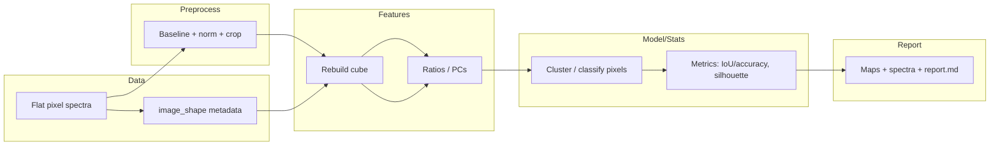

# Workflow: Hyperspectral Mapping

> New to workflow design? See [Designing & reporting workflows](workflow_design_and_reporting.md). For model/metric choices, see [ML & DL models](../ml/models_and_best_practices.md) and [Metrics & evaluation](../../metrics/metrics_and_evaluation/). Troubleshooting (SNR, misalignment): [Common problems & solutions](../troubleshooting/common_problems_and_solutions.md).

Hyperspectral mapping treats each pixel as a spectrum; goals include spatial localization of components, contaminants, or quality gradients.

Suggested visuals: intensity/ratio maps, cluster maps, pixel-level spectra, PCA score maps.



## What? / Why? / When? / Where?
- **What:** Pixel-level workflow: preprocess spectra → rebuild cube → extract ratios/PCs → cluster/classify → map outputs.  
- **Why:** Spatially resolve composition/contaminants, detect drift across products, visualize heterogeneity.  
- **When:** You have per-pixel spectra + image_shape metadata; want spatial insight. Limitations: SNR variations, misregistration, computational cost for large cubes.  
- **Where:** Upstream preprocessing identical per pixel; downstream metrics (IoU/accuracy, silhouette on pixel embeddings) and maps for reporting.

## 1. Problem and dataset
- **Use cases:** spatial adulteration, contamination localization, tissue/structure mapping.  
- **Inputs:** per-pixel spectra flattened to rows; wavenumber axis; image_shape metadata.  
- **Typical size:** thousands of pixels; consider subsampling for development.

## 2. Pipeline (default)
- Preprocess per spectrum (baseline, normalization).  
- Rebuild cube with `HyperSpectralCube.from_spectrum_set`.  
- Extract ratios or PCs per pixel.  
- Segment via k-means/thresholds or classify with trained model.

## 3. Python sketch
```python
from foodspec.core.hyperspectral import HyperSpectralCube
from foodspec.viz.hyperspectral import plot_hyperspectral_intensity_map
from foodspec.viz import plot_correlation_heatmap

cube = HyperSpectralCube.from_spectrum_set(fs_pixels, image_shape=(h, w))
fig = plot_hyperspectral_intensity_map(cube, target_wavenumber=1655, window=5)
```

## 4. Metrics & interpretation
- If labeled masks exist: pixel-wise accuracy/IoU; confusion matrix on pixel labels.  
- Unsupervised: stability across runs; silhouette/between-within metrics on pixel embeddings; correlation of ratio maps vs reference metrics.  
- Inspect edge artifacts and spatial smoothness.

### Qualitative & quantitative interpretation
- **Qualitative:** Intensity/ratio maps reveal spatial patterns; cluster maps show segmentation; inspect representative pixel spectra for classes.  
- **Quantitative:** Report pixel accuracy/IoU (if masks); silhouette/between-within metrics on PCA pixel scores for cluster separability; confusion matrix for pixel labels. Link to [Metrics & evaluation](../../metrics/metrics_and_evaluation/).  
- **Reviewer phrasing:** “Ratio maps highlight localized high-intensity regions; clustering yields k segments with silhouette ≈ …; pixel-level IoU vs reference mask = …; representative spectra confirm chemical plausibility.”
---

## When Results Cannot Be Trusted

⚠️ **Red flags for hyperspectral imaging workflow:**

1. **Pixel-level clustering applied without accounting for spatial correlation**
   - Adjacent pixels are highly correlated (same region); standard clustering assumes independence
   - Produces inflated silhouette scores and overstated cluster separation
   - **Fix:** Use spatially-aware clustering (morphological operations, connected-component labeling) or validate with spatial replicates

2. **Preprocessing applied to entire cube, then segmentation (baseline fitting influences all pixels)**
   - Preprocessing parameters (baseline correction, normalization) affect spectral patterns
   - Results sensitive to preprocessing choices; different parameters → different maps
   - **Fix:** Freeze preprocessing parameters before analysis; test sensitivity to preprocessing; report parameter choices

3. **Number of clusters chosen post-hoc to match visual appearance ("k=5 looks right")**
   - Data-dependent k selection overfits; new samples won't have same cluster structure
   - Subjective choice lacks reproducibility
   - **Fix:** Use objective criteria (elbow method, silhouette score, gap statistic) on held-out region; pre-specify k

4. **Maps show high contrast without ground truth validation (visual "separation" not confirmed)**
   - Maps can be visually striking yet incorrect
   - Missing ground truth (chemical analysis, reference masks) leaves interpretation unverified
   - **Fix:** Compare segmentation to chemical reference (e.g., LC-MS localization, histology); report accuracy metrics

5. **Spatial resolution insufficient for features of interest (pixel size 100 µm, structure size 10 µm)**
   - Cannot resolve fine structures; maps appear coarser than reality
   - Information loss: true heterogeneity hidden
   - **Fix:** Ensure pixel size ≤10x smaller than features of interest; document spatial resolution limits

6. **Spectral bands with low signal-to-noise included in analysis (noisy wavenumber regions dominate)**
   - Noise dominates signal; clustering/classification unreliable
   - May produce artifact maps reflecting noise patterns
   - **Fix:** Mask low-SNR regions; consider denoising (PCA, wavelets); report signal-to-noise by band

7. **Reference sample not imaged alongside test sample (no batch/day control)**
   - Instrumental drift, lens contamination, or alignment changes between measurements
   - Can't distinguish sample differences from instrumental artifacts
   - **Fix:** Include reference sample in imaging run; check for drift; normalize by reference

8. **Classification/clustering applied without balancing classes (one region massive, another tiny)**
   - Classifier biased toward majority class; minority class misclassified
   - Metrics (overall accuracy) misleading
   - **Fix:** Report per-class metrics (precision/recall); show pixel confusion matrix; use weighted or balanced loss
## Summary
- Preprocess → rebuild cube → ratios/PCs → clustering/classification → maps + metrics.  
- Pair maps with pixel spectra and QC plots; report preprocessing and class definitions.
