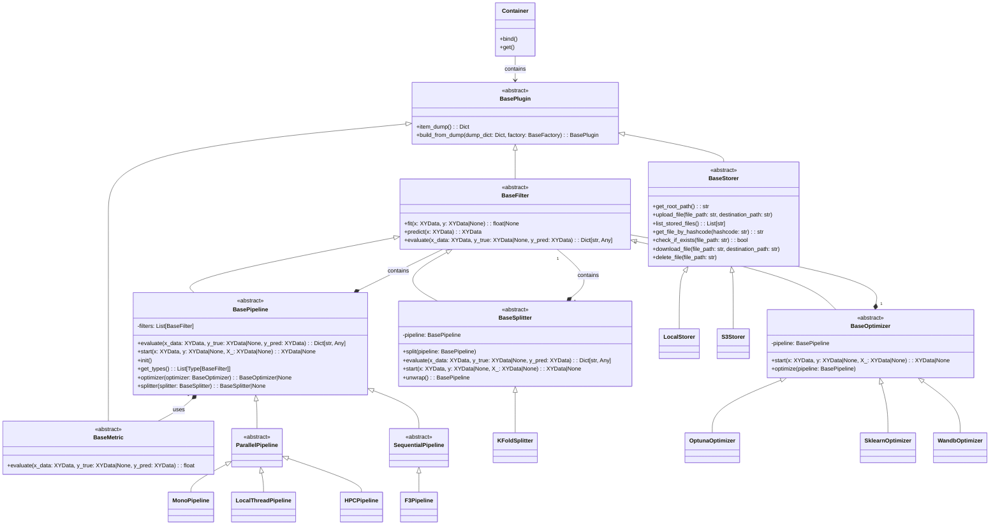

# LabChain [](https://github.com/manucouto1/LabChain/actions/workflows/test_on_push_pull.yml)
LabChain is an innovative platform designed to simplify and accelerate the development of machine learning models. It provides data scientists and machine learning engineers with a flexible and powerful tool to create, experiment with, and deploy models efficiently and in a structured manner. [https://manucouto1.github.io/LabChain](https://manucouto1.github.io/LabChain)

## Key Features

- Modular and flexible architecture
- Customizable pipelines for ML workflows
- Extensible plugin system for filters, metrics, and storage
- Support for distributed processing with MapReduce
- Integrated model evaluation and optimization tools

## Diagram


## Prerequisites

Before installing LabChain, ensure you have the following prerequisites:

1. Python 3.11 or higher
2. pip (Python package installer)

## Installation Options

You have two options to install LabChain:

### Option 1: Install from PyPI

The easiest way to install LabChain is directly from PyPI using pip:

```bash
pip install framework3
```

This will install the latest stable version of LabChain and its dependencies.

### Option 2: Install from Source

2. Clone the repository:
   ```
   git clone https://github.com/manucouto1/LabChain.git
   ```

3. Navigate to the project directory:
   ```
   cd LabChain
   ```

4. Install the dependencies using pip:
   ```
   pip install -r requirements.txt
   ```

## Basic Usage

Here's a basic example of how to use LabChain:

```python
from framework3.plugins.pipelines import F3Pipeline
from framework3.plugins.filters import KnnFilter
from framework3.plugins.metrics import F1, Precision, Recall

# Create a pipeline
pipeline = F3Pipeline(
    plugins=[KnnFilter()],
    metrics=[F1(), Precision(), Recall()]
)

# Fit the model
pipeline.fit(X_train, y_train)

# Make predictions
predictions = pipeline.predict(X_test)

# Evaluate the model
evaluation = pipeline.evaluate(X_test, y_test, y_pred=predictions)
print(evaluation)
```

## Documentation

For more detailed information on how to use Framework3, check out our complete documentation at:

[https://manucouto1.github.io/LabChain](https://manucouto1.github.io/LabChain)

## Contributing

Contributions are welcome. Please read our contribution guidelines before submitting pull requests.

## License

This project is licensed under the AGPL-3.0 license. See the `LICENSE` file for more details.

## Contact

If you have any questions or suggestions, don't hesitate to open an issue in this repository or contact the development team.

---

Thank you for your interest in LabChain! We hope this tool will be useful in your machine learning projects.
