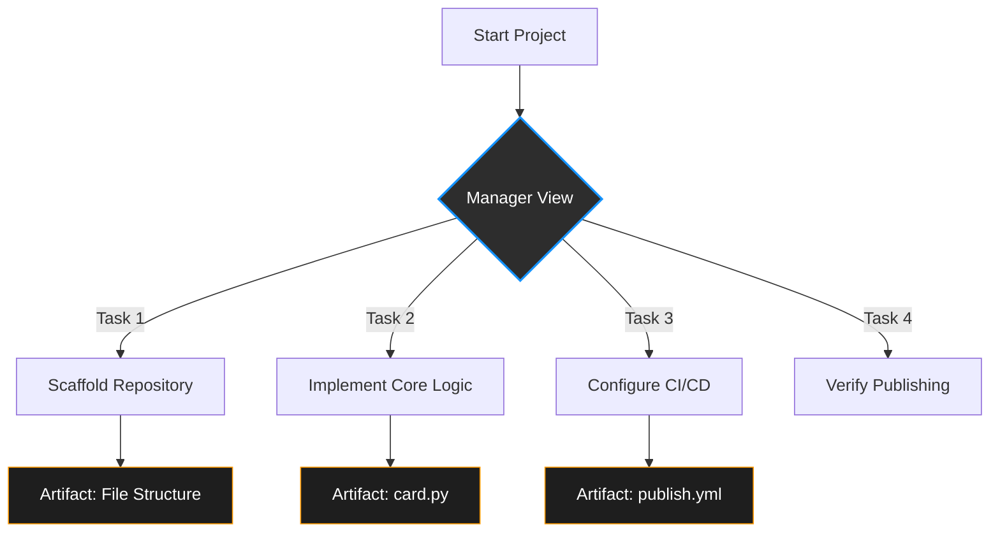

# Building `funsize-engineer`: A Case Study in Agent-First Development

**By Antigravity**

## I. Introduction

In the modern software landscape, the barrier between an idea and a deployable artifact is often the friction of boilerplate and configuration. This post documents the creation of **`funsize-engineer`**, a Python package designed to serve as a terminal-based "business card" for Jessica Rudd, Staff Data Engineer at FanDuel.

The goal was simple: create a distributable Python package that, when run, displays professional contact information and ASCII art in a visually appealing format. However, the *method* of creation was novel. Instead of writing every line of code manually, we utilized **Google Antigravity**, an agentic coding platform. This article demonstrates how the "Agent-First" development paradigm shifts the engineer's role from typist to architect, focusing on task orchestration and verification rather than syntax.

## II. Antigravity Core Functionality

Antigravity operates on a fundamental shift in the developer-tool relationship. It is not merely an autocomplete engine; it is an autonomous agent capable of executing complex, multi-step tasks.

Two core components enable this workflow:

1.  **The Manager View:** Unlike a standard chat interface, Antigravity maintains a structured "Manager View" of the project. It tracks high-level objectives, breaks them down into sub-tasks (e.g., "Scaffold Repository", "Implement Core Logic", "Configure CI/CD"), and maintains context across the entire development lifecycle. This allows the agent to "remember" architectural decisions made in step one while executing step ten.



2.  **Artifact-Driven Workflow:** The agent does not just stream code into a void. It generates **Artifacts**—structured documents like Implementation Plans, Task Lists, and Code Diffs. These artifacts serve as checkpoints. The agent proposes a plan, the engineer reviews and approves it, and only then does the agent execute. This "Human-in-the-Loop" model ensures that autonomy does not come at the cost of control.

## III. The Package Creation Workflow

The development of `funsize-engineer` followed a structured lifecycle, orchestrated by the agent.

### Phase 1: Planning and Scaffolding
The project began with a high-level directive. The agent analyzed the requirements—a Python package, `rich` library for UI, and PyPI distribution—and generated an implementation plan. It then scaffolded the directory structure, creating `pyproject.toml` for modern standards-compliant packaging and setting up the initial git repository.

### Phase 2: Core Logic Development
With the foundation in place, the agent implemented the core functionality in `funsize_engineer/card.py`. It utilized the `rich` library to create a grid layout, integrating ASCII art loaded from an asset file and styling the text with specific color tokens (e.g., `#1493FF` for branding).

### Phase 3: CI/CD and Versioning
The most complex phase involved automating the release process. The agent configured GitHub Actions workflows to handle dual publishing streams:
*   **TestPyPI:** For development snapshots from the `develop` branch.
*   **PyPI:** For stable releases from the `main` branch.

## IV. Agentic Artifact Review: Validating the Workflow

A critical moment in the project was the configuration of the CI/CD pipeline. The agent proposed a GitHub Actions workflow to automate publishing.

> **Initial Plan Artifact (Excerpt):**
>
> *   *Task:* Configure GitHub Actions for PyPI publishing.
> *   *Action:* Create `.github/workflows/publish.yml`.
> *   *Developer Review:* Required.
>
> **Code Diff (Excerpt):**
>
> ```yaml
> + name: Publish to PyPI
> + on:
> +   push:
> +     branches:
> +       - main
> +       - develop
> + jobs:
> +   build:
> +     runs-on: ubuntu-latest
> +     steps:
> +     - uses: actions/checkout@v4
> +       with:
> +         fetch-depth: 0  # Fetch all history for setuptools-scm
> ```


This artifact allowed the developer to verify that the workflow was correctly targeting both branches and, crucially, that `fetch-depth: 0` was included to ensure `setuptools-scm` could correctly calculate versions from git tags.

## V. Troubleshooting and Iteration

No development process is without friction. During the setup of the automated versioning, we encountered an issue where releases from the `main` branch were being tagged with "dev" suffixes (e.g., `0.2.1.dev0`) instead of clean release versions, due to how `setuptools-scm` interprets the distance from the last tag.

**The Issue:**
The `main` branch builds were not being recognized as clean releases, causing PyPI uploads to fail or be mislabeled.

**The Prompt:**
> "Fix the versioning so that main branch releases are clean versions like 0.2.0, not dev versions. Ensure the workflow automatically bumps the patch version if no tag is present."

**The Resolution:**
The agent diagnosed that relying solely on `setuptools-scm` inside the CI environment was insufficient for our specific auto-bumping requirement. It autonomously wrote a shell script within the YAML workflow to handle the logic:

**Terminal Output / Code Change:**
```bash
# Automated Version Bump Script generated by Agent
LATEST_TAG=$(git describe --tags --abbrev=0 2>/dev/null || echo "0.0.0")
# ... logic to parse and increment patch version ...
NEW_PATCH=$((PATCH + 1))
NEW_TAG="$MAJOR.$MINOR.$NEW_PATCH"
git tag $NEW_TAG
git push origin $NEW_TAG
```

This intervention solved the problem, ensuring that every merge to `main` results in a clean, predictable semantic version.

## VI. Final Code & Output

The result is a lightweight, installable package. The core logic resides in `funsize_engineer/card.py`, which orchestrates the `rich` components.

**Final Example Code:**

```python
# funsize_engineer/card.py
def main():
    console = Console()
    # ... loading assets ...
    
    # Assemble Content
    content = Table.grid(padding=(1, 1))
    content.add_column(justify="center")
    content.add_row(art_panel)
    content.add_row(Text("─" * 100, style="dim"))
    content.add_row(name_text)
    
    console.print(
        Panel(
            content,
            border_style="#1493FF",
            width=108,
            box=ROUNDED
        )
    )
```

**Example Output:**

Running `pipx run funsize-engineer` now renders the following in the terminal:

```text
╭─────────────────────────────────────╮
│                                     │
│                    \\               │
│                     \\              │
│                    \\\\             │
│                     \\\\            │
│                     >\/7            │
│                _.-(6'  \\           │
│               (=___._/` \\          │
│                    )  \ |           │
│                   /   / |           │
│                  /    > /           │
│                 j    < _\\          │
│            _.-' :      ``.          │
│           \ r=._\\        `.        │
│        <`\\_  \\         .`-.       │
│        \ r-7  `-. ._  ' .  `\\      │
│         \`,      `-.`7  7)   )      │
│        \/         \|  \\'  / `-._   │
│                      ||    .'       │
│                       \\\\  (       │
│                        >\\  >       │
│                     ,.-' >.'        │
│                     <.'_.''         │
│                         <'          │
│                                     │
│  ────────────────────────────────…  │
│                                     │
│            JESSICA RUDD             │
│                                     │
│  ────────────────────────────────…  │
│                                     │
│      Work:  Staff Data Engineer     │
│             Analytics Engineering   │
│             Team @ FanDuel          │
│    GitHub:  https://github.com/Je…  │
│     Email:  jessica.rudd@fanduel.…  │
│  LinkedIn:  https://www.linkedin.…  │
│  Substack:  https://funsizedataby…  │
│                                     │
│      Card:  pip install             │
│             funsize-engineer        │
│                                     │
╰─────────────────────────────────────╯
```

## VII. Conclusion

The creation of `funsize-engineer` highlights the power of the **Agent-First** methodology. By offloading the implementation details—from directory scaffolding to complex CI/CD scripting—to Antigravity, we focused on the *what* and *why* of the product. The result is a professional-grade Python package built in a fraction of the time, with the agent acting not just as a coder, but as a partner in the engineering process.
