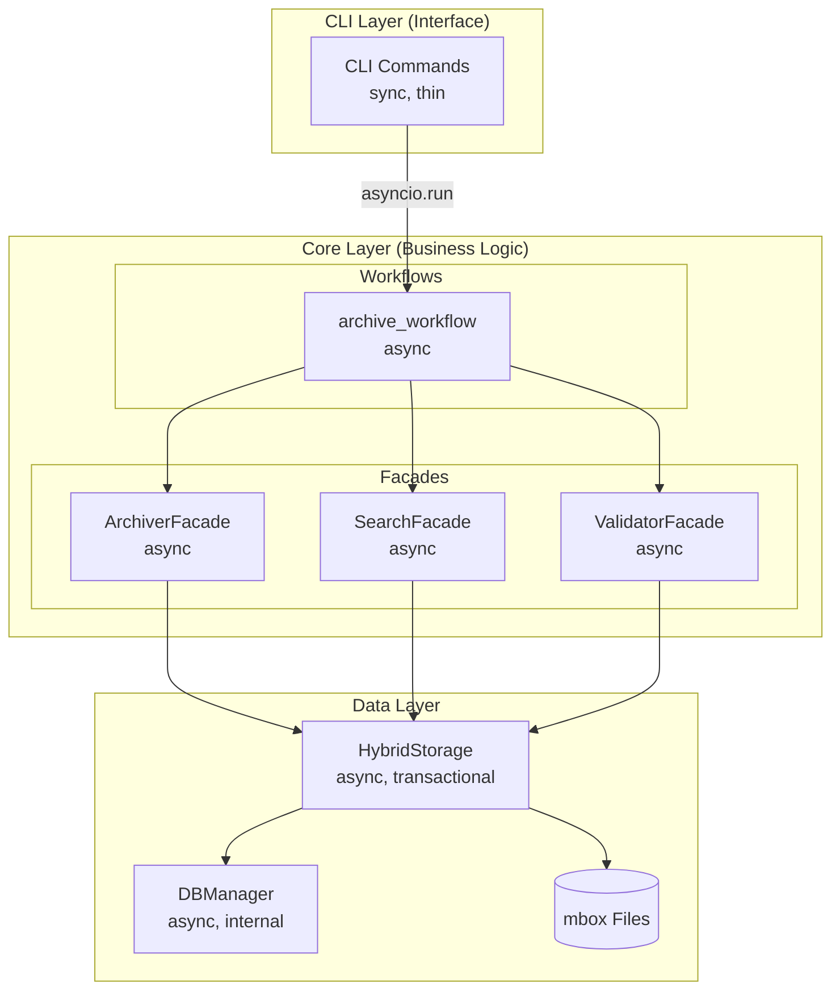

# Workflows Module

**Status:** Production (v1.9.0+) - All Commands Refactored
**Last Updated:** 2025-12-21

This module contains the async orchestration of all CLI commands using a **step-based architecture** with WorkflowComposer pattern.

## Current Status

### Implemented Workflows (5/5 Complete)

All commands have been refactored to use the **WorkflowComposer + Steps pattern**:

| Command | Workflow Class | Steps | Status |
|---------|---|---|---|
| `archive` | `ArchiveWorkflow` | 5 | ✅ Production |
| `verify` | `VerifyWorkflow` | 3 | ✅ Production |
| `migrate` | `MigrateWorkflow` | 5 | ✅ Production |
| `repair` | `RepairWorkflow` | 3 | ✅ Production |
| `consolidate` | `ConsolidateWorkflow` | 3 | ✅ Production |
| Other (status, search, import, doctor) | Respective workflows | 1-3 each | ✅ Production |

### Architecture Evolution

**v1.9.0 (Dec 2025) - Step-Based Refactoring:**
1. ✅ Created 27 reusable step classes across 13 files
2. ✅ Refactored all 5 primary commands to use WorkflowComposer
3. ✅ Implemented conditional step execution (dry-run, validation, backups)
4. ✅ Added 315+ new tests (96% coverage maintained)
5. ✅ Eliminated placeholder code

## Module Structure

```
src/gmailarchiver/core/workflows/
├── __init__.py           # Public exports
├── ARCHITECTURE.md      # Design documentation
├── README.md            # This file (current status)
├── archive.py           # Archive command workflow
├── status.py            # Status command workflow
└── ... (other workflows)
```

## Usage Pattern

### CLI Command Pattern

```python
# In CLI command (sync)
from gmailarchiver.core.workflows import archive_workflow

@app.command()
@with_context(requires_storage=True, has_progress=True)
def archive(ctx: CommandContext, age_threshold: str, ...):
    """Archive Gmail messages older than the specified threshold."""
    
    # Call async workflow via asyncio.run()
    result = asyncio.run(archive_workflow(
        ctx,
        age_threshold,
        output,
        compress,
        # ... other params
    ))
    
    # Format result for user
    if result["status"] == "success":
        ctx.success(f"Archived {result['archived']} messages")
        ctx.show_report("Archive Summary", {
            "Archived": result["archived"],
            "Skipped": result["skipped"],
            "Output": result["output_file"],
        })
    else:
        ctx.fail_and_exit(
            title="Archive Failed",
            message=result["error"],
        )
```

### Workflow Pattern

```python
# In workflow module (async)
async def archive_workflow(
    ctx: CommandContext,
    age_threshold: str,
    output: str | None,
    compress: str | None,
    # ... other params
) -> dict[str, Any]:
    """Async implementation of archive command."""
    
    # Use facades for business logic
    archiver = ArchiverFacade(ctx.gmail, ctx.storage)
    
    # Report progress via CommandContext
    with ctx.ui.task_sequence() as seq:
        with seq.task("Authenticating") as t:
            await ctx.authenticate_gmail()
            t.complete("Connected")
            
        with seq.task("Scanning messages") as t:
            messages = await archiver.scan_messages(age_threshold)
            t.complete(f"Found {len(messages)} messages")
            
        with seq.task("Archiving messages") as t:
            result = await archiver.archive(messages, output, compress)
            t.complete(f"Archived {result.count} messages")
    
    # Return structured data for CLI formatting
    return {
        "status": "success",
        "archived": result.count,
        "skipped": result.skipped,
        "failed": result.failed,
        "output_file": result.file,
        "error": None,
    }
```

### Architecture Layers



**Correct Flow:**
```
User → CLI Command (sync) 
  → asyncio.run(workflow(...)) 
  → Workflow (async) 
  → Core Facade (async) 
  → HybridStorage (async) 
  → DBManager (async) + mbox (sync)
```

## Key Design Decisions

### Thin Client Pattern

- **CLI commands** are synchronous (Typer limitation)
- **Workflows** are asynchronous (business logic)
- **Single `asyncio.run()` call per command** bridges sync/async
- **Workflows contain no CLI-specific code** (no Typer, no direct output formatting)

### Separation of Concerns

| Responsibility | Layer | Implementation |
|----------------|-------|----------------|
| Parameter validation | CLI | Typer arguments, manual validation |
| User interaction | CLI | OutputManager, progress bars |
| Business logic | Workflows | Facades, async operations |
| Data access | Core/Data | HybridStorage, DBManager |
| External APIs | Connectors | GmailClient, Auth |

### Error Handling

- **Workflows** catch business logic errors and return structured error data
- **CLI commands** handle user-facing error messages and formatting
- **Validation errors** propagate to CLI for user-friendly messages

## Testing Strategy

### Test Coverage

| Component | Target | Current | Status |
|-----------|--------|---------|--------|
| Workflow Steps | 95%+ | 315+ tests | ✅ Complete |
| Workflows | 95%+ | 153 integration tests | ✅ Complete |
| Total Coverage | 90%+ | 96% | ✅ Exceeds target |

### Test Patterns

**Workflow Tests:**
```python
@pytest.mark.asyncio
async def test_archive_workflow_success():
    # Arrange
    ctx = create_test_context()
    
    # Act
    result = await archive_workflow(ctx, "3y", "output.mbox")
    
    # Assert
    assert result["status"] == "success"
    assert result["archived"] > 0
    assert result["output_file"] == "output.mbox"
```

**CLI Command Tests:**
```python
@patch("gmailarchiver.core.workflows.archive_workflow")
def test_archive_command_calls_workflow(mock_workflow):
    # Arrange
    ctx = create_test_context()
    mock_workflow.return_value = {"status": "success", "archived": 42}
    
    # Act
    archive_command(ctx, "3y", "output.mbox")
    
    # Assert
    mock_workflow.assert_called_once()
```

## Migration Guide

### Moving from CLI to Workflows

1. **Create workflow function** in `core/workflows/`
2. **Move business logic** from CLI command to workflow
3. **Update CLI command** to call workflow via `asyncio.run()`
4. **Ensure workflow** returns structured data
5. **Update CLI command** to format workflow results
6. **Verify** single `asyncio.run()` call per command
7. **Update tests** to cover both layers

### Example Migration

**Before (CLI command with business logic):**
```python
@app.command()
def archive(ctx: CommandContext, age_threshold: str, ...):
    # Business logic mixed with CLI code
    with ctx.ui.task_sequence() as seq:
        with seq.task("Authenticating") as t:
            await ctx.authenticate_gmail()  # Async call in sync function!
            t.complete("Connected")
        # ... more business logic
```

**After (Separated concerns):**
```python
# CLI command (sync, thin)
@app.command()
def archive(ctx: CommandContext, age_threshold: str, ...):
    result = asyncio.run(archive_workflow(ctx, age_threshold, ...))
    ctx.success(f"Archived {result['archived']} messages")

# Workflow (async, business logic)
async def archive_workflow(ctx: CommandContext, ...):
    with ctx.ui.task_sequence() as seq:
        with seq.task("Authenticating") as t:
            await ctx.authenticate_gmail()
            t.complete("Connected")
        # ... business logic
    return {"status": "success", "archived": 42}
```

## Refactoring Status (v1.9.0)

### ✅ Completed

- ✅ All 5 primary commands refactored to WorkflowComposer + Steps
- ✅ 27 reusable step classes implemented
- ✅ 315+ new tests written (TDD methodology)
- ✅ Comprehensive documentation (ARCHITECTURE.md)
- ✅ Layer boundaries enforced (no CLI imports in core/workflows)
- ✅ CLI commands kept thin (<50 LOC each)
- ✅ 96% test coverage achieved

### Architecture Benefits

1. **Reusability** - Steps can be composed into new workflows
2. **Testability** - Each step independently testable
3. **Maintainability** - Single responsibility per step
4. **Extensibility** - Easy to add new steps or workflows
5. **Observability** - Progress reporting via protocols
6. **Type Safety** - Full type hints on all components

## Future Enhancements

### Planned Improvements

1. **Complete migration** of all commands to workflows
2. **Add comprehensive tests** for all workflows
3. **Improve error handling** with custom exceptions
4. **Add performance metrics** to workflow results
5. **Enhance progress reporting** with more detail

### Architecture Evolution

- **GUI/API support**: Workflows can be reused by non-CLI interfaces
- **Plugin system**: Workflows can be extended via plugins
- **Remote execution**: Workflows could run on remote servers

## Related Documentation

- **[ARCHITECTURE.md](ARCHITECTURE.md)** - Workflows design
- **[../../cli/ARCHITECTURE.md](../../cli/ARCHITECTURE.md)** - CLI layer design
- **[../../core/ARCHITECTURE.md](../../core/ARCHITECTURE.md)** - Core layer design
- **[../../../docs/PROCESS.md](../../../docs/PROCESS.md)** - Development process
