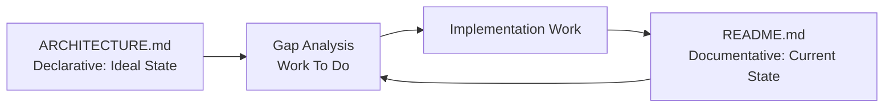
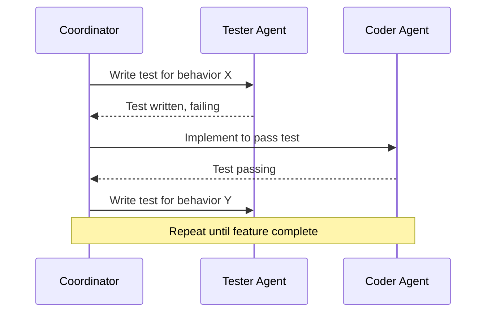

# Development Process

**Last Updated:** 2025-11-26
**Status:** Draft

This document defines the artifact-based development workflow for Gmail Archiver. It ensures consistency across sessions, maintains documentation integrity, and enforces design discipline.

---

## Table of Contents

- [Philosophy](#philosophy)
- [Artifact Types](#artifact-types)
- [Development Phases](#development-phases)
- [Sub-Agent Coordination](#sub-agent-coordination)
- [Definition of Done](#definition-of-done)
- [Automation Hooks](#automation-hooks)

---

## Philosophy

### Artifact-Based Development

All knowledge is captured in persistent artifacts (documents, tests, code) rather than ephemeral conversations. This enables:

- **Session Independence**: Any session can resume work by reading artifacts
- **Progress Visibility**: Gap between declarative (ideal) and documentative (actual) shows work remaining
- **Design Discipline**: Architecture decisions are explicit and reviewable
- **Audit Trail**: Changes flow through defined phases with clear artifacts

### Declarative vs Documentative

| Type | Purpose | Example | Updates When |
|------|---------|---------|--------------|
| **Declarative** | Describes ideal state | `ARCHITECTURE.md` | Design decisions change |
| **Documentative** | Describes current state | `README.md` | Implementation changes |

The **gap** between declarative and documentative artifacts defines the work to be done.



---

## Artifact Types

### Project-Level Artifacts

| Artifact | Location | Purpose |
|----------|----------|---------|
| `docs/ARCHITECTURE.md` | Root docs | Overall system architecture, layer overview |
| `docs/PROCESS.md` | Root docs | This document - development workflow |
| `docs/PLAN.md` | Root docs | Roadmap and feature planning |
| `CHANGELOG.md` | Root | Version history and release notes |
| `CLAUDE.md` | Root | AI assistant quick reference |

### Layer-Level Artifacts

Each layer (`cli/`, `core/`, `data/`, `connectors/`, `shared/`) contains:

| Artifact | Purpose | Type |
|----------|---------|------|
| `ARCHITECTURE.md` | Layer design, patterns, class diagrams, contracts | Declarative |
| `README.md` | Current implementation status, what exists today | Documentative |
| `CHANGELOG.md` | History of changes to this layer | Documentative |

### Artifact Hierarchy

```
docs/
├── ARCHITECTURE.md          # Links to layer ARCHITECTURE.md files
├── PROCESS.md               # This document
└── PLAN.md                  # Roadmap

src/gmailarchiver/
├── cli/
│   ├── ARCHITECTURE.md      # CLI layer design
│   ├── README.md            # CLI current status
│   └── CHANGELOG.md         # CLI change history
├── core/
│   ├── ARCHITECTURE.md      # Business logic design
│   ├── README.md            # Business logic status
│   └── CHANGELOG.md
├── data/
│   ├── ARCHITECTURE.md      # Data layer design
│   ├── README.md            # Data layer status
│   └── CHANGELOG.md
├── connectors/
│   ├── ARCHITECTURE.md      # External integrations design
│   ├── README.md            # Connectors status
│   └── CHANGELOG.md
└── shared/
    ├── ARCHITECTURE.md      # Shared utilities design
    ├── README.md            # Shared utilities status
    └── CHANGELOG.md
```

---

## Development Phases

Every development task flows through these phases in order:

```mermaid
graph TB
    subgraph "1. Context Phase"
        C1[Read docs/ARCHITECTURE.md]
        C2[Read layer ARCHITECTURE.md]
        C3[Read layer README.md]
        C4[Run tests, check coverage]
        C1 --> C2 --> C3 --> C4
    end

    subgraph "2. Design Phase"
        D1[Analyze request against architecture]
        D2[Identify affected layers]
        D3[Update ARCHITECTURE.md if needed]
        D4[Formulate implementation approach]
        D1 --> D2 --> D3 --> D4
    end

    subgraph "3. Test Phase"
        T1[Gap analysis: ARCH vs README]
        T2[Analyze existing code/tests]
        T3[Write failing tests first]
        T4[Verify tests fail]
        T1 --> T2 --> T3 --> T4
    end

    subgraph "4. Code Phase"
        I1[Implement minimal code]
        I2[Run tests until pass]
        I3[Refactor if needed]
        I1 --> I2 --> I3
    end

    subgraph "5. Verify Phase"
        V1[Run ruff check/format]
        V2[Run mypy]
        V3[Run full test suite]
        V4[Check coverage requirements]
        V1 --> V2 --> V3 --> V4
    end

    subgraph "6. Review Phase"
        R1[Code review]
        R2[Architecture alignment check]
        R3[Update README.md files]
        R4[Update CHANGELOG.md]
        R1 --> R2 --> R3 --> R4
    end

    C4 --> D1
    D4 --> T1
    T4 --> I1
    I3 --> V1
    V4 --> R1
```



### Phase 1: Context (Exploration)

**Purpose:** Understand project state before making changes.

**Activities:**
1. Read `docs/ARCHITECTURE.md` for system overview
2. Read relevant layer `ARCHITECTURE.md` for detailed design
3. Read relevant layer `README.md` for current implementation status
4. Run `uv run pytest` to verify test health
5. Check coverage report for gaps

**Exit Criteria:**
- [ ] Understand overall system architecture
- [ ] Understand affected layer(s) design
- [ ] Know current implementation state
- [ ] Tests are passing (or failures are understood)

**Automation:**
```bash
# Context check script (future)
gmailarchiver-dev context --layer data
```

---

### Phase 2: Design (Architecture-First)

**Purpose:** Ensure changes align with architecture; update design before code.

**Activities:**
1. Compare request against existing architecture
2. Identify which layer(s) are affected
3. Determine if new class/component is needed (SOLID principles)
4. Decide: Does architecture need to change?
   - **Yes**: Update `ARCHITECTURE.md` first (declarative change)
   - **No**: Proceed with existing architecture
5. Ensure `README.md` accurately reflects current state

**Key Questions:**
- Does this fit within an existing component's responsibility?
- Would adding this violate Single Responsibility Principle?
- Does this require a new pattern or abstraction?
- Are there cross-layer implications?

**Exit Criteria:**
- [ ] Request is mapped to specific layer(s)
- [ ] Architecture changes (if any) are documented in ARCHITECTURE.md
- [ ] Implementation approach is clear
- [ ] No SOLID violations anticipated

**Automation:**
```bash
# Architecture validation (future)
gmailarchiver-dev design --check-solid
```

---

### Phase 3: Test (TDD - Red Phase)

**Purpose:** Write tests that define expected behavior before implementation.

**Activities:**
1. **Gap Analysis**: Compare `ARCHITECTURE.md` (ideal) vs `README.md` (actual)
2. Identify specific behaviors to implement
3. Analyze existing tests for patterns and fixtures
4. Write new tests that:
   - Test the expected behavior (not implementation details)
   - Use existing fixtures where possible
   - Follow layer testing guidelines (unit vs integration)
5. **Verify tests fail** - confirms they test something new

**Test Writing Guidelines:**
```python
# Test behavior, not implementation
def test_archive_message_persists_to_database(self):
    """Archiving a message should record it in the database."""
    # Arrange
    storage = HybridStorage(db)

    # Act
    storage.archive_message(msg, "gmail123", path)

    # Assert - verify behavior, not internal state
    assert db.get_message_location("<test@example.com>") is not None
```

**Exit Criteria:**
- [ ] Tests are written for all new/changed behavior
- [ ] Tests follow existing patterns and conventions
- [ ] Tests are in correct location (unit/ or integration/)
- [ ] **All new tests FAIL** (Red phase complete)

**Sub-Agent Usage:**
```
Spawn: Tester Agent
Task: Write failing tests for [specific behavior]
Resume: When tests are ready for verification
```

---

### Phase 4: Code (TDD - Green Phase)

**Purpose:** Write minimal code to make tests pass.

**Activities:**
1. Implement the simplest code that makes tests pass
2. Run tests after each change
3. Avoid over-engineering - solve only what tests require
4. Refactor once tests pass (TDD refactor phase)

**Implementation Guidelines:**
- One test at a time: make it pass, then next test
- Don't add features not covered by tests
- Keep commits small and focused

**Exit Criteria:**
- [ ] All new tests pass
- [ ] Existing tests still pass
- [ ] Code follows existing patterns
- [ ] No obvious code smells

**Sub-Agent Usage:**
```
Spawn: Coder Agent
Task: Implement code to pass [specific test]
Resume: After each test passes for next iteration
```

**Coordinator Pattern:**


---

### Phase 5: Verify (Quality Gates)

**Purpose:** Ensure code meets project quality standards.

**Activities:**
1. Run linter: `uv run ruff check .`
2. Run formatter: `uv run ruff format .`
3. Run type checker: `uv run mypy gmailarchiver`
4. Run full test suite: `uv run pytest`
5. Check coverage meets requirements

**Quality Requirements:**

| Check | Command | Requirement |
|-------|---------|-------------|
| Lint | `uv run ruff check .` | No errors |
| Format | `uv run ruff format --check .` | No changes needed |
| Types | `uv run mypy gmailarchiver` | No errors |
| Tests | `uv run pytest` | All pass |
| Coverage | `uv run pytest --cov` | 90%+ overall, 95%+ core modules |

**Exit Criteria:**
- [ ] `ruff check` passes
- [ ] `ruff format --check` passes
- [ ] `mypy` passes
- [ ] All tests pass
- [ ] Coverage requirements met

**Automation:**
```bash
# Run all quality checks (future)
gmailarchiver-dev verify
```

---

### Phase 6: Review (Documentation Update)

**Purpose:** Ensure documentation reflects changes; get review approval.

**Activities:**
1. **Code Review**: Verify implementation aligns with architecture
2. **Architecture Check**: Confirm no unintended architectural drift
3. **Update README.md**: Document what was implemented (documentative)
4. **Update CHANGELOG.md**: Record the change for history
5. **Commit with proper message**: Follow conventional commits

**README.md Update Guidelines:**
- Describe what IS, not what SHOULD BE
- Update class/method inventory if changed
- Update "Current Status" section
- Note any known limitations or technical debt

**CHANGELOG.md Entry Format:**
```markdown
## [Unreleased]

### Added
- New feature X in data layer

### Changed
- Modified behavior Y in core layer

### Fixed
- Bug Z in cli layer
```

**Exit Criteria:**
- [ ] Code review approved (or self-reviewed for solo work)
- [ ] README.md reflects actual implementation
- [ ] CHANGELOG.md entry added
- [ ] Commit message follows conventional format

**Sub-Agent Usage:**
```
Spawn: Reviewer Agent
Task: Review changes, update documentation
```

---

## Sub-Agent Coordination

### Agent Roles

| Agent | Responsibility | Typical Tasks |
|-------|----------------|---------------|
| **Coordinator** | Orchestrates workflow, maintains context | Phase transitions, decision making |
| **Explorer** | Codebase exploration | Find files, understand patterns |
| **Tester** | Write and verify tests | TDD red phase, test improvements |
| **Coder** | Implement features | TDD green phase, bug fixes |
| **Reviewer** | Code review, documentation | Quality check, README updates |

### Coordination Patterns

**Pattern 1: TDD Loop**
```
Coordinator
  └─> Tester: Write failing test
      └─> Coordinator: Verify test fails
          └─> Coder: Implement to pass
              └─> Coordinator: Verify test passes
                  └─> (repeat for next behavior)
```

**Pattern 2: Review Loop**
```
Coordinator
  └─> Reviewer: Review code changes
      └─> Coordinator: Address feedback
          └─> Reviewer: Re-review
              └─> Coordinator: Merge/commit
```

### Context Preservation

When spawning sub-agents:
1. Provide relevant file paths
2. Reference specific ARCHITECTURE.md sections
3. Include test patterns from existing tests
4. Specify exact scope of work

```python
# Example sub-agent prompt
"""
Task: Write failing tests for DBManager.record_archived_message()

Context:
- Architecture: src/gmailarchiver/data/ARCHITECTURE.md#dbmanager
- Current tests: tests/unit/data/test_db_manager.py
- Behavior to test: [specific behavior description]

Requirements:
- Follow existing fixture patterns
- Place in tests/unit/data/
- Tests MUST fail initially
"""
```

---

## Definition of Done

A task is **DONE** when all phases are complete:

### Feature/Enhancement Done
- [ ] **Context**: Project state understood
- [ ] **Design**: Architecture updated if needed
- [ ] **Test**: Failing tests written, then passing
- [ ] **Code**: Implementation complete
- [ ] **Verify**: All quality gates pass
- [ ] **Review**: Documentation updated, code reviewed

### Bug Fix Done
- [ ] **Context**: Bug reproduced, root cause understood
- [ ] **Design**: Architecture impact assessed (usually none)
- [ ] **Test**: Regression test written (fails before fix)
- [ ] **Code**: Fix implemented
- [ ] **Verify**: All quality gates pass
- [ ] **Review**: Documentation updated if behavior changed

### Refactoring Done
- [ ] **Context**: Current code understood
- [ ] **Design**: Refactoring approach documented
- [ ] **Test**: Existing tests still pass (no new tests needed unless behavior changes)
- [ ] **Code**: Refactoring complete
- [ ] **Verify**: All quality gates pass
- [ ] **Review**: README.md updated to reflect new structure

---

## Automation

The development workflow is automated through Claude Code features and Git hooks.

### Claude Code Slash Commands

Located in `.claude/commands/`, these commands guide each phase:

| Command | Phase | Description |
|---------|-------|-------------|
| `/context [layer]` | 1 | Establish context, read docs, check test health |
| `/design <task>` | 2 | Architecture-first design, SOLID check |
| `/test <behavior>` | 3 | TDD Red - write failing tests |
| `/code <module>` | 4 | TDD Green - implement minimal code |
| `/verify` | 5 | Run all quality gates |
| `/review` | 6 | Code review, documentation update |
| `/feature <task>` | All | Full 6-phase orchestration |
| `/gap-analysis <layer>` | - | Compare ARCHITECTURE.md vs README.md |
| `/gh-issue <type>` | - | Create GitHub issue with proper template |
| `/gh-pr <title>` | - | Create PR with workflow checklist |

**Usage:**
```
/feature Add message export functionality
/context data
/verify
```

Commands use `@` notation for composition (single source of truth):
- `/feature` includes all 6 phase commands
- `/test` includes `/gap-analysis`
- `/context` includes `/gap-analysis`
- `/gh-pr` includes `/verify`

### Claude Code Skills

Located in `.claude/skills/`, these provide context-aware guidance. Claude loads them automatically based on trigger keywords in their descriptions:

| Skill | Triggers On | Source Documentation |
|-------|-------------|---------------------|
| `coding-standards` | style, format, lint, ruff, mypy, type hint | `docs/CODING.md` |
| `testing-guidelines` | test, pytest, fixture, mock, coverage | `docs/TESTING.md` |
| `tdd-workflow` | TDD, red-green, failing test, implement | `docs/PROCESS.md` |
| `gmailarchiver-patterns` | architecture, layer, pattern, SOLID | `docs/ARCHITECTURE.md` |
| `database-operations` | database, DBManager, schema, transaction | `src/gmailarchiver/data/ARCHITECTURE.md` |

Skills point to authoritative documentation (single source of truth) rather than duplicating content.

### Claude Code Agents

Located in `.claude/agents/`, specialized agents for different tasks:

| Agent | Role | Tools |
|-------|------|-------|
| `architect` | Design decisions, SOLID validation | Read, Grep, Glob |
| `coder` | Implementation, TDD green phase | Read, Write, Edit, Bash, Glob, Grep |
| `tester` | TDD red phase, behavioral tests | Read, Write, Edit, Bash, Glob, Grep |
| `reviewer` | Code review, documentation | Read, Grep, Glob |
| `product-owner` | Requirements, acceptance criteria | Read, Grep, Glob, WebFetch |

### Pre-commit Hooks

Configured in `.pre-commit-config.yaml`, runs automatically on `git commit`:

```yaml
# Local hooks (use project's uv environment)
- ruff-check: uv run ruff check --fix
- ruff-format: uv run ruff format
- mypy: uv run mypy src/gmailarchiver

# Standard hooks
- trailing-whitespace, end-of-file-fixer, check-yaml, etc.

# Commit message validation
- commitizen: Enforces conventional commits
```

**Installation:**
```bash
uv run pre-commit install
uv run pre-commit install --hook-type commit-msg
```

### GitHub Integration

**Issue Templates** (`.github/ISSUE_TEMPLATE/`):
- `bug_report.yml` - Bug reports with reproduction steps
- `feature_request.yml` - Feature requests with acceptance criteria
- `task.yml` - Development tasks with 6-phase checklist

**PR Template** (`.github/PULL_REQUEST_TEMPLATE.md`):
- 6-phase workflow checklist
- Quality gates checklist
- Affected layers checklist

**CI Workflow** (`.github/workflows/tests.yml`):
- Lint job: `uv run ruff check .`
- Type check job: `uv run mypy src/gmailarchiver`
- Test job: `uv run pytest --cov-fail-under=90`
- Runs on PR and push to main

### Claude Code Hooks

Configured in `.claude/settings.json`:

```json
{
  "hooks": {
    "PostToolUse": [
      {
        "matcher": "Write|Edit",
        "command": "uv run ruff check $FILE --fix && uv run ruff format $FILE"
      }
    ]
  }
}
```

Automatically formats code after Claude writes or edits files.

---

## Quick Reference

### Phase Checklist

```
[ ] 1. CONTEXT
    [ ] Read docs/ARCHITECTURE.md
    [ ] Read <layer>/ARCHITECTURE.md
    [ ] Read <layer>/README.md
    [ ] Run tests, check health

[ ] 2. DESIGN
    [ ] Map request to layer(s)
    [ ] Check SOLID implications
    [ ] Update ARCHITECTURE.md if needed
    [ ] Plan implementation approach

[ ] 3. TEST (Red)
    [ ] Gap analysis: ARCH vs README
    [ ] Write failing tests
    [ ] Verify tests fail

[ ] 4. CODE (Green)
    [ ] Implement minimal code
    [ ] Make tests pass
    [ ] Refactor if needed

[ ] 5. VERIFY
    [ ] ruff check passes
    [ ] mypy passes
    [ ] All tests pass
    [ ] Coverage met

[ ] 6. REVIEW
    [ ] Code reviewed
    [ ] README.md updated
    [ ] CHANGELOG.md updated
    [ ] Committed
```

---

## References

- [ARCHITECTURE.md](ARCHITECTURE.md) - System architecture
- [CODING.md](CODING.md) - Coding standards
- [TESTING.md](TESTING.md) - Testing guidelines
- [Test-Driven Development](https://martinfowler.com/bliki/TestDrivenDevelopment.html)
- [SOLID Principles](https://en.wikipedia.org/wiki/SOLID)
