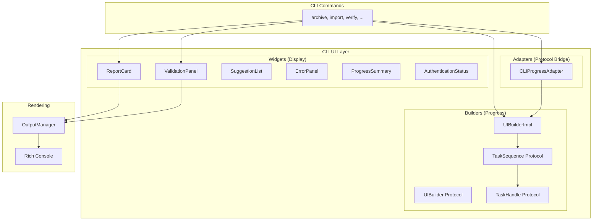

# CLI UI Architecture

**Last Updated:** 2025-12-19
**Status:** Production (v1.9.0+)

This document defines the architecture for the CLI user interface layer. The UI layer provides **composable widgets** and **progress builders** that CLI commands use to create consistent, accessible, and visually appealing terminal output.

---

## Table of Contents

- [Design Principles](#design-principles)
- [Component Hierarchy](#component-hierarchy)
- [Widget Architecture](#widget-architecture)
- [Builder Architecture](#builder-architecture)
- [Integration with Workflows](#integration-with-workflows)
- [Widget Library](#widget-library)
- [Accessibility](#accessibility)
- [Testing Strategy](#testing-strategy)
- [Migration Guide](#migration-guide)

---

## Design Principles

### 1. Composition Over Configuration

Widgets are built by **composing smaller components**, not by passing complex configuration objects:

```python
# Good: Composable
ReportCard("Results")
    .add_field("Count", 42)
    .add_field("Size", "12.3 MB")
    .render(output)

# Bad: Configuration object
output.show_report({
    "title": "Results",
    "fields": [{"name": "Count", "value": 42}, ...],
    "format": {...},
})
```

### 2. Commands Describe WHAT, UI Handles HOW

CLI commands declare **what** to display using widgets. Widgets handle **how** to display it (colors, symbols, formatting):

```python
# Command describes WHAT
ReportCard("Validation Results")
    .add_check("Count check", passed=True)
    .add_check("Integrity", passed=False, detail="5 mismatches")

# Widget handles HOW (colors, symbols, layout)
# Output:
# ✓ Count check: Passed
# ✗ Integrity: Failed → 5 mismatches
```

### 3. Accessibility First

All visual elements must be accessible:
- **Color + Symbol**: Never color alone (colorblind users)
- **Non-TTY fallback**: Works without terminal features
- **JSON mode**: Machine-readable alternative
- **Meaningful text**: Screen-reader friendly

### 4. Progressive Disclosure

- **Default output**: Essential information only
- **`--verbose`**: More detail about the same information
- **`--json`**: Complete data for automation

### 5. Consistent Visual Language

See [docs/UI_UX_CLI.md](../../../docs/UI_UX_CLI.md) for the complete visual language specification:

| Symbol | Color | Meaning |
|--------|-------|---------|
| `✓` | green | Success |
| `✗` | red | Failure |
| `⚠` | yellow | Warning |
| `ℹ` | blue | Info |
| `○` | dim | Pending |
| `⠋⠙⠹⠸...` | cyan | Running (animated) |

---

## Component Hierarchy



---

## Widget Architecture

### Widget Protocol

All widgets implement a common interface:

```python
from typing import Protocol
from gmailarchiver.cli.output import OutputManager


class Widget(Protocol):
    """Protocol for renderable UI components."""

    def render(self, output: OutputManager) -> None:
        """Render the widget to output.

        Args:
            output: OutputManager for rendering
        """
        ...

    def to_json(self) -> dict:
        """Return JSON-serializable representation.

        Used when --json flag is set.
        """
        ...
```

### Widget Base Pattern

Widgets use the **fluent builder pattern** for construction:

```python
from dataclasses import dataclass, field
from typing import Self


@dataclass
class ReportCard:
    """Displays a key-value report with title.

    Example:
        ReportCard("Archive Summary")
            .add_field("Messages", 4269)
            .add_field("Size", "12.3 MB")
            .add_field_if(verbose, "Duration", "45.2s")
            .render(output)
    """

    title: str
    fields: list[tuple[str, str]] = field(default_factory=list)
    emoji: str | None = None  # Optional title emoji

    def add_field(self, label: str, value: object) -> Self:
        """Add a field to the report."""
        self.fields.append((label, str(value)))
        return self

    def add_field_if(self, condition: bool, label: str, value: object) -> Self:
        """Conditionally add a field."""
        if condition:
            self.fields.append((label, str(value)))
        return self

    def with_emoji(self, emoji: str) -> Self:
        """Set title emoji (e.g., '📦')."""
        self.emoji = emoji
        return self

    def render(self, output: OutputManager) -> None:
        """Render to Rich console."""
        if output.json_mode:
            output.emit_json(self.to_json())
            return

        title = f"{self.emoji} {self.title}" if self.emoji else self.title
        output.show_report(title, dict(self.fields))

    def to_json(self) -> dict:
        """JSON representation."""
        return {
            "type": "report_card",
            "title": self.title,
            "fields": dict(self.fields),
        }
```

### Widget Categories

#### 1. Display Widgets (Static Output)

| Widget | Purpose | When to Use |
|--------|---------|-------------|
| `ReportCard` | Key-value summary | Command results, statistics |
| `ValidationPanel` | Pass/fail checks | Validation, verification |
| `ErrorPanel` | Error with suggestion | Fatal errors |
| `SuggestionList` | Next steps | After command completion |
| `TableView` | Tabular data | Lists, comparisons |

#### 2. Status Widgets (Inline Output)

| Widget | Purpose | When to Use |
|--------|---------|-------------|
| `SuccessMessage` | `✓ message` | Operation completed |
| `WarningMessage` | `⚠ message` | Non-fatal issue |
| `InfoMessage` | `ℹ message` | Informational |
| `DryRunBanner` | DRY RUN mode indicator | When dry_run=True |

#### 3. Interactive Widgets (Live Output)

| Widget | Purpose | When to Use |
|--------|---------|-------------|
| `AuthenticationStatus` | Auth spinner/result | Gmail authentication |
| `ProgressTaskPanel` | Multi-task progress | Long operations |

---

## Builder Architecture

### UIBuilder Protocol

The `UIBuilder` creates live, updating UI components:

```python
from typing import Protocol
from contextlib import AbstractContextManager


class TaskHandle(Protocol):
    """Handle for controlling a running task."""

    def complete(self, message: str) -> None:
        """Mark task as successful."""
        ...

    def fail(self, message: str, reason: str | None = None) -> None:
        """Mark task as failed."""
        ...

    def warn(self, message: str) -> None:
        """Mark task as completed with warning status.

        Use when task completed but with caveats or non-fatal issues.
        Displays yellow warning symbol instead of green checkmark.
        """
        ...

    def advance(self, n: int = 1) -> None:
        """Advance progress counter."""
        ...

    def set_total(self, total: int, description: str | None = None) -> None:
        """Set total for late-bound progress."""
        ...

    def set_status(self, message: str) -> None:
        """Update task description/status without completing.

        Use for dynamic status updates during long operations.
        Example: "Scanning: Found 1,234 messages"
        """
        ...

    def log(self, message: str, level: str = "INFO") -> None:
        """Log message within task context."""
        ...


class TaskSequence(Protocol):
    """Manages multiple sequential tasks."""

    def task(
        self, description: str, total: int | None = None
    ) -> AbstractContextManager[TaskHandle]:
        """Create a task within the sequence."""
        ...


class UIBuilder(Protocol):
    """Entry point for building live UI."""

    def task_sequence(
        self,
        title: str | None = None,
        show_logs: bool = False,
        max_logs: int = 10,
    ) -> AbstractContextManager[TaskSequence]:
        """Create a task sequence for multi-step operations.

        Args:
            title: Optional title for the sequence
            show_logs: Show scrolling log window below tasks
            max_logs: Maximum visible log entries

        Example:
            with ctx.ui.task_sequence() as seq:
                with seq.task("Step 1") as t:
                    do_work()
                    t.complete("Done")
        """
        ...

    def spinner(self, description: str) -> AbstractContextManager[TaskHandle]:
        """Simple spinner for single operations.

        Shorthand for task_sequence with one task.

        Example:
            with ctx.ui.spinner("Authenticating") as s:
                auth()
                s.complete("Connected")
        """
        ...
```

### UIBuilderImpl

The implementation manages Rich Live context:

```python
class UIBuilderImpl:
    """Implementation of UIBuilder using Rich Live."""

    def __init__(
        self,
        console: Console | None,
        json_mode: bool = False,
    ) -> None:
        self._console = console
        self._json_mode = json_mode

    @contextmanager
    def task_sequence(
        self,
        title: str | None = None,
        show_logs: bool = False,
        max_logs: int = 10,
    ) -> Generator[TaskSequenceImpl]:
        """Create and manage a task sequence."""
        seq = TaskSequenceImpl(
            console=self._console,
            json_mode=self._json_mode,
            title=title,
            show_logs=show_logs,
            max_logs=max_logs,
        )
        with seq:
            yield seq

    @contextmanager
    def spinner(self, description: str) -> Generator[TaskHandleImpl]:
        """Shorthand for single-task sequence."""
        with self.task_sequence() as seq:
            with seq.task(description) as task:
                yield task
```

### Task Rendering

Tasks are rendered with status symbols and progress bars:

```
Running:
⠹ Importing messages [████████░░░░] 67% • 1,234/2,000 • 2m remaining

Completed:
✓ Importing messages: Imported 2,000 messages

Failed:
✗ Importing messages: FAILED → "Database write error"
```

---

## Integration with Workflows

### CLIProgressAdapter

The adapter bridges workflows (protocol-based) with UI (Rich-based):

```python
from contextlib import contextmanager
from gmailarchiver.shared.protocols import ProgressReporter, TaskSequence


class CLIProgressAdapter:
    """Adapts OutputManager/UIBuilder to ProgressReporter protocol.

    This adapter allows workflows in the core layer to report progress
    without depending on CLI-specific types.
    """

    def __init__(self, output: OutputManager, ui: UIBuilder | None = None) -> None:
        self._output = output
        self._ui = ui

    def info(self, message: str) -> None:
        """Log info message."""
        self._output.info(message)

    def warning(self, message: str) -> None:
        """Log warning message."""
        self._output.warning(message)

    def error(self, message: str) -> None:
        """Log error message."""
        self._output.error(message)

    @contextmanager
    def task_sequence(self) -> Generator[TaskSequence]:
        """Create task sequence, delegating to UIBuilder."""
        if self._ui:
            with self._ui.task_sequence() as seq:
                yield seq
        else:
            yield NoOpTaskSequence()
```

### Command Pattern

CLI commands use both widgets and builders:

```python
async def import_command(ctx: CommandContext, archive_pattern: str, ...):
    """Import archives using workflows + widgets."""

    # 1. Create adapter for workflow progress
    adapter = CLIProgressAdapter(ctx.output, ctx.ui)

    # 2. Run workflow (uses task sequences internally)
    workflow = ImportWorkflow(ctx.storage, progress=adapter)
    result = await workflow.run(config)

    # 3. Display results using widgets
    ReportCard("Import Results")
        .with_emoji("📦")
        .add_field("Files Processed", len(result.files_processed))
        .add_field("Messages Imported", f"{result.imported_count:,}")
        .add_field_if(config.dedupe, "Duplicates Skipped", f"{result.duplicate_count:,}")
        .render(ctx.output)

    # 4. Show success
    ctx.success(f"Successfully imported {result.imported_count:,} messages")

    # 5. Suggest next steps
    SuggestionList()
        .add("Search messages: gmailarchiver search 'query'")
        .add("View status: gmailarchiver status")
        .render(ctx.output)
```

### Progress Ownership Rules

| Layer | Creates Task Sequence? | Why |
|-------|----------------------|-----|
| **CLI Command** | NO (delegates to workflow) | Avoids double sequences |
| **Workflow** | YES (via ProgressReporter) | Owns multi-step progress |
| **Step** | MAYBE (for complex sub-tasks) | Only if step has multiple phases |

---

## Widget Library

### ReportCard

Key-value summary with optional emoji:

```python
ReportCard("Archive Summary")
    .with_emoji("📦")
    .add_field("Archived", "42 messages")
    .add_field("Skipped", "10 duplicates")
    .add_field("File", "archive_20251201.mbox")
    .add_field("Size", "2.3 GB")
    .add_field_if(trash_mode, "Gmail", "Moved to trash")
    .render(ctx.output)

# Output:
# 📦 Archive Summary
#    Archived     42 messages
#    Skipped      10 duplicates
#    File         archive_20251201.mbox
#    Size         2.3 GB
#    Gmail        Moved to trash
```

### ValidationPanel

Pass/fail checks with conditional details:

```python
ValidationPanel("Archive Validation")
    .add_check("Count check", passed=True, detail="19,334 messages verified")
    .add_check("Database check", passed=True)
    .add_check("Integrity check", passed=False, detail="5 checksum mismatches")
    .add_check("Spot check", skipped=True, reason="Previous check failed")
    .render(ctx.output)

# Output:
# ╭── Archive Validation ──────────────────────────────────╮
# │ ✓ Count check       19,334 messages verified           │
# │ ✓ Database check    Passed                             │
# │ ✗ Integrity check   5 checksum mismatches              │
# │ ○ Spot check        Skipped (Previous check failed)    │
# ╰────────────────────────────────────────────────────────╯
```

### SuggestionList

Next steps with context:

```python
SuggestionList()
    .with_context("Since 10 duplicates were found")
    .add("Review duplicates: gmailarchiver dedupe --dry-run")
    .add("Check status: gmailarchiver status")
    .render(ctx.output)

# Output:
# 💡 Since 10 duplicates were found, you might want to:
#    • Review duplicates: gmailarchiver dedupe --dry-run
#    • Check status: gmailarchiver status
```

### ErrorPanel

Fatal error with actionable suggestion:

```python
ErrorPanel("Authentication Failed")
    .with_message("Could not authenticate with Gmail")
    .with_details([
        "Token may have expired",
        "Credentials may be invalid",
    ])
    .with_suggestion("Run 'gmailarchiver auth-reset' and try again")
    .render(ctx.output)

# Output:
# ╭── Authentication Failed ─────────────────────────────────╮
# │ Could not authenticate with Gmail                        │
# │                                                          │
# │ • Token may have expired                                 │
# │ • Credentials may be invalid                             │
# │                                                          │
# │ Suggestion: Run 'gmailarchiver auth-reset' and try again │
# ╰──────────────────────────────────────────────────────────╯
```

### ProgressSummary

Multi-stat progress overview:

```python
ProgressSummary()
    .add_stat("Scanned", 15000, style="blue")
    .add_stat("New", 13267, style="green")
    .add_stat("Skipped", 1733, style="dim")
    .render(ctx.output)

# Output:
# Scanned: 15,000  New: 13,267  Skipped: 1,733
```

### AuthenticationStatus

Gmail authentication with spinner:

```python
# This is typically done via ctx.ui.spinner() or ctx.authenticate_gmail()
# but could be a dedicated widget for more control:

with AuthenticationStatus(ctx.output) as auth:
    gmail = await authenticate()
    if gmail:
        auth.success("Connected as user@gmail.com")
    else:
        auth.fail("Authentication failed")

# Output (running):
# ⠹ Authenticating with Gmail...

# Output (success):
# ✓ Authenticating with Gmail: Connected as user@gmail.com
```

---

## Accessibility

### Color Independence

Every status has both color AND symbol:

```python
# Good: Color + Symbol
"✓ Passed"  # Green + checkmark
"✗ Failed"  # Red + X
"⚠ Warning" # Yellow + warning triangle

# Bad: Color only
"[green]Passed[/]"  # Invisible to colorblind users
```

### Non-TTY Fallback

Widgets degrade gracefully without a terminal:

```python
def render(self, output: OutputManager) -> None:
    if output.json_mode:
        output.emit_json(self.to_json())
        return

    if output.console is None:
        # Plain text fallback
        output.print_plain(self._to_plain_text())
        return

    # Rich rendering
    output.console.print(self._to_rich())
```

### Screen Reader Friendly

- Use meaningful text, not ASCII art
- Provide text alternatives for symbols
- Keep output linearized (no complex table layouts)

---

## Testing Strategy

### Widget Unit Tests

```python
def test_report_card_renders_fields(mock_output):
    """ReportCard renders all added fields."""
    card = ReportCard("Test")
        .add_field("Count", 42)
        .add_field("Size", "12 MB")

    card.render(mock_output)

    mock_output.show_report.assert_called_once_with(
        "Test",
        {"Count": "42", "Size": "12 MB"}
    )


def test_report_card_conditional_field():
    """add_field_if only adds when condition is True."""
    card = ReportCard("Test")
        .add_field_if(True, "Included", "yes")
        .add_field_if(False, "Excluded", "no")

    assert len(card.fields) == 1
    assert card.fields[0] == ("Included", "yes")


def test_report_card_json_output():
    """ReportCard produces valid JSON."""
    card = ReportCard("Summary").add_field("Count", 42)

    json_data = card.to_json()

    assert json_data["type"] == "report_card"
    assert json_data["title"] == "Summary"
    assert json_data["fields"]["Count"] == "42"
```

### Builder Tests

```python
def test_task_sequence_renders_tasks(mock_console):
    """TaskSequence renders all tasks."""
    ui = UIBuilderImpl(mock_console, json_mode=False)

    with ui.task_sequence() as seq:
        with seq.task("Step 1") as t:
            t.complete("Done")

    # Verify Rich Live was used
    assert mock_console.print.called


def test_task_handle_advance_updates_progress():
    """TaskHandle.advance increments completed count."""
    state = TaskState("Test", total=10)
    handle = TaskHandleImpl(state, mock_sequence)

    handle.advance(3)

    assert state.completed == 3
```

### Integration Tests

```python
@pytest.mark.asyncio
async def test_import_command_uses_widgets(cli_runner, tmp_mbox):
    """Import command uses ReportCard for results."""
    result = await cli_runner.invoke(["import", str(tmp_mbox)])

    assert result.exit_code == 0
    assert "Import Results" in result.output
    assert "Messages Imported" in result.output
```

---

## Migration Guide

### Migrating from OutputManager Direct Calls

**Before:**
```python
# Direct OutputManager calls
ctx.output.show_report("Results", {"Count": "42", "Size": "12 MB"})
ctx.output.success("Done!")
ctx.output.suggest_next_steps(["gmailarchiver status"])
```

**After:**
```python
# Widget-based approach
ReportCard("Results")
    .add_field("Count", 42)
    .add_field("Size", "12 MB")
    .render(ctx.output)

ctx.success("Done!")

SuggestionList()
    .add("gmailarchiver status")
    .render(ctx.output)
```

### Migrating from Manual Progress

**Before:**
```python
# Manual progress with OutputManager
ctx.output.start_operation("import", "Importing...")
with ctx.output.progress_context("Importing", total=100) as progress:
    task = progress.add_task("Importing", total=100)
    for msg in messages:
        process(msg)
        progress.update(task, advance=1)
ctx.output.success("Done")
```

**After:**
```python
# UIBuilder approach
with ctx.ui.task_sequence() as seq:
    with seq.task("Importing messages", total=100) as t:
        for msg in messages:
            process(msg)
            t.advance()
        t.complete("Imported 100 messages")
```

### Widget Adoption Order

1. **Phase 1: ReportCard + SuggestionList** - Low-risk, high-value
2. **Phase 2: ValidationPanel** - Standardizes validation output
3. **Phase 3: ErrorPanel** - Consistent error formatting
4. **Phase 4: ProgressSummary** - Enhanced statistics display
5. **Phase 5: AuthenticationStatus** - Gmail auth consistency

---

## File Organization

```
src/gmailarchiver/cli/ui/
├── __init__.py           # Public exports
├── ARCHITECTURE.md       # This document
├── protocols.py          # Widget and Builder protocols
├── builder.py            # UIBuilder, TaskSequence, TaskHandle implementations
├── adapters.py           # CLIProgressAdapter
└── widgets/
    ├── __init__.py       # Widget exports
    ├── task.py           # TaskWidget (task state and rendering)
    ├── log_window.py     # LogWindowWidget (scrolling log display)
    ├── report_card.py    # ReportCard
    ├── suggestions.py    # SuggestionList
    ├── errors.py         # ErrorPanel
    ├── progress.py       # ProgressSummary
    └── progress_bar.py   # ProgressBarWidget
```

---

## Code Cleanup

### Items to Remove

The following backward compatibility code should be removed:

#### builder.py

```python
# REMOVE: TaskState wrapper class (lines 65-91)
@dataclass
class TaskState:
    """DEPRECATED: This is a compatibility wrapper around TaskWidget."""
    ...

# REMOVE: LOG_SYMBOLS constant (lines 49-54)
LOG_SYMBOLS = {
    "INFO": ("ℹ", "blue"),
    ...
}
# Use LogLevel enum from widgets/log_window.py instead

# REMOVE: _tasks property in TaskSequenceImpl (lines 371-390)
@property
def _tasks(self) -> list[TaskState]:
    """DEPRECATED: Use _task_widgets directly."""
    ...
```

### LogLevel Consolidation

Use the `LogLevel` enum from `widgets/log_window.py` as the single source of truth:

```python
# In widgets/log_window.py (KEEP - this is the source of truth)
class LogLevel(Enum):
    INFO = ("ℹ", "blue")
    SUCCESS = ("✓", "green")
    WARNING = ("⚠", "yellow")
    ERROR = ("✗", "red")

# In builder.py (REMOVE - duplicate)
LOG_SYMBOLS = {...}  # Remove this

# In builder.py._log() (UPDATE to use LogLevel directly)
def _log(self, message: str, level: LogLevel) -> None:
    # Accept LogLevel enum, not string
    ...
```

### Protocol Alignment

Ensure all protocol methods are implemented:

| Protocol Method | TaskHandleImpl | NoOpTaskHandle |
|-----------------|----------------|----------------|
| `complete(message)` | ✓ | ✓ |
| `fail(message, reason)` | ✓ | ✓ |
| `warn(message)` | **ADD** | **ADD** |
| `advance(n)` | ✓ | ✓ |
| `set_total(total, description)` | ✓ | ✓ |
| `set_status(message)` | ✓ (exists) | **ADD** |
| `log(message, level)` | ✓ | ✓ |

---

## Related Documentation

- **[docs/UI_UX_CLI.md](../../../docs/UI_UX_CLI.md)** - Visual language specification
- **[workflows/ARCHITECTURE.md](../../core/workflows/ARCHITECTURE.md)** - Workflow integration
- **[cli/ARCHITECTURE.md](../ARCHITECTURE.md)** - CLI layer overview
- **[docs/PROCESS.md](../../../docs/PROCESS.md)** - Development workflow
