# Core Layer Architecture

**Last Updated:** 2025-12-16

The core layer contains business logic for email archiving operations: archiving, validation, consolidation, deduplication, search, extraction, compression, and diagnostics.

---

## Layer Contract

| Property | Value |
|----------|-------|
| **Dependencies** | `shared`, `data`, `connectors` layers |
| **Dependents** | `cli` layer (via workflows) |
| **Responsibility** | Business logic for all archiving operations |
| **Thread Safety** | Components are not thread-safe (use separate instances per thread) |

### Critical Architecture Rules

**Rule 1: ALL database access MUST go through HybridStorage.**

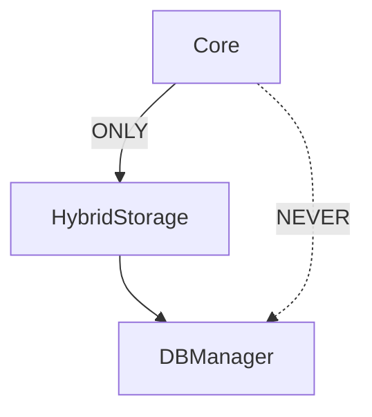

**Rule 2: Core layer MUST NOT import from CLI layer.**

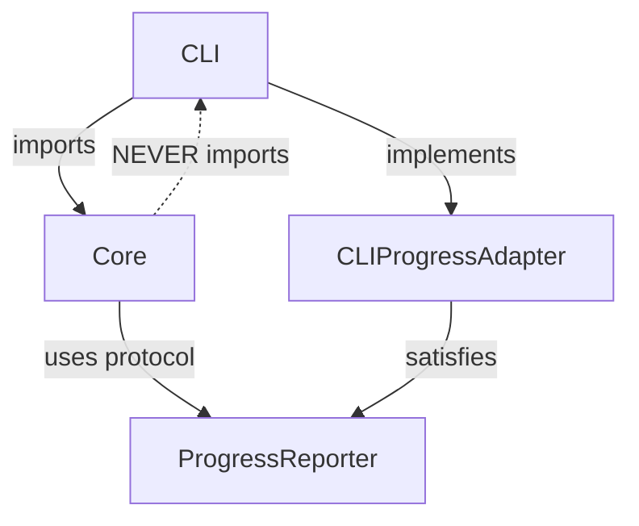

For progress reporting, core components should depend on `ProgressReporter` protocol (not `OutputManager`).

**Rationale:**
- HybridStorage provides transactional guarantees
- Ensures atomic operations across mbox + database
- Centralizes validation and integrity checking
- Maintains layer boundaries and testability
- Enables alternative UIs (GUI, API) without changing core

### Known Layer Violations (to fix)

| Component | Violation | Fix |
|-----------|-----------|-----|
| `ArchiverFacade` | Imports `OperationHandle`, `OutputManager` from CLI | Use `ProgressReporter` protocol |
| `workflows/archive.py` | Imports `OutputManager` from CLI | Use `ProgressReporter` protocol |

---

## Components

### ArchiverFacade (archiver/facade.py)

Main archiving orchestrator - coordinates Gmail fetch, mbox write, and database operations.
This is the **public API** for archiving operations.

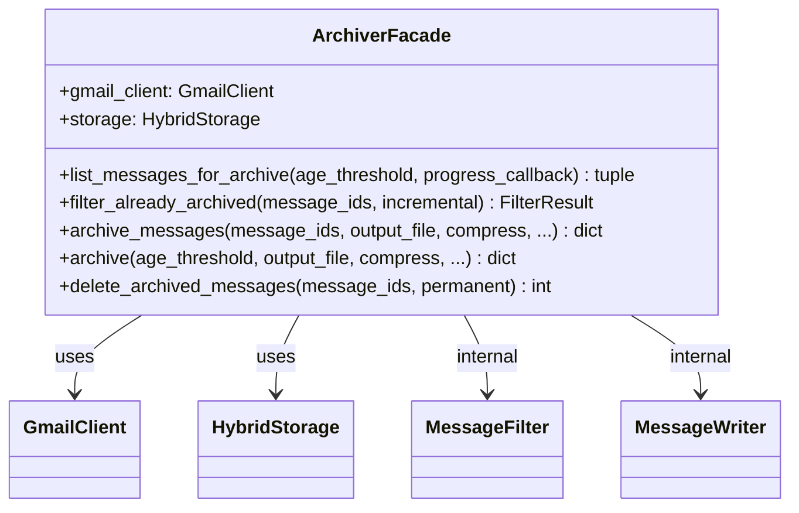

**Internal Modules** (implementation details, not public API):
- `_filter.py`: `MessageFilter` - filters already-archived messages
- `_writer.py`: `MessageWriter` - writes messages to mbox with atomic operations

**Note:** ArchiverFacade currently imports `OperationHandle` from CLI layer - this is a layer violation that should be fixed by using `ProgressReporter` protocol instead.

### ArchiveValidator

Multi-layer archive validation before deletion.

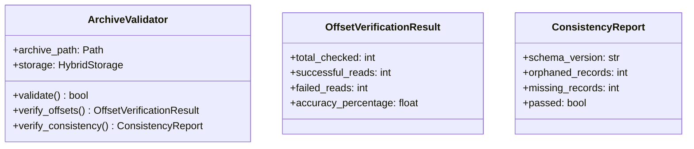

### ArchiveImporter

Import existing mbox archives into database.

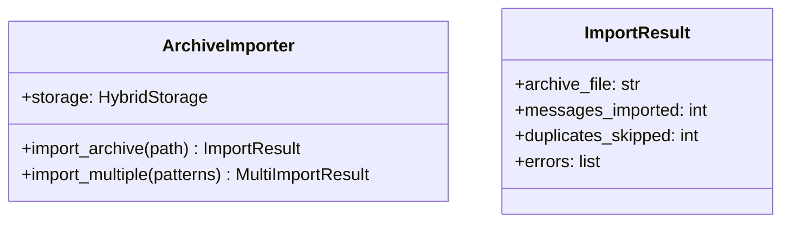

### ArchiveConsolidator

Merge multiple archives into one.

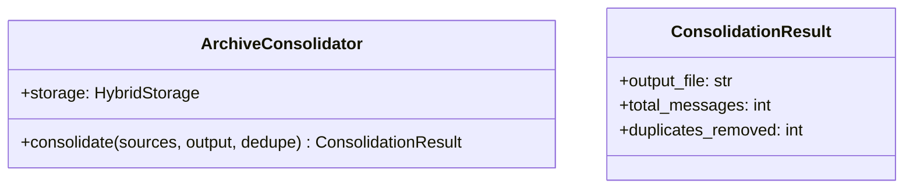

### MessageDeduplicator

Message-ID based deduplication across archives.

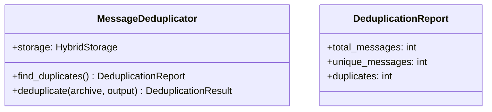

### SearchEngine

Full-text search via SQLite FTS5.

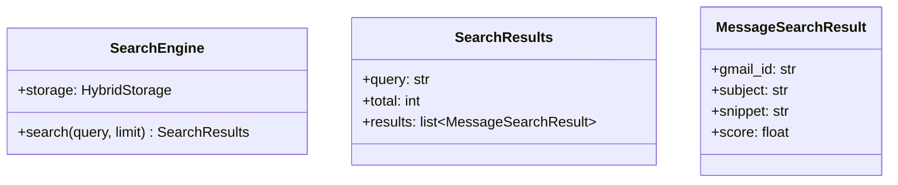

### MessageExtractor

Extract messages from archives by ID or criteria.

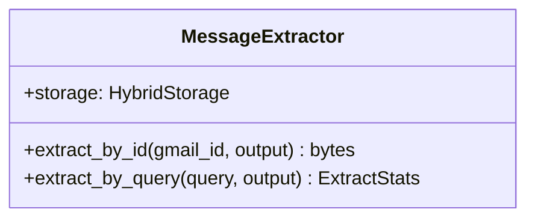

### ArchiveCompressor

Compress/decompress archive files.

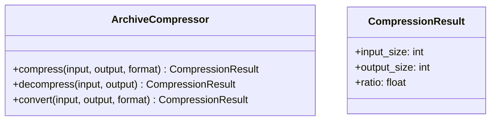

### Doctor

System diagnostics and auto-repair.

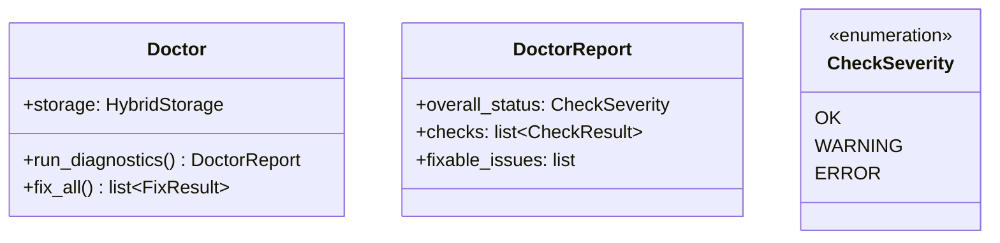

---

## Data Flow

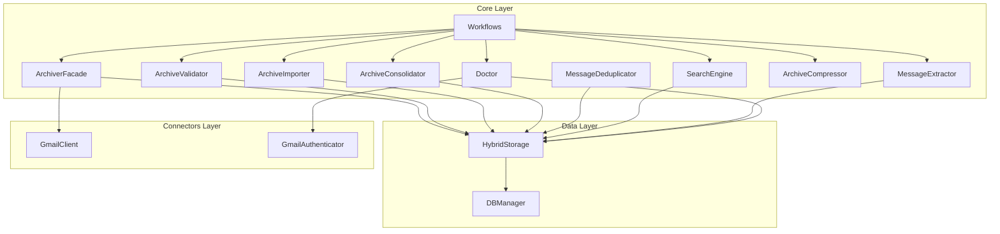

## Workflows Module

The workflows module contains **class-based** async business logic orchestrators:

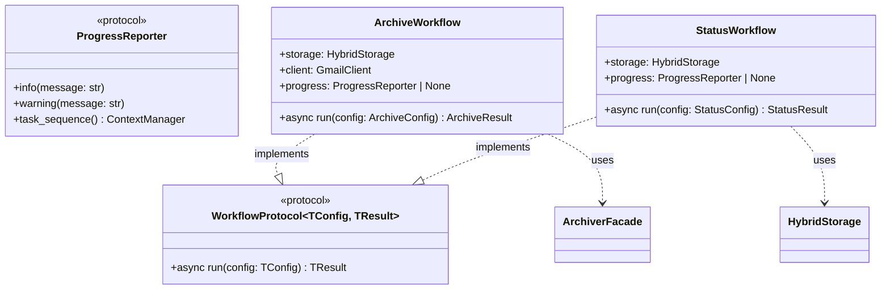

### Workflow Pattern

Each workflow:
- Is a **class** implementing `WorkflowProtocol[TConfig, TResult]`
- Has a **`run(config)` method** (not `execute`)
- Receives dependencies via **constructor injection**
- Depends on **ProgressReporter protocol** (not CLI types)
- Returns **typed Result dataclass**
- Uses **facades** for core operations

**Example:**
```python
class ArchiveWorkflow:
    """Workflow for archiving Gmail messages."""

    def __init__(
        self,
        storage: HybridStorage,
        client: GmailClient,
        progress: ProgressReporter | None = None,
    ) -> None:
        self.storage = storage
        self.client = client
        self.progress = progress

    async def run(self, config: ArchiveConfig) -> ArchiveResult:
        """Execute archive workflow."""
        # Report progress via protocol (if available)
        if self.progress:
            with self.progress.task_sequence() as seq:
                with seq.task("Archiving") as t:
                    result = await self._do_archive(config)
                    t.complete(f"Archived {result.count} messages")

        # Return typed result dataclass
        return ArchiveResult(
            archived_count=result.count,
            output_file=result.file,
            validation_passed=result.validated,
        )
```

**Key Design Decisions:**
- Workflows depend on `ProgressReporter` **protocol**, not CLI types
- CLI layer creates `CLIProgressAdapter` that implements the protocol
- This maintains layer boundaries and enables testability

---

## Testing Strategy

| Component | Test Focus |
|-----------|------------|
| `ArchiverFacade` | Atomic operations, incremental mode, compression |
| `ArchiveValidator` | Offset verification, consistency checks |
| `ArchiveImporter` | Glob patterns, deduplication, error handling |
| `ArchiveConsolidator` | Merge operations, offset updates |
| `MessageDeduplicator` | Message-ID matching, preservation logic |
| `SearchEngine` | FTS5 queries, ranking, Gmail syntax |
| `MessageExtractor` | Offset-based retrieval, compression support |
| `ArchiveCompressor` | All formats, streaming, integrity |
| `Doctor` | Diagnostics, auto-fix, edge cases |
| `Workflows` | Business logic orchestration, error handling, progress reporting |

See `tests/core/` for test implementations.
