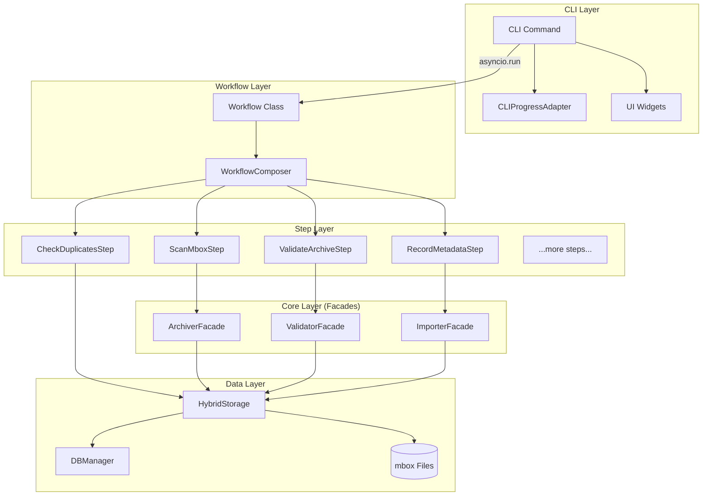
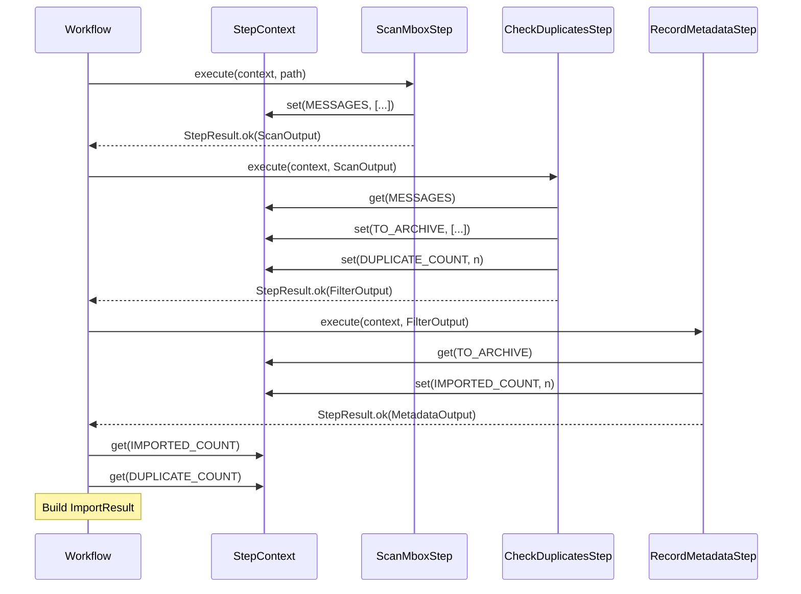
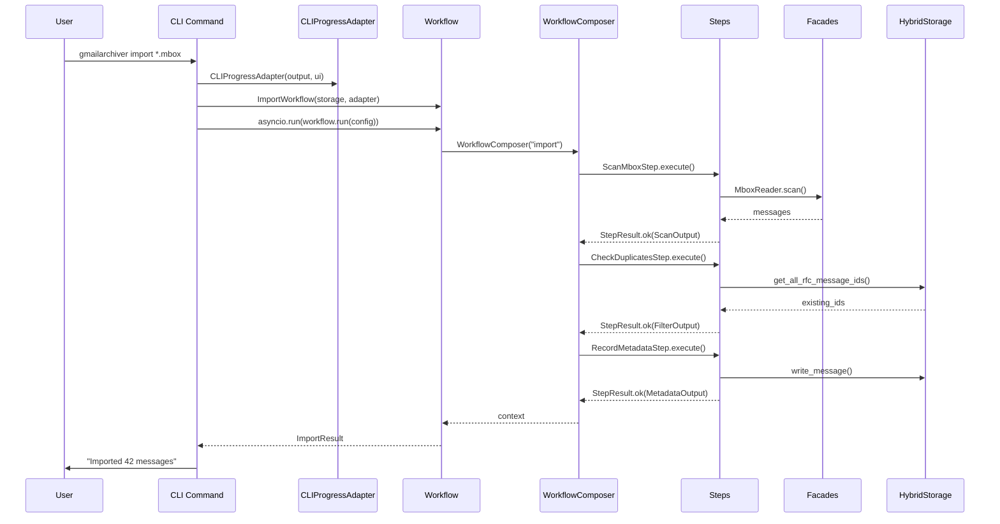

# Workflows Architecture

**Last Updated:** 2025-12-19
**Status:** Production (v1.9.0+)

This document defines the architecture of the workflows module, which contains the async business logic for all CLI commands. Workflows are **class-based** with a `run()` method, use **Step composition** for reusable operations, and use **protocol-based dependency injection** to maintain layer boundaries.

---

## Table of Contents

- [Design Principles](#design-principles)
- [Component Hierarchy](#component-hierarchy)
- [Step Architecture](#step-architecture)
- [Workflow Architecture](#workflow-architecture)
- [Progress Reporting](#progress-reporting)
- [Data Flow](#data-flow)
- [Step Library](#step-library)
- [Integration Points](#integration-points)
- [Testing Strategy](#testing-strategy)
- [Migration Checklist](#migration-checklist)

---

## Design Principles

### Thin Client Pattern

The workflows module implements the **thin client pattern** where:

1. **CLI commands are synchronous** (due to Typer limitations)
2. **Workflows are asynchronous** (business logic orchestration)
3. **Steps are reusable async units** (composable operations)
4. **Single `asyncio.run()` call per command** bridges the sync/async boundary
5. **All layers depend on protocols, not concrete types**

### Composition Over Inheritance

Workflows are built by **composing reusable Steps** rather than inheriting from base classes:

```
Workflow = Step1 + Step2 + Step3 + ...
```

This enables:
- **Code reuse**: Same step used across multiple workflows
- **Consistency**: Fix once, benefit everywhere
- **Testability**: Steps are independently testable units
- **Flexibility**: Workflows can mix-and-match steps as needed

### Single Responsibility

| Component | Responsibility |
|-----------|----------------|
| **Step** | One atomic operation (scan, filter, validate, etc.) |
| **Workflow** | Orchestrates steps for one command |
| **Facade** | Domain logic abstraction (called by steps) |
| **CLI Command** | User interface, result formatting |

---

## Component Hierarchy



---

## Step Architecture

### Step Protocol

A Step is a **reusable async unit of work** with a defined interface:

```python
from typing import Protocol, Any
from dataclasses import dataclass, field

@dataclass
class StepResult[T]:
    """Result from step execution."""
    success: bool
    data: T | None = None
    error: str | None = None
    metadata: dict[str, Any] = field(default_factory=dict)

    @classmethod
    def ok(cls, data: T, **metadata: Any) -> StepResult[T]:
        return cls(success=True, data=data, metadata=metadata)

    @classmethod
    def fail(cls, error: str, **metadata: Any) -> StepResult[T]:
        return cls(success=False, error=error, metadata=metadata)


class Step(Protocol):
    """Protocol for workflow steps."""

    @property
    def name(self) -> str:
        """Unique identifier for this step."""
        ...

    @property
    def description(self) -> str:
        """Human-readable description (shown in progress)."""
        ...

    async def execute(
        self,
        context: StepContext,
        input_data: Any,
        progress: ProgressReporter | None = None,
    ) -> StepResult[Any]:
        """Execute this step."""
        ...
```

### StepContext

Steps communicate via a **shared context dictionary**:

```python
class StepContext:
    """Shared state passed between steps in a workflow."""

    def get(self, key: str, default: T | None = None) -> T | None: ...
    def set(self, key: str, value: Any) -> None: ...
    def __contains__(self, key: str) -> bool: ...
    def __getitem__(self, key: str) -> Any: ...
    def __setitem__(self, key: str, value: Any) -> None: ...
```

**Standard Context Keys** (use `ContextKeys` enum for consistency):

| Key | Type | Set By | Used By |
|-----|------|--------|---------|
| `MBOX_PATH` | `str` | ScanMboxStep | RecordMetadataStep, ValidateArchiveStep |
| `ARCHIVE_FILE` | `str` | ScanMboxStep | RecordMetadataStep, ValidateArchiveStep |
| `MESSAGES` | `list[tuple]` | ScanMboxStep | CheckDuplicatesStep |
| `TO_ARCHIVE` | `list[tuple]` | CheckDuplicatesStep | RecordMetadataStep |
| `DUPLICATE_COUNT` | `int` | CheckDuplicatesStep | Workflow result |
| `IMPORTED_COUNT` | `int` | RecordMetadataStep | Workflow result |
| `VALIDATION_PASSED` | `bool` | ValidateArchiveStep | Workflow result |

### Step Implementation Pattern

```python
from dataclasses import dataclass
from gmailarchiver.core.workflows.step import Step, StepContext, StepResult, ContextKeys
from gmailarchiver.shared.protocols import ProgressReporter

@dataclass
class ScanOutput:
    """Typed output for ScanMboxStep."""
    archive_file: str
    total_messages: int
    scanned_messages: list[tuple[str, int, int]]  # (rfc_id, offset, length)


class ScanMboxStep:
    """Step that scans an mbox file for messages.

    Input: MboxScanInput with archive path
    Output: ScanOutput with message info
    Context: Sets MBOX_PATH, ARCHIVE_FILE, MESSAGES
    """

    name = "scan_mbox"
    description = "Scanning mbox for messages"

    async def execute(
        self,
        context: StepContext,
        input_data: str | Path,
        progress: ProgressReporter | None = None,
    ) -> StepResult[ScanOutput]:
        archive_path = Path(input_data)

        if not archive_path.exists():
            return StepResult.fail(f"Archive not found: {archive_path}")

        # Store in context for subsequent steps
        context.set(ContextKeys.MBOX_PATH, str(archive_path))
        context.set(ContextKeys.ARCHIVE_FILE, str(archive_path))

        # Perform scanning with progress feedback
        if progress:
            with progress.task_sequence() as seq:
                with seq.task(f"Scanning {archive_path.name}") as task:
                    messages = await self._scan(archive_path)
                    task.complete(f"Found {len(messages):,} messages")
        else:
            messages = await self._scan(archive_path)

        # Store in context
        context.set(ContextKeys.MESSAGES, messages)

        output = ScanOutput(
            archive_file=str(archive_path),
            total_messages=len(messages),
            scanned_messages=messages,
        )

        return StepResult.ok(output, count=len(messages))

    async def _scan(self, path: Path) -> list[tuple[str, int, int]]:
        # Actual scanning logic using facades/readers
        ...
```

### Step Dependencies

Steps receive dependencies via **constructor injection**:

```python
class CheckDuplicatesStep:
    """Step requiring database access."""

    def __init__(self, db_manager: DBManager) -> None:
        self.db_manager = db_manager

    async def execute(self, context: StepContext, input_data: Any, ...) -> StepResult[FilterOutput]:
        existing_ids = await self.db_manager.get_all_rfc_message_ids()
        # Filter logic...
```

---

## Workflow Architecture

### WorkflowComposer

The `WorkflowComposer` composes steps into executable workflows with support for conditional execution:

```python
from collections.abc import Callable

class WorkflowComposer:
    """Composes steps into executable workflows.

    Supports:
    - Sequential step execution with data passing
    - Conditional steps that only run when condition is met
    - Automatic error handling (raises WorkflowError on step failure)
    """

    def __init__(self, name: str) -> None:
        self.name = name
        self._steps: list[tuple[Step, Callable[[StepContext], bool] | None]] = []

    def add_step(self, step: Step) -> WorkflowComposer:
        """Add a step that always executes."""
        self._steps.append((step, None))
        return self

    def add_conditional_step(
        self,
        step: Step,
        condition: Callable[[StepContext], bool],
    ) -> WorkflowComposer:
        """Add a step that only executes when condition(context) is True.

        Args:
            step: The step to conditionally execute
            condition: Callable that takes StepContext and returns bool.
                       Step is skipped if condition returns False.

        Example:
            .add_conditional_step(
                WriteMessagesStep(archiver),
                lambda ctx: bool(ctx.get(ContextKeys.TO_ARCHIVE)) and not ctx.get("dry_run")
            )

        IMPORTANT: Conditions should only read from StepContext. Store config
        values in context before running the workflow, not captured from CLI scope.
        This maintains layer separation.
        """
        self._steps.append((step, condition))
        return self

    async def run(
        self,
        initial_input: Any,
        progress: ProgressReporter | None = None,
        context: StepContext | None = None,
    ) -> StepContext:
        """Execute all steps in sequence.

        - Each step's output becomes the next step's input
        - Conditional steps are skipped if condition returns False
        - Raises WorkflowError if any step fails
        - Steps must handle empty input gracefully (return success with zeros/empty)
        """
        if context is None:
            context = StepContext()

        current_input = initial_input

        for step, condition in self._steps:
            # Skip conditional steps when condition is False
            if condition is not None and not condition(context):
                continue

            result = await step.execute(context, current_input, progress)

            if not result.success:
                raise WorkflowError(step.name, result.error)

            current_input = result.data

        return context
```

### Conditional Step Design

Conditional steps enable declarative workflow composition without manual orchestration:

```python
# Store config in context (workflow layer, not CLI layer)
context = StepContext()
context.set("dry_run", config.dry_run)
context.set("compress", config.compress)
context.set(ContextKeys.ARCHIVE_FILE, output_file)

# Compose workflow with conditional steps
workflow = (
    WorkflowComposer("archive")
    .add_step(ScanGmailMessagesStep(archiver))
    .add_step(FilterGmailMessagesStep(archiver))
    .add_conditional_step(
        WriteMessagesStep(archiver),
        lambda ctx: bool(ctx.get(ContextKeys.TO_ARCHIVE)) and not ctx.get("dry_run")
    )
    .add_conditional_step(
        ValidateArchiveStep(db),
        lambda ctx: ctx.get(ContextKeys.ARCHIVED_COUNT, 0) > 0 and not ctx.get("dry_run")
    )
)

result_context = await workflow.run(initial_input, progress, context)
```

**Key Principles:**

1. **Conditions read from context only**: Never capture CLI variables in lambdas
2. **Steps handle empty input**: Return `StepResult.ok()` with zeros/empty data
3. **No early exit needed**: Empty data flows through, conditionals skip naturally
4. **All workflows use WorkflowComposer**: No manual step orchestration

### Workflow Class Pattern

Workflows are **classes** that orchestrate steps:

```python
@dataclass
class ImportConfig:
    """Configuration for import workflow."""
    archive_patterns: list[str]
    state_db: str
    dedupe: bool = True
    account_id: str = "default"


@dataclass
class ImportResult:
    """Result from import workflow."""
    imported_count: int
    skipped_count: int
    duplicate_count: int
    files_processed: list[str]
    errors: list[str] = field(default_factory=list)


class ImportWorkflow:
    """Workflow for importing mbox archives.

    Uses step composition:
    1. ScanMboxStep - Scan for messages
    2. CheckDuplicatesStep - Filter duplicates
    3. RecordMetadataStep - Write to database
    """

    def __init__(
        self,
        storage: HybridStorage,
        progress: ProgressReporter | None = None,
    ) -> None:
        self.storage = storage
        self.progress = progress

    async def run(self, config: ImportConfig) -> ImportResult:
        """Execute the import workflow."""
        total_imported = 0
        total_duplicates = 0
        files_processed = []
        errors = []

        for pattern in config.archive_patterns:
            for file_path in self._find_files(pattern):
                try:
                    result = await self._import_single_file(file_path, config)
                    total_imported += result["imported_count"]
                    total_duplicates += result["duplicate_count"]
                    files_processed.append(str(file_path))
                except WorkflowError as e:
                    errors.append(str(e))

        return ImportResult(
            imported_count=total_imported,
            skipped_count=0,
            duplicate_count=total_duplicates,
            files_processed=files_processed,
            errors=errors,
        )

    async def _import_single_file(self, file_path: str, config: ImportConfig) -> dict:
        """Import a single file using step composition."""
        workflow = (
            WorkflowComposer("import_single")
            .add_step(ScanMboxStep())
            .add_step(CheckDuplicatesStep(self.storage.db))
            .add_step(RecordMetadataStep(self.storage.db))
        )

        context = StepContext()
        context.set("account_id", config.account_id)
        context.set("skip_duplicates", config.dedupe)

        await workflow.run(file_path, progress=self.progress, context=context)

        return {
            "imported_count": context.get(ContextKeys.IMPORTED_COUNT, 0),
            "duplicate_count": context.get(ContextKeys.DUPLICATE_COUNT, 0),
        }
```

### Step Input Handling

Steps must handle input flexibly and gracefully:

#### Input Normalization Pattern

Steps should accept multiple input types and normalize internally:

```python
class CheckDuplicatesStep:
    """Step that filters out already-imported messages."""

    async def execute(
        self,
        context: StepContext,
        input_data: FilterInput | MboxScanOutput | list | None,
        progress: ProgressReporter | None = None,
    ) -> StepResult[FilterOutput]:
        # Normalize input from multiple sources
        if isinstance(input_data, FilterInput):
            scanned_messages = input_data.scanned_messages
        elif isinstance(input_data, MboxScanOutput):
            scanned_messages = input_data.scanned_messages
        elif isinstance(input_data, list):
            scanned_messages = input_data
        else:
            # Fallback to context
            scanned_messages = context.get(ContextKeys.MESSAGES) or []

        # Continue with normalized data...
```

#### Empty Input Handling

**Steps MUST handle empty input gracefully** by returning success with zeros/empty data:

```python
async def execute(self, context, input_data, progress=None) -> StepResult[FilterOutput]:
    scanned_messages = self._normalize_input(input_data, context)

    # Handle empty input - return success, not failure
    if not scanned_messages:
        return StepResult.ok(FilterOutput(
            to_process=[],
            total_count=0,
            new_count=0,
            duplicate_count=0,
        ))

    # Normal processing for non-empty input...
```

**Why this matters:**
- Enables conditional steps to work naturally (empty flows through)
- No need for early exit logic in workflows
- Simplifies workflow composition

### Step Guidelines

| Requirement | Rationale |
|-------------|-----------|
| Handle empty input → return success with zeros | Enables conditional step flow |
| Accept multiple input types → normalize internally | Flexible step composition |
| Store results in context using ContextKeys | Inter-step communication |
| Return StepResult.fail() only for errors | Empty data is not an error |
| Accept dependencies via constructor | Testability and layer separation |

---

## Progress Reporting

### Progress Ownership Pattern

**Key Principle**: Workflows own the task sequence, steps receive individual task handles OR use progress for their own sequences.

There are two valid patterns:

#### Pattern 1: Workflow-Owned Task Sequence (Recommended)

The workflow creates the task sequence and manages all tasks:

```python
class ImportWorkflow:
    async def run(self, config: ImportConfig) -> ImportResult:
        if self.progress:
            with self.progress.task_sequence() as seq:
                # Workflow manages task sequence
                with seq.task("Scanning archives") as task:
                    scan_result = await self._scan(config)
                    task.complete(f"Found {scan_result.count:,} messages")

                with seq.task("Filtering duplicates") as task:
                    filter_result = await self._filter(scan_result)
                    task.complete(f"{filter_result.new_count:,} new messages")

                with seq.task("Importing", total=filter_result.new_count) as task:
                    for msg in filter_result.messages:
                        await self._import_one(msg)
                        task.advance()
                    task.complete(f"Imported {filter_result.new_count:,} messages")
        else:
            # No progress - still works
            scan_result = await self._scan(config)
            filter_result = await self._filter(scan_result)
            # ...
```

#### Pattern 2: Step-Owned Task Sequences (For Complex Steps)

Steps manage their own task sequences when they have multiple sub-tasks:

```python
class ValidateArchiveStep:
    """Complex step with multiple validation checks."""

    async def execute(
        self,
        context: StepContext,
        input_data: str,
        progress: ProgressReporter | None = None,
    ) -> StepResult[ValidateOutput]:
        if progress:
            with progress.task_sequence() as seq:
                with seq.task("Count check") as t:
                    count_ok = await self._check_count()
                    t.complete("Passed" if count_ok else "Failed")

                with seq.task("Integrity check") as t:
                    integrity_ok = await self._check_integrity()
                    t.complete("Passed" if integrity_ok else "Failed")
        else:
            count_ok = await self._check_count()
            integrity_ok = await self._check_integrity()

        return StepResult.ok(ValidateOutput(count_ok=count_ok, integrity_ok=integrity_ok))
```

### Avoiding Double Task Sequences

**Anti-Pattern** (causes visual confusion):

```python
# CLI creates task sequence
with ctx.ui.task_sequence() as seq:
    with seq.task("Importing") as t:
        result = await workflow.run(config)  # Workflow ALSO creates task sequence!
        t.complete(...)
```

**Correct Pattern**:

```python
# Option A: CLI delegates entirely to workflow
result = await workflow.run(config)  # Workflow handles all progress

# Option B: CLI handles progress, workflow doesn't create sequences
with ctx.ui.task_sequence() as seq:
    with seq.task("Importing") as t:
        result = await workflow.run(config)  # Workflow uses progress.info() only
        t.complete(f"Imported {result.count:,}")
```

### ProgressReporter Protocol

```python
class ProgressReporter(Protocol):
    """Protocol for workflow progress reporting.

    Implementations:
    - CLIProgressAdapter: Rich terminal output
    - TestProgressReporter: Captures calls for testing
    - NoOpProgressReporter: Silent (for non-interactive use)
    """

    def info(self, message: str) -> None:
        """Log informational message."""
        ...

    def warning(self, message: str) -> None:
        """Log warning message."""
        ...

    def error(self, message: str) -> None:
        """Log error message."""
        ...

    def task_sequence(self) -> ContextManager[TaskSequence]:
        """Create a task sequence for multi-step operations."""
        ...


class TaskSequence(Protocol):
    """Protocol for task sequences."""

    def task(
        self, description: str, total: int | None = None
    ) -> ContextManager[TaskHandle]:
        """Create a task within the sequence."""
        ...


class TaskHandle(Protocol):
    """Protocol for controlling a single task."""

    def complete(self, message: str) -> None:
        """Mark task as successfully completed."""
        ...

    def fail(self, message: str, reason: str | None = None) -> None:
        """Mark task as failed."""
        ...

    def advance(self, n: int = 1) -> None:
        """Advance progress counter."""
        ...

    def set_total(self, total: int, description: str | None = None) -> None:
        """Set total for late-bound progress."""
        ...

    def log(self, message: str, level: str = "INFO") -> None:
        """Log message within task context."""
        ...
```

---

## Data Flow

### Step Data Flow



### Command Execution Flow



---

## Step Library

### Current Steps

| Step | Purpose | Input | Output |
|------|---------|-------|--------|
| `ScanMboxStep` | Scan mbox for RFC Message-IDs | path | ScanOutput |
| `CheckDuplicatesStep` | Filter already-imported messages | ScanOutput | FilterOutput |
| `RecordMetadataStep` | Write message metadata to DB | FilterOutput | MetadataOutput |
| `ValidateArchiveStep` | Validate archive integrity | path | ValidateOutput |

### Planned Steps

| Step | Purpose | Used By |
|------|---------|---------|
| `AuthenticateGmailStep` | OAuth authentication | archive, retry-delete |
| `ScanGmailMessagesStep` | Query Gmail API | archive |
| `FilterArchivedMessagesStep` | Filter already-archived | archive |
| `WriteMessagesStep` | Write messages to mbox | archive, consolidate |
| `DeleteMessagesStep` | Trash/delete from Gmail | archive, retry-delete |
| `VerifyIntegrityStep` | Database integrity check | verify, doctor |
| `RepairDatabaseStep` | Fix database issues | repair, doctor |

### Step Naming Convention

```
<Verb><Noun>Step

Examples:
- ScanMboxStep (verb: Scan, noun: Mbox)
- CheckDuplicatesStep (verb: Check, noun: Duplicates)
- WriteArchiveStep (verb: Write, noun: Archive)
```

---

## Integration Points

### Dependencies (What Workflows/Steps CAN Import)

```python
# From core layer (FACADES)
from gmailarchiver.core.archiver import ArchiverFacade
from gmailarchiver.core.validator import ValidatorFacade
from gmailarchiver.core.importer import ImporterFacade
# ... other facades

# From data layer (via constructor injection)
from gmailarchiver.data.hybrid_storage import HybridStorage
from gmailarchiver.data.db_manager import DBManager  # For steps only

# From connectors layer (via constructor injection)
from gmailarchiver.connectors.gmail_client import GmailClient

# From shared layer (protocols)
from gmailarchiver.shared.protocols import ProgressReporter, TaskSequence, TaskHandle
```

### Forbidden Dependencies (What Workflows/Steps MUST NOT Import)

```python
# NEVER import CLI types - breaks layer boundary
# ❌ from gmailarchiver.cli.output import OutputManager
# ❌ from gmailarchiver.cli.command_context import CommandContext
# ❌ from gmailarchiver.cli.ui_builder import UIBuilder
# ❌ from gmailarchiver.cli.widgets import ReportCard
```

### Dependents (Who Uses Workflows)

```python
# CLI commands import workflows
from gmailarchiver.core.workflows import ImportWorkflow, ImportConfig, ImportResult
from gmailarchiver.cli.adapters import CLIProgressAdapter

async def import_command(ctx: CommandContext, archive_pattern: str, ...):
    adapter = CLIProgressAdapter(ctx.output, ctx.ui)
    workflow = ImportWorkflow(ctx.storage, progress=adapter)
    config = ImportConfig(archive_patterns=[archive_pattern], ...)

    result = await workflow.run(config)

    # CLI handles display using widgets
    ReportCard("Import Results")
        .add_field("Imported", f"{result.imported_count:,}")
        .render(ctx.output)
```

---

## Testing Strategy

### Step Tests

```python
@pytest.mark.asyncio
async def test_scan_mbox_step_success(tmp_path: Path):
    """ScanMboxStep returns messages for valid mbox."""
    # Arrange
    mbox_path = tmp_path / "test.mbox"
    mbox_path.write_text("From test@example.com\nMessage-ID: <123>\n\nBody\n")

    step = ScanMboxStep()
    context = StepContext()

    # Act
    result = await step.execute(context, str(mbox_path))

    # Assert
    assert result.success
    assert result.data.total_messages == 1
    assert context.get(ContextKeys.MESSAGES) is not None


@pytest.mark.asyncio
async def test_scan_mbox_step_file_not_found():
    """ScanMboxStep fails gracefully for missing file."""
    step = ScanMboxStep()
    context = StepContext()

    result = await step.execute(context, "/nonexistent.mbox")

    assert not result.success
    assert "not found" in result.error.lower()
```

### Workflow Tests

```python
@pytest.mark.asyncio
async def test_import_workflow_success(mock_storage, tmp_mbox):
    """ImportWorkflow imports messages and returns result."""
    workflow = ImportWorkflow(mock_storage)
    config = ImportConfig(archive_patterns=[str(tmp_mbox)], state_db="test.db")

    result = await workflow.run(config)

    assert result.imported_count > 0
    assert str(tmp_mbox) in result.files_processed


@pytest.mark.asyncio
async def test_import_workflow_with_progress(mock_storage, tmp_mbox):
    """ImportWorkflow reports progress correctly."""
    progress = Mock(spec=ProgressReporter)
    progress.task_sequence.return_value.__enter__ = Mock(return_value=Mock())
    progress.task_sequence.return_value.__exit__ = Mock(return_value=None)

    workflow = ImportWorkflow(mock_storage, progress=progress)
    config = ImportConfig(archive_patterns=[str(tmp_mbox)], state_db="test.db")

    await workflow.run(config)

    progress.task_sequence.assert_called()
```

### Coverage Requirements

| Component | Target | Focus |
|-----------|--------|-------|
| Steps | 95%+ | All branches, error conditions |
| Workflows | 90%+ | Happy path, error handling |
| WorkflowComposer | 95%+ | Edge cases, failures |

---

## Migration Checklist

### Creating a New Step

1. [ ] Define **Input/Output dataclasses** with clear types
2. [ ] Implement **Step class** with `name`, `description`, `execute()`
3. [ ] Use **ContextKeys** for standard context keys
4. [ ] Accept **dependencies via constructor** (DBManager, etc.)
5. [ ] **Handle empty input gracefully** - return success with zeros/empty
6. [ ] **Normalize input** - accept multiple types (dataclass, raw data, context fallback)
7. [ ] Handle **progress reporting** when progress is provided
8. [ ] Return **StepResult.ok()** or **StepResult.fail()** (only for errors)
9. [ ] Document **what context keys step reads/writes**
10. [ ] Write **unit tests** for success, empty input, and error cases
11. [ ] Add to **steps/__init__.py** exports

### Creating a New Workflow

1. [ ] Define **Config dataclass** for workflow parameters
2. [ ] Define **Result dataclass** for typed return values
3. [ ] Use **constructor injection** for dependencies (storage, client, progress)
4. [ ] **Store config in context** before running (not captured in lambdas)
5. [ ] Compose workflow using **WorkflowComposer** with `add_step()` and `add_conditional_step()`
6. [ ] Use **conditional steps** for optional operations (dry-run, validation, etc.)
7. [ ] Build result from **context values** after workflow.run()
8. [ ] Handle **WorkflowError** in CLI layer
9. [ ] Document **which steps are used** in docstring
10. [ ] Write **tests** for workflow success, empty input, and error scenarios
11. [ ] Add to **workflows/__init__.py** exports

### Migrating Existing Workflow to Steps

1. [ ] Identify **reusable operations** in the workflow
2. [ ] Extract each operation to a **new Step class**
3. [ ] Ensure steps **handle empty input** gracefully
4. [ ] Update workflow to use **WorkflowComposer**
5. [ ] Convert **early exit logic** to conditional steps
6. [ ] **Remove deprecated wrapper methods** (e.g., `_scan_messages()`, `_filter_messages()`)
7. [ ] Verify **progress reporting** still works correctly
8. [ ] Ensure **no double task sequences**
9. [ ] Update **tests** to cover both step and workflow levels

### Code to Remove During Migration

The following deprecated patterns should be removed:

```python
# REMOVE: Deprecated wrapper methods in workflows
async def _scan_messages(self, ...):  # Use Step directly
async def _filter_messages(self, ...):  # Use Step directly
async def _archive_messages(self, ...):  # Use Step directly

# REMOVE: Manual step orchestration
scan_result = await self._scan_step.execute(...)
if not scan_result.success or not scan_result.data:
    return ArchiveResult(...)  # Early exit - use conditional steps instead

# REPLACE WITH: WorkflowComposer with conditional steps
workflow = (
    WorkflowComposer("archive")
    .add_step(scan_step)
    .add_conditional_step(write_step, condition)
)
result_context = await workflow.run(input, progress, context)
```

---

## Related Documentation

- **[docs/ARCHITECTURE.md](../../../docs/ARCHITECTURE.md)** - System-wide architecture
- **[cli/ui/ARCHITECTURE.md](../../cli/ui/ARCHITECTURE.md)** - UI widgets and builders
- **[core/ARCHITECTURE.md](../../core/ARCHITECTURE.md)** - Business logic layer
- **[docs/PROCESS.md](../../../docs/PROCESS.md)** - Development workflow
- **[docs/UI_UX_CLI.md](../../../docs/UI_UX_CLI.md)** - CLI output guidelines
