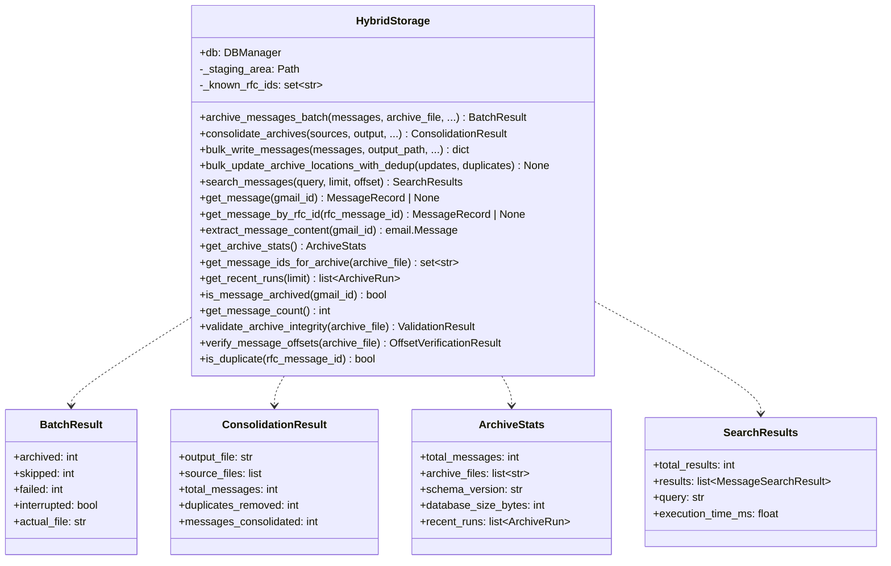
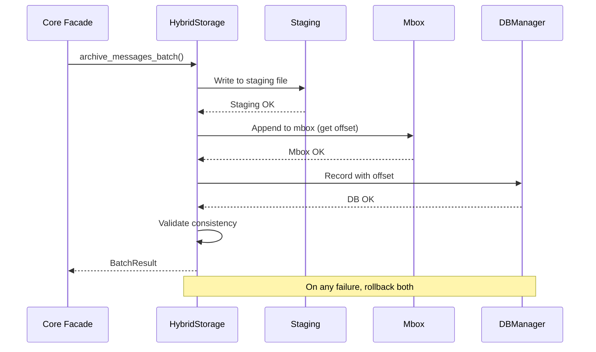
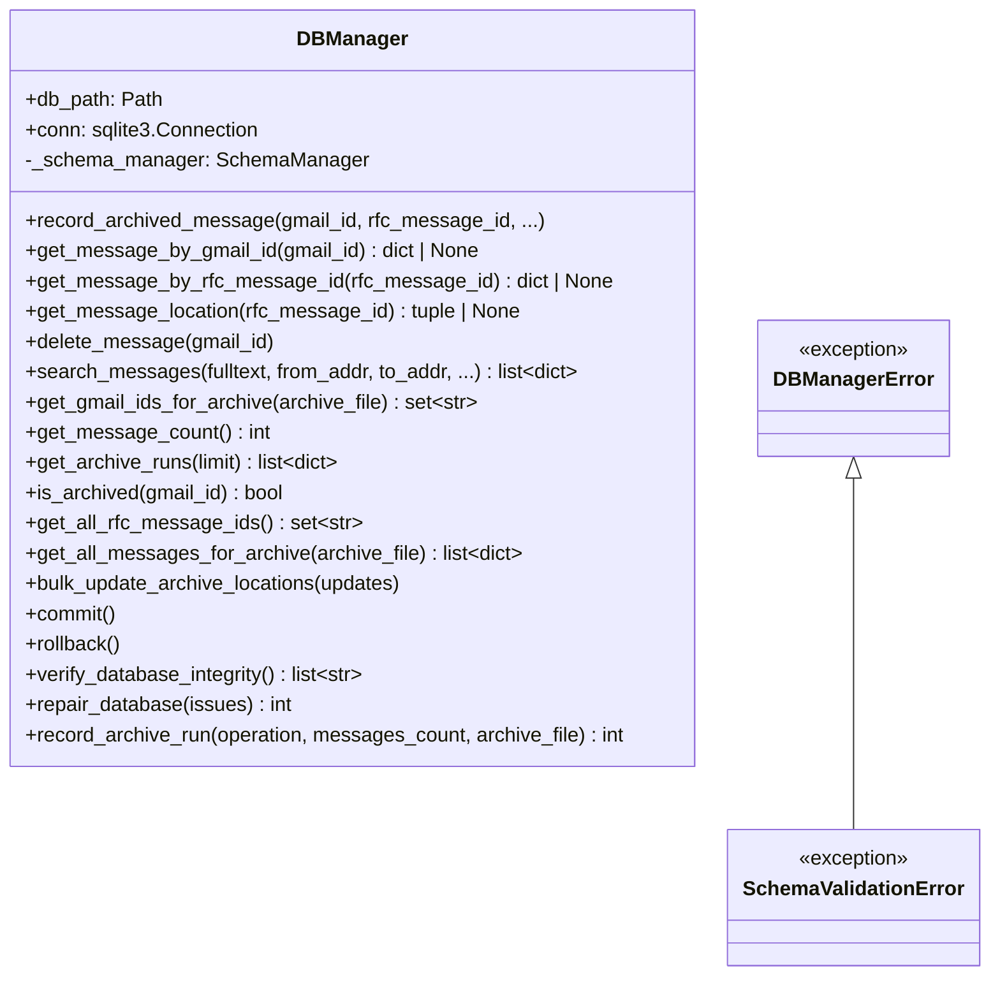
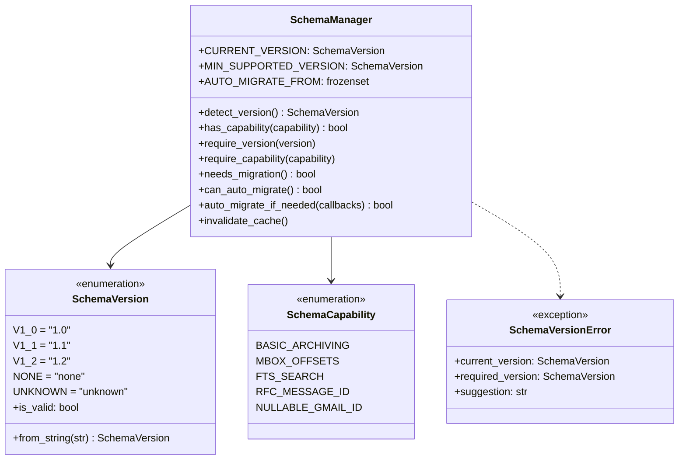
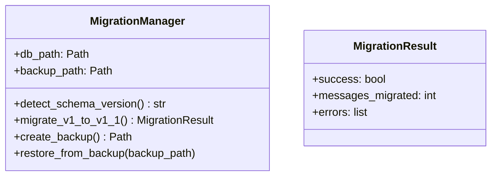
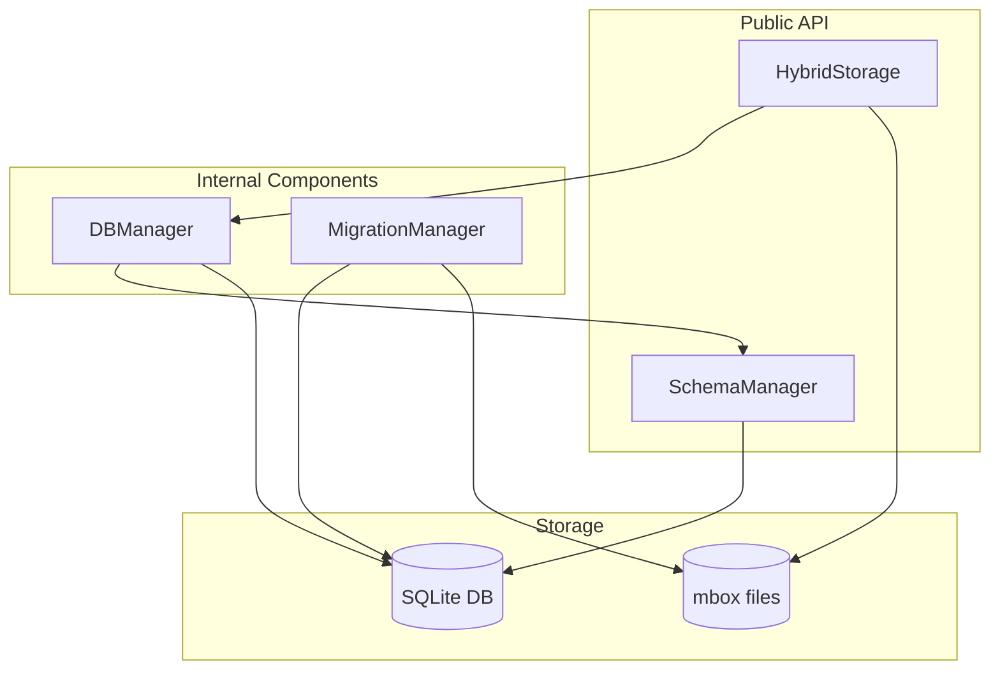
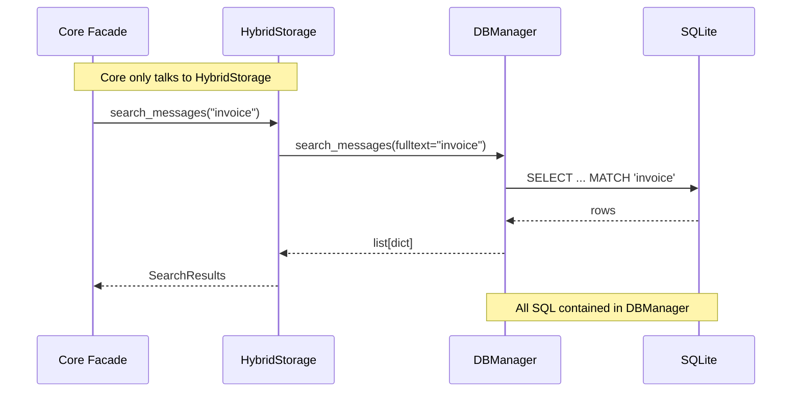

# Data Layer Architecture

**Last Updated:** 2025-12-08
**Schema Version:** 1.2
**Status:** Production (v1.6.0+)

The data layer manages all persistent state: SQLite database and mbox file operations. It provides transactional guarantees for atomic operations across both storage systems.

---

## Design Principles

### SOLID Compliance

| Principle | Application |
|-----------|-------------|
| **Single Responsibility** | Each component has one clear purpose |
| **Open/Closed** | Extensible via new methods, not modification |
| **Liskov Substitution** | Components are swappable via consistent interfaces |
| **Interface Segregation** | Small, focused interfaces per use case |
| **Dependency Inversion** | Core depends on HybridStorage abstraction, not DBManager |

### Key Invariant: Single Entry Point

**HybridStorage is the ONLY gateway for data operations from the core layer.**

```
                    CORE LAYER
                        |
                        v
              +-----------------+
              |  HybridStorage  |  <-- Single Entry Point
              |  (public API)   |
              +--------+--------+
                       |
          +------------+------------+
          |                         |
          v                         v
    +-----------+             +-----------+
    | DBManager |             | mbox I/O  |
    | (internal)|             | (internal)|
    +-----------+             +-----------+
          |
          v
    +-------------+
    |SchemaManager|
    +-------------+
```

**Rules:**
- Core layer components use **HybridStorage** exclusively
- Core layer **NEVER** imports or uses DBManager directly
- DBManager is an internal implementation detail
- All SQL is contained within DBManager (no SQL elsewhere)

---

## Layer Contract

| Property | Value |
|----------|-------|
| **Dependencies** | `shared` layer only |
| **Dependents** | `core` layer (via HybridStorage only) |
| **Public API** | `HybridStorage`, `SchemaManager`, `SchemaCapability`, `SchemaVersion` |
| **Internal** | `DBManager`, `MigrationManager` |
| **Thread Safety** | Not thread-safe (SQLite connections are not shared) |

### Public Exports

```python
# What core layer CAN import:
from gmailarchiver.data import (
    HybridStorage,           # Primary data gateway
    SchemaManager,           # Version checking
    SchemaVersion,           # Version enum
    SchemaCapability,        # Feature flags
    SchemaVersionError,      # Error type
    IntegrityError,          # Error type
    HybridStorageError,      # Error type
)

# What core layer should NOT import:
# - DBManager (internal)
# - MigrationManager (internal, use via CLI only)
```

---

## Components

### HybridStorage (Public API)

**The single gateway for all data operations from the core layer.**

Provides both READ and WRITE operations with transactional guarantees.



#### Interface Categories

**Write Operations** (existing):
| Method | Purpose |
|--------|---------|
| `archive_messages_batch()` | Archive multiple messages atomically |
| `consolidate_archives()` | Merge multiple archives into one |
| `bulk_write_messages()` | Low-level batch write for consolidation |
| `bulk_update_archive_locations_with_dedup()` | Update DB records after consolidation |

**Read Operations** (new):
| Method | Purpose |
|--------|---------|
| `search_messages()` | Full-text + metadata search |
| `get_message()` | Get message record by gmail_id |
| `get_message_by_rfc_id()` | Get message record by RFC Message-ID |
| `extract_message_content()` | Read full message from mbox |

**Statistics** (new - replaces ArchiveState):
| Method | Purpose |
|--------|---------|
| `get_archive_stats()` | Get comprehensive statistics |
| `get_message_ids_for_archive()` | Get gmail_ids for specific archive |
| `get_recent_runs()` | Get recent archive operations |
| `is_message_archived()` | Check if message is already archived |
| `get_message_count()` | Get total message count |

**Validation**:
| Method | Purpose |
|--------|---------|
| `validate_archive_integrity()` | Full archive validation |
| `verify_message_offsets()` | Check mbox offset accuracy |
| `is_duplicate()` | Check if RFC Message-ID exists |

#### Guarantees

1. **Atomicity**: Both mbox and database succeed, OR both are rolled back
2. **Validation**: After every write, consistency is verified
3. **Recovery**: Staging area allows rollback on failures
4. **Performance**: Pre-loaded RFC Message-IDs for O(1) duplicate detection

#### Two-Phase Commit Pattern



---

### DBManager (Internal)

**Internal component - NOT for use by core layer.**

Single source of truth for all SQL operations with transaction management.



#### Key Methods

**Message Operations:**
| Method | Purpose |
|--------|---------|
| `record_archived_message()` | Record a newly archived message |
| `get_message_by_gmail_id()` | Get message record by Gmail ID |
| `get_message_location()` | Get (file, offset, length) for message retrieval |
| `delete_message()` | Remove message from database |

**Query Operations (new):**
| Method | Purpose |
|--------|---------|
| `search_messages()` | FTS5 + metadata search (internal implementation) |
| `get_gmail_ids_for_archive()` | Get gmail_ids for specific archive file |
| `get_message_count()` | Total archived message count |
| `get_archive_runs()` | Recent operation history |
| `is_archived()` | Check if gmail_id is already archived |

**Bulk Operations:**
| Method | Purpose |
|--------|---------|
| `get_all_rfc_message_ids()` | Get all RFC Message-IDs (for dedup) |
| `get_all_messages_for_archive()` | Get all messages for an archive |
| `bulk_update_archive_locations()` | Update multiple records atomically |

#### SQL Containment Rule

**ALL SQL queries are contained within DBManager.**

```python
# CORRECT: SQL in DBManager
class DBManager:
    def search_messages(self, fulltext: str | None = None, ...):
        sql = """
            SELECT ... FROM messages
            JOIN messages_fts ON ...
            WHERE messages_fts MATCH ?
        """
        return self.conn.execute(sql, params)

# WRONG: SQL outside DBManager
class SearchExecutor:  # This violates the architecture!
    def __init__(self, db_path):
        self.conn = sqlite3.connect(db_path)  # BAD: own connection

    def _search_fulltext(self, query):
        sql = "SELECT ... FROM messages ..."  # BAD: SQL outside DBManager
```

---

### SchemaManager (Public API)

Version detection, capability checking, and migration coordination.



#### Usage

```python
from gmailarchiver.data import SchemaManager, SchemaCapability

mgr = SchemaManager(db_path)

# Check capabilities (preferred over version comparison)
if mgr.has_capability(SchemaCapability.FTS_SEARCH):
    # Use full-text search features
    pass

# Require specific capability
mgr.require_capability(SchemaCapability.MBOX_OFFSETS)  # Raises if not available
```

---

### MigrationManager (Internal)

**Internal component - used by CLI migrate command only.**

Database schema migrations with backup and rollback support.



---

## Data Flow

### Component Relationships



### Core Layer Access Pattern



---

## Schema Versions

| Version | Tables | Capabilities |
|---------|--------|--------------|
| **1.0** | `archived_messages`, `archive_runs` | Basic archiving |
| **1.1** | `messages`, `messages_fts`, `archive_runs`, `schema_version` | FTS, offsets, Message-ID |
| **1.2** | Same as 1.1 + `sessions` | Nullable gmail_id, sessions |

### Capability Matrix

| Capability | v1.0 | v1.1 | v1.2 |
|------------|:----:|:----:|:----:|
| BASIC_ARCHIVING | Yes | Yes | Yes |
| MBOX_OFFSETS | - | Yes | Yes |
| FTS_SEARCH | - | Yes | Yes |
| RFC_MESSAGE_ID | - | Yes | Yes |
| NULLABLE_GMAIL_ID | - | - | Yes |

---

## Testing Strategy

| Component | Test Focus |
|-----------|------------|
| `HybridStorage` | Atomicity, integrity validation, read/write operations |
| `DBManager` | Transactions, rollback, SQL correctness, concurrent access |
| `SchemaManager` | Version detection, capability checks, migration triggers |
| `MigrationManager` | Backup/restore, data preservation, error handling |

See `tests/data/` for test implementations.

---

## Migration Checklist (for developers)

When updating code to use the new architecture:

1. [x] ~~Replace `ArchiveState` imports with `HybridStorage`~~ **COMPLETED**
2. [x] ~~Replace direct `DBManager` usage in core layer with `HybridStorage`~~ **COMPLETED**
3. [x] ~~Remove any `sqlite3.connect()` calls outside DBManager~~ **COMPLETED**
4. [x] ~~Use capability checks instead of version string comparisons~~ **COMPLETED**
5. [x] ~~Update tests to use HybridStorage as the primary interface~~ **COMPLETED**

**Status:** All migration tasks completed as of v1.7.0. ArchiveState has been removed.

---

## Related Documentation

- **[docs/ARCHITECTURE.md](../../../docs/ARCHITECTURE.md)** - System-wide architecture
- **[core/ARCHITECTURE.md](../core/ARCHITECTURE.md)** - Business logic layer
- **[cli/ARCHITECTURE.md](../cli/ARCHITECTURE.md)** - Interface layer
