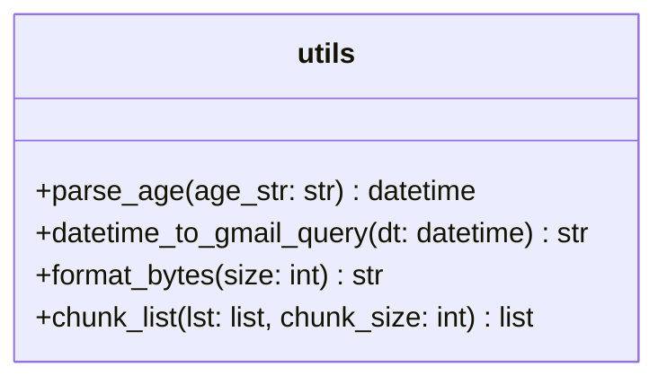
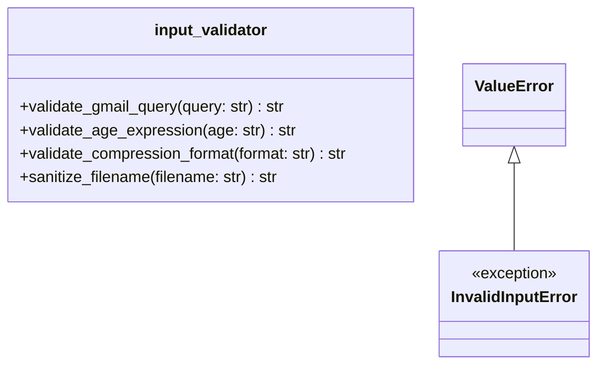
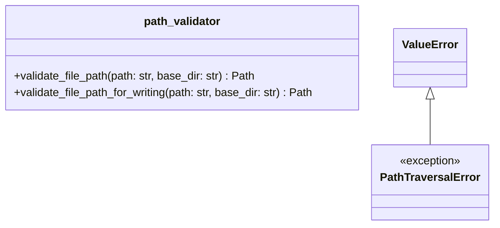
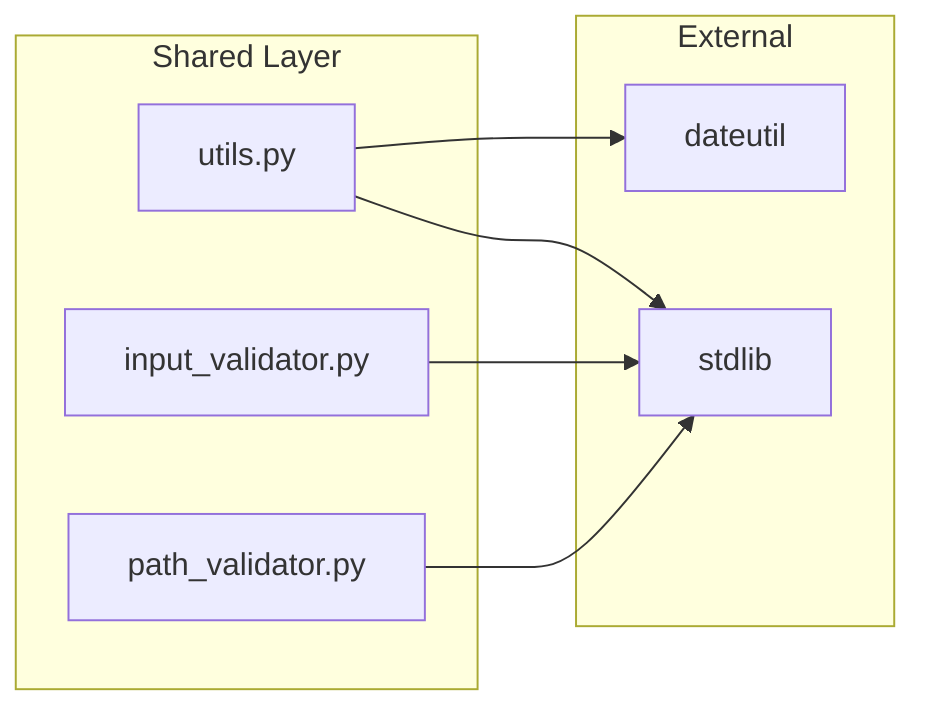

# Shared Layer Architecture

**Last Updated:** 2025-11-26

The shared layer contains pure utility functions and validators with **no internal dependencies**. All other layers may depend on this layer, but this layer depends on no other gmailarchiver modules.

---

## Layer Contract

| Property | Value |
|----------|-------|
| **Dependencies** | Standard library, `dateutil` only |
| **Dependents** | All other layers (cli, core, data, connectors) |
| **Responsibility** | Pure functions, input validation, security utilities |
| **Thread Safety** | All functions are thread-safe (no shared state) |

---

## Components

### utils

Date/time parsing, formatting, and list manipulation utilities.



#### Interface

- **`parse_age(age_str: str) -> datetime`**
  - Parses relative age (`3y`, `6m`, `2w`, `30d`) or ISO date (`YYYY-MM-DD`)
  - Returns cutoff datetime
  - Raises `ValueError` on invalid format

- **`datetime_to_gmail_query(dt: datetime) -> str`**
  - Converts datetime to Gmail search format (`YYYY/MM/DD`)
  - Used to build `before:` queries

- **`format_bytes(size: int) -> str`**
  - Formats byte counts to human-readable strings (`1.5 MB`)
  - Used in progress display and status output

- **`chunk_list(lst: list, chunk_size: int) -> list[list]`**
  - Splits lists into chunks for batch processing
  - Used by Gmail API batch operations

#### Usage Example

```python
from gmailarchiver.shared.utils import parse_age, datetime_to_gmail_query

cutoff = parse_age("3y")  # 3 years ago
query = f"before:{datetime_to_gmail_query(cutoff)}"
# query = "before:2022/11/26"
```

---

### input_validator

User input validation with security focus.



#### Interface

- **`InvalidInputError`** (exception)
  - Raised when user input fails validation
  - Subclass of `ValueError`

- **`validate_gmail_query(query: str) -> str`**
  - Validates Gmail search queries
  - Rejects shell metacharacters (`;`, `|`, `&`, etc.)
  - Enforces 1024 character limit

- **`validate_age_expression(age: str) -> str`**
  - Validates relative age (`3y`) or ISO date (`2024-01-01`)
  - Returns normalized form (lowercase for relative)

- **`validate_compression_format(format: str | None) -> str | None`**
  - Validates compression formats: `gzip`, `lzma`, `zstd`
  - Returns `None` if input is `None`

- **`sanitize_filename(filename: str, max_length: int = 255) -> str`**
  - Removes path separators and dangerous characters
  - Preserves extension when truncating

#### Usage Example

```python
from gmailarchiver.shared.input_validator import (
    validate_gmail_query,
    validate_age_expression,
    InvalidInputError,
)

try:
    query = validate_gmail_query(user_input)
    age = validate_age_expression("3y")
except InvalidInputError as e:
    print(f"Invalid input: {e}")
```

---

### path_validator

File path security to prevent traversal attacks.



#### Interface

- **`PathTraversalError`** (exception)
  - Raised when path traversal attack is detected
  - Subclass of `ValueError`

- **`validate_file_path(path: str, base_dir: str | None = None) -> Path`**
  - Validates path stays within `base_dir` (or cwd if None)
  - Resolves symlinks and `..` components
  - Returns resolved `Path` object

- **`validate_file_path_for_writing(path: str, base_dir: str | None = None) -> Path`**
  - Same validation as `validate_file_path`
  - Additionally creates parent directories if needed

#### Usage Example

```python
from gmailarchiver.shared.path_validator import (
    validate_file_path,
    PathTraversalError,
)

try:
    safe_path = validate_file_path(user_path, base_dir="/data/archives")
    # safe_path is guaranteed to be within /data/archives
except PathTraversalError as e:
    print(f"Security error: {e}")
```

---

## Design Principles

### No Internal Dependencies



The shared layer only depends on:
- Python standard library (`re`, `datetime`, `pathlib`)
- `python-dateutil` for robust date calculations

### Pure Functions

All functions in this layer are:
- **Stateless**: No global state or side effects (except `validate_file_path_for_writing` which may create directories)
- **Deterministic**: Same input always produces same output
- **Thread-safe**: Safe for concurrent use

### Fail-Fast Validation

Validators raise exceptions immediately on invalid input rather than returning error codes. This ensures invalid data never propagates through the system.

---

## Testing Strategy

| Component | Test Focus |
|-----------|------------|
| `utils` | Edge cases (year boundaries, zero values, empty lists) |
| `input_validator` | Injection attacks, boundary values, Unicode |
| `path_validator` | Traversal patterns, symlinks, permission errors |

See `tests/shared/` for test implementations.
