# Gmail Archiver Architecture

**Last Updated:** 2025-12-08
**Schema Version:** 1.2
**Status:** Production (v1.6.0+)

---

## Table of Contents

- [Design Principles](#design-principles)
- [System Overview](#system-overview)
- [Component Architecture](#component-architecture)
- [Data Architecture](#data-architecture)
- [Data Flows](#data-flows)
- [Command Infrastructure](#command-infrastructure)
- [Security Architecture](#security-architecture)
- [Component Contracts](#component-contracts)
- [Architecture Decision Records](#architecture-decision-records)

---

## Design Principles


```mermaid
mindmap
  root((Gmail Archiver))
    Safety First
      Multiple validation layers
      Dry-run mode
      Reversible operations
      Atomic transactions
    Portability
      Standard mbox format
      RFC 4155 compliant
      No vendor lock-in
    Searchability
      SQLite FTS5
      O&#40;1&#41; message retrieval
      BM25 ranking
    Simplicity
      CLI-first design
      Minimal dependencies
      Single-user focus

```

### Core Invariants

1. **Atomicity:** mbox and database always stay in sync
2. **Safety:** No data deletion without validation
3. **Portability:** Archives work with any mbox-compatible tool
4. **Auditability:** All operations recorded in `archive_runs`

---

## System Overview

### High-Level Architecture

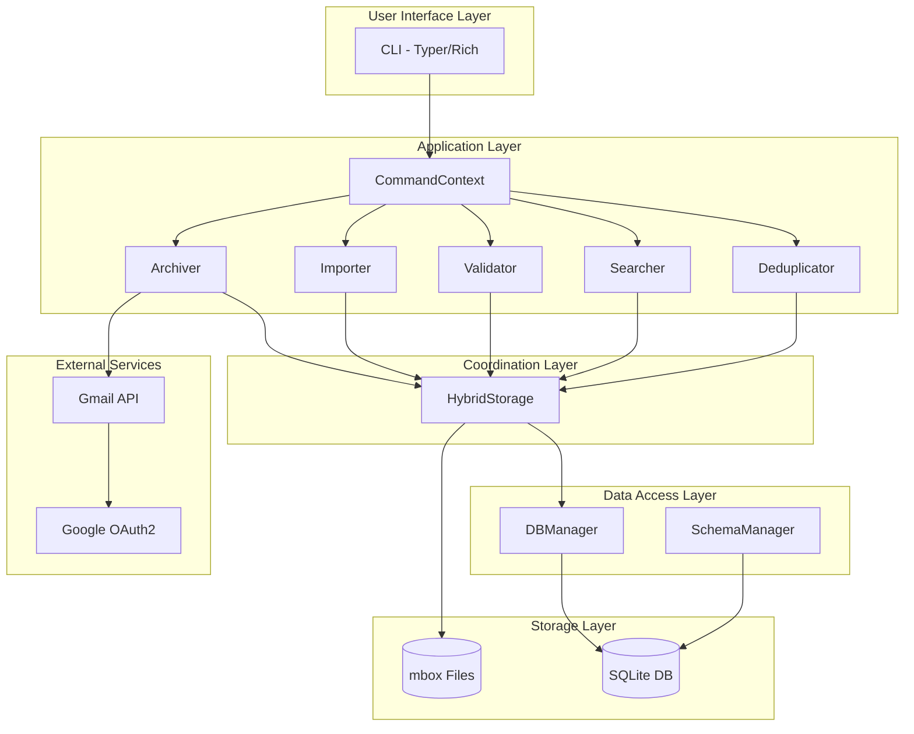
```mermaid
graph TB
    subgraph "User Interface Layer"
        CLI[CLI - Typer/Rich]
    end

    subgraph "Application Layer"
        CTX[CommandContext]
        ARCH[Archiver]
        IMP[Importer]
        VAL[Validator]
        SRCH[Searcher]
        DEDUP[Deduplicator]
    end

    subgraph "Coordination Layer"
        HS[HybridStorage]
    end

    subgraph "Data Access Layer"
        DBM[DBManager]
        SM[SchemaManager]
    end

    subgraph "Storage Layer"
        MBOX[(mbox Files)]
        SQL[(SQLite DB)]
    end

    subgraph "External Services"
        GMAIL[Gmail API]
        OAUTH[Google OAuth2]
    end

    CLI --> CTX
    CTX --> ARCH
    CTX --> IMP
    CTX --> VAL
    CTX --> SRCH
    CTX --> DEDUP

    ARCH --> HS
    IMP --> HS
    VAL --> HS
    SRCH --> HS
    DEDUP --> HS

    HS --> DBM
    HS --> MBOX

    DBM --> SQL
    SM --> SQL

    ARCH --> GMAIL
    GMAIL --> OAUTH
```

### Key Architectural Rule: HybridStorage as Single Gateway

**All core layer components access data exclusively through HybridStorage.**

This ensures:
- Atomic operations across mbox + database
- Consistent transaction management
- Single point for data validation
- No SQL leakage into business logic

### Layer Responsibilities

| Layer | Responsibility | Key Components |
|-------|----------------|----------------|
| **Interface** | CLI parsing, output formatting | `__main__.py`, CommandContext, OutputManager |
| **Business Logic** | Core workflows, orchestration | Archiver, Importer, Validator, Search |
| **Data** | Database, transactions, schema | HybridStorage (gateway), DBManager (internal), SchemaManager |
| **Connectors** | External service integration (async) | AsyncGmailClient, AdaptiveRateLimiter, GmailAuthenticator |
| **Shared** | Cross-cutting utilities | utils, input_validator, path_validator |

### Layer Dependencies

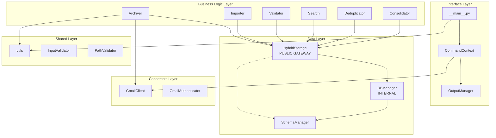
```mermaid
graph TB
    subgraph "Interface Layer"
        CLI[__main__.py]
        CTX[CommandContext]
        OUT[OutputManager]
    end

    subgraph "Business Logic Layer"
        ARCH[Archiver]
        IMP[Importer]
        VAL[Validator]
        SRCH[Search]
        DEDUP[Deduplicator]
        CONSOL[Consolidator]
    end

    subgraph "Data Layer"
        HS[HybridStorage<br/>PUBLIC GATEWAY]
        DBM[DBManager<br/>INTERNAL]
        SM[SchemaManager]
    end

    subgraph "Connectors Layer"
        GMAIL[GmailClient]
        AUTH[GmailAuthenticator]
    end

    subgraph "Shared Layer"
        UTIL[utils]
        IV[InputValidator]
        PV[PathValidator]
    end

    CLI --> CTX
    CTX --> OUT
    CTX --> GMAIL

    ARCH --> HS
    IMP --> HS
    VAL --> HS
    SRCH --> HS
    DEDUP --> HS
    CONSOL --> HS

    HS --> DBM
    HS -.-> SM
    DBM --> SM

    ARCH --> GMAIL

    CLI --> UTIL
    ARCH --> UTIL
```

### Layer Contracts

Each layer has specific contracts:

| Layer | Can Depend On | Cannot Depend On |
|-------|---------------|------------------|
| **Interface** | Core layer facades, Connectors, Shared | Data layer directly |
| **Business Logic** | Data (via HybridStorage only), Connectors, Shared | Interface, DBManager directly |
| **Data** | Shared | Interface, Business Logic, Connectors |
| **Connectors** | Shared | Interface, Business Logic, Data |
| **Shared** | (none) | All other layers |

**Critical Rule:** Business logic layer accesses data **only through HybridStorage**, never DBManager directly.

### Source Code Organization

Current flat structure can be reorganized into layers:

```
src/gmailarchiver/
├── cli/                    # Interface Layer
│   ├── app.py              # Typer app (from __main__.py)
│   ├── command_context.py
│   ├── output.py
│   └── commands/           # Individual command modules
├── core/                   # Business Logic Layer
│   ├── archiver.py
│   ├── importer.py
│   ├── consolidator.py
│   ├── deduplicator.py
│   ├── validator.py
│   ├── search.py
│   └── extractor.py
├── data/                   # Data Layer
│   ├── db_manager.py
│   ├── schema_manager.py
│   ├── hybrid_storage.py
│   └── migration.py
├── connectors/             # Connectors Layer
│   ├── gmail_client.py
│   ├── auth.py
│   └── scheduler.py
└── shared/                 # Shared Layer
    ├── utils.py
    ├── input_validator.py
    ├── path_validator.py
    └── compressor.py
```

---

## Component Architecture

### Component Diagram

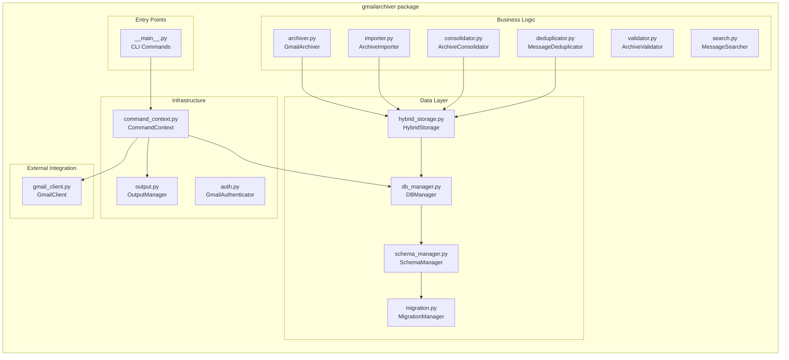
```mermaid
graph LR
    subgraph "gmailarchiver package"
        direction TB

        subgraph "Entry Points"
            MAIN[__main__.py<br/>CLI Commands]
        end

        subgraph "Infrastructure"
            CMD_CTX[command_context.py<br/>CommandContext]
            OUTPUT[output.py<br/>OutputManager]
            AUTH[auth.py<br/>GmailAuthenticator]
        end

        subgraph "Business Logic"
            ARCHIVER[archiver.py<br/>GmailArchiver]
            IMPORTER[importer.py<br/>ArchiveImporter]
            VALIDATOR[validator.py<br/>ArchiveValidator]
            SEARCH[search.py<br/>MessageSearcher]
            DEDUP[deduplicator.py<br/>MessageDeduplicator]
            CONSOL[consolidator.py<br/>ArchiveConsolidator]
        end

        subgraph "Data Layer"
            HYBRID[hybrid_storage.py<br/>HybridStorage]
            DB[db_manager.py<br/>DBManager]
            SCHEMA[schema_manager.py<br/>SchemaManager]
            MIGRATE[migration.py<br/>MigrationManager]
        end

        subgraph "External Integration"
            GMAIL[gmail_client.py<br/>GmailClient]
        end
    end

    MAIN --> CMD_CTX
    CMD_CTX --> OUTPUT
    CMD_CTX --> DB
    CMD_CTX --> GMAIL

    ARCHIVER --> HYBRID
    IMPORTER --> HYBRID
    CONSOL --> HYBRID
    DEDUP --> HYBRID

    HYBRID --> DB
    DB --> SCHEMA
    SCHEMA --> MIGRATE
```

### Component Boundaries

Each component has clear responsibilities and dependencies:

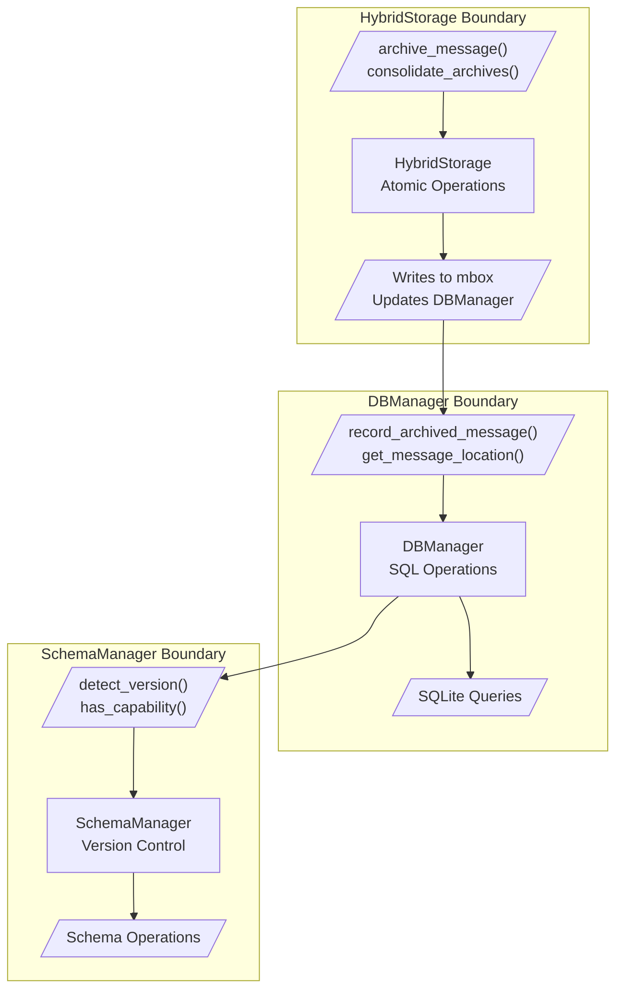
```mermaid
graph TB
    subgraph "HybridStorage Boundary"
        HS_IN[/"archive_message()<br/>consolidate_archives()"/]
        HS_CORE[HybridStorage<br/>Atomic Operations]
        HS_OUT[/"Writes to mbox<br/>Updates DBManager"/]

        HS_IN --> HS_CORE --> HS_OUT
    end

    subgraph "DBManager Boundary"
        DB_IN[/"record_archived_message()<br/>get_message_location()"/]
        DB_CORE[DBManager<br/>SQL Operations]
        DB_OUT[/"SQLite Queries"/]

        DB_IN --> DB_CORE --> DB_OUT
    end

    subgraph "SchemaManager Boundary"
        SM_IN[/"detect_version()<br/>has_capability()"/]
        SM_CORE[SchemaManager<br/>Version Control]
        SM_OUT[/"Schema Operations"/]

        SM_IN --> SM_CORE --> SM_OUT
    end

    HS_OUT --> DB_IN
    DB_CORE --> SM_IN
```

---

## Data Architecture

### Hybrid Storage Model

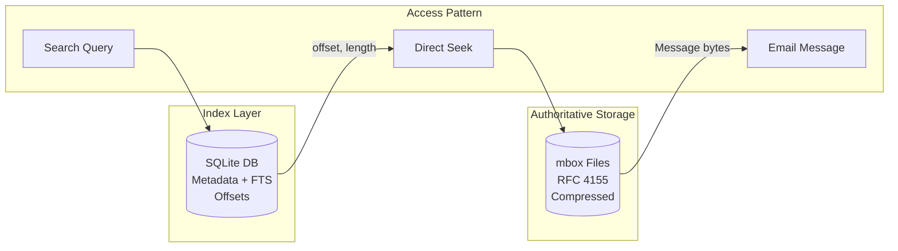
```mermaid
graph LR
    subgraph "Authoritative Storage"
        MBOX[("mbox Files<br/>RFC 4155<br/>Compressed")]
    end

    subgraph "Index Layer"
        SQL[("SQLite DB<br/>Metadata + FTS<br/>Offsets")]
    end

    subgraph "Access Pattern"
        SEARCH[Search Query] --> SQL
        SQL --> |"offset, length"| SEEK[Direct Seek]
        SEEK --> MBOX
        MBOX --> |"Message bytes"| MSG[Email Message]
    end
```

**Key Innovation: `mbox_offset` for O(1) Access**

```
Traditional: O(n) - Scan entire mbox
  for msg in mbox:
      if msg.id == target: return msg

Hybrid: O(1) - Direct seek
  offset = db.get_offset(target_id)
  file.seek(offset)
  return file.read(length)
```

### Database Schema (v1.2)

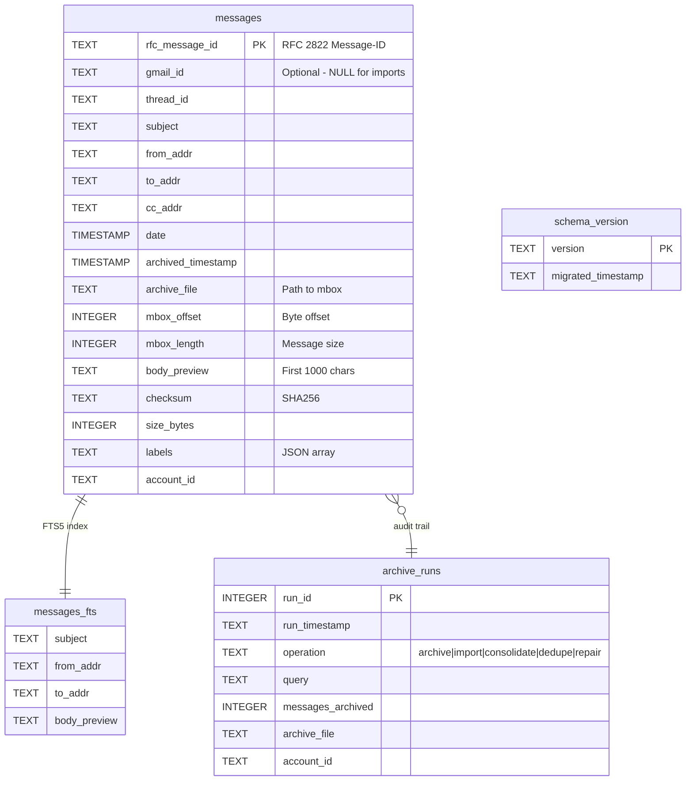
```mermaid
erDiagram
    messages {
        TEXT rfc_message_id PK "RFC 2822 Message-ID"
        TEXT gmail_id "Optional - NULL for imports"
        TEXT thread_id
        TEXT subject
        TEXT from_addr
        TEXT to_addr
        TEXT cc_addr
        TIMESTAMP date
        TIMESTAMP archived_timestamp
        TEXT archive_file "Path to mbox"
        INTEGER mbox_offset "Byte offset"
        INTEGER mbox_length "Message size"
        TEXT body_preview "First 1000 chars"
        TEXT checksum "SHA256"
        INTEGER size_bytes
        TEXT labels "JSON array"
        TEXT account_id
    }

    messages_fts {
        TEXT subject
        TEXT from_addr
        TEXT to_addr
        TEXT body_preview
    }

    archive_runs {
        INTEGER run_id PK
        TEXT run_timestamp
        TEXT operation "archive|import|consolidate|dedupe|repair"
        TEXT query
        INTEGER messages_archived
        TEXT archive_file
        TEXT account_id
    }

    schema_version {
        TEXT version PK
        TEXT migrated_timestamp
    }

    messages ||--|| messages_fts : "FTS5 index"
    messages }o--|| archive_runs : "audit trail"
```

### Schema Evolution

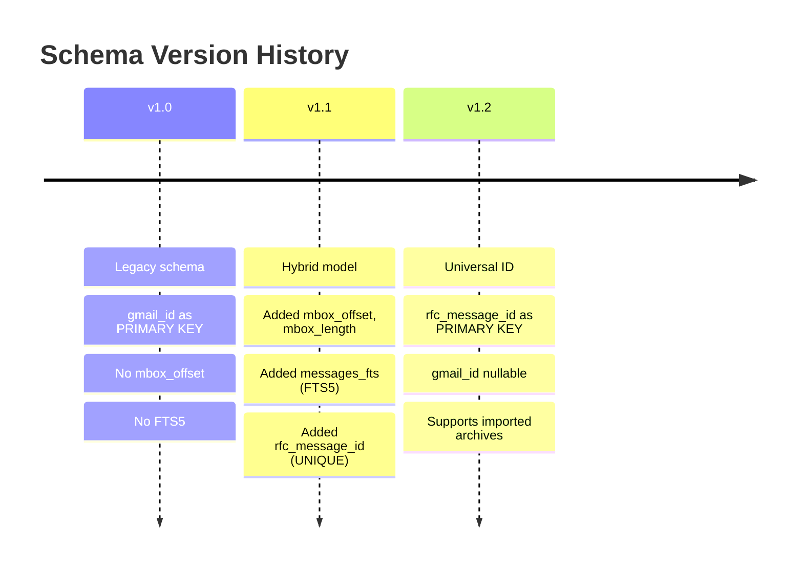
```mermaid
timeline
    title Schema Version History
    v1.0 : Legacy schema
         : gmail_id as PRIMARY KEY
         : No mbox_offset
         : No FTS5
    v1.1 : Hybrid model
         : Added mbox_offset, mbox_length
         : Added messages_fts (FTS5)
         : Added rfc_message_id (UNIQUE)
    v1.2 : Universal ID
         : rfc_message_id as PRIMARY KEY
         : gmail_id nullable
         : Supports imported archives
```

### Schema Capabilities

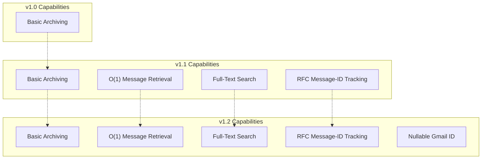
```mermaid
graph TB
    subgraph "v1.0 Capabilities"
        V10_1[Basic Archiving]
    end

    subgraph "v1.1 Capabilities"
        V11_1[Basic Archiving]
        V11_2["O(1) Message Retrieval"]
        V11_3[Full-Text Search]
        V11_4[RFC Message-ID Tracking]
    end

    subgraph "v1.2 Capabilities"
        V12_1[Basic Archiving]
        V12_2["O(1) Message Retrieval"]
        V12_3[Full-Text Search]
        V12_4[RFC Message-ID Tracking]
        V12_5[Nullable Gmail ID]
    end

    V10_1 -.-> V11_1
    V11_1 -.-> V12_1
    V11_2 -.-> V12_2
    V11_3 -.-> V12_3
    V11_4 -.-> V12_4
```

---

## Data Flows

### Archive Flow

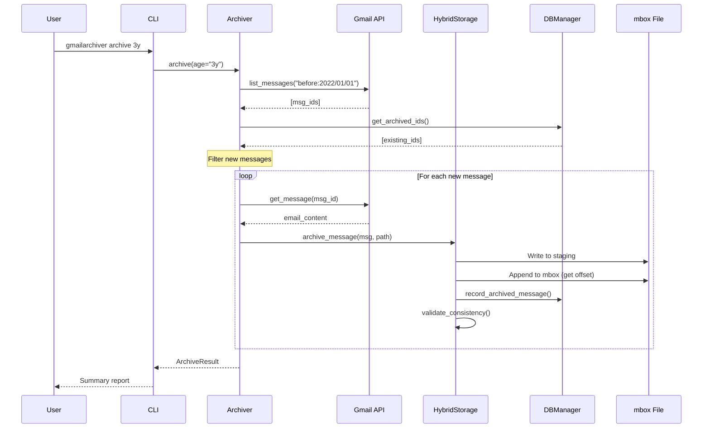
```mermaid
sequenceDiagram
    participant User
    participant CLI
    participant Archiver
    participant Gmail as Gmail API
    participant HS as HybridStorage
    participant DB as DBManager
    participant MBOX as mbox File

    User->>CLI: gmailarchiver archive 3y
    CLI->>Archiver: archive(age="3y")

    Archiver->>Gmail: list_messages("before:2022/01/01")
    Gmail-->>Archiver: [msg_ids]

    Archiver->>DB: get_archived_ids()
    DB-->>Archiver: [existing_ids]

    Note over Archiver: Filter new messages

    loop For each new message
        Archiver->>Gmail: get_message(msg_id)
        Gmail-->>Archiver: email_content

        Archiver->>HS: archive_message(msg, path)

        HS->>MBOX: Write to staging
        HS->>MBOX: Append to mbox (get offset)
        HS->>DB: record_archived_message()
        HS->>HS: validate_consistency()
    end

    Archiver-->>CLI: ArchiveResult
    CLI-->>User: Summary report
```

### Search Flow

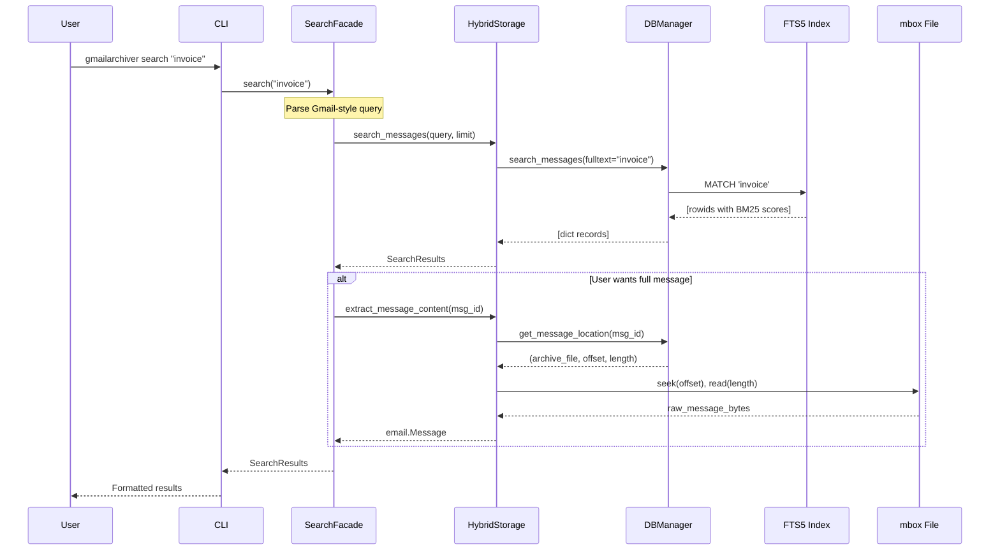
```mermaid
sequenceDiagram
    participant User
    participant CLI
    participant Searcher as SearchFacade
    participant HS as HybridStorage
    participant DB as DBManager
    participant FTS as FTS5 Index
    participant MBOX as mbox File

    User->>CLI: gmailarchiver search "invoice"
    CLI->>Searcher: search("invoice")

    Note over Searcher: Parse Gmail-style query

    Searcher->>HS: search_messages(query, limit)
    HS->>DB: search_messages(fulltext="invoice")
    DB->>FTS: MATCH 'invoice'
    FTS-->>DB: [rowids with BM25 scores]
    DB-->>HS: [dict records]
    HS-->>Searcher: SearchResults

    alt User wants full message
        Searcher->>HS: extract_message_content(msg_id)
        HS->>DB: get_message_location(msg_id)
        DB-->>HS: (archive_file, offset, length)
        HS->>MBOX: seek(offset), read(length)
        MBOX-->>HS: raw_message_bytes
        HS-->>Searcher: email.Message
    end

    Searcher-->>CLI: SearchResults
    CLI-->>User: Formatted results
```

**Key Points:**
- SearchFacade handles query parsing (business logic)
- HybridStorage handles data access
- DBManager handles SQL (internal)
- No direct DB access from SearchFacade

### Import Flow

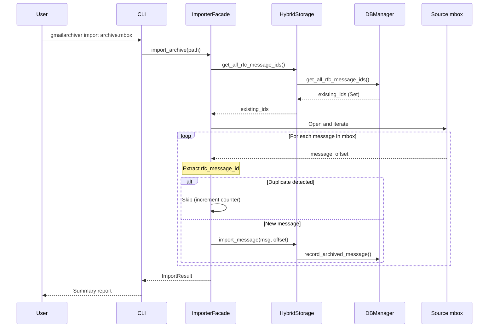
```mermaid
sequenceDiagram
    participant User
    participant CLI
    participant Importer as ImporterFacade
    participant HS as HybridStorage
    participant DB as DBManager
    participant MBOX as Source mbox

    User->>CLI: gmailarchiver import archive.mbox
    CLI->>Importer: import_archive(path)

    Importer->>HS: get_all_rfc_message_ids()
    HS->>DB: get_all_rfc_message_ids()
    DB-->>HS: existing_ids (Set)
    HS-->>Importer: existing_ids

    Importer->>MBOX: Open and iterate

    loop For each message in mbox
        MBOX-->>Importer: message, offset

        Note over Importer: Extract rfc_message_id

        alt Duplicate detected
            Importer->>Importer: Skip (increment counter)
        else New message
            Importer->>HS: import_message(msg, offset)
            HS->>DB: record_archived_message()
        end
    end

    Importer-->>CLI: ImportResult
    CLI-->>User: Summary report
```

### Migration Flow

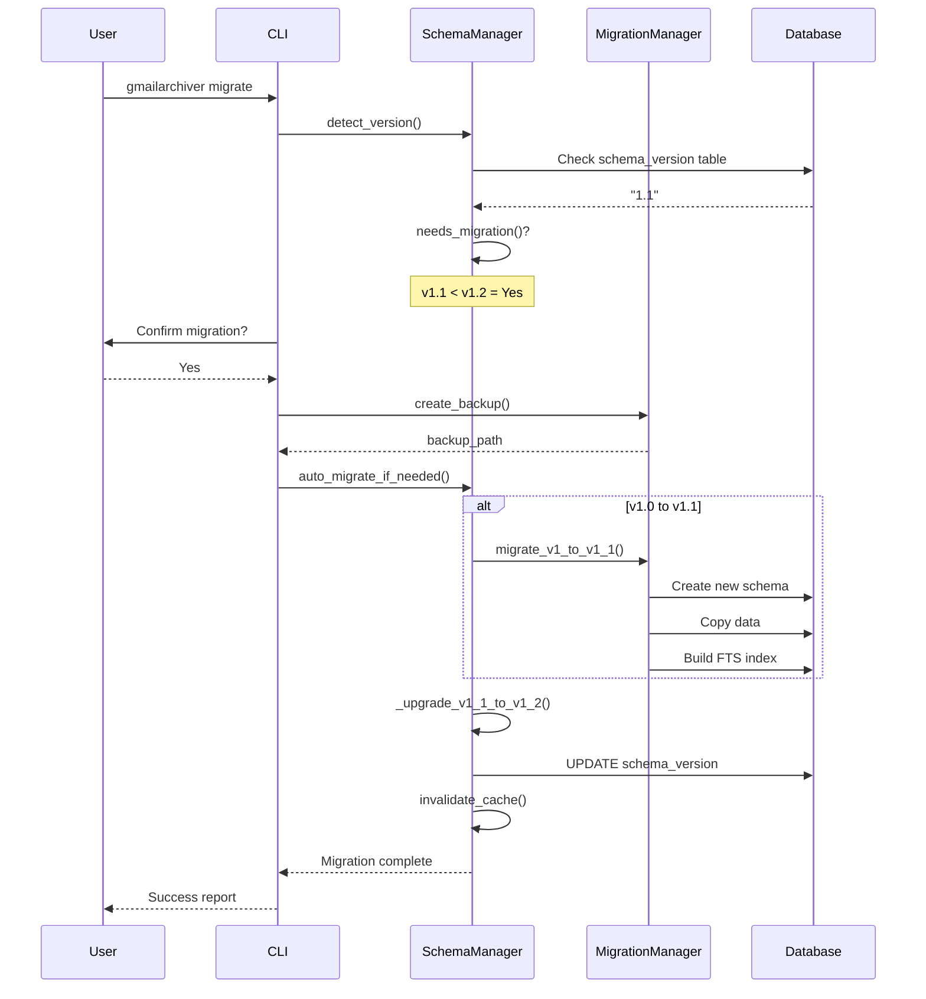
```mermaid
sequenceDiagram
    participant User
    participant CLI
    participant SM as SchemaManager
    participant MM as MigrationManager
    participant DB as Database

    User->>CLI: gmailarchiver migrate
    CLI->>SM: detect_version()
    SM->>DB: Check schema_version table
    DB-->>SM: "1.1"

    SM->>SM: needs_migration()?
    Note over SM: v1.1 < v1.2 = Yes

    CLI->>User: Confirm migration?
    User-->>CLI: Yes

    CLI->>MM: create_backup()
    MM-->>CLI: backup_path

    CLI->>SM: auto_migrate_if_needed()

    alt v1.0 to v1.1
        SM->>MM: migrate_v1_to_v1_1()
        MM->>DB: Create new schema
        MM->>DB: Copy data
        MM->>DB: Build FTS index
    end

    SM->>SM: _upgrade_v1_1_to_v1_2()
    SM->>DB: UPDATE schema_version

    SM->>SM: invalidate_cache()
    SM-->>CLI: Migration complete

    CLI-->>User: Success report
```

---

## Command Infrastructure

### CommandContext Architecture

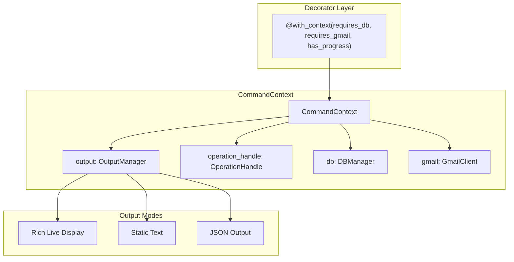
```mermaid
graph TB
    subgraph "Decorator Layer"
        DEC["@with_context(requires_db, requires_gmail, has_progress)"]
    end

    subgraph "CommandContext"
        CTX[CommandContext]
        OUTPUT[output: OutputManager]
        OP[operation_handle: OperationHandle]
        DB[db: DBManager]
        GMAIL[gmail: GmailClient]
    end

    subgraph "Output Modes"
        LIVE[Rich Live Display]
        STATIC[Static Text]
        JSON[JSON Output]
    end

    DEC --> CTX
    CTX --> OUTPUT
    CTX --> OP
    CTX --> DB
    CTX --> GMAIL

    OUTPUT --> LIVE
    OUTPUT --> STATIC
    OUTPUT --> JSON
```

### Command Categories

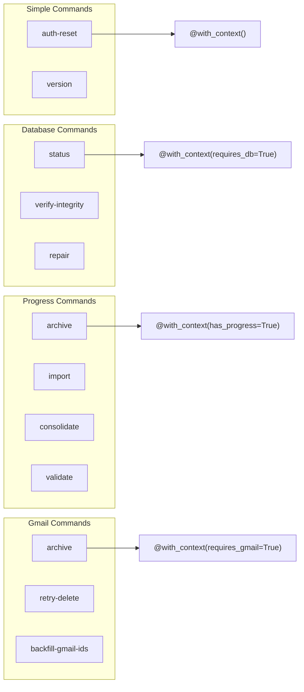
```mermaid
graph LR
    subgraph "Simple Commands"
        A1[auth-reset]
        A2[version]
    end

    subgraph "Database Commands"
        B1[status]
        B2[verify-integrity]
        B3[repair]
    end

    subgraph "Progress Commands"
        C1[archive]
        C2[import]
        C3[consolidate]
        C4[validate]
    end

    subgraph "Gmail Commands"
        D1[archive]
        D2[retry-delete]
        D3[backfill-gmail-ids]
    end

    A1 --> CTX1["@with_context()"]
    B1 --> CTX2["@with_context(requires_db=True)"]
    C1 --> CTX3["@with_context(has_progress=True)"]
    D1 --> CTX4["@with_context(requires_gmail=True)"]
```

### Output Mode Selection

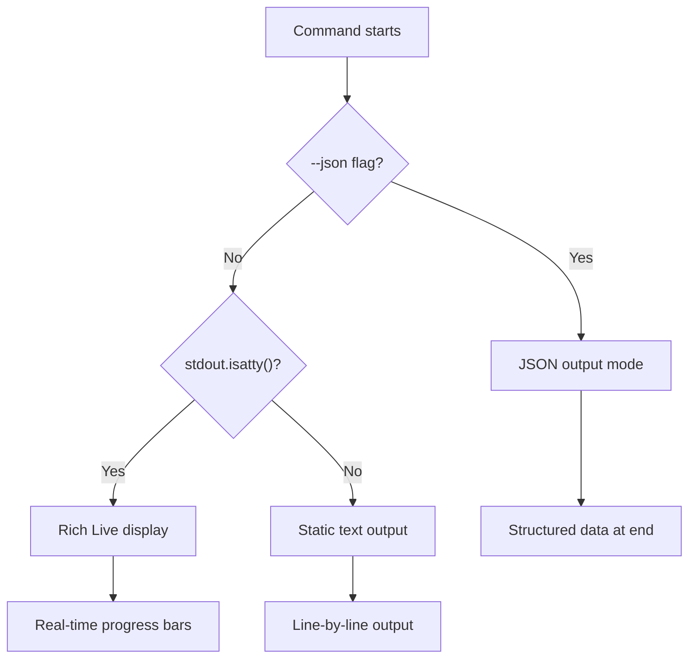
```mermaid
flowchart TD
    START[Command starts] --> JSON_FLAG{--json flag?}

    JSON_FLAG -->|Yes| JSON_MODE[JSON output mode]
    JSON_FLAG -->|No| TTY_CHECK{"stdout.isatty()?"}

    TTY_CHECK -->|Yes| LIVE_MODE[Rich Live display]
    TTY_CHECK -->|No| STATIC_MODE[Static text output]

    JSON_MODE --> JSON_OUT[Structured data at end]
    LIVE_MODE --> RICH_OUT[Real-time progress bars]
    STATIC_MODE --> TEXT_OUT[Line-by-line output]
```

---

## Security Architecture

### Threat Model

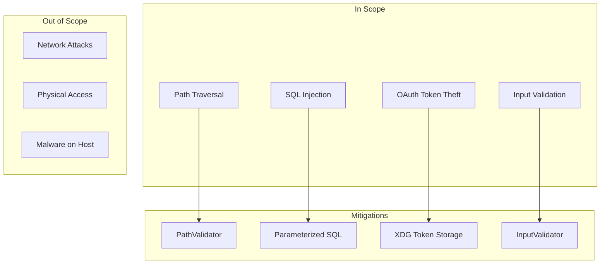
```mermaid
graph TB
    subgraph "In Scope"
        T1[Path Traversal]
        T2[SQL Injection]
        T3[OAuth Token Theft]
        T4[Input Validation]
    end

    subgraph "Out of Scope"
        O1[Network Attacks]
        O2[Physical Access]
        O3[Malware on Host]
    end

    subgraph "Mitigations"
        M1[PathValidator]
        M2[Parameterized SQL]
        M3[XDG Token Storage]
        M4[InputValidator]
    end

    T1 --> M1
    T2 --> M2
    T3 --> M3
    T4 --> M4
```

### Security Layers

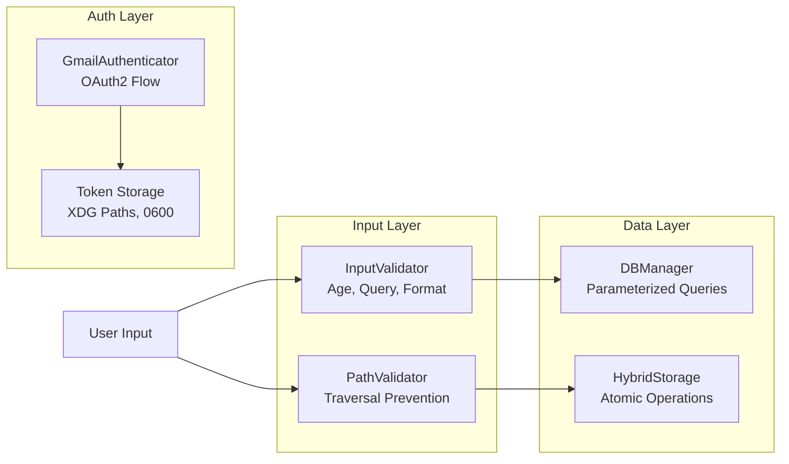
```mermaid
graph LR
    subgraph "Input Layer"
        I1[InputValidator<br/>Age, Query, Format]
        I2[PathValidator<br/>Traversal Prevention]
    end

    subgraph "Data Layer"
        D1[DBManager<br/>Parameterized Queries]
        D2[HybridStorage<br/>Atomic Operations]
    end

    subgraph "Auth Layer"
        A1[GmailAuthenticator<br/>OAuth2 Flow]
        A2[Token Storage<br/>XDG Paths, 0600]
    end

    USER[User Input] --> I1
    USER --> I2
    I1 --> D1
    I2 --> D2
    A1 --> A2
```

---

## Component Contracts

### HybridStorage Contract (PRIMARY DATA GATEWAY)

**HybridStorage is the single entry point for all data operations from the core layer.**

#### Responsibilities
• Atomic mbox + database operations
• Two-phase commit pattern (staging → commit → validate)
• Automatic validation after writes
• Staging area for safe writes
• **READ operations** for search, statistics, and message retrieval
• **WRITE operations** for archiving and consolidation

#### Interface
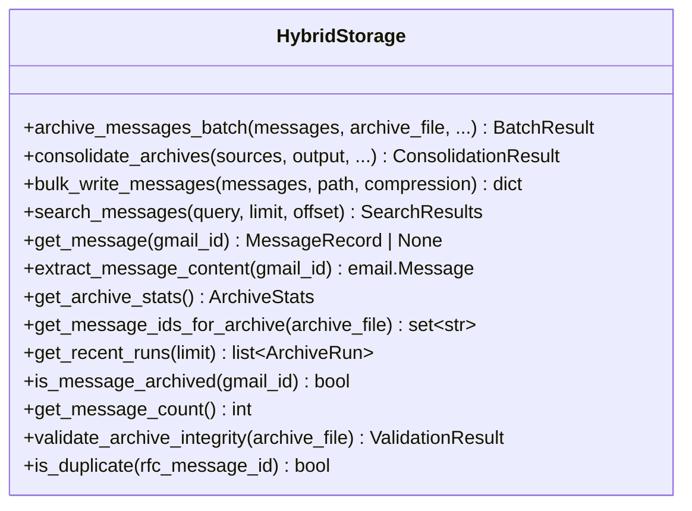
```mermaid
classDiagram
class HybridStorage {
    %% WRITE OPERATIONS
    +archive_messages_batch(messages, archive_file, ...) BatchResult
    +consolidate_archives(sources, output, ...) ConsolidationResult
    +bulk_write_messages(messages, path, compression) dict

    %% READ OPERATIONS
    +search_messages(query, limit, offset) SearchResults
    +get_message(gmail_id) MessageRecord | None
    +extract_message_content(gmail_id) email.Message

    %% STATISTICS
    +get_archive_stats() ArchiveStats
    +get_message_ids_for_archive(archive_file) set~str~
    +get_recent_runs(limit) list~ArchiveRun~
    +is_message_archived(gmail_id) bool
    +get_message_count() int

    %% VALIDATION
    +validate_archive_integrity(archive_file) ValidationResult
    +is_duplicate(rfc_message_id) bool
}
```

#### Guarantees
• Both mbox AND database succeed, OR both rollback
• Validation after every write
• No partial/orphaned state
• Pre-loaded RFC Message-IDs for O(1) duplicate detection
• Provides both read AND write operations

---

### DBManager Contract (INTERNAL)

**DBManager is an INTERNAL component - core layer should NOT use it directly.**

Use HybridStorage instead for all data operations.

#### Responsibilities
• ALL SQL operations (single source of truth for SQL)
• Transaction management with auto-rollback
• Audit trail in archive_runs
• Schema validation

#### Interface
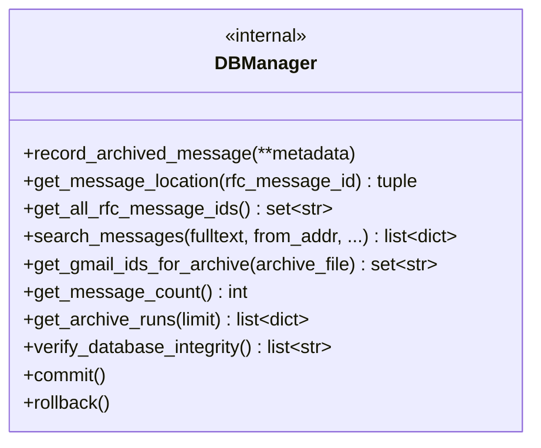
```mermaid
classDiagram
class DBManager {
    <<internal>>
    +record_archived_message(**metadata)
    +get_message_location(rfc_message_id) tuple
    +get_all_rfc_message_ids() set~str~
    +search_messages(fulltext, from_addr, ...) list~dict~
    +get_gmail_ids_for_archive(archive_file) set~str~
    +get_message_count() int
    +get_archive_runs(limit) list~dict~
    +verify_database_integrity() list~str~
    +commit()
    +rollback()
}
```

#### Guarantees
• Parameterized queries only (no SQL injection)
• All writes recorded in audit trail
• Auto-rollback on transaction failure
• **All SQL contained here** (no SQL elsewhere in codebase)

---

### SchemaManager Contract

#### Responsibilities
• Schema version detection (single source of truth)
• Capability checks
• Migration coordination
• Version caching for performance

#### Interface
```mermaid
classDiagram
class SchemaManager {
    +CURRENT_VERSION: SchemaVersion
    +MIN_SUPPORTED_VERSION: SchemaVersion
    +AUTO_MIGRATE_FROM: frozenset
    +detect_version() SchemaVersion
    +has_capability(cap) bool
    +needs_migration() bool
    +can_auto_migrate() bool
    +auto_migrate_if_needed(callbacks) bool
    +require_version(min_version) None
    +invalidate_cache() None
}
```

#### Guarantees
• Version detection results are cached (call `invalidate_cache()` to refresh)
• Capability checks use capability enum, not version string comparisons
• Migration only proceeds if version is in `AUTO_MIGRATE_FROM` set

---

### CommandContext Contract

#### Responsibilities
• Unified output interface for all commands
• Progress tracking with Rich Live display
• Resource management (DBManager, GmailClient)
• Error handling with user-friendly messages and suggestions

#### Interface
```mermaid
classDiagram
class CommandContext {
    +output: OutputManager
    +db: DBManager | None
    +gmail: GmailClient | None
    +json_mode: bool
    +dry_run: bool
    +info(message) None
    +warning(message) None
    +success(message) None
    +error(message) None
    +fail_and_exit(title, message, suggestion) NoReturn
    +operation(description, total) ContextManager
    +advance_progress(n) None
    +set_progress_total(total) None
    +log_progress(message, level) None
    +show_report(title, data) None
    +show_table(title, headers, rows) None
    +suggest_next_steps(suggestions) None
}
```

#### Injected by @with_context
• `output`: Always available (OutputManager)
• `db`: DBManager (if `requires_db=True`)
• `gmail`: GmailClient (if `requires_gmail=True`)
• Common options extracted: `json_output`, `dry_run`, `state_db`, `credentials`

#### Guarantees
• Resources are cleaned up on exit (DBManager closed)
• Exceptions are caught and displayed as user-friendly error panels
• Schema version is validated if `requires_schema` is specified
• TTY detection for automatic output mode selection

---

## Architecture Decision Records

### ADR Index

| ADR | Decision | Status |
|-----|----------|--------|
| [ADR-001](./adrs/001-hybrid-architecture-model.md) | Hybrid mbox + SQLite model | ✅ Accepted |
| [ADR-002](./adrs/002-sqlite-fts5-search.md) | SQLite FTS5 for full-text search | ✅ Accepted |
| [ADR-003](./adrs/003-web-ui-technology-stack.md) | Svelte 5 + FastAPI for Web UI | ✅ Accepted |
| [ADR-004](./adrs/004-message-deduplication.md) | Message-ID exact matching | ✅ Accepted |
| [ADR-005](./adrs/005-distribution-strategy.md) | Multi-tiered distribution | ✅ Accepted |
| [ADR-006](./adrs/006-async-first-architecture.md) | Async-first architecture + httpx + adaptive rate limiting | ✅ Accepted |

### Key Decisions Summary

```mermaid
mindmap
  root("Architecture<br/>Decisions")
    Storage
      mbox for portability
      SQLite for indexing
      mbox_offset for O&#40;1&#41; access"
    Search
      FTS5 over Elasticsearch
      BM25 ranking
      Porter stemming
    Identity
      rfc_message_id as PK
      gmail_id optional
      Cross-system compatibility
    Safety
      Two-phase commit
      Automatic validation
      Audit trail
```

---

## Related Documentation

- **[CODING.md](CODING.md)** - Coding standards and patterns
- **[TESTING.md](TESTING.md)** - Testing guidelines and fixtures
- **[PLAN.md](PLAN.md)** - Development roadmap
- **[CONTRIBUTING.md](../CONTRIBUTING.md)** - Development setup

---

**Last Updated:** 2025-12-08
