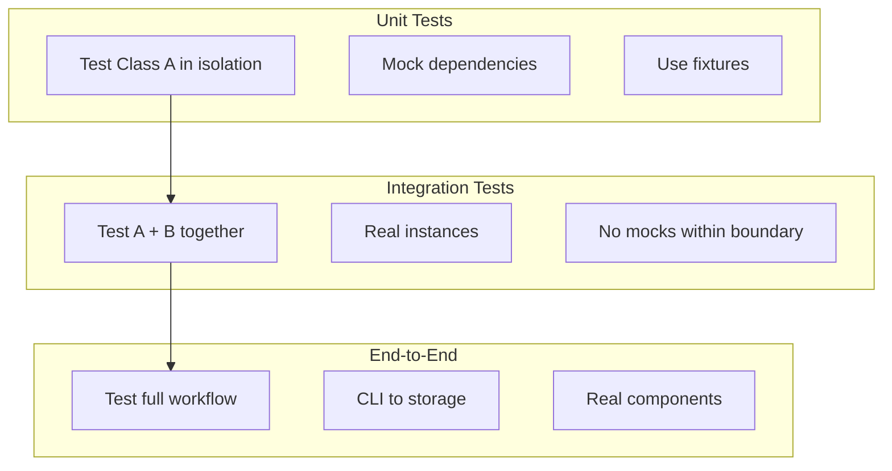

# Testing Guidelines

**Last Updated:** 2025-11-26

This document defines testing standards, patterns, and best practices for the Gmail Archiver test suite.

---

## Table of Contents

- [Overview](#overview)
- [Running Tests](#running-tests)
- [Test Organization](#test-organization)
- [Fixture Patterns](#fixture-patterns)
- [Mocking Patterns](#mocking-patterns)
- [Testing Boundaries](#testing-boundaries)
- [Test Categories](#test-categories)
- [Do's and Don'ts](#dos-and-donts)
- [Coverage Requirements](#coverage-requirements)

---

## Overview

### Test Stack

| Tool | Purpose |
|------|---------|
| pytest | Test framework |
| pytest-cov | Coverage reporting |
| unittest.mock | Mocking and patching |

### Current Metrics

- **Test Count:** 1667 tests
- **Coverage Target:** 95%+
- **Execution Time:** ~8 seconds

---

## Running Tests

### Basic Commands

```bash
# Run all tests with coverage
uv run pytest

# Run specific test file
uv run pytest tests/test_db_manager.py

# Run specific test class
uv run pytest tests/test_db_manager.py::TestMessageOperations

# Run specific test function
uv run pytest tests/test_db_manager.py::TestMessageOperations::test_record_archived_message_success

# Run tests with verbose output
uv run pytest -v

# Run tests without coverage (faster)
uv run pytest --no-cov

# Run tests matching a pattern
uv run pytest -k "test_import"

# Run tests and stop on first failure
uv run pytest -x
```

### Running by Test Type (Future Structure)

Once tests are reorganized into layers:

```bash
# Run only unit tests (fast, isolated)
uv run pytest tests/unit/ --no-cov

# Run only integration tests
uv run pytest tests/integration/

# Run tests for a specific layer
uv run pytest tests/unit/data/
uv run pytest tests/unit/core/
uv run pytest tests/integration/cli/

# Run unit + integration for a component
uv run pytest tests/unit/data/test_db_manager.py tests/integration/data/
```

### Configuration

Tests are configured in `pyproject.toml`:

```toml
[tool.pytest.ini_options]
testpaths = ["tests"]
python_files = "test_*.py"
python_functions = "test_*"
addopts = "--cov=gmailarchiver --cov-report=term-missing"
```

---

## Test Organization

### Layer-Mirrored Test Structure

Tests mirror the source code layer structure:

```
tests/
├── conftest.py                    # Shared fixtures (all layers)
├── unit/                          # Unit tests (isolated, with mocks)
│   ├── cli/                       # Interface Layer
│   │   ├── test_command_context.py
│   │   ├── test_output.py
│   │   └── commands/
│   │       ├── test_archive_cmd.py
│   │       └── ...
│   ├── core/                      # Business Logic Layer
│   │   ├── test_archiver.py
│   │   ├── test_importer.py
│   │   ├── test_validator.py
│   │   └── ...
│   ├── data/                      # Data Layer
│   │   ├── test_db_manager.py
│   │   ├── test_schema_manager.py
│   │   ├── test_hybrid_storage.py
│   │   └── ...
│   ├── connectors/                # Connectors Layer
│   │   ├── test_gmail_client.py
│   │   ├── test_auth.py
│   │   └── ...
│   └── shared/                    # Shared Layer
│       ├── test_utils.py
│       ├── test_input_validator.py
│       └── ...
└── integration/                   # Integration tests (real components)
    ├── cli/
    │   ├── test_cli_archive.py
    │   ├── test_cli_import.py
    │   └── ...
    ├── core/
    │   └── test_workflow_archive.py
    └── data/
        └── test_hybrid_db_integration.py
```

### File Naming

| Source File | Unit Test | Integration Test |
|-------------|-----------|------------------|
| `data/db_manager.py` | `unit/data/test_db_manager.py` | `integration/data/test_db_*.py` |
| `core/archiver.py` | `unit/core/test_archiver.py` | `integration/core/test_workflow_*.py` |
| `cli/commands/archive.py` | `unit/cli/commands/test_archive_cmd.py` | `integration/cli/test_cli_archive.py` |

### Test Class Structure

Organize tests by functionality using classes with section comments:

```python
"""Tests for DBManager class."""

import pytest
from gmailarchiver.db_manager import DBManager

# ============================================================================
# Test Fixtures
# ============================================================================

@pytest.fixture
def sample_message_data() -> dict[str, Any]:
    """Sample message data for testing."""
    return {
        "gmail_id": "msg123",
        "rfc_message_id": "<unique123@example.com>",
        "subject": "Test Subject",
        # ...
    }

# ============================================================================
# Initialization Tests
# ============================================================================

class TestDBManagerInitialization:
    """Tests for DBManager initialization."""

    def test_connect_to_existing_database(self, v11_db: str) -> None:
        """Test connecting to an existing v1.1 database."""
        db = DBManager(v11_db)
        assert db.conn is not None
        db.close()

    def test_connect_to_missing_database(self, temp_db_path: str) -> None:
        """Test connecting to a non-existent database path."""
        with pytest.raises(FileNotFoundError):
            DBManager(temp_db_path, auto_create=False)

# ============================================================================
# Message Operations Tests
# ============================================================================

class TestMessageOperations:
    """Tests for message CRUD operations."""

    def test_record_archived_message_success(
        self, v11_db: str, sample_message_data: dict[str, Any]
    ) -> None:
        """Test recording a new archived message."""
        with DBManager(v11_db) as db:
            db.record_archived_message(**sample_message_data)
            # Verify...
```

### Test Method Naming

Use descriptive names that explain the scenario and expected outcome:

```python
# Pattern: test_<method>_<scenario>_<expected_result>

def test_record_archived_message_success(self):
    """Test recording a new archived message."""

def test_record_duplicate_gmail_id_fails(self):
    """Test that duplicate gmail_id raises error."""

def test_validate_schema_on_init(self):
    """Test that schema is validated on initialization."""
```

---

## Fixture Patterns

### ⚠️ CRITICAL: Avoid Fixture Duplication

**Before creating ANY fixture:**

1. **Run `uv run pytest --fixtures -q`** to list all available fixtures
2. **Search conftest.py** for existing fixtures that match your needs
3. **Compose existing fixtures** rather than creating new ones

**Why this matters:** Duplicate fixtures (especially for database connections) cause:
- Tests that hang indefinitely (unclosed connections)
- Resource leaks and warnings
- Inconsistent test behavior
- Harder debugging

### Fixture Location Rules

| Fixture Type | Location | Example |
|-------------|----------|---------|
| Shared across all tests | `tests/conftest.py` | `db_manager`, `hybrid_storage`, `v11_db` |
| Specific to one test file | Same test file | `mbox_with_messages` (if only used in one file) |
| Specific to test directory | Directory's `conftest.py` | `tests/core/workflows/conftest.py` |

**NEVER** define these fixtures locally in test files - always use from conftest.py:
- `db_manager` - async DBManager with proper cleanup
- `db_manager_with_messages` - DBManager with pre-populated messages
- `hybrid_storage` - HybridStorage wrapping db_manager
- `v11_db` - v1.1 schema database path
- `temp_dir` - temporary directory

### Async Fixture Cleanup Pattern

Always use `yield` with proper cleanup for async fixtures:

```python
@pytest.fixture
async def db_manager(v11_db: str) -> AsyncGenerator[DBManager]:
    """Create a DBManager with proper async initialization and cleanup."""
    manager = DBManager(v11_db)
    await manager.initialize()
    try:
        yield manager
    finally:
        await manager.close()  # CRITICAL: Always close!
```

### Fixture Composition Example

```python
# CORRECT: Compose existing fixtures
@pytest.fixture
async def db_with_test_data(db_manager: DBManager) -> AsyncGenerator[DBManager]:
    """Extend db_manager with test-specific data."""
    # db_manager handles connection lifecycle
    await db_manager._conn.execute("INSERT INTO messages ...")
    await db_manager.commit()
    yield db_manager
    # No need to close - db_manager fixture handles cleanup

# WRONG: Creating duplicate db_manager
@pytest.fixture
async def db_manager(v11_db: str) -> DBManager:  # DON'T DO THIS!
    """This duplicates conftest.py's db_manager!"""
    manager = DBManager(v11_db)
    await manager.initialize()
    return manager  # Missing cleanup - will cause hangs!
```

### Base Fixtures (conftest.py)

All shared fixtures live in `conftest.py`:

```python
@pytest.fixture
def temp_dir() -> Generator[Path]:
    """Create and cleanup temporary directory for testing.

    Yields:
        Path to a temporary directory that is automatically cleaned up.
    """
    with tempfile.TemporaryDirectory() as tmpdir:
        yield Path(tmpdir)
```

### Generator Fixtures for Cleanup

Use generator fixtures to ensure proper resource cleanup:

```python
@pytest.fixture
def db_connection(populated_db: Path) -> Generator[DBManager]:
    """Create managed database connection with automatic cleanup."""
    db = DBManager(str(populated_db))
    try:
        yield db
    finally:
        db.close()  # Always close to avoid ResourceWarnings
```

### Factory Fixtures

Use factory fixtures when tests need multiple instances:

```python
@pytest.fixture
def v11_db_factory(temp_dir: Path):
    """Factory to create additional v1.1-style databases in tests."""

    def _factory(name: str = "test_archive.db") -> str:
        db_path = temp_dir / name
        conn = sqlite3.connect(str(db_path))
        try:
            # Create schema...
            conn.commit()
        finally:
            conn.close()
        return str(db_path)

    return _factory

# Usage in test
def test_multiple_databases(v11_db_factory):
    db1 = v11_db_factory("db1.db")
    db2 = v11_db_factory("db2.db")
    # Test with both databases...
```

### Sample Data Fixtures

Provide realistic test data:

```python
@pytest.fixture
def sample_message() -> bytes:
    """Sample email message for testing."""
    return b"""From alice@example.com Mon Jan 01 00:00:00 2024
From: alice@example.com
To: bob@example.com
Subject: Test Message
Message-ID: <test001@example.com>
Date: Mon, 01 Jan 2024 00:00:00 +0000

This is a test message body.
"""

@pytest.fixture
def sample_message_data() -> dict[str, Any]:
    """Sample message data for database testing."""
    return {
        "gmail_id": "msg123",
        "rfc_message_id": "<unique123@example.com>",
        "thread_id": "thread123",
        "subject": "Test Subject",
        "from_addr": "sender@example.com",
        "to_addr": "recipient@example.com",
        "archive_file": "archive.mbox",
        "mbox_offset": 0,
        "mbox_length": 1234,
    }
```

### Fixture Hierarchy

```
temp_dir                    # Base: temporary directory
├── temp_db_path            # Path to database file (not created)
├── v11_db                  # Created v1.1 database with schema
├── temp_db                 # Created database via DBManager
├── populated_db            # Database with test messages + archive files
│   └── db_connection       # DBManager instance for populated_db
└── uncompressed_mbox       # Archive file fixtures
    ├── compressed_mbox_gzip
    └── compressed_mbox_lzma
```

---

## Mocking Patterns

### ManagedConnection for SQLite

The test suite uses a `ManagedConnection` wrapper to auto-close SQLite connections:

```python
class ManagedConnection(sqlite3.Connection):
    """SQLite connection that auto-closes on garbage collection (tests only)."""

    def __del__(self) -> None:
        try:
            if getattr(self, "in_transaction", False):
                self.rollback()
            self.close()
        except Exception:
            pass

# Installed globally in conftest.py
sqlite3.connect = _managed_connect
```

### Mocking External Services

Mock Gmail API calls to avoid network dependencies:

```python
from unittest.mock import MagicMock, patch

def test_list_messages_success(self):
    """Test listing messages from Gmail API."""
    mock_service = MagicMock()
    mock_service.users().messages().list().execute.return_value = {
        "messages": [{"id": "msg1"}, {"id": "msg2"}],
        "nextPageToken": None,
    }

    with patch("gmailarchiver.gmail_client.build", return_value=mock_service):
        client = GmailClient(mock_credentials)
        messages = client.list_messages("before:2024/01/01")

    assert len(messages) == 2
```

### Mocking Authentication

```python
@pytest.fixture
def mock_credentials():
    """Mock Google OAuth credentials."""
    creds = MagicMock()
    creds.valid = True
    creds.expired = False
    creds.token = "mock_token"
    return creds

def test_authenticate_with_valid_token(mock_credentials, temp_dir):
    """Test authentication when valid token exists."""
    token_path = temp_dir / "token.json"

    with patch("gmailarchiver.auth.Credentials") as MockCreds:
        MockCreds.from_authorized_user_file.return_value = mock_credentials
        authenticator = GmailAuthenticator()
        creds = authenticator.authenticate()

    assert creds.valid
```

### Patching Class Methods

```python
def test_db_connection_failure(self):
    """Test handling database connection failure."""
    with patch.object(DBManager, "_connect", side_effect=sqlite3.OperationalError("disk full")):
        with pytest.raises(DBManagerError, match="Cannot open database"):
            DBManager("/path/to/db.db")
```

---

## Testing Boundaries

### Layer Testing Principles

Each component should be tested at its own layer:



### Shared Component Testing

When a class is shared across multiple consumers, test it systematically:

```python
# Example: Class A is shared, used by Class B and Class C

# 1. Unit Tests: Test A in isolation
class TestClassAUnit:
    """Unit tests for ClassA with mocked dependencies."""

    def test_method_with_mock(self, mock_dependency):
        a = ClassA(mock_dependency)
        assert a.method() == expected

# 2. Integration: Test A + B
class TestClassAWithClassB:
    """Integration tests for ClassA consumed by ClassB."""

    @pytest.fixture
    def class_a_for_b(self, temp_db):
        """ClassA instance configured for ClassB tests."""
        return ClassA(real_dependency)

    def test_b_uses_a_correctly(self, class_a_for_b):
        b = ClassB(class_a_for_b)
        assert b.workflow() == expected

# 3. Integration: Test A + C
class TestClassAWithClassC:
    """Integration tests for ClassA consumed by ClassC."""

    @pytest.fixture
    def class_a_for_c(self, temp_db):
        """ClassA instance configured for ClassC tests."""
        return ClassA(real_dependency)

    def test_c_uses_a_correctly(self, class_a_for_c):
        c = ClassC(class_a_for_c)
        assert c.operation() == expected

# 4. Integration: Test A + B + C together
class TestClassABCIntegration:
    """Full integration tests for A, B, and C working together."""

    def test_full_workflow(self, temp_db):
        a = ClassA(real_dependency)
        b = ClassB(a)
        c = ClassC(a)
        # Test complete workflow
```

### Layer Testing Guidelines

| Layer | Unit Test Approach | Integration Test Approach |
|-------|-------------------|---------------------------|
| **Interface** | Mock DBManager, GmailClient | Real CommandContext + mocked business logic |
| **Business Logic** | Mock HybridStorage, DBManager | Real components, fixtures for data |
| **Data** | Mock SchemaManager, use temp SQLite | Real DBManager + HybridStorage + temp files |
| **Connectors** | Mock HTTP responses | (skip - external services) |
| **Shared** | Pure functions, no mocks needed | N/A (no dependencies) |

### Testing Boundaries Example: HybridStorage

```python
# Unit Test (tests/unit/data/test_hybrid_storage.py)
class TestHybridStorageUnit:
    """Unit tests with mocked DBManager."""

    def test_archive_message_calls_db(self, mock_db):
        storage = HybridStorage(mock_db)
        storage.archive_message(msg, "gmail123", path)
        mock_db.record_archived_message.assert_called_once()

# Integration Test (tests/integration/data/test_hybrid_db_integration.py)
class TestHybridStorageWithDB:
    """Integration tests with real DBManager."""

    def test_archive_persists_to_database(self, temp_db, temp_mbox):
        db = DBManager(temp_db)
        storage = HybridStorage(db)

        storage.archive_message(msg, "gmail123", temp_mbox)

        # Verify in actual database
        location = db.get_message_location("<test@example.com>")
        assert location is not None
        db.close()
```

---

## Test Categories

### Unit Tests

Test individual functions/methods in isolation:

```python
class TestParseAge:
    """Unit tests for age parsing utility."""

    def test_parse_years(self):
        assert parse_age("3y") == timedelta(days=3*365)

    def test_parse_months(self):
        assert parse_age("6m") == timedelta(days=6*30)

    def test_invalid_format_raises(self):
        with pytest.raises(ValueError):
            parse_age("invalid")
```

### Integration Tests

Test component interactions:

```python
class TestArchiveWorkflow:
    """Integration tests for archive workflow."""

    def test_archive_and_retrieve(self, temp_dir, sample_message):
        """Test archiving a message and retrieving it."""
        db_path = temp_dir / "test.db"
        archive_path = temp_dir / "archive.mbox"

        # Archive
        db = DBManager(str(db_path))
        storage = HybridStorage(db)
        storage.archive_message(sample_message, "msg1", archive_path)

        # Retrieve
        location = db.get_message_location("<test001@example.com>")
        assert location is not None
        offset, length = location[1], location[2]

        with open(archive_path, "rb") as f:
            f.seek(offset)
            data = f.read(length)

        assert b"Test Message" in data
        db.close()
```

### CLI Tests

Test command-line interface:

```python
from typer.testing import CliRunner
from gmailarchiver.__main__ import app

@pytest.fixture
def runner():
    return CliRunner()

class TestMigrateCommand:
    """Test 'gmailarchiver migrate' command."""

    def test_migrate_v1_0_database(self, runner, v1_0_database, tmp_path, monkeypatch):
        """Test migrating a v1.0 database."""
        monkeypatch.chdir(tmp_path)

        with patch("typer.confirm", return_value=True):
            result = runner.invoke(app, ["migrate", "--state-db", str(v1_0_database)])

        assert result.exit_code == 0
        assert "Migration completed successfully" in result.stdout
```

### Security Tests

Test input validation and path safety:

```python
class TestPathValidator:
    """Security tests for path validation."""

    @pytest.mark.parametrize("malicious_path", [
        "../../../etc/passwd",
        "/absolute/path/outside/base",
        "symlink_attack",
        "path/with/../traversal",
    ])
    def test_rejects_malicious_paths(self, malicious_path):
        """Test that malicious paths are rejected."""
        with pytest.raises(PathValidationError):
            PathValidator.validate_path("/safe/base", malicious_path)
```

---

## Do's and Don'ts

### Do's

| Practice | Rationale |
|----------|-----------|
| Use fixtures for setup | Reusable, consistent test state |
| Clean up resources in fixtures | Prevents ResourceWarnings |
| Test one thing per test | Clear failure diagnosis |
| Use descriptive test names | Self-documenting |
| Test error cases | Verify error handling works |
| Use parametrize for variations | Reduces code duplication |
| Mock external services | Fast, reliable, offline |

### Don'ts

| Anti-Pattern | Why It's Bad | Alternative |
|--------------|--------------|-------------|
| Tests that depend on order | Fragile, hard to debug | Each test should be independent |
| Real network calls | Slow, flaky, requires credentials | Mock external services |
| Hardcoded file paths | Breaks on other machines | Use fixtures for temp files |
| Testing implementation details | Breaks on refactoring | Test behavior, not internals |
| Large test methods | Hard to maintain | Split into focused tests |
| Shared mutable state | Tests interfere with each other | Fresh fixtures per test |

### Test Independence

Each test should work in isolation:

```python
# DON'T: Tests that depend on each other
class TestOrdered:
    state = None

    def test_1_create(self):
        self.state = create_something()

    def test_2_use(self):
        # Fails if test_1 didn't run first!
        use(self.state)

# DO: Independent tests with fixtures
class TestIndependent:
    def test_create_and_verify(self, temp_db):
        state = create_something(temp_db)
        assert state.valid

    def test_use_existing(self, populated_db):
        # Uses fixture that provides pre-populated state
        result = use(populated_db)
        assert result.success
```

### Assertion Best Practices

```python
# DO: Specific assertions with messages
assert db.schema_version == "1.2", f"Expected v1.2, got {db.schema_version}"

# DO: Use pytest.raises for exceptions
with pytest.raises(ValueError, match="Invalid age format"):
    parse_age("invalid")

# DO: Check multiple aspects in integration tests
def test_import_creates_records(self, db, archive):
    result = import_archive(archive, db)

    assert result.messages_imported == 3
    assert result.errors == []
    assert db.get_message_count() == 3

# DON'T: Vague assertions
assert result  # What exactly are we checking?
assert len(items) > 0  # Why? What's the expected count?
```

---

## Coverage Requirements

### Minimum Coverage

- **Overall:** 90%+
- **Core modules:** 95%+ (db_manager, hybrid_storage, archiver)
- **CLI commands:** 85%+

### Checking Coverage

```bash
# Run tests with coverage report
uv run pytest

# Generate HTML report
uv run pytest --cov-report=html

# View specific module coverage
uv run pytest --cov=gmailarchiver.db_manager
```

### Coverage Exclusions

Some code is excluded from coverage:

```python
def __del__(self) -> None:  # pragma: no cover
    """Defensive finalizer - hard to test reliably."""
    try:
        self.close()
    except Exception:
        pass
```

---

## Test Naming Exceptions

Per `pyproject.toml`, test files allow:

```toml
[tool.ruff.lint.per-file-ignores]
"tests/*" = ["N806", "F841"]
```

| Rule | Exception | Example |
|------|-----------|---------|
| N806 | Mock variable names can use PascalCase | `MockCreds`, `MockFlow` |
| F841 | Unused variables allowed | Capture return values even if not asserted |

---

## References

- [pytest Documentation](https://docs.pytest.org/)
- [pytest-cov Documentation](https://pytest-cov.readthedocs.io/)
- [unittest.mock Documentation](https://docs.python.org/3/library/unittest.mock.html)
- [Testing Best Practices](https://docs.pytest.org/en/stable/explanation/goodpractices.html)
