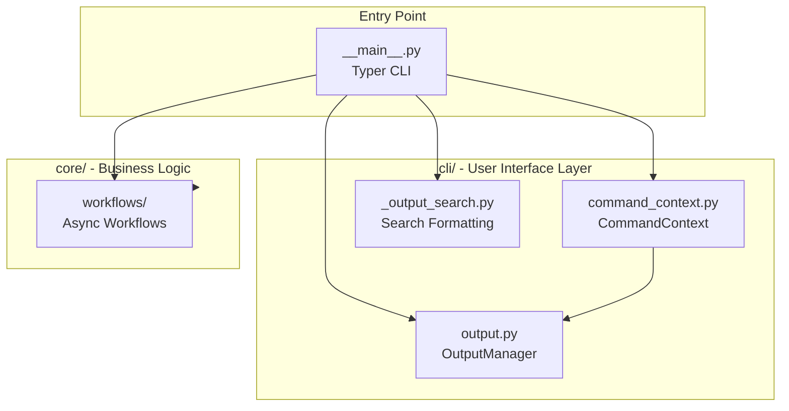
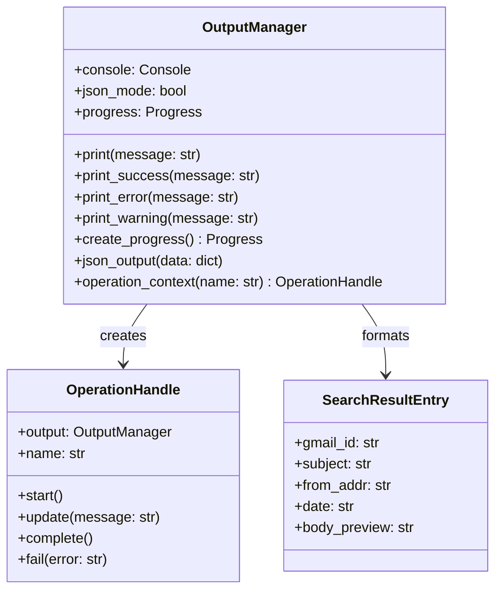
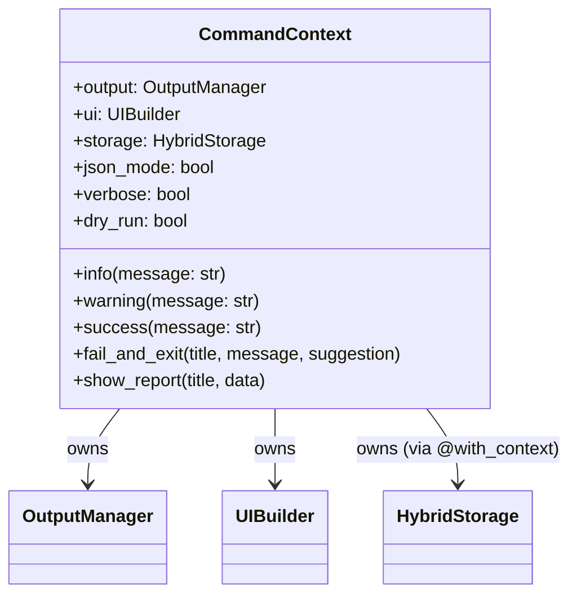
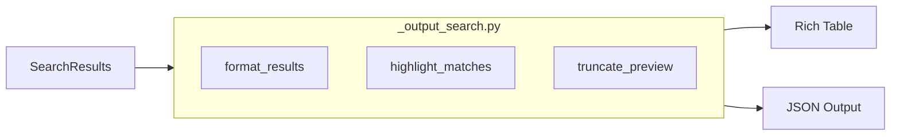
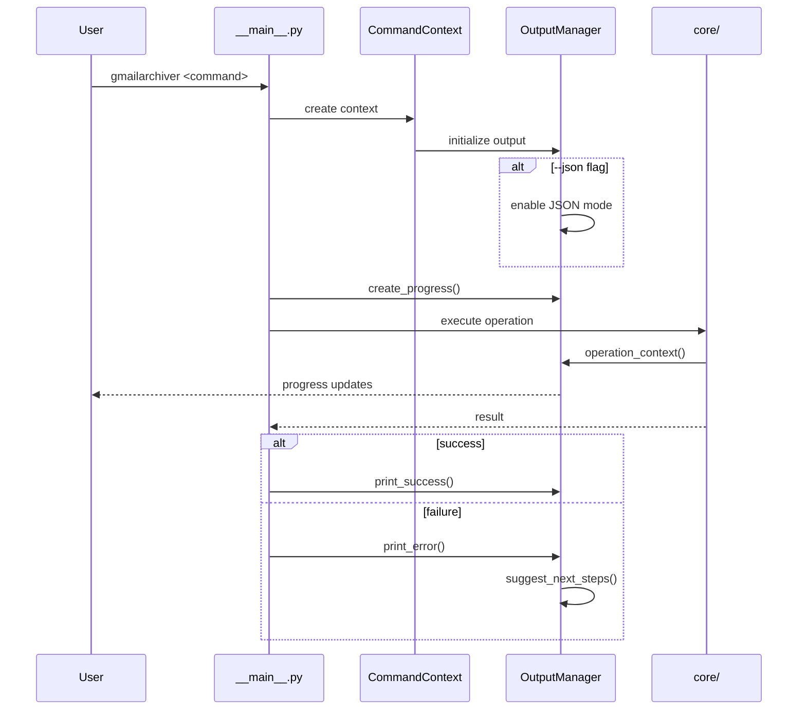
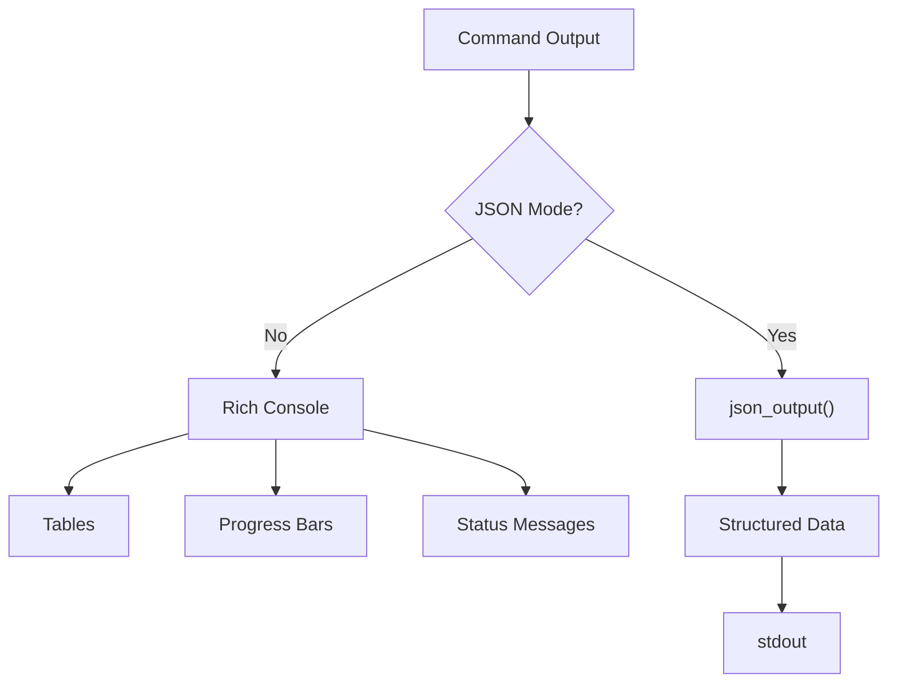
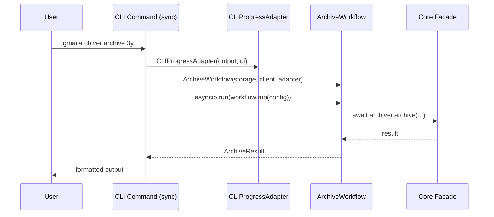

# CLI Layer Architecture

This document defines the design of the CLI layer, which handles user interaction,
command processing, and output formatting for the Gmail Archiver application.

## Layer Overview

The CLI layer provides:
1. **OutputManager**: Unified output system (Rich terminal / JSON modes)
2. **CommandContext**: Dependency injection for CLI commands
3. **Search Output**: Formatted search result display
4. **Workflows**: Business logic orchestration (in core/workflows/)



## Component Design

### OutputManager (output.py)

The unified output system supporting both rich terminal output and JSON mode.



**Key Features:**
- Rich console output with colors, progress bars, status indicators
- JSON output mode (`--json`) for scripting and automation
- Progress tracking (uv-style spinners and progress bars)
- Actionable next-step suggestions on errors
- Operation contexts for start/update/complete tracking

### CommandContext (command_context.py)

Dependency injection container for CLI commands, providing consistent access to
shared resources across all commands.



**Key Features:**
- Lazy initialization via `@with_context` decorator
- **HybridStorage** access (NOT DBManager directly)
- Consistent error handling across commands
- Shared configuration (verbosity, JSON mode, dry-run)

**Note:** CommandContext does NOT expose GmailClient or GmailAuthenticator directly.
Gmail connectivity is handled separately using the factory pattern (see below).

### GmailClient Factory Pattern

GmailClient uses an async context manager pattern for clean connection management:

```python
# GmailClient encapsulates authentication internally
async with GmailClient.connect(credentials_file=credentials) as client:
    # Client is authenticated and ready to use
    messages = await client.list_messages(query)
```

This pattern:
- Encapsulates `GmailAuthenticator` internally (not exposed to CLI)
- Handles OAuth flow automatically
- Ensures clean resource cleanup on exit
- Makes testing easier (mock the factory)

### Search Output (_output_search.py)

Specialized formatting for search results with relevance highlighting.



## Data Flow

### Command Execution Flow



### Output Mode Decision



## Integration Points

### Dependencies (imports from other layers)

```python
# From data layer
from gmailarchiver.data.db_manager import DBManager

# From connectors layer
from gmailarchiver.connectors.auth import GmailAuthenticator
from gmailarchiver.connectors.gmail_client import GmailClient

# From core layer
from gmailarchiver.core.search import SearchResults
```

### Dependents (imported by)

```python
# Entry point
from gmailarchiver.cli.output import OutputManager
from gmailarchiver.cli.command_context import CommandContext

# Core layer (for progress reporting)
from gmailarchiver.cli.output import OperationHandle
```

## Design Decisions

### Thin Client Pattern

The CLI layer follows a thin client pattern where:
1. **CLI commands are synchronous** (Typer limitation)
2. **Business logic is async** in class-based workflows
3. **Single `asyncio.run()` call per command** bridges sync/async
4. **Workflows are in `core/workflows/`** not in CLI
5. **CLIProgressAdapter** bridges CLI output to workflow protocol



### Why Separate CLI Layer?

1. **Separation of Concerns**: CLI-specific logic (formatting, progress, user interaction)
   is isolated from business logic
2. **Testability**: Core logic can be tested without CLI dependencies
3. **Alternative Interfaces**: Future GUI or API could reuse core without CLI code
4. **JSON Mode**: Clean implementation of dual output modes

### OutputManager in CLI vs Shared

OutputManager is in CLI because:
- It's fundamentally about user output (Rich console, JSON)
- Core components receive `OperationHandle` for progress, not full OutputManager
- This maintains the boundary between business logic and presentation

### Entry Point Location

`__main__.py` remains at package root because:
- Python convention for `python -m gmailarchiver`
- Typer app definition is the natural entry point
- CLI layer provides supporting infrastructure

### Workflow Pattern

All business logic should be in async workflow **classes**:
- **Location**: `src/gmailarchiver/core/workflows/`
- **Pattern**: Class with `async def run(config: TConfig) -> TResult`
- **Dependencies**: Constructor injection (storage, client, progress)
- **Progress Protocol**: Workflows depend on `ProgressReporter` protocol, not CLI types
- **Calling**: CLI creates adapter, creates workflow, calls `asyncio.run(workflow.run(config))`

**Example:**
```python
# In src/gmailarchiver/core/workflows/archive.py
class ArchiveWorkflow:
    def __init__(
        self,
        storage: HybridStorage,
        client: GmailClient,
        progress: ProgressReporter | None = None,
    ) -> None:
        self.storage = storage
        self.client = client
        self.progress = progress

    async def run(self, config: ArchiveConfig) -> ArchiveResult:
        """Execute archive workflow."""
        # Business logic here
        return ArchiveResult(archived_count=42, ...)

# In CLI command (sync) - shows full dependency flow
@with_context(requires_storage=True, has_progress=True)
def archive(ctx: CommandContext, age_threshold: str, credentials: str | None, ...):
    # Create progress adapter from CommandContext
    adapter = CLIProgressAdapter(ctx.output, ctx.ui)

    # Define async workflow execution
    async def _run_archive():
        # GmailClient is created HERE using factory pattern (not in CommandContext)
        async with GmailClient.connect(credentials_file=credentials) as client:
            # Create workflow with all dependencies
            workflow = ArchiveWorkflow(
                storage=ctx.storage,  # From CommandContext
                client=client,        # From factory
                progress=adapter,     # CLI adapter
            )

            # Create typed config and execute
            config = ArchiveConfig(age_threshold=age_threshold, ...)
            return await workflow.run(config)

    # Single asyncio.run() call bridges sync/async
    result = asyncio.run(_run_archive())

    # Format typed result (CLI responsibility)
    ctx.success(f"Archived {result.archived_count} messages")
```

**Key Points:**
- `CommandContext` provides: `storage` (HybridStorage), `output`, `ui`
- `GmailClient` is created via factory pattern inside async context
- `CLIProgressAdapter` bridges CLI output to workflow protocol
- Workflow receives all dependencies via constructor

### CLIProgressAdapter

The CLI layer provides `CLIProgressAdapter` that implements the `ProgressReporter` protocol:

```python
class CLIProgressAdapter:
    """Adapts CLI output types to ProgressReporter protocol.

    This allows workflows to report progress without depending on
    CLI-specific types (OutputManager, UIBuilder).
    """

    def __init__(self, output: OutputManager, ui: UIBuilder | None = None) -> None:
        self._output = output
        self._ui = ui

    def info(self, message: str) -> None:
        self._output.info(message)

    def warning(self, message: str) -> None:
        self._output.warning(message)

    @contextmanager
    def task_sequence(self) -> ContextManager[TaskSequence]:
        if self._ui:
            yield self._ui.task_sequence()
        else:
            yield NoOpTaskSequence()
```

This pattern ensures workflows remain independent of CLI implementation details.
