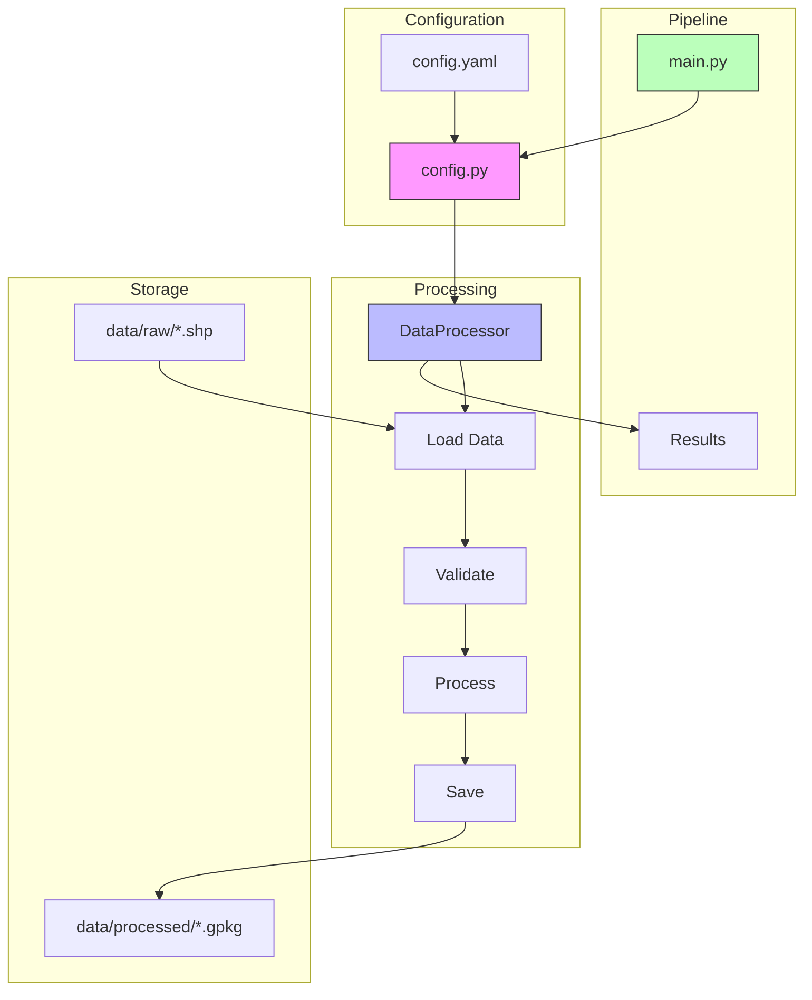
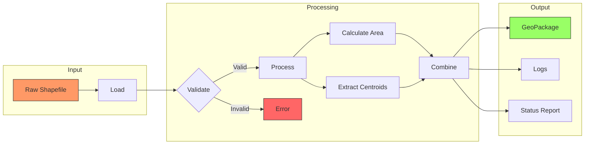
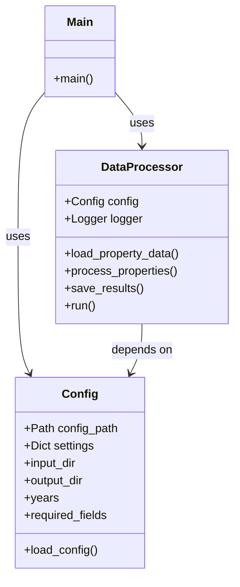

# Heirs Property Pipeline Restructuring Guide

## Overview
This guide outlines the simplified architecture of the Heirs Property Analysis Pipeline. The restructuring focuses on core functionality while maintaining clean code practices and the Single Responsibility Principle (SRP).

## Architecture Diagrams

### Component Architecture


### Data Flow


### Class Relationships


## Directory Structure
```
heirs-property/
├── src/
│   ├── main.py              # Pipeline entry point
│   ├── config.py            # Configuration management
│   ├── data_processing/     
│   │   ├── processor.py     # Core processing logic
│   │   └── __init__.py
│   └── archive/            # Legacy code storage
├── data/
│   ├── raw/                # Input data directory
│   └── processed/          # Output data directory
├── requirements.txt        # Project dependencies
└── README.md              # Project documentation
```

## Core Components

### 1. Configuration Management (`config.py`)
```python
class Config:
    """Manages pipeline configuration via YAML or defaults"""
    
    # Key responsibilities:
    # - Load configuration from YAML
    # - Provide default settings
    # - Manage input/output paths
    # - Define required fields
```

Key Features:
- YAML-based configuration with sensible defaults
- Type-hinted property accessors
- Path management for data I/O
- Required field specifications

### 2. Data Processing (`processor.py`)
```python
class DataProcessor:
    """Handles core geospatial data processing"""
    
    # Key responsibilities:
    # - Load property data
    # - Validate required fields
    # - Process spatial features
    # - Save results
```

Key Features:
- Unified data processing workflow
- Built-in logging
- Error handling
- GeoPackage output format

### 3. Pipeline Entry Point (`main.py`)
```python
def main():
    """Orchestrates the complete pipeline"""
    
    # Key responsibilities:
    # - Initialize configuration
    # - Run processing pipeline
    # - Report results
```

Key Features:
- Simple command-line interface
- Clear success/failure reporting
- Pipeline orchestration

## Data Flow
1. **Input**: Raw property data (Shapefile/GeoJSON) in `data/raw/`
2. **Processing**:
   - Load and validate spatial data
   - Compute geometric properties
   - Extract features (area, centroids)
3. **Output**: Processed GeoPackage in `data/processed/`

## Implementation Guidelines

### Configuration
- Use YAML for external configuration
- Provide sensible defaults
- Type-hint all properties
- Keep configuration minimal

### Data Processing
- Focus on core spatial operations
- Validate early
- Log operations clearly
- Handle errors gracefully

### Code Style
- Use type hints
- Write clear docstrings
- Follow PEP 8
- Keep functions focused and small

## Dependencies
Essential packages only:
```
geopandas>=0.13.2
pandas>=2.0.0
pyyaml>=6.0.1
shapely>=2.0.0
```

## Usage Example
```python
# Load and run pipeline
from config import Config
from data_processing.processor import DataProcessor

# Initialize with default config
config = Config()
processor = DataProcessor(config)

# Run pipeline
results = processor.run()


