# Architecture Overview

GridFIA is designed as a modular, extensible toolkit for forest data analysis with clear separation of concerns and modern software engineering practices. This page provides a comprehensive overview of the system architecture, component relationships, and design patterns.

## System Overview

GridFIA follows a layered architecture pattern with the following key principles:

- **Modularity**: Clear separation between data processing, analysis, visualization, and user interfaces
- **Extensibility**: Plugin-like architecture for adding new analysis types
- **Configuration-driven**: Centralized configuration management with environment awareness
- **User-friendly**: Multiple interfaces (CLI, Python API, scripts) for different user needs
- **Performance**: Efficient data structures and processing pipelines for large datasets

## Package Structure

The following diagram shows how the main components of GridFIA fit together:

```mermaid
graph TB
    subgraph "Entry Points"
        CLI["CLI Commands<br/>gridfia-analyze<br/>gridfia-visualize<br/>gridfia-process"]
        Scripts["Root Scripts<br/>identify_missing_species.py<br/>batch_add_missing_species.py<br/>add_api_species_to_zarr.py"]
        Package["Python Package<br/>import gridfia"]
    end
    
    subgraph "Core Package Structure"
        Config["config.py<br/>Settings & Configuration"]
        Console["console.py<br/>Rich Terminal Output"]
        Init["__init__.py<br/>Public API"]
    end
    
    subgraph "Main Modules"
        Core["core/<br/>• analyze_species_presence.py<br/>• create_species_diversity_map.py"]
        Utils["utils/<br/>• clip_rasters_to_nc.py<br/>• create_nc_biomass_zarr.py<br/>• batch_append_species.py"]
        Viz["visualization/<br/>• map_nc_forest.py"]
        API["api/<br/>• rest_client.py"]
        CLIModule["cli/<br/>• __init__.py"]
    end
    
    subgraph "Data Flow"
        Input["input/<br/>Raw BIGMAP data"]
        Data["data/<br/>Processed data"]
        Output["output/<br/>Results & visualizations"]
        Cache[".cache/<br/>Temporary files"]
    end
    
    subgraph "Analysis Outputs"
        BigmapAnalysis["analysis_bigmap/<br/>• Species analysis<br/>• County maps<br/>• Bar charts"]
        HeirsAnalysis["analysis_heirs/<br/>• Property analysis<br/>• Buffer analysis<br/>• NDVI reports"]
        NDVIAnalysis["analysis_ndvi/<br/>• Temporal analysis<br/>• JSON outputs"]
    end
    
    CLI --> CLIModule
    Scripts --> Core
    Scripts --> Utils
    Scripts --> API
    Package --> Init
    
    CLIModule --> Core
    CLIModule --> Utils
    CLIModule --> Viz
    CLIModule --> API
    
    Core --> Config
    Core --> Console
    Utils --> Config
    Utils --> Console
    Viz --> Config
    Viz --> Console
    API --> Console
    
    Utils --> Input
    Core --> Data
    Utils --> Data
    Core --> Output
    Viz --> Output
    Utils --> Cache
    
    Core --> BigmapAnalysis
    Core --> HeirsAnalysis
    Utils --> NDVIAnalysis
```

## Data Processing Pipeline

GridFIA implements a comprehensive data processing pipeline that transforms raw geospatial data into analysis-ready formats:

## Class Architecture

The object-oriented design emphasizes clear responsibilities and dependency injection:

## Dependency Mapping

GridFIA leverages modern Python libraries, with each external dependency serving specific functions:

```mermaid
graph LR
    subgraph "External Dependencies"
        NumPy["numpy<br/>Scientific computing"]
        Pandas["pandas<br/>Data analysis"]
        Xarray["xarray<br/>N-dimensional arrays"]
        Zarr["zarr<br/>Chunked storage"]
        Rasterio["rasterio<br/>Geospatial rasters"]
        GeoPandas["geopandas<br/>Spatial data"]
        Matplotlib["matplotlib<br/>Plotting"]
        Rich["rich<br/>Terminal UI"]
        Pydantic["pydantic<br/>Data validation"]
        Click["click/typer<br/>CLI framework"]
        Requests["requests<br/>HTTP client"]
    end
    
    subgraph "Core Functions"
        DataProcessing["Data Processing<br/>• Raster clipping<br/>• Zarr conversion<br/>• Species appending"]
        Analysis["Analysis<br/>• Species presence<br/>• Diversity metrics<br/>• Statistics"]
        Visualization["Visualization<br/>• Forest maps<br/>• Charts<br/>• Publication figures"]
        APIAccess["API Access<br/>• REST client<br/>• Data download<br/>• Rate limiting"]
    end
    
    subgraph "Configuration & Utilities"
        Settings["Settings<br/>• Environment config<br/>• Path management<br/>• Processing params"]
        Console["Console<br/>• Progress tracking<br/>• Error handling<br/>• Rich output"]
        CLI["CLI<br/>• Command routing<br/>• Argument parsing<br/>• Workflow execution"]
    end
    
    NumPy --> DataProcessing
    Pandas --> Analysis
    Xarray --> Analysis
    Zarr --> DataProcessing
    Rasterio --> DataProcessing
    GeoPandas --> DataProcessing
    Matplotlib --> Visualization
    Rich --> Console
    Pydantic --> Settings
    Click --> CLI
    Requests --> APIAccess
    
    Settings --> DataProcessing
    Settings --> Analysis
    Settings --> Visualization
    Console --> DataProcessing
    Console --> Analysis
    Console --> Visualization
    Console --> APIAccess
    CLI --> DataProcessing
    CLI --> Analysis
    CLI --> Visualization
    CLI --> APIAccess
```

## Analysis Workflow Types

GridFIA supports multiple types of analysis workflows, each with specific data requirements and outputs:

```mermaid
graph TB
    subgraph "Analysis Types"
        BigmapAnalysis["BIGMAP Species Analysis<br/>📊 Species presence & biomass<br/>🗺️ County-level mapping<br/>📈 Distribution charts"]
        HeirsAnalysis["Heirs Property Analysis<br/>🏠 Property characteristics<br/>📏 Buffer analysis<br/>🌱 NDVI vegetation trends"]
        NDVIAnalysis["NDVI Temporal Analysis<br/>📅 Multi-year trends<br/>🔄 Change detection<br/>📋 Statistical summaries"]
    end
    
    subgraph "Data Sources"
        BIGMAP["BIGMAP 2018<br/>Forest biomass data<br/>30m resolution<br/>100+ tree species"]
        HeirsData["Heirs Property Data<br/>Parcel boundaries<br/>Ownership records<br/>Legal status"]
        NDVIData["NDVI Rasters<br/>Vegetation index<br/>Multi-temporal<br/>1m resolution"]
        Boundaries["NC Boundaries<br/>County/state limits<br/>Administrative units"]
    end
    
    subgraph "Processing Tools"
        SpatialTools["Spatial Processing<br/>• Clipping & masking<br/>• Coordinate transforms<br/>• Geometric operations"]
        StatTools["Statistical Analysis<br/>• Diversity metrics<br/>• Trend analysis<br/>• Comparative stats"]
        VizTools["Visualization<br/>• Thematic mapping<br/>• Chart generation<br/>• Publication output"]
    end
    
    subgraph "Output Products"
        Maps["Maps & Visualizations<br/>• Species distribution<br/>• Diversity patterns<br/>• Property analysis"]
        Reports["Analysis Reports<br/>• Statistical summaries<br/>• Trend assessments<br/>• Comparative studies"]
        DataProducts["Data Products<br/>• Processed rasters<br/>• Vector datasets<br/>• Compressed archives"]
    end
    
    BIGMAP --> BigmapAnalysis
    HeirsData --> HeirsAnalysis
    NDVIData --> NDVIAnalysis
    Boundaries --> BigmapAnalysis
    Boundaries --> HeirsAnalysis
    
    BigmapAnalysis --> SpatialTools
    HeirsAnalysis --> SpatialTools
    NDVIAnalysis --> SpatialTools
    
    BigmapAnalysis --> StatTools
    HeirsAnalysis --> StatTools
    NDVIAnalysis --> StatTools
    
    SpatialTools --> VizTools
    StatTools --> VizTools
    
    VizTools --> Maps
    StatTools --> Reports
    SpatialTools --> DataProducts
```

## Design Patterns

### 1. Configuration as Code
GridFIA uses Pydantic for type-safe, environment-aware configuration management:

- **Centralized settings** with validation and type checking
- **Environment variable support** for deployment flexibility
- **Hierarchical configuration** with nested settings objects
- **Path management** with automatic directory creation

### 2. Rich Terminal Experience
Modern CLI interface with enhanced user experience:

- **Progress tracking** with visual progress bars
- **Structured output** with tables and panels
- **Color-coded messages** for different log levels
- **Interactive elements** for better user engagement

### 3. Modular Architecture
Clear separation of concerns across functional domains:

- **Core analysis logic** separated from presentation
- **Utility functions** for reusable operations
- **Plugin-like structure** for easy extension
- **Dependency injection** for testability

### 4. Data Pipeline Architecture
ETL (Extract, Transform, Load) patterns for data processing:

- **Validation stages** at data ingestion points
- **Transformation pipelines** with error handling
- **Chunked processing** for memory efficiency
- **Metadata preservation** throughout the pipeline

### 5. API Integration Patterns
Robust external API integration with error handling:

- **Rate limiting** to respect service limits
- **Retry logic** with exponential backoff
- **Request/response validation** for data integrity
- **Session management** for connection reuse

## Performance Considerations

### Memory Management
- **Chunked processing** using Zarr for large arrays
- **Lazy loading** with Xarray for on-demand computation
- **Memory monitoring** and garbage collection optimization
- **Configurable chunk sizes** based on available memory

### Parallel Processing
- **Vectorized operations** using NumPy for performance
- **Multi-threading** for I/O-bound operations
- **Process pools** for CPU-intensive computations
- **Configurable worker counts** based on system capabilities

### Storage Optimization
- **Compression** using LZ4 for fast read/write operations
- **Efficient formats** (Zarr, NetCDF) for scientific data
- **Metadata indexing** for quick data discovery
- **Incremental updates** for adding new data layers

## Error Handling and Logging

### Graceful Degradation
- **Comprehensive error messages** with actionable guidance
- **Fallback mechanisms** for failed operations
- **Partial results** when some operations succeed
- **Recovery strategies** for common failure modes

### Logging Strategy
- **Structured logging** with consistent message formats
- **Configurable log levels** for different environments
- **Rich console output** for interactive use
- **File logging** for batch processing and debugging

## Extension Points

The architecture provides several extension points for customization:

1. **Analysis Functions**: Add new analysis algorithms in the `core/` module
2. **Data Sources**: Integrate new data providers through the `api/` module
3. **Visualization**: Create custom plotting functions in `visualization/`
4. **CLI Commands**: Add new command-line tools in the `cli/` module
5. **Configuration**: Extend settings with new configuration sections

This modular design ensures GridFIA can grow and adapt to new requirements while maintaining code quality and user experience. 