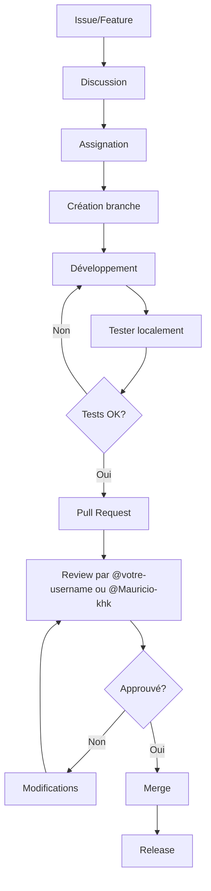

# Guide de Contribution - GSQL

Merci de votre intérêt pour contribuer à GSQL ! Ce guide explique comment collaborer efficacement sur le projet.

## 👥 Équipe Actuelle

**Mainteneurs principaux :**
- **[@Mauricio-100](https://github.com/Mauricio-100)** - Créateur et mainteneur principal
- **[@Mauricio-khk](https://github.com/Mauricio-khk)** - Contributeur principal

## 🎯 Philosophie de Contribution

GSQL est une surcouche Python pour SQLite avec ces valeurs fondamentales :
- **Simplicité** : Interface intuitive et facile à utiliser
- **Transparence** : Reconnaître les bugs et fournir des workarounds
- **Performance** : Cache intelligent et optimisations
- **Communauté** : Travail collaboratif et ouvert

## 📋 Processus de Contribution

### 1. 🐛 Signaler un Bug
**Avant de créer une issue :**
1. Vérifiez si le bug n'est pas déjà listé dans [BUGS.md](BUGS.md)
2. Consultez les [workarounds connus](README.md#bugs-connus)

**Format d'une issue bug :**
```markdown
**Version GSQL :** 3.9.7
**Python :** 3.11
**Système :** Linux Ubuntu 22.04

**Description :**
[Description claire du problème]

**Pour reproduire :**
```python
# Code minimal pour reproduire le bug
from gsql.database import Database
db = Database(":memory:")
# ...
```

Comportement attendu :
[Ce qui devrait se produire]

Comportement actuel :
[Ce qui se produit réellement]

Workaround connu (si applicable) :
[Solution temporaire]

```

### 2. ✨ Proposer une Amélioration
**Discutez d'abord !** 
Ouvrez une discussion GitHub avant de coder pour :
- Valider l'utilité de la fonctionnalité
- Discuter de l'implémentation
- Éviter les doublons de travail

**Format d'une feature request :**
```markdown
**Problème à résoudre :**
[Description du problème]

**Solution proposée :**
[Description de la solution]

**Alternatives considérées :**
[Autres options]

**Impact sur l'API :**
[Changements nécessaires]

**Exemple d'utilisation :**
```python
# Code montrant la nouvelle API
```

```

### 3. 🔧 Soumettre un Correctif (Pull Request)

#### Étape 1 : Préparer votre environnement
```bash
# 1. Fork le dépôt
# Via l'interface GitHub

# 2. Cloner votre fork
git clone https://github.com/votre-username/gsql.git
cd gsql

# 3. Installer en mode développement
pip install -e .[dev]

# 4. Créer une branche
git checkout -b fix/nom-du-correctif
# ou
git checkout -b feature/nouvelle-fonctionnalité
```

Étape 2 : Normes de Code

```python
# ✅ Style recommandé
from gsql.database import Database
from gsql.exceptions import SQLExecutionError

class MaClasse:
    """Docstring au format Google."""
    
    def ma_methode(self, param1: str, param2: int) -> bool:
        """Description courte.
        
        Args:
            param1: Description du paramètre 1
            param2: Description du paramètre 2
            
        Returns:
            True si succès, False sinon
            
        Raises:
            SQLExecutionError: En cas d'erreur SQL
        """
        # Code ici
        pass

# ❌ À éviter
def bad_func(param):  # Pas de type hints
    pass
```

Outils de vérification :

```bash
# Formatter le code
black gsql/
isort gsql/

# Vérifier le style
flake8 gsql/

# Vérifier les types
mypy gsql/

# Exécuter les tests
pytest tests/ -v
```

Étape 3 : Écrire des Tests

Structure des tests :

```python
# tests/unit/test_nouvelle_fonction.py
import pytest
from gsql.database import Database

class TestNouvelleFonction:
    """Tests pour la nouvelle fonctionnalité."""
    
    def setup_method(self):
        """Setup avant chaque test."""
        self.db = Database(":memory:")
        
    def teardown_method(self):
        """Cleanup après chaque test."""
        self.db.close()
        
    def test_fonction_base(self):
        """Test du cas d'usage principal."""
        # Arrange
        # Setup des données
        
        # Act
        result = self.db.execute("SELECT 1")
        
        # Assert
        assert result['success'] == True
        assert result['rows'][0]['1'] == 1
        
    def test_fonction_erreur(self):
        """Test de la gestion d'erreur."""
        with pytest.raises(SQLExecutionError):
            self.db.execute("INVALID SQL")
```

Exécuter tous les tests :

```bash
# Tests unitaires
pytest tests/unit/ -v

# Tests d'intégration
pytest tests/integration/ -v

# Avec couverture
coverage run -m pytest tests/
coverage report -m
coverage html  # Rapport HTML
```

Étape 4 : Documentation

Mettre à jour :

1. README.md si changement d'API public
2. DOCS.md pour les nouvelles fonctionnalités
3. CHANGELOG.md pour les changements notables
4. Exemples dans examples/

Format Changelog :

```markdown
### ✨ Ajouté
- Nouvelle fonctionnalité X par @votre-username

### 🐛 Corrigé
- Bug Y résolu par @Mauricio-khk
```

Étape 5 : Créer la Pull Request

Template PR :

```markdown
## Description
[Description des changements]

## Type de changement
- [ ] Correction de bug
- [ ] Nouvelle fonctionnalité
- [ ] Modification d'API
- [ ] Documentation
- [ ] Tests

## Checklist
- [ ] J'ai lu CONTRIBUTING.md
- [ ] J'ai ajouté/modifié les tests
- [ ] J'ai mis à jour la documentation
- [ ] Les tests passent localement
- [ ] J'ai vérifié le style de code
- [ ] J'ai mis à jour CHANGELOG.md

## Tests effectués
- [ ] Tests unitaires
- [ ] Tests d'intégration
- [ ] Tests de performance

## Screenshots (si applicable)
[Captures d'écran pour les changements UI]

## Issues liées
Fixes #123
```

🎯 Priorités Actuelles

🔴 Bugs Hautement Prioritaires

1. API Transactionnelle - db.begin_transaction() ne fonctionne pas
   · Fichier : gsql/database.py
   · Issue : #42
2. Parsing des guillemets - Problèmes dans le shell interactif
   · Fichier : gsql/cli.py, gsql/parser.py
   · Issue : #56
3. Cache incohérent après DROP TABLE
   · Fichier : gsql/executor.py
   · Issue : #38

🟡 Fonctionnalités Demandées

1. Interface Web Admin - Dashboard simple
2. Support PostgreSQL - En plus de SQLite
3. Monitoring intégré - Métriques de performance

🟢 Tâches Simples pour Débutants

1. Améliorer la documentation
2. Ajouter des exemples d'utilisation
3. Écrire des tests supplémentaires

🏗️ Architecture du Projet

```
gsql/
├── gsql/                    # Code source principal
│   ├── database.py         # Classe Database (PRIORITÉ)
│   ├── executor.py         # Cache et exécution
│   ├── parser.py           # Parseur SQL
│   ├── cli.py              # Interface ligne de commande
│   ├── storage.py          # Abstraction stockage
│   └── exceptions.py       # Exceptions personnalisées
│
├── tests/                  # Suite de tests
│   ├── unit/              # Tests unitaires
│   ├── integration/       # Tests d'intégration
│   └── fixtures/          # Données de test
│
├── examples/              # Exemples d'utilisation
│   ├── basic_usage.py
│   ├── transactions.py
│   └── performance.py
│
├── docs/                  # Documentation
│   ├── api.md
│   ├── tutorial.md
│   └── migration.md
│
└── scripts/              # Scripts utilitaires
    ├── benchmark.py
    └── deploy.py
```

🤝 Convention des Commits

Format : type(scope): description

Types :

· feat : Nouvelle fonctionnalité
· fix : Correction de bug
· docs : Documentation
· style : Formatage (sans changement fonctionnel)
· refactor : Restructuration de code
· test : Tests
· chore : Tâches de maintenance

Exemples :

```bash
# Bug fix pour les transactions
git commit -m "fix(database): workaround pour transactions SQL"

# Nouvelle fonctionnalité
git commit -m "feat(cli): ajout de l'auto-complétion"

# Documentation
git commit -m "docs(README): ajout section bugs connus"

# Tests
git commit -m "test(transactions): tests pour workaround"
```

🔄 Workflow de Développement



🧪 Environnement de Test

Configuration recommandée :

```python
# tests/conftest.py
import pytest
import tempfile
from pathlib import Path
from gsql.database import Database

@pytest.fixture
def temp_db():
    """Base de données temporaire pour les tests."""
    temp_dir = tempfile.mkdtemp()
    db_path = Path(temp_dir) / "test.db"
    db = Database(str(db_path))
    yield db
    db.close()
    import shutil
    shutil.rmtree(temp_dir)

@pytest.fixture
def memory_db():
    """Base en mémoire pour tests rapides."""
    db = Database(":memory:")
    yield db
    db.close()
```

Exécution des tests :

```bash
# Tous les tests
./scripts/run_tests.sh

# Tests spécifiques
pytest tests/unit/test_database.py::TestDatabase::test_transaction_workaround

# Tests avec couverture
./scripts/test_with_coverage.sh

# Tests de performance
python -m pytest tests/integration/test_performance.py --benchmark-only
```

📚 Ressources pour les Contributeurs

Documentation

· Architecture technique
· Guide API
· Guide de migration
· FAQ

Outils

· Debugging : Utiliser logging.DEBUG niveau
· Profiling : Script scripts/profile_performance.py
· Benchmark : Comparaisons avec SQLite brut

Communication

· Issues GitHub : Pour les bugs et features
· Pull Requests : Pour le code
· Discussions GitHub : Pour les questions générales
· Pair Programming : Sur demande pour les contributions complexes

🏆 Reconnaissance

Tous les contributeurs sont listés dans :

· CONTRIBUTORS.md
· Page "Contributors" sur GitHub
· Mentions dans CHANGELOG.md

❓ Questions Fréquentes

Q : Comment savoir quoi contribuer ?
R : Consultez les issues étiquetées good-first-issue ou help-wanted.

Q : Qui peut merger les PR ?
R : Seuls @votre-username et @Mauricio-khk peuvent merger.

Q : Comment tester mes changements localement ?
R : pip install -e . puis pytest tests/

Q : Que faire si je suis bloqué ?
R : Ouvrez une discussion GitHub ou contactez directement les mainteneurs.

---

📞 Contact

· @votre-username : Créateur et mainteneur principal
· @Mauricio-khk : Contributeur principal et expert technique

Merci pour votre contribution à GSQL ! Ensemble, nous construisons une meilleure interface pour SQLite. 🚀

```

## 📁 Fichiers supplémentaires à créer :

### 1. **BUGS.md** (Pour la transparence)
```markdown
# Bugs Connus - GSQL

## 🔴 Bugs Critiques (Priorité Haute)

### #42 - API Transactionnelle Défectueuse
**Description :** `db.begin_transaction()` et `db.commit_transaction()` ne fonctionnent pas
**Statut :** En cours de correction
**Workaround :** Utiliser `db.execute("BEGIN TRANSACTION")` et `db.execute("COMMIT")`
**Fichiers concernés :** `gsql/database.py`
**Assigné à :** @votre-username

### #56 - Parsing des Guillemets
**Description :** Le shell interactif plante avec certains caractères
**Statut :** Investigation en cours
**Workaround :** Utiliser des scripts Python pour requêtes complexes
**Fichiers concernés :** `gsql/cli.py`, `gsql/parser.py`
**Assigné à :** @Mauricio-khk

## 🟡 Bugs Moyenne Priorité

### #38 - Cache Incohérent
**Description :** Cache obsolète après opérations DDL
**Statut :** En attente
**Workaround :** Désactiver cache avec `use_cache=False`
**Fichiers concernés :** `gsql/executor.py`

## 🟢 Bugs Mineurs

### #23 - Documentation Manquante
**Description :** Certaines fonctions ne sont pas documentées
**Statut :** En cours
**Assigné à :** Nouveaux contributeurs
```

2. CONTRIBUTORS.md

```markdown
# Contributeurs - GSQL

## 🥇 Mainteneurs Principaux
- **[@votre-username](https://github.com/votre-username)** - Créateur, architecture principale, mentor
- **[@Mauricio-khk](https://github.com/Mauricio-khk)** - Expert technique, code review, optimisation

## 🥈 Contributeurs Actifs
[À compléter au fur et à mesure des contributions]

## 🥉 Premiers Contributeurs
[À compléter]

## 🤝 Comment Rejoindre Cette Liste ?
1. Faire une contribution significative (code, docs, tests)
2. Être mentionné dans CHANGELOG.md
3. Être ajouté par un mainteneur

## 📊 Statistiques des Contributions
- Total des contributeurs : 2
- PR mergées : [nombre]
- Issues résolues : [nombre]
- Lignes de code : [nombre]
```

3. scripts/run_tests.sh

```bash
#!/bin/bash
# Script pour exécuter tous les tests GSQL

echo "🧪 Lancement des tests GSQL..."

# Vérifier l'installation
echo "1. Vérification de l'installation..."
python -c "import gsql; print(f'GSQL version: {gsql.__version__}')"

# Tests unitaires
echo "2. Tests unitaires..."
pytest tests/unit/ -v --tb=short

# Tests d'intégration
echo "3. Tests d'intégration..."
pytest tests/integration/ -v --tb=short

# Tests de performance (optionnel)
if [ "$1" == "--perf" ]; then
    echo "4. Tests de performance..."
    pytest tests/integration/test_performance.py --benchmark-only
fi

# Couverture de code
echo "5. Couverture de code..."
coverage run -m pytest tests/
coverage report -m
```

Ce guide de contribution est :

· Pratique : Instructions claires étape par étape
· Collaboratif : Reconnaît l'équipe existante
· Structured : Workflow organisé et professionnel
· Encourageant : Accueille les nouveaux contributeurs
· Transparent : Priorités et bugs clairement identifiés